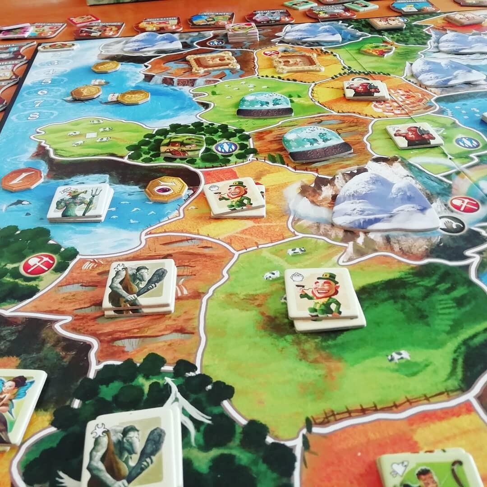

<Setting>

  In Smallworld il mondo è diventato troppo piccolo per le razze che lo
  popolano, spetta a te cercare di condurle verso il dominio di queste terre.
  Orchi, Elfi, Nani, Scheletri e chi ne ha più ne metta, tutti contro tutti per
  cercare di conquistare un piccolo pezzetto di terra{" "}
  <strong>a suon di mazzate.</strong>

</Setting>

<Rules>

  Le regole sono <strong>semplici e intuitive</strong>, inoltre grazie al gran
  numero di componenti e segnalini la comprensione diviene ancora più immediata.
  In Smallworld le Razze sono 14 ed ognuna di esse ha poteri diversi che
  dovranno poi essere abbinati casualmente a altri 20 Poteri Speciali.
  All'inizio del gioco, ogni giocatore dovrà scegliere una Razza e il Potere
  Speciale a cui è abbinata e iniziare la conquista del continente. La Razza e
  il Potere combinati permettono, in base alla loro somma, di prendere un numero
  di segnalini razza, con i quali, il giocatore potrà conquistare le terre.
  All'inizio, la conquista potrà partire solo ai margini della mappa, e per
  conquistare una regione bisognerà spendere{" "}
  <strong>2+1 per ogni segnalino già presente sul territorio</strong>. Se il
  giocatore ha ancora segnalini ma non può conquistare con le normali regole
  un'ultima regione può avvalersi del dado, il quale, con un tiro fortunato, gli
  permetterebbe di aumentare la forza della sua Razza solo per quella conquista.
  Terminata l'invasione il giocatore ridispone i segnalini come meglio crede e
  ottiene un punto vittoria per ogni regione che possiede più eventuali abilità.
  Durante le successive conquiste, all'inizio del turno, il giocatore può o
  prendere in mano quanti segnalini vuole e riiniziare l'espansione da una
  regione adiacente ad una già posseduta oppure decidere di{" "}
  <strong>andare in declino</strong> passando il turno. Facendo ciò, il turno
  successivo potrà scegliere una nuova Razza e iniziare una nuova conquista. Ci
  può essere solo una Razza in declino per ogni giocatore, inoltre, le Razze in
  declino non possono essere usate durante la conquista, ma danno comunque punti
  vittoria a fine del turno. Alla fine del 9-10 round (dipende dal numero dei
  giocatori) la partita finisce e si contano i punti vittoria di ogni giocatore,
  chi ne ha di più vince!

</Rules>

<Feedback>

  Come già detto le regole non sono complesse e le meccaniche sono semplici e
  intuitive, ma non per questo il gioco non risulta strategico e accattivante.{" "}
  <strong>L'interazione è alta</strong> essendo il mondo piccolo e gli scontri
  tra i vari giocatori saranno frequenti. Le strategie che possono essere
  utilizzate sono moltissime anche grazie all'altissima varietà dei componenti
  del titolo. Razze e Poteri Speciali sono moltissimi e combinati tra loro
  permettono di avere partire sempre diverse, per non parlare delle varie mappe,
  che cambiano a seconda del numero dei giocatori costringendo così ad adottare
  strategie sempre differenti. Inoltre, grazie all'enorme successo, le
  espansioni sono moltissime e, per chi ha già consumato questo gioco, sono una
  ventata di aria fresca che permette di dare ancora più varietà al titolo.{" "}
  <strong>Smallworld è un gioco un po' per tutti</strong>, grazie alla stupenda
  grafica riesce ad affascinare, le regole e le meccaniche semplici permettono
  di imparare velocemente il gioco e la varietà e la quantità di razze e poteri
  lo rendono allo stesso tempo difficile da padroneggiare. Tutte queste
  caratteristiche rendono Smallworld un gioco da tavolo da avere sicuramente sui
  propri scaffali.

</Feedback>

