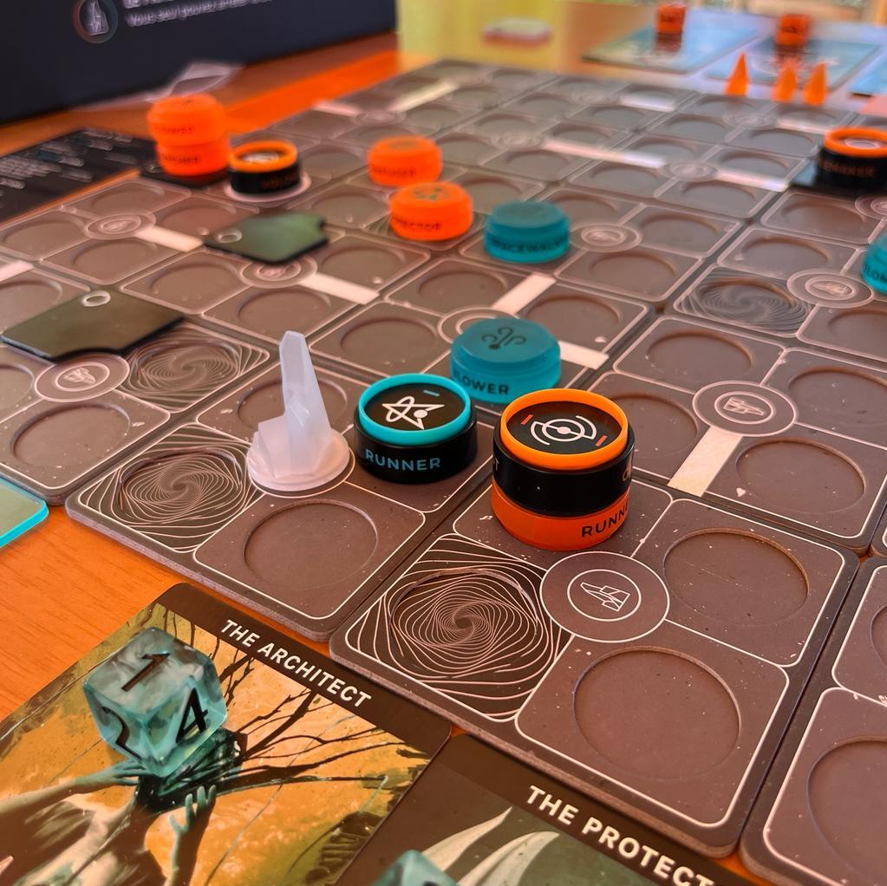
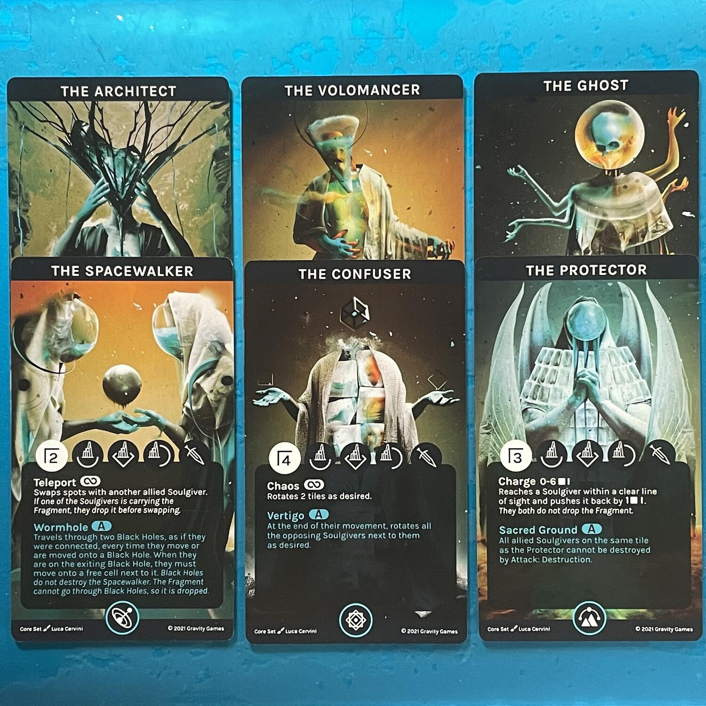

<Setting>

  Nel multiverso di Soulgivers, dopo l’imprevedibile autodistruzione del pianeta
  Primo Anello, <strong>la Decadenza</strong> incombe sulle popolazioni, un
  tempo immortali, dei <strong>Gusci</strong> e degli <strong>Spettri</strong>:
  la loro unica possibilità di salvezza risiede nel <strong>Frammento</strong>,
  ultimo rimasuglio dell’antico pianeta, che può ancora guarirle dal tremendo
  male cosmico. La <strong>battaglia</strong> sarà cruenta, brutale e disperata:
  solo chi sarà in grado di primeggiare sul campo, manipolando gli elementi e{" "}
  <strong>assorbendo le anime</strong> dei compagni defunti, riuscirà a piegare
  la volontà del nemico. Schierate la vostra <strong>squadra</strong>,
  recuperate il Frammento e conducetelo al sicuro nel vostro{" "}
  <strong>Portale</strong> prima degli avversari. Salvate il vostro mondo dalla
  Decadenza!

</Setting>

<Rules>

  Il tabellone di gioco è costituito da una{" "}
  <strong>griglia di 5x5 tessere</strong>, ognuna con <strong>4 caselle</strong>
  , il cui setup varierà di partita in partita, salvo per la collocazione della{" "}
  <strong>Tessera Madre</strong> posta al centro (su cui troverà posto il
  Frammento, protetto dalla sua <strong>Barriera</strong>) e due{" "}
  <strong>Tessere Interferenza</strong> alle due estremità della riga centrale.
  Lo <strong>scopo del gioco</strong> è quello di recapitare il Frammento fino a
  uno dei due Portali della propria fazione, che vengono posizionati come
  descritto sul manuale.
   
  Dai medesimi Portali, a inizio partita, si muoveranno sul campo i{" "}
  <strong>3 Soulgivers</strong> che ogni giocatore avrà selezionato dalla
  propria <strong>squadra</strong>, inizialmente costituita da 10 unità. I 10
  Soulgivers del gioco base hanno tutti abilità diverse ma sono uguali per
  entrambe le popolazioni: non c’è dunque asimmetria, da questo punto di vista,
  salvo per l’abilità specifica di ogni Fazione, che potrà essere utilizzata
  soltanto una volta per partita.
   
  <strong>Ogni Soulgiver</strong> verrà rappresentato sul campo da una pedina
  nera, a cui è associata un’anima del colore di fazione e una carta con le{" "}
  <strong>Caratteristiche</strong>, l’<strong>Aura</strong> e le{" "}
  <strong>Abilità</strong>. A turni, i giocatori si alternano attivando i
  loro Soulgivers, muovendoli sul campo in base ai loro valori e tipi di
  movimento; quindi, una volta raggiunta la casella di destinazione, ne
  orientano gli Scudi in modo da parare eventuali Attacchi. Dopo essersi mosso,
  un Soulgiver può essere attivato per compiere <strong>Azioni Gratuite</strong>:
  <ul>
    <li>      <strong>Movimento</strong>, solo ortogonale o lineare;</li>
    <li>      <strong>Rotazione dello Scudo</strong>;</li>
    <li>      <strong>Assorbimento di un’anima</strong>, con la possibilità da quel
      momento di sfruttarne Aura e Abilità.</li>
  </ul>
  Un giocatore può, inoltre, voler compiere <strong>    Azioni a Pagamento</strong>{" "}
  al prezzo di un <strong>Punto Decadenza</strong> o, più frequentemente, di una
  delle <strong>Essenze</strong> attinte dalla riserva delle 3 che ogni
  giocatore possiede ogni Turno:
  <ul>
    <li>      <strong>Raccogliere, Passare o Lasciar Cadere il Frammento</strong>;</li>
    <li>      <strong>Attivare le Abilità dei Soulgivers</strong>;</li>
    <li>      <strong>Attacco: Distruzione</strong>, che se va a buon fine (ovvero
      colpisce un lato non coperto da Scudo) uccide istantaneamente il Soulgiver
      bersaglio, il quale rilascia la propria Anima sulla Casella dove è stato
      sconfitto.</li>
  </ul>
  Alla morte di un Soulgiver, il giocatore che lo possedeva può sostituirlo,
  finché gli è possibile, con un altro Soulgiver dalla propria riserva,
  facendolo partire da uno dei propri Portali e facendolo entrare in campo
  all’inizio del turno successivo.
   
  Vi sono infine <strong>Azioni Speciali</strong>: 
  <ul>
    <li>      <strong>Pescare una Carta Anomalia</strong>, esclusivamente durante il
      proprio turno;</li>
    <li>      <strong>Giocare una Carta Anomalia</strong>, nel turno dell’avversario;</li>
    <li>      <strong>Attivare l’Abilità della Popolazione</strong>, nel proprio turno o
      subito dopo l’attivazione di un Soulgiver avversario (l’Abilità terminerà
      il suo effetto all’inizio del turno successivo del giocatore che l’ha
      attivata).</li>
  </ul>
  Si noti che non si possono Pescare o Giocare Carte Anomalia se un Soulgiver
  avversario si trova su una Casella Interferenza.
   
  Turno dopo turno, i Soulgivers patiscono gli effetti della Decadenza: su
  ciascuna carta, un dado indicherà a mo’ di conto alla rovescia quanti turni
  restano da vivere a ogni specifico Soulgiver. Raggiunto il 6, il Soulgiver
  viene eliminato.
   
  <strong>    Vince chi riesce a trasportare il Frammento dentro uno dei propri portali</strong>
  , oppure chi, avendo distrutto entrambi i Portali avversari o avendo ucciso
  tutti i Soulgivers avversari, riesce entro il turno successivo a portare il
  Frammento entro il proprio portale.

</Rules>

<Feedback>

  Di Soulgivers, è finora stato individuato il difetto di un{" "}
  <strong>Regolamento</strong> che avrebbe potuto essere certamente più breve e
  scritto meglio (per eventuali dubbi, rimandiamo a questa{" "}
  <a href="https://www.soulgiversgame.com/it/faq.aspx" target="_blank">
    pagina FAQ
  </a>
  ) , ma <strong>difficilmente emergeranno altri difetti</strong>: si può non amare
  il genere, ma occorre riconoscere la <strong>    stupefacente perizia creativa</strong> dell’autore nell’aver creato un <strong>    sistema efficace, bilanciato e originale</strong>. 
  Soulgivers è, innanzitutto, uno <strong>skirmish estremamente tattico</strong>,
  che ha la capacità di declinare il confronto in modo <strong>    elegante</strong> e <strong>coinvolgente</strong>. Le scelte strategiche ci sono, ma si
  limitano alla selezione dei Soulgivers iniziali e alla scelta di quali lasciare
  in riserva, a mano a mano che gli altri fanno il loro ingresso in campo. Sul fronte
  della tattica, invece, si ha la netta percezione che un passo falso potenzialmente
  sia in grado di innescare la vittoria dell’avversario. E in certi momenti della
  partita è così. Questo avviene anche perché la <strong>    cura del ritmo e del bilanciamento del gameplay</strong> è stata… qual è la parola che sto cercando? Ah sì: <strong>    perfetta</strong>. 
  La <strong>longevità</strong> è <strong>notevole</strong>, ed è favorita anche
  dalla presenza di 4 espansioni, attualmente, che introducono ciascuna un nuovo
  Soulgiver per ognuna delle due fazioni: questo, poiché la squadra di partenza
  deve essere sempre composta da 10 unità, significa che ogni giocatore potrà
  scegliere i suoi 10 tra un pool iniziale di massimo 14 Soulgivers, il che
  porterà a schieramenti variabili.
   
  La <strong>preziosità del design</strong>, opera dello stesso autore, Luca
  Cervini, è frutto di uno straordinario, quasi <strong>metafisico</strong>{" "}
  <strong>incontro</strong> tra pittura digitale, fotografia e materiali poveri
  minimalisti, che lo rende uno dei rari titoli “<strong>da esposizione</strong>
  ” (e, diciamolo, non ci importa nulla di quale sia l’arredo intorno!): i
  materiali, ora traslucidi ora opachi, uniti a una essenzialità grafica delle
  linee, complementare all’elaborazione di{" "}
  <strong>immagini visionarie e surreali</strong>, in aderenza allo{" "}
  <strong>stile artistico</strong> di Cervini, che è stato definito “
  <strong>amniotico</strong>”, ci tuffano in una nuova generazione di Board Game
  Porn, in cui ammirare il gioco è un piacere pari a quello derivante dal
  giocarlo. Piccoli e discreti tocchi di stile stupefacenti, come il fatto che
  la base del Frammento sia magnetica e si installi perfettamente in cima ai
  Soulgivers che lo trasportano, sono vincenti tasselli di un{" "}
  <strong>puzzle estetico formidabile</strong>, in cui nulla è lasciato al caso
  e tutto trova la sua esatta collocazione, in un{" "}
  <strong>    <em>Magnificent Decay</em></strong>
  . 
  Sul fronte del gameplay, si impara dopo qualche partita a scegliere con
  estrema attenzione il team di Soulgivers di partenza, a caccia di particolari
  sinergie. Non bisogna, inoltre, sottovalutare l’agency del giocatore nella
  scelta di sacrificare un certo Soulgiver: la sua anima, se raccolta dal
  compagno giusto, innescherà una serie di <strong>combo</strong> che potranno
  virtualmente rendere un Soulgiver estremamente potente.
   
  Esiste la <strong>possibilità di giocarlo in 4</strong>, frutto di
  un’ispirazione giunta all’autore durante il Lucca Comics del 2019, che, con
  minime variazioni di setup e regole, può trasmettere nuove emozioni agli
  amanti del titolo, anche se il gioco{" "}
  <strong>nasce principalmente come sfida per 2</strong>. 
  Per un giocatore che solitamente guarda gli astratti col binocolo e con estrema
  diffidenza, come me (a meno che non si tratti di Scacchi o di <Link to="/reviews/azul-summer-pavillon/">
    Azul: Summer Pavillon
  </Link>), questo gioco poteva rivelarsi un buco nell’acqua… Ma Soulgivers ha cambiato
  tutto: <strong>    che nessuno osi più dire che Dadi-Daddy non è un amante degli astratti…
    giusti</strong>
  ! 
  Qui a Dudexpress aspettiamo tutti con ansia ulteriori sviluppi per questo magnifico
  titolo, a cui auguriamo di poter espandere le proprie possibilità! E voi? Cosa
  state aspettando per provarlo?

</Feedback>

