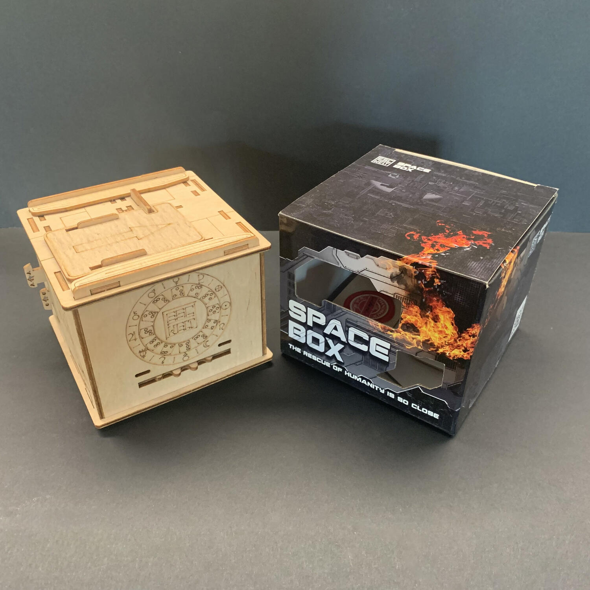
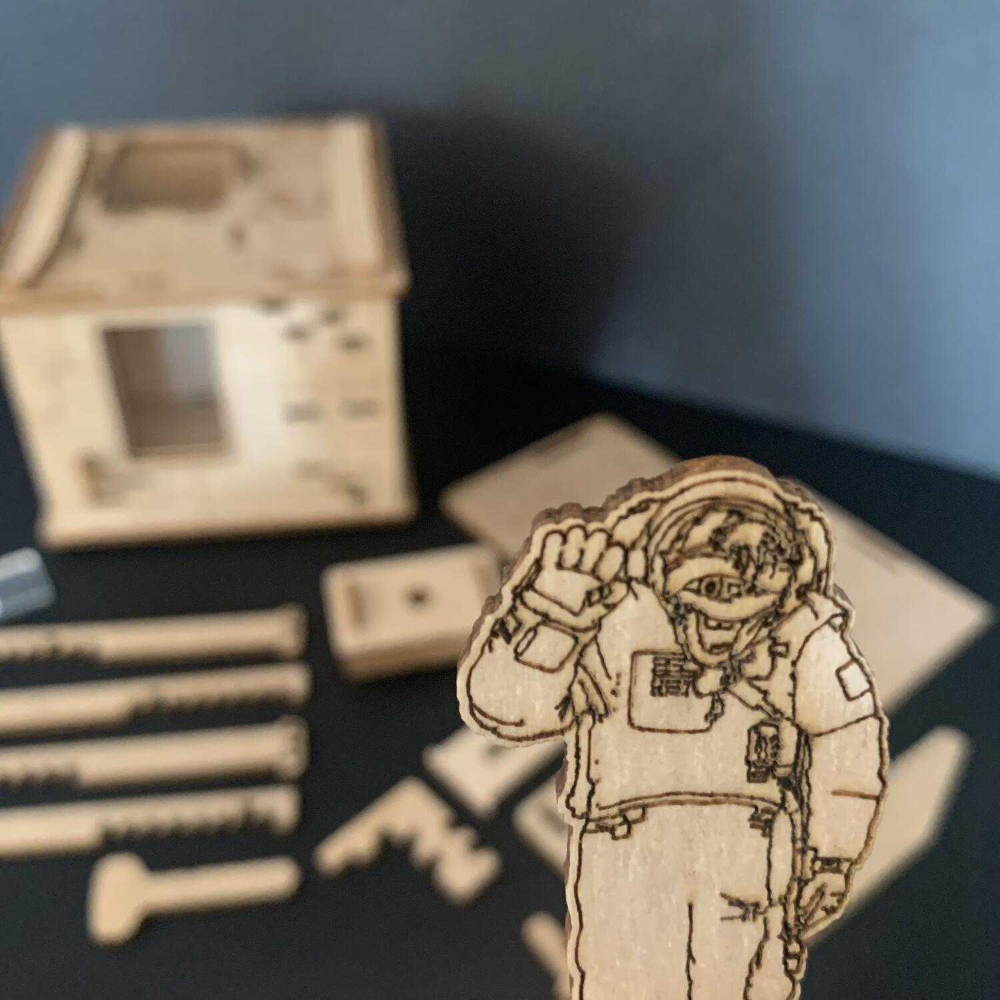

<Setting>

  Anno domini 3143.  
  Dopo una lunga ricerca, gli scienziati hanno finalmente individuato un pianeta
  abitabile all'interno nell'intero universo: X63Z.  
  La terra è al collasso e nel giro di poche generazioni non sarà più
  abitabile... bisogna assolutamente capire se questo pianeta possa ospitare
  l'intera umanità. È necessario completare alcune ricerche su X63Z e, per
  questo compito, viene scelto il cosmonauta BUBU: la sua missione consiste nel
  portare dei campioni dal pianeta alla terra.  
  Dopo 39 anni, il cosmonauta è riuscito a raccogliere questi campioni e, quindi,
  a rendere la salvezza dell'umanità un passo più vicina.
   
  È ora di tornare a casa... ma nel momento in cui la navicella entra nel nostro
  sistema solare, viene colpita da un asteroide che la sfascia interamente.  
  BUBU, fluttuando nel vuoto cosmico, riesce a contattare il ground control e
  richiede un'immediata missione di salvataggio.  
  Tu sei il prescelto: ti prepari e parti subito.  
  L'agenzia spaziale ti avvisa che la navicella è equipaggiata coi migliori
  sistemi di sicurezza, i quali ti renderanno l'ingresso molto difficile.
   
  Take your protein pills and put your helmet on.
   
  Il tempo è poco.

</Setting>

<Rules>

  Come avevamo visto per <Link to="/reviews/fort-knox">Fort Knox</Link>, per
  giocare a Space Box non c'è bisogno di sapere niente, nessun regolamento da
  leggere e nessun dettaglio da imparare. Vi basta prendere la scatola (la
  nostra navicella) in mano, osservarla, capovolgerla, decifrarla con l'unico
  scopo di aprirla prima che sia troppo tardi per BUBU.  
  Sulla scatola sono presenti 6 enigmi, alcuni intuitivi, altri, invece, vi faranno
  fumare la testa. Alcune cose potrebbero non essere come sembrano. Enigma dopo enigma
  si apriranno tutte le porte, fino a che non verrà aperta la più importante: quella
  che vi permetterà di salvare BUBU.
   
  Tutto quello che vi serve è in bella mostra: riuscirete a carpirlo?

</Rules>

<Feedback>

  Se siete amanti delle escape room da tavolo, come ad esempio{" "}
  <Link to="/reviews/escape-tales-i-bambini-di-wyrmwoods/">
    I bambini di Wyrmwoods
  </Link>
  , non potete che prendere la navicella di soccorso e gettarvi a capofitto nel salvataggio
  di BUBU.
   
  Gli enigmi di questa scatola sono più sfidanti di quelli di <Link to="/reviews/fort-knox">
    Fort Knox
  </Link> e alcuni vi faranno brillare gli occhi dall'incredulità di cosa state facendo
  e gioire nel momento in cui li risolverete.  
  "Cose" che si staccano, "cose" che si aprono, "cose" che appaiono, "cose"
  che... wow!  
  Il flusso di gioco non lascia molto spazio all'incomprensione, quello che bisogna
  fare è chiaro... ma bisogna capirlo e farlo.
   
  Anche in questo caso, bisogna tenere a mente che la scatola è realizzata in legno
  e che, quindi, qualche meccanismo potrebbe risultare leggermente inceppante, ma
  con un po' di pazienza e con qualche ovvio micro movimento, tutto torna a funzionare.
   
  Inoltre, la navicella dispone di un bell'antro capace di ospitare dei piccoli oggetti,
  un biglietto o qualsiasi cosa si voglia nascondere, raggiungibile dopo aver risolto
  tutti gli enigmi. Ottimo per "incartare" un regalo!
   
  Una volta aperta, seguite le istruzioni per richiuderla... e prestarla ai vostri
  amici per vedere chi ci mette di meno.
   
  Semplicemente spaziale.

</Feedback>
