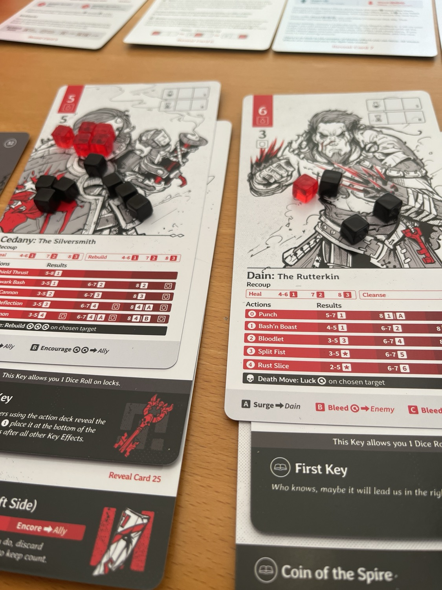
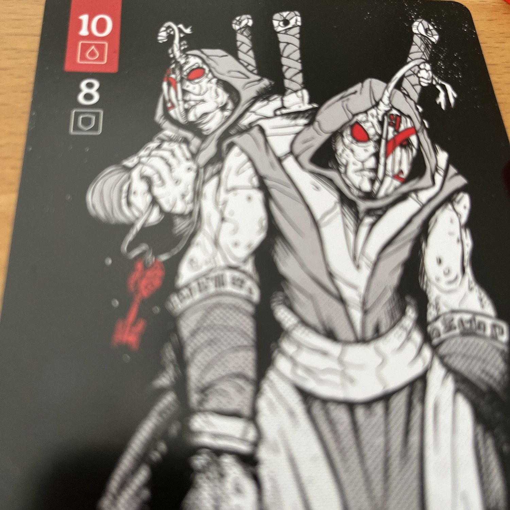
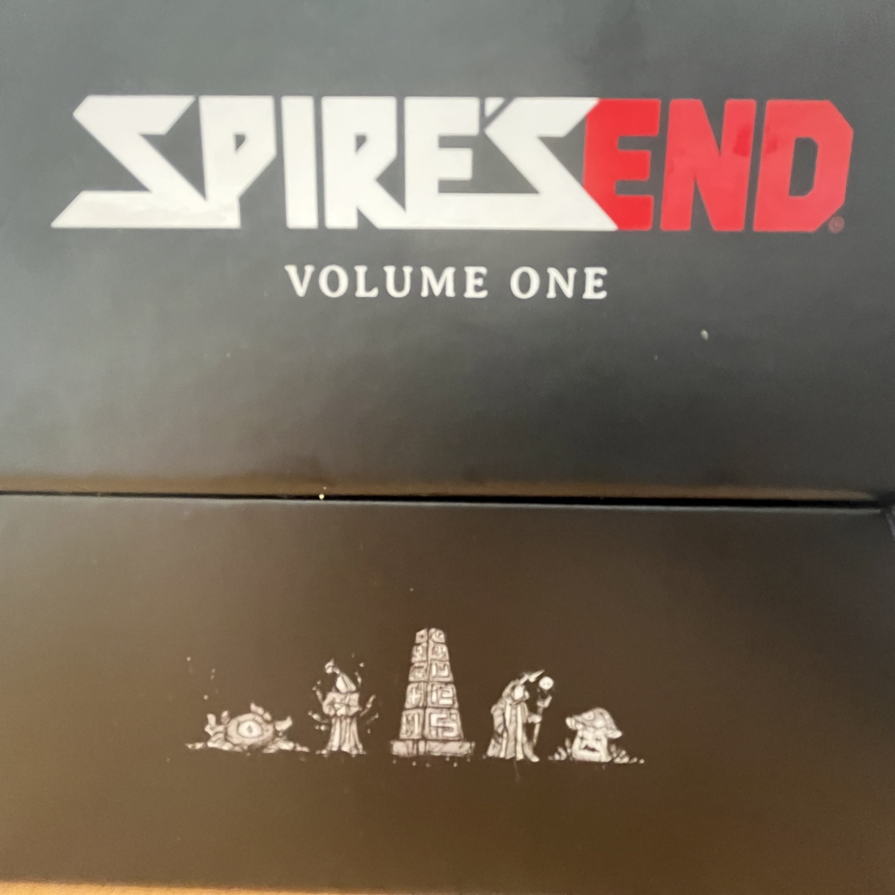

<Setting>

Sono arrivati chissà da dove e ora siete rimasti in 7… 7 vichinghi con diverse abilità e di diversa estrazione sociale, ma con un unico desiderio: quello di esplorare la torre che è apparsa durante l’eclissi e salvare il vostro popolo, catturato al suo interno… O, quanto meno, quel che ne rimane. Questi mostri non potranno ucciderci tutti e restare impuniti!

</Setting>

<Rules>

Spire’s end è, di fatto, un <Link to="/mechanisms/libro-gioco"> Libro game </Link>. Delle carte giganti, probabilmente formato tarocco, vengono girate in ordine e ognuna porta con sé una scelta. Una scelta che farà rivelare un’altra carta e così via fino a che o i 7 verranno eliminati in combattimento o si raggiungerà una carta <strong>ENDING</strong>. Il tutto ovviamente condito da carte ricompensa e “inutili" ninnoli che chissà se e quando si riveleranno <strong>utili</strong>...  
Alcune carte faranno iniziare un combattimento che utilizza come base il lancio dei dadi. Ogni Vichingo, infatti, durante il suo turno prima di affidarsi alla sorte lanciando il dado, potrà scegliere quanto ferirsi per poter usare abilità più o meno potenti in quel combattimento e tentare di recuperare qualche punto vita, così come scegliere come e quando curarsi o come e quando attaccare, o ancora in che modo applicare eventuali effetti di stato, che sarà la chiave per salvare la pellaccia. In caso contrario… Beh, si sa che un guerriero vichingo alle porte del Valhalla è più pericoloso e in Spire End, prima di andarsene, un avventuriero cercherà di scatenare un potentissimo <strong>attacco finale</strong>!

</Rules>

<Feedback>

Spire’s End è un gioco particolare. In nessuno dei vostri tentativi, e ce ne saranno tanti, vi sarà esattamente chiaro che direzione prenderà la storia. É un problema? In realtà no. Ogni carta trasuda di una grafica decisamente interessante, basata su una palette tricromatica in bianco e nero più rosso, e per tutto il tempo sarete confusi come gli eroi di questo mondo. Tutto sommato una <strong>confusione tematica, no?</strong>. È davvero interessante il fatto che le “vite" che si hanno coincidano con il numero degli eroi. Combattimento dopo combattimento, alcuni potrebbero morire uno dopo l’altro, e la fine sarà sempre più vicina… Decisamente tematico anche questo!  
L’unico grande problema del gioco a mio avviso risiede nella durata. Certo, alcune partite possono durare anche quindici minuti, causa una carta <em>Ending</em> nel posto sbagliato, ma altre dureranno tantissimo, forse troppo per un finto libro game senza una vera possibilità di salvataggio. Perché nel momento in cui sarete stanchi e distratti… La torre vi distruggerà sicuramente più velocemente.

</Feedback>

