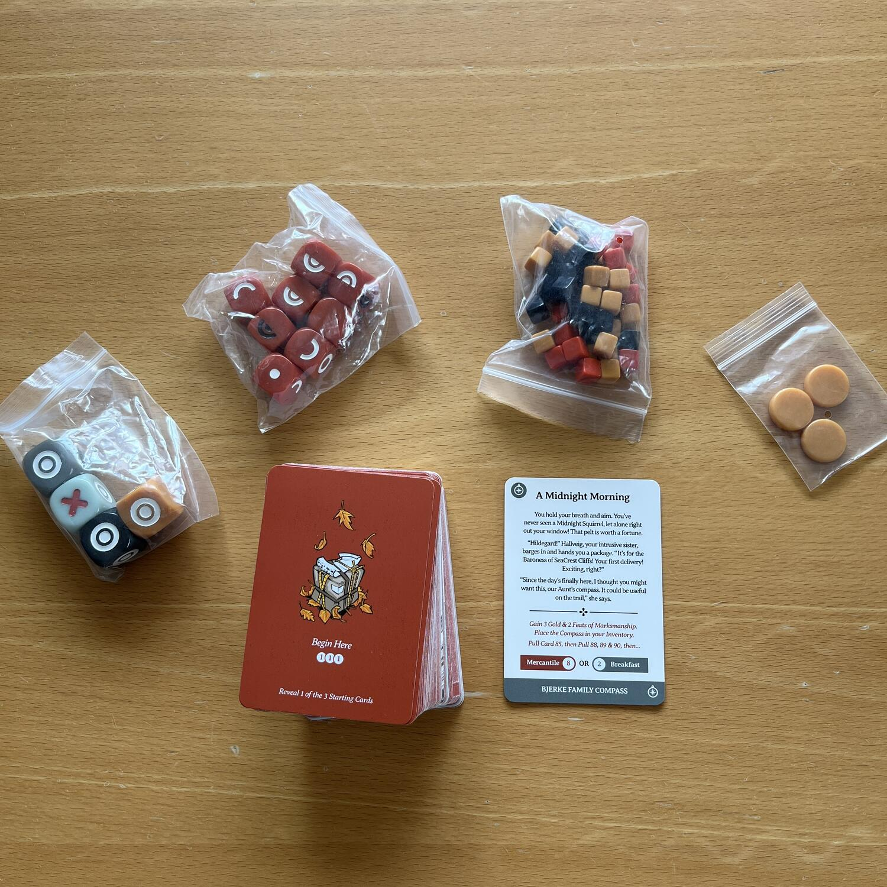
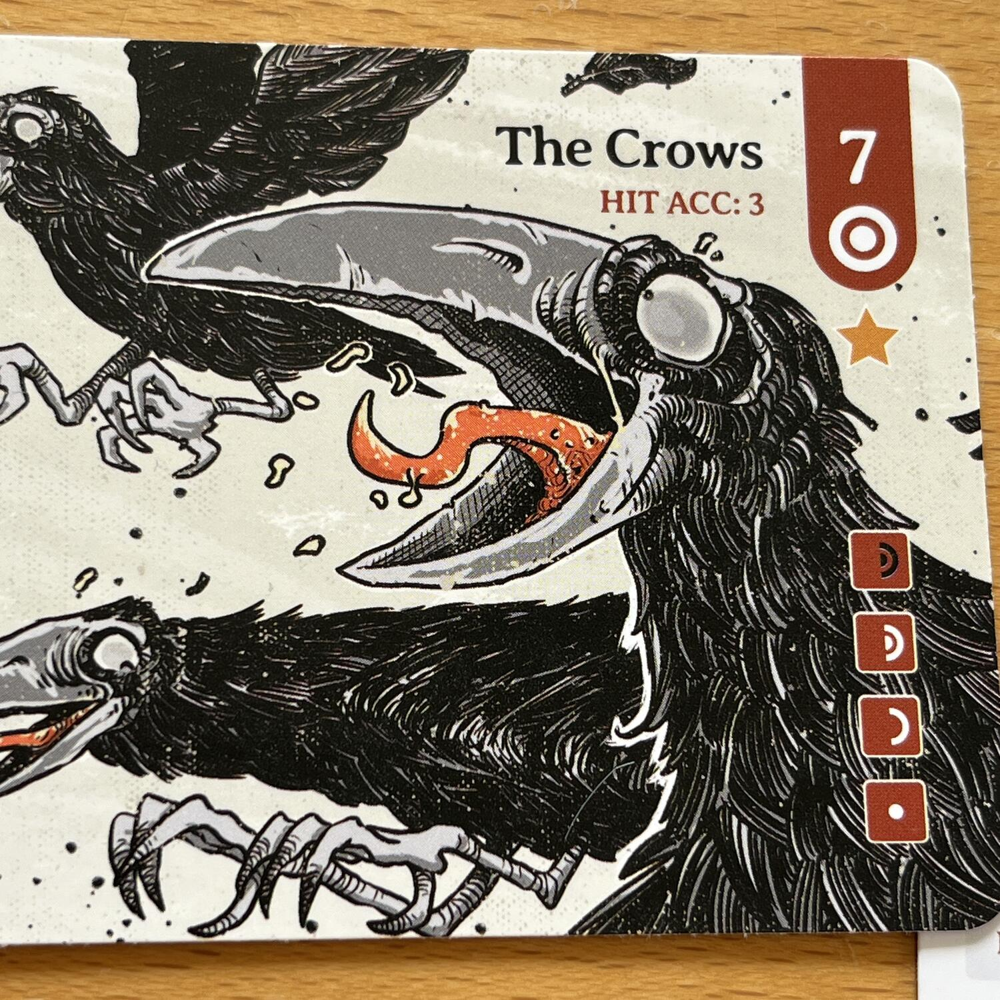
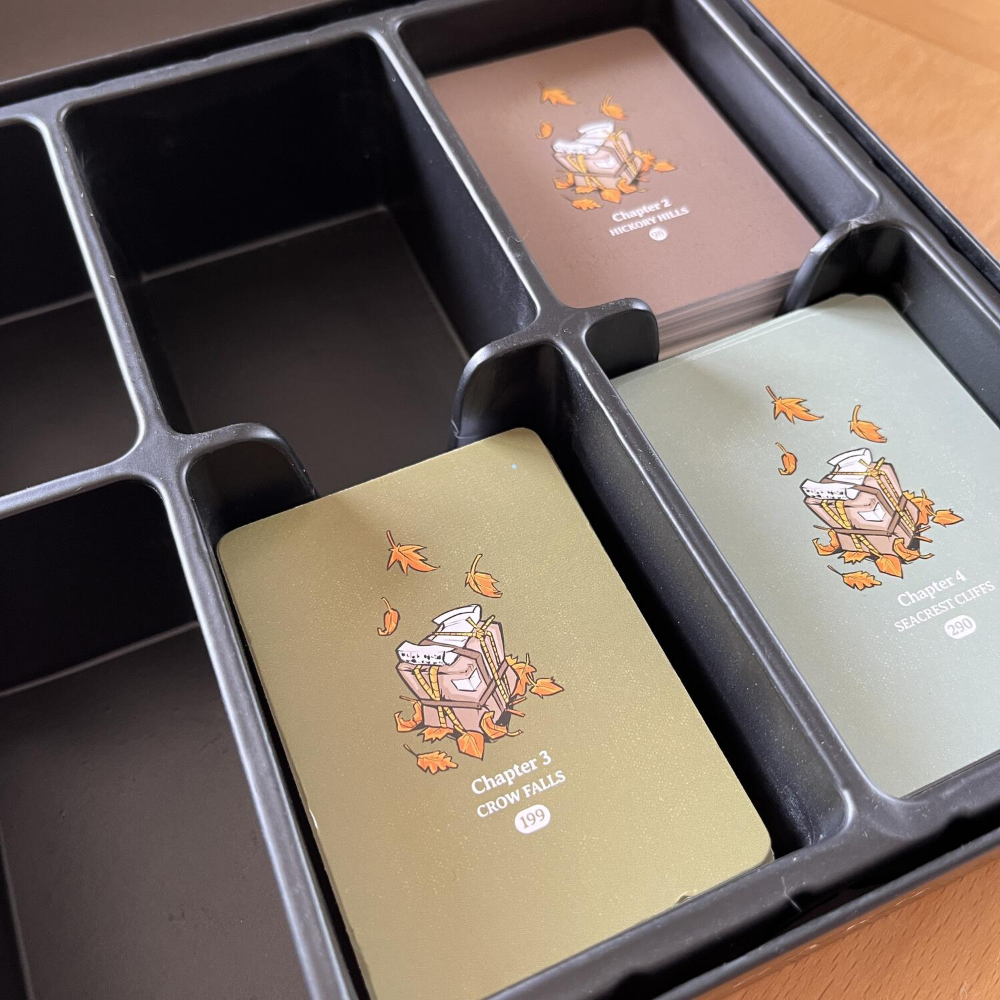

<Setting>

  Sei Hildegard, una ragazza appartenente alla Gilda dei messaggeri, a cui è
  stato affidato un misterioso pacco da consegnare alla Baronessa di una lontana
  città. Come evolverà la tua avventura? Che scelte farai?

</Setting>

<Rules>

  In Hildegard il giocatore deve “solo” lasciarsi cullare dalla storia. Girare
  una carta, leggerla, scegliere che alternativa seguire e proseguire con la
  storia, fino ad una carta ENDING che potrà essere ottenuta finendo la campagna
  oppure… beh… morendo!  
  Durante tutto il gioco bisognerà fare scelte che aumenteranno o diminuiranno gli
  oggetti nel proprio inventario, mentre gli scontri più importanti saranno gestiti
  a suon di dadi, in un modo molto simile allo Yahtzee. Infatti, in Hildegard i dadi
  comporranno con varie forme un occhio. Più occhi si otterranno più successi si
  avranno. Ottieni abbastanza occhi? L’incontro sarà superato con successo. Ne ottieni
  troppo pochi? Bisognerà capire a cosa porterà il fallimento…

</Rules>

<Feedback>

  Hildegard è un gioco strano. Illustrazioni fantastiche e storia avvincente.
  Arrivare alla carta ENDING non sarà mai un problema. Anzi, sarà sempre bello
  ricominciare dal capitolo I e riprovare l’avventura. Chissà che scelte
  sbagliate avete commesso, che oggetto avete mancato che vi avrebbe aiutato
  invece nella situazione difficile. Oppure magari, adesso, scegliendo un’altra
  strada, chissà cosa potrete arrivare a fare.  
  Tutto questo è bellissimo fino a che non vi accorgete che state rileggendo le stesse
  carte e che tante scelte sono per lo più decise dalla dea bendata. Più conoscete
  del gioco, più morite, più sembrerà che la sopravvivenza di Hildegard sia davvero
  decisa dal risultato di un dado. Questo lo rende un gioco che può sicuramente piacere
  fino a che non lo si sarà giocato troppo. Perciò, fino a che rimane la magia e
  la novità... è un gioco sicuramente da tenere in collezione!

</Feedback>

