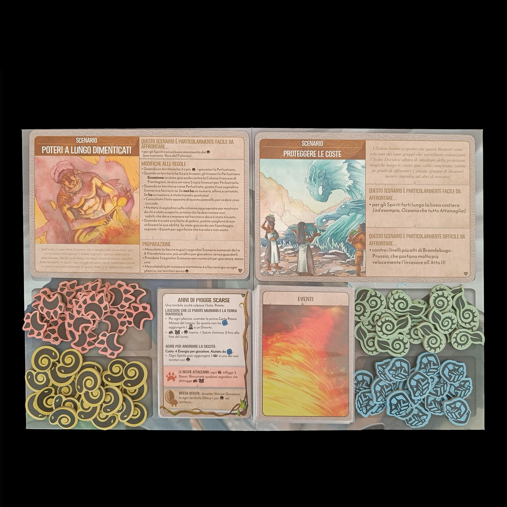
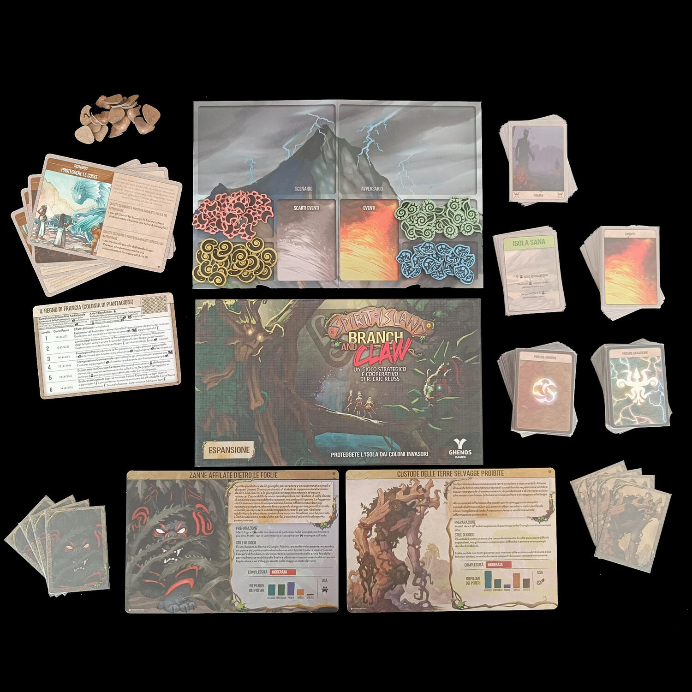

<OriginalReviewLink slug="spirit-island" />
<Panoramic>

  Gli invasori avanzano senza sosta, e fermarli è diventata un’impresa quasi
  impossibile: i poteri degli Spiriti dell’isola sembrano non bastare e{" "}
  <strong>l’isola stessa deve scendere in campo</strong> e combattere! I
  predatori si agitano tra i boschi, pronti ad assalire i colonizzatori;
  malattie sconosciute si diffondono tra gli invasori e i nuovi sentieri, da
  poco battuti, vengono misteriosamente assorbiti nuovamente dalla fitta
  vegetazione. Basterà questo a fermarli?
   
  Branch and Claw è la prima espansione di Spirit Island, che apporta diversi
  nuovi elementi che arricchiscono il gioco base, rendendo{" "}
  <strong>l’isola più “viva”</strong>. 
  Viene innanzitutto introdotta una <strong>nuova fase di gioco</strong>, all’inizio
  della Fase Invasori, ovvero gli eventi: prima che gli invasori agiscano, dovrà
  essere, infatti, rivelata una <strong>Carta Evento</strong>, che conterrà alcuni
  effetti da risolvere immediatamente e favorevoli agli Spiriti oppure agli Invasori.
  Queste carte, inoltre, attiveranno sulla plancia di gioco <strong>    Bestie, Malattia, Natura o Conflitto</strong>, l’altra novità principale di Branch and Claw: si tratta di quattro diversi
  di token che popoleranno l’isola e aiuteranno gli Spiriti nella lotta per la salvezza
  della loro casa. Le Bestie, quando azionate (da Carte Potere, Poteri Innati o Carte
  Evento) infliggeranno danni agli Invasori, la Malattia preverrà la successiva azione
  di Costruire su quel territorio, così come la Natura e il Conflitto bloccheranno
  le successive azioni rispettivamente di Esplorazione e di Devastazione.
   
  Il gioco aggiunge inoltre <strong>due nuovi spiriti</strong> che agiranno spesso
  in combinazione con questi alleati: uno, il “Custode delle Terre Selvagge Proibite”,
  si insidierà lentamente in diversi territori, diffondendo a profusione token Natura,
  mentre l’altro, le “Zanne Affilate dietro le Foglie”, agirà in maniera più offensiva,
  muovendo all’interno dell’isola le proprie Bestie e attaccando all’improvviso gli
  invasori.
   
  “Last but not least”, vengono introdotti anche <strong>    quattro nuovi scenari</strong>, di cui uno permette lo svolgimento di una mini-campagna di due partite!

</Panoramic>

<Feedback>

  Nonostante Spirit Island sia tra i nostri giochi preferiti, eravamo abbastanza
  scettici nei confronti di questa nuova espansione: quello che, errando,
  guardavamo con maggiore interesse erano infatti i nuovi spiriti, e questa
  espansione ne contiene solo due, ben misera cosa in confronto a Jagged Earth,
  che contiene 10 nuovi spiriti e che dovrebbe essere pubblicata entro il 2023
  in italiano da Ghenos Games.
   
  Abbiamo deciso di provare comunque questa espansione, e abbiamo capito ben
  presto quanto ci sbagliavamo: le novità introdotte da Branch and Claw,
  infatti, si incastrano alla perfezione all’interno delle meccaniche del gioco
  base. <strong>L’isola diventa un vero e proprio ecosistema “vivente”</strong>:
  le Bestie, le Malattie, la Natura (che di fatto simboleggia l’espandersi
  incontrollato della vegetazione) e il Conflitto danno più forza
  all’ambientazione selvaggia della nostra isola, rendendo il gioco ancora più
  tematico. Tutto sembra essere stato testato e perfezionato in maniera ottima:
  il <strong>grado altissimo di tensione e di sfida rimane immutato</strong>, e
  il bilanciamento non cambia.
   I nuovi spiriti, per quanto siano solo due, sono molto interessanti, e l’interazione
  con i nuovi token renderà <strong>molto appagante</strong> la comprensione di come
  giocarli. Anche gli scenari sono molto ben fatti, introducendo <strong>    alcuni elementi mai visti prima</strong>, come ad esempio l’esplorazione e la scoperta di alcuni oggetti nascosti
  che all’inizio della partita non conosceremo.
   
  Che dire quindi? Spirit Island è e rimane <strong>un capolavoro</strong>, anche
  senza questa espansione: ma Branch and Claw <strong>    si integra alla perfezione</strong>, e probabilmente nell’idea originale dell’autore avrebbe dovuto far parte
  fin da subito del gioco base, come dimostra il fatto che era uno degli Stretch
  Goal della campagna Kickstarter di lancio. Il gioco con Branch and Claw cambia
  leggermente l’impostazione molto strategica del base, diventando <strong>    più tattico e leggermente più imprevedibile</strong>. La consigliamo soprattutto a chi è attirato da questa nuova componente
  e desidera aumentare la capacità di far fronte a maggiori cambiamenti e capovolgimenti
  di fronte durante la partita.

</Feedback>

