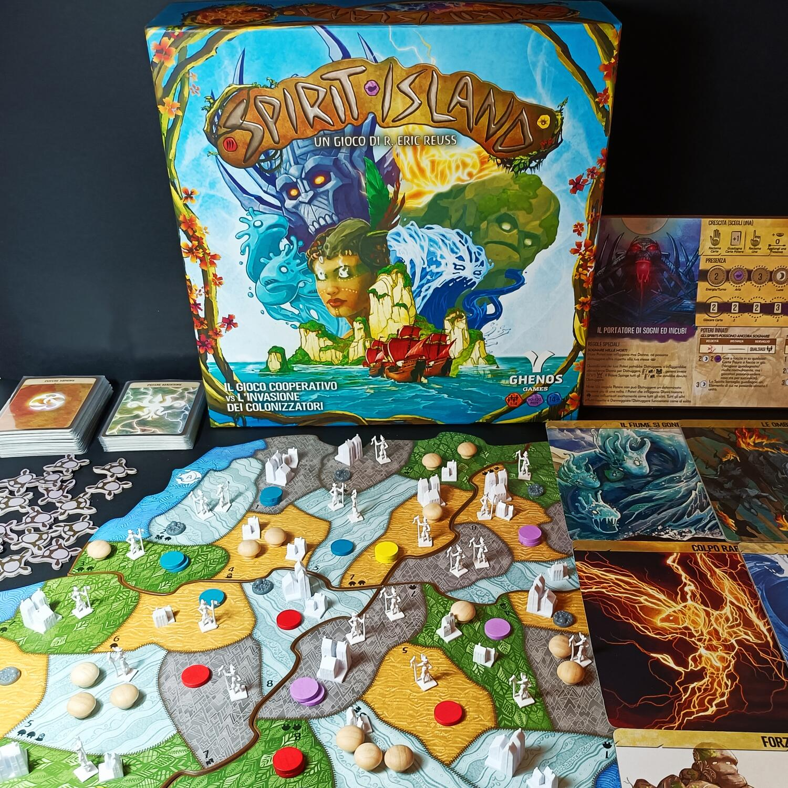
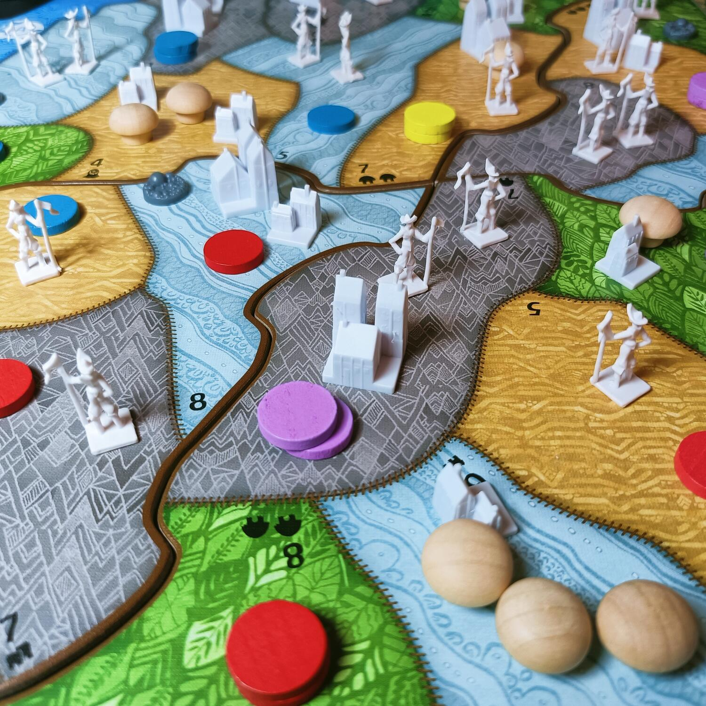

<Setting>

  <strong>Spirit island</strong> è un gioco <strong>cooperativo</strong> sul
  colonialismo. <strong>Colonizzatori</strong> che cercano di invadere un'isola
  abitata dagli indigeni <strong>Dahan</strong> e i giocatori dovranno
  affrontare questa invasione da una posizione privilegiata: il pantheon degli
  <strong>Dei dell'isola</strong>.

</Setting>

<Rules>

  In Spirit Island il round di gioco è diviso, grosso modo, in{" "}
  <strong>2 macro fasi</strong> in cui gli spiriti/giocatori diventeranno più
  potenti ottenendo nuove carte ed estenderanno la propria influenza, mentre
  invece gli invasori accresceranno la loro influenza negativa sull'isola
  corrompendola, costruendo villaggi o città e esplorando nuove terre. Prima che
  gli invasori agiscano, agli spiriti è data la possibilità di utilizzare i
  propri poteri per{" "}
  <strong>    attivare una incredibile moltitudine dei più disparati effetti prima o dopo
    il turno degli invasori</strong>
  . Il gioco continuerà poi fino a quando una delle condizioni di fine partita si
  sarà verificata: gli invasori vinceranno se l'isola è troppo contaminata, gli spiriti
  non hanno più influenza sull'isola o saranno passate troppe generazioni (rappresentate
  dalla fine di un mazzetto di carte). Dal canto loro gli spiriti vinceranno solamente
  se sono stati in grado di <strong>spaventare</strong> i colonizzatori abbastanza
  da farli fuggire.

</Rules>

<Feedback>

  Spirit Island è un gioco che{" "}
  <strong>    non dovrebbe mai mancare nella collezione di un amante dei cooperativi</strong>
  . Non è un gioco semplice: infatti, per quanto dotato di uno schema per
  stabilire a che livello di difficoltà lo si vuole affrontare, il gioco non è
  semplice a causa di molte interazioni e complessità. Spirit Island{" "}
  <strong>non è comunque esente da difetti, seppur trascurabili</strong>: in
  meno giocatori la fortuna nel pescare la carta giusta al momento giusto è da
  tenere in considerazione, mentre invece in più giocatori il gioco tende ad
  aumentare proporzionalmente in durata.
   
  Dopo innumerevoli partite a Spirit Island, mi sento invece di <strong>consigliare l'acquisto
  della espansione Branch &amp; Claw</strong>, che introduce un mazzo eventi e dei nuovi segnalini
  che fanno sì che l'isola risulti più “viva”, a discapito di un po' di controllabilità.

</Feedback>

