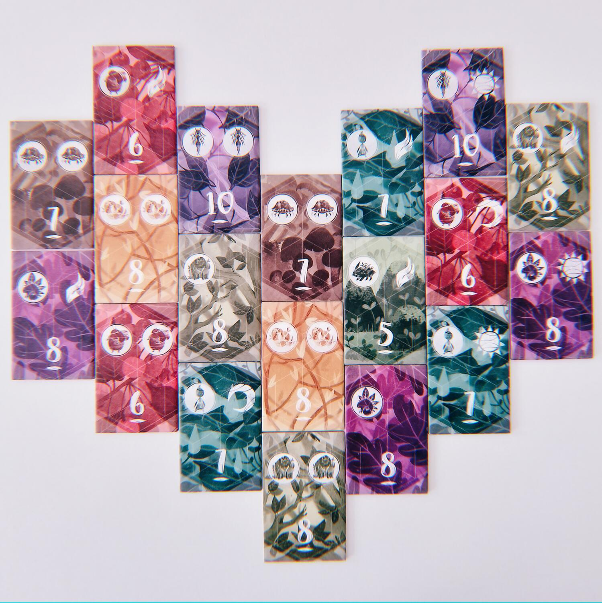
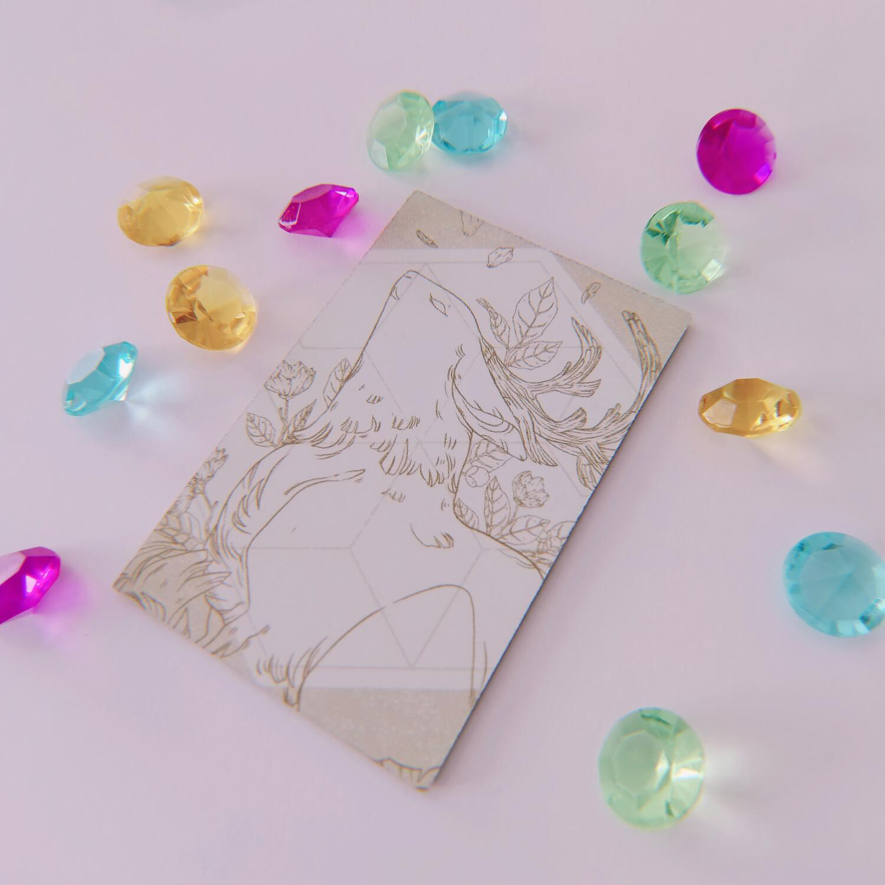
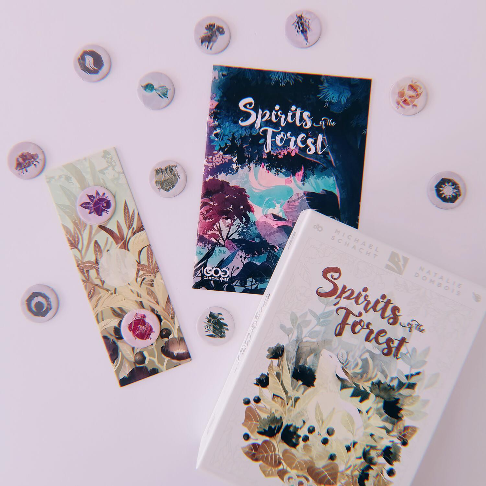

<Setting>

  Il gioco è un <strong>astratto </strong>in piena regola, ma le illustrazioni
  molto grafiche e i colori tenui e opachi vi portano in una foresta popolata da
  spiriti della natura che è un dolce per gli occhi.

</Setting>

<Rules>

  Una volta disposte le tessere in una griglia 4x12 e aver distribuito i gettoni
  bonus coperti come riportato sul regolamento, i giocatori a turno possono{" "}
  <strong>raccogliere fino a 2 tessere</strong> dai lati della “foresta”, cioè
  quelle più esterne a destra e sinistra. Perché 2 tessere possano essere
  raccolte insieme è necessario che abbiano lo stesso colore, ma il{" "}
  <strong>simbolo spirito</strong> su di esse riportato non dovrà essere
  presente più di 1 volta su ciascuna. Esistono anche i{" "}
  <strong>simboli forza della natura</strong>, casualmente presenti sulle
  tessere o sui gettoni bonus insieme ai simboli spirito. Ai giocatori sono
  anche fornite delle <strong>gemme </strong>con le quali, alla fine del proprio
  turno, potranno “prenotare” delle tessere qualsiasi ancora disponibili nella
  foresta: perché un altro giocatore se ne impadronisca, dovrà scartare una
  delle sue gemme (ma gli sarà possibile riprenderla se sarà abbastanza
  fortunato da ottenere il gettone bonus con la croce).
   
  La partita termina quando l’ultima tessera della foresta è stata raccolta. A
  quel punto ogni giocatore rivela i propri gettoni bonus e conta quante copie
  di ogni simbolo ha collezionato. Chi ottiene la{" "}
  <strong>maggioranza di un simbolo</strong>, guadagna quello stesso ammontare
  di punti (in caso di parità tra più giocatori, entrambi li guadagnano). Chi
  non possiede nemmeno una copia di un simbolo perde invece 3 punti dal totale.
   
  Il vincitore è chi avrà ottenuto il maggior numero di punti.

</Rules>

<Feedback>

  Le <strong>regole</strong>, come si è visto, sono{" "}
  <strong>poche e pulite</strong>. Ma se per questo vi aspettate di trovarvi
  davanti un gioco semplice o monotono, siete fuori strada.
   
  <em>Spirits of the Forest</em> ha una{" "}
  <strong>lenta curva di apprendimento</strong>, dotato com’è di una profondità
  che non è affatto scontata in un gioco così essenziale. La presentazione, a
  partire dalla scatola, fa pensare ad un filler per neofiti, e in un certo
  senso lo è. Ma è anche <strong>un’esperienza fredda e lucida</strong>, che
  richiede grandi capacità di calcolo e di anticipazione. Ogni mossa libera una
  o più possibili tessere, fa oscillare l’ago della bilancia delle singole
  maggioranze, prepara il terreno per le mosse successive. È necessario un
  attento <strong>dosaggio di tattica e strategia</strong> per riuscire a
  intascare la vittoria.
   
  Molto interessanti sono anche i cristalli che permettono di prenotare le
  tessere e che, se usati acutamente, possono interferire attivamente con la
  strategia dell’avversario, finanche a bloccargli le prese nelle battute
  finali.
   
  Certo, si può giocare in maniera rilassata, preoccupandosi solo del proprio
  set, lasciandosi trasportare dai colori tenui e dal design minimal dei
  componenti; ma appena si pestano i piedi all’avversario è guerra aperta.
  Questo è vero soprattutto per le partite in 2 giocatori: con un player count
  più alto è improbabile riuscire a prevedere quale sarà la situazione di gioco
  una volta che sarà di nuovo il proprio turno, e il gioco in sé potrebbe
  risultare più blando, più vicino ad un comune set collection senza particolari
  virtuosismi.
   
  In conclusione, <em>Spirits of the Forest</em> è un ottimo titolo che potrà
  accompagnarvi dalle vostre prime mosse nel mondo dei giochi fino a quando
  saprete masticare pesi medio-massimi. Non offre forse quella varietà e quella
  semplicità da poter essere intavolato tutte le sere, ma di sicuro è un titolo
  che <strong>non si smette di apprezzare</strong>.

</Feedback>

