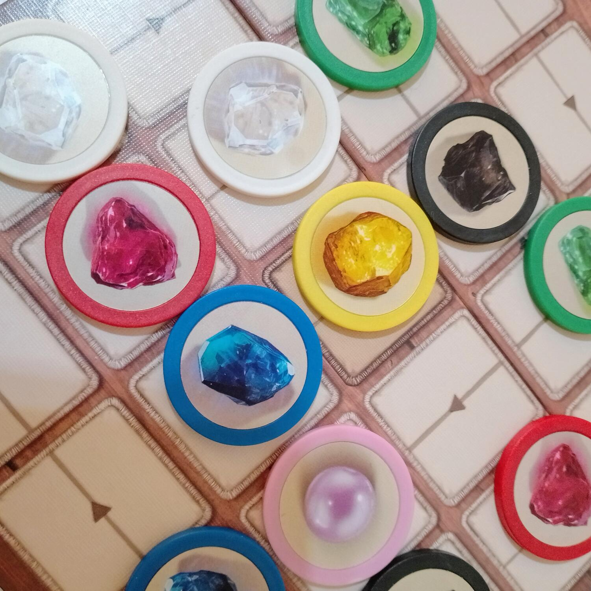
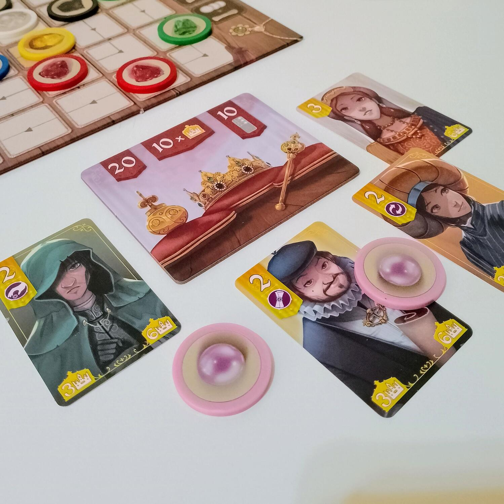
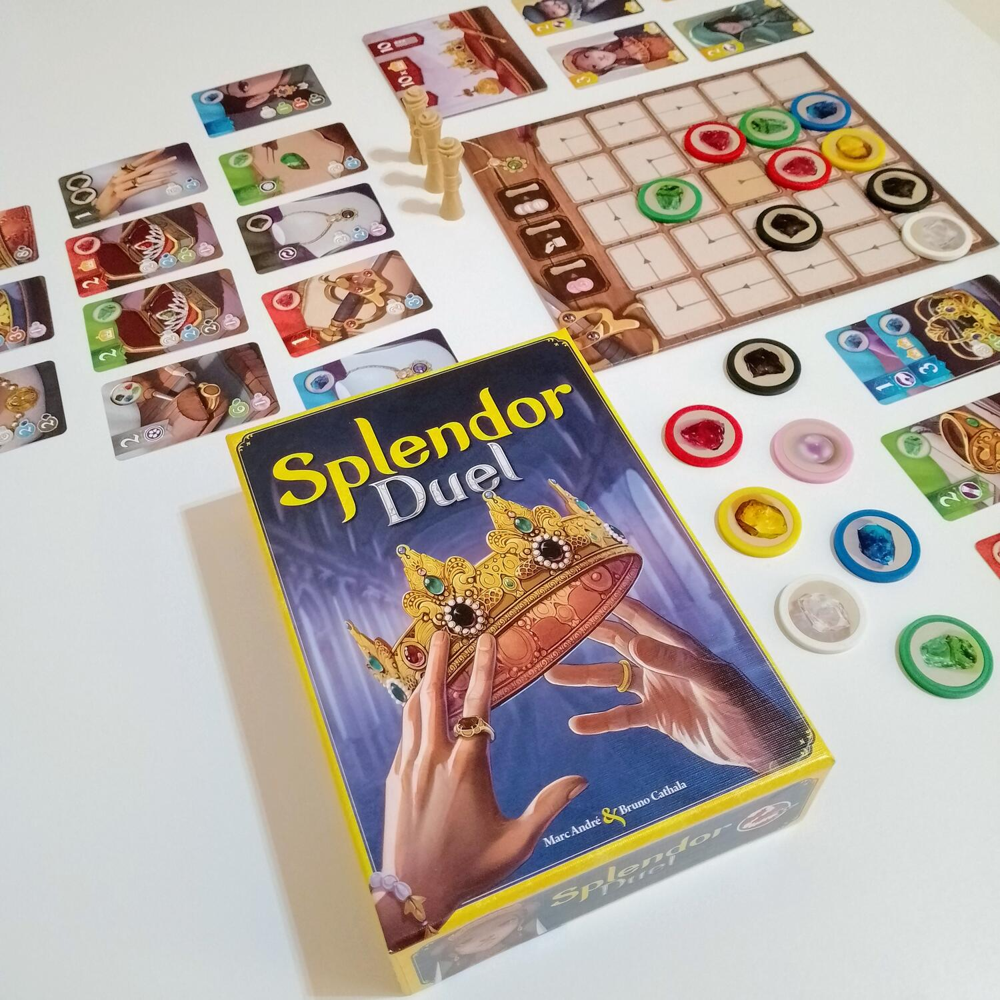

<Setting>

  Due artigiani competono per creare la collezione di gioielli più prestigiosa.
  Il gioco è a tutti gli effetti un astratto.
   

</Setting>

<Rules>

  A differenza dello <em>Splendor </em>originale, i{" "}
  <strong>gettoni gemma</strong> non sono riposti in una riserva generica ma
  vengono disposti secondo uno schema preciso su una{" "}
  <strong>plancia centrale</strong>, dalla quale potranno essere presi in file
  di (massimo) 3 e successivamente spesi per la “forgiatura” delle{" "}
  <strong>carte gioiello</strong>. Queste saranno scoperte sul tavolo secondo la
  configurazione indicata sul regolamento e, a meno che un giocatore non le
  prenoti collezionando un <strong>gettone oro</strong>, saranno sempre a
  disposizione di entrambi.
   
  Le carte gioiello possono avere un colore, un bonus (cioè uno “sconto” sulla
  forgiatura delle successive carte), un valore in punti, un valore in corone e,
  infine, un potere che si attiva nel momento in cui la carta viene costruita.
  Le corone serviranno per ottenere le <strong>carte dei reali</strong>, che
  forniranno punti extra ed eventualmente garantiranno l’attivazione di un
  potere.
   
  Oltre a queste regole, che rimangono abbastanza fedeli al titolo originale,{" "}
  <em>Splendor Duel</em> aggiunge le <strong>pergamene privilegio</strong>,
  ovvero dei token che è possibile spendere per compiere azioni aggiuntive.
   
  Ci sono <strong>tre possibili condizioni di vittoria</strong>: fare 20 punti,
  fare 10 punti con carte di uno stesso colore, collezionare dieci corone. Il
  primo giocatore che alla fine del suo turno riuscirà a soddisfare una di
  queste condizioni sarà il vincitore.
   

</Rules>

<Feedback>

  <em>Splendor Duel</em> poteva facilmente diventare un titolo acchiappa-soldi,
  considerando che il suo predecessore supportava anche 2 giocatori. Invece
  bisogna ammettere che <strong>è un gioco che stupisce</strong> e centra tutti
  i bersagli, sia in termini di produzione che di design.
   
  Per quanto riguarda il primo aspetto, ricordo che il primo <em>Splendor </em>  aveva una scatola di dimensioni titaniche, decisamente sproporzionate rispetto
  al tipo di esperienza di gioco che offriva, e anche i componenti in sé erano immotivatamente
  enormi. Un gettone di quelli poteva con facilità diventare un’arma impropria. <em>    Splendor Duel</em>, invece, <strong>ridimensiona tutto</strong> in maniera saggia, <strong>    senza rinunciare alla qualità</strong>. Le carte sono piccole ma pregevoli; il cartone, dove c’è, è bello solido;il
  feeling dei gettoni al tatto e alla vista viene conservato nelle dimensioni ridotte.
   
  Anche il design del meccanismo di distribuzione e ottenimento dei gettoni aggiunge
  quel sapore <strong>tattico </strong>che è forse imprescindibile per un titolo
  astratto per 2 giocatori, e fornisce molte più possibilità di attenzione sul <strong>    breve termine</strong> e sulla strategia dell’avversario.
   
  Al di là dei paragoni con l’originale, <em>Splendor Duel</em> è uno strategico
  astratto molto interessante, che riesce a creare <strong>    un crescendo di tensione agonistica</strong>, partendo da atmosfere di early game molto rilassate per arrivare a turni
  in cui l’ordine e il tempismo delle azioni saranno determinanti per l’esito della
  partita. Anche la curva di apprendimento è piuttosto “dolce” e garantisce al gioco{" "}
  <strong>un’ottima longevità</strong>. 
  Questa non è la prima opera di rimaneggiamento di un classico contemporaneo
  che viene affidata a Bruno Cathala. Lo ricordiamo per il pluripremiato{" "}
  <em>7 Wonders Duel</em>, di gran lunga più apprezzato del suo “genitore” per
  3-7 giocatori. Una fetta di pubblico sostiene che non si sentisse la necessità
  di uno <em>Splendor </em>esclusivamente per 2: eppure è innegabile che
  l’indice di gradimento di <em>Splendor Duel</em> è alto (8/10 su BoardGameGeek
  su 767 valutazioni nel momento in cui scrivo), forse perché Cathala riesce a
  calare in un peso legger(issim)o dei livelli di{" "}
  <strong>complessità ed elaborazione </strong>a cui un pubblico più navigato
  non può rinunciare, anche se solo per una serata di coppia davanti ad una
  camomilla.
   

</Feedback>

