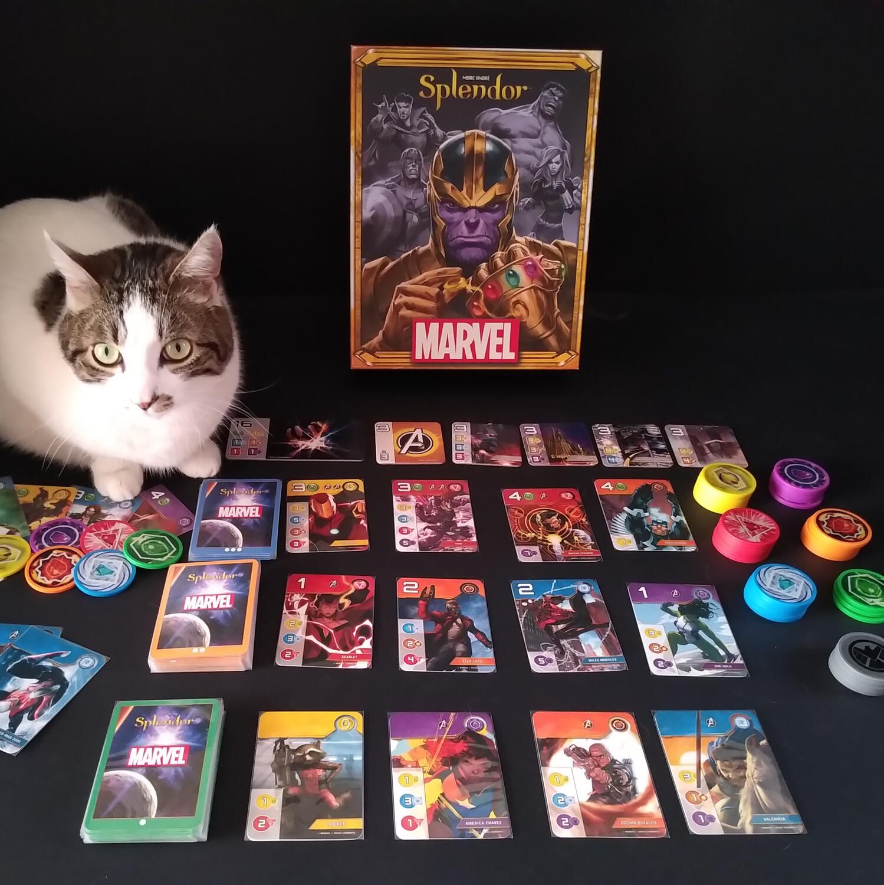
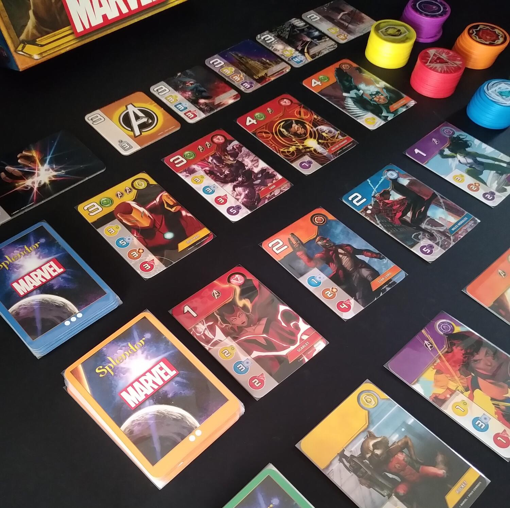

<Setting>

  La battaglia contro Thanos ha avuto un esito tragico: l'umanità è dimezzata,
  gli eroi sono stati sconfitti e si prospetta un futuro di triste
  rassegnazione. Ma ecco che, quando tutto sembra ormai perduto, si accende una
  speranza. In Marvel Splendor avremo la possibilità di formare una nuova
  squadra di eroi e usare i loro poteri per raccogliere le Gemme dell'Infinito e
  assemblarle nel Guanto. Solo in questo modo il mondo sarà salvo e al sicuro
  dalla minaccia di Thanos.
   
  Sulla scia del successo mondiale del Marvel Cinematic Universe, Splendor, il
  gioco già apprezzato dal 2014 da critica e pubblico, si reinventa con una
  nuova ambientazione a tema supereroistico.

</Setting>

<Rules>

  Esattamente come nell'originale Splendor, lo scopo del gioco è quello di
  collezionare i gettoni colorati, che in questo caso rappresentano le Gemme
  dell'Infinito, per poter ottenere carte, nello specifico personaggi Marvel,
  che conferiscono punteggi e bonus.
   
  Le carte personaggio vengono posizionate scoperte in file da 4 e visibili a
  tutti i giocatori, mentre accanto resta disponibile il mazzo coperto che
  servirà a riempire eventuali “vuoti” lasciati dalle carte reclutate nel corso
  della partita.  
  Le Gemme vengono posizionate in pile divise per colore.
   
  Il giocatore di turno dovrà effettuare una delle seguenti azioni:
   
  <ul>
    <li>      Prendere 3 Gemme dell'Infinito di 3 colori diversi (escluse le verdi e le
      grigie che si ottengono in altro modo).</li>
    <li>      Prendere 2 Gemme dello stesso colore: ciò si può fare solo se sono
      presenti almeno 4 Gemme nella pila prescelta (nuovamente sono escluse le
      verdi e le grigie).</li>
    <li>      Prenotare 1 carta personaggio e prendere un gettone grigio (si possono
      prenotare un massimo di 3 carte personaggio). Il gettone grigio è
      utilizzabile come jolly di qualsiasi colore.</li>
    <li>      Reclutare una carta personaggio dal tavolo, pagandone eventuali costi,
      oppure una carta precedentemente prenotata: in questo modo si otterranno
      sia il punteggio fornito da quella determinata carta sia il bonus del
      colore corrispondente.</li>
  </ul>
  Ogni bonus guadagnato con il reclutamento di un personaggio è pari a una Gemma
  dell'Infinito “permanente” e può essere utilizzato per reclutare i personaggi
  successivi. Nel corso della partita, può anche capitare che si possa reclutare
  un personaggio senza spendere nulla, sfruttando solamente i bonus.
   
  I bonus posseduti possono inoltre permettere a un giocatore di impossessarsi
  di una tessera luogo che non è necessaria ai fini della vittoria, ma che
  conferisce ulteriori punti.
   
  La Gemma dell'Infinito Verde serve per avvicinarsi alla vittoria: tali gemme
  si ottengono quando viene reclutata una carta personaggio di livello 3.  
  Alcune carte inoltre presentano dei simboli Avengers: il primo giocatore che riesce
  a collezionarne almeno tre, prende possesso della tessera Avengers Uniti.
   
  Appena un giocatore riesce ad ottenere 16 punti, 1 bonus per ogni colore e 1 gettone
  verde può finalmente assemblare il Guanto dell'Infinito e innescare la fine della
  partita. La vittoria spetta a chi avrà totalizzato il maggior numero di punti (a
  parità di punti, vince il giocatore che possiede la tessera Avenger Uniti).

</Rules>

<Feedback>

  La qualità è evidente già dalla scatola: esteticamente di alto livello, di
  cartone resistente, con organizer interno per riporre i materiali, dimensioni
  non compattissime ma ugualmente adatte ad essere trasportate facilmente e
  identiche alla versione classica di Splendor (dettaglio utile per organizzare
  al meglio gli scaffali!). Salta immediatamente all'occhio Thanos con il
  celebre guanto, nel quale sono incastonate le Gemme dell'Infinito e sotto il
  quale giganteggia la scritta Marvel, a conferma che si tratta di un prodotto
  ufficiale.  
  Gli elementi di gioco, nonostante i materiali siano pochi ed essenziali, rivelano
  una grande cura sia nella grafica sia nella qualità: i gettoni di plastica sono
  robusti, ben intagliati e presentano i colori delle sei gemme (giallo, arancio,
  rosso, blu, viola e verde), arricchite da stampe lucide che donano lucentezza.
  Le carte colpiscono per i meravigliosi disegni che raffigurano moltissimi personaggi
  Marvel, eroi e villain, tutti diversi tra loro, e anche le tessere, di cartoncino
  più spesso, presentano la stessa bella grafica con illustrazioni di ambienti e
  paesaggi.
   
  Dal punto di vista della qualità dell'esperienza di gioco, Marvel Splendor rimane
  per molte cose simile all'originale, con alcune interessanti modifiche che vanno
  a prevenire strategie settoriali e che bilanciano maggiormente le varie meccaniche.
   
  Punto forte è ancora una volta la strategia e la competizione tra i giocatori al
  tavolo. Rimane inoltre un gioco semplice, veloce, di facile spiegazione anche per
  i neofiti, mentre potrebbe risultare forse troppo “leggero” per chi ama intavolare
  titoli con durata e meccaniche più impegnative.

</Feedback>

