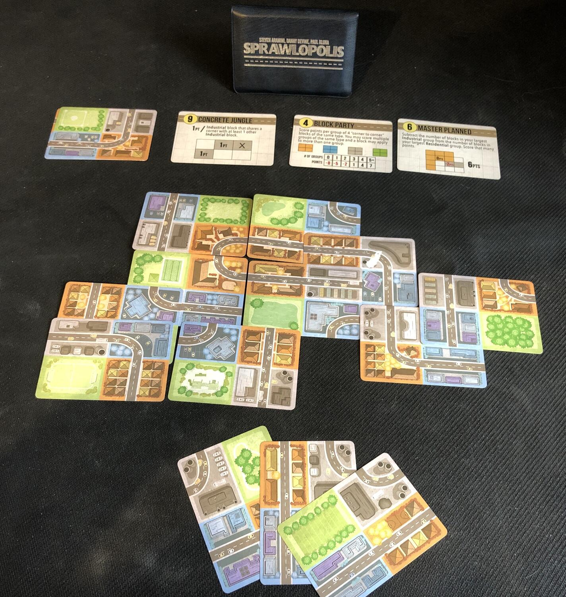
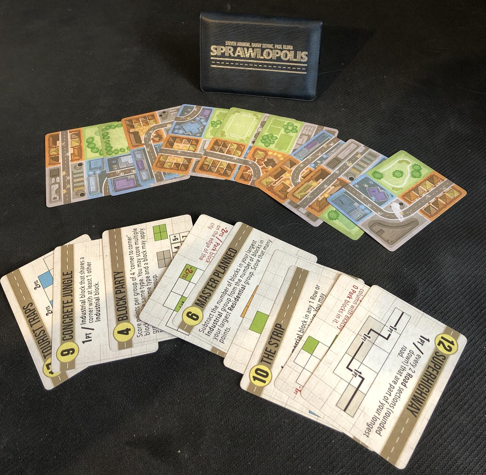

<Setting>

  Avete mai sognato di essere i fondatori di una città? Di poter costruire una
  città più o meno liberamente secondo chissà quale disegno urbanistico? Vi
  piacerebbe poterlo fare in meno di 20 minuti? E soprattutto vi piacciono gli
  astucci stilosissimi?

</Setting>

<Rules>

  In Sprawlopolis da 1-4 giocatori dovranno collaborare per costruire la città
  dei loro sogni seguendo le “istruzioni” di tre carte obiettivo che, oltre ad
  essere il modo principale per ottenere punti, sono anche responsabili di
  stabilire la soglia di punteggio necessaria per vincere una partita. Il gioco
  continuerà fino a quando i giocatori avranno finito le carte a disposizione e
  quando verrà il turno del giocatore dovrà sistemare una di queste carte nella
  propria città, assicurandosi, oltre che di seguire gli obiettivi, che non ci
  siano troppe strade (toglieranno punti vittoria a fine partita), che siano
  conglomerati abbastanza grandi (il gruppo maggiore darà punti vittoria
  direttamente proporzionale alla propria grandezza) e che ogni carta possa
  essere disposta ortogonalmente adiacente alle altre…Visto che ogni carta,
  però, è suddivisa in 4 sezioni rappresentanti quattro quartieri,
  l'ortogonalità è relativa alla sezione e quindi sarà possibile sovrapporre le
  carte! Vi ho detto che Sprawlopolis è composto da solo 18 carte vero?

</Rules>

<Feedback>

  Se devo pensare ad un gioco di cui, in qualsiasi momento, vorrei fare una
  partita nel corso della giornata la risposta sarà sempre Sprawlopolis (o -
  spoiler - Agropolis) in quanto regala sempre un'esperienza di gioco
  affascinante. Più di una volta tra un incastro di obiettivo e l'altro mi sono
  ritrovato ad aver passato un'oretta di gioco facendo più partite e facendo
  divertire tutti al tavolo. Ché è quello l'importante, no? Sprawlopolis però
  nella sua semplicità e nella sua composizione minimal di 18 carte ha due
  grandi difetti: il primo è che alle volte gli obiettivi sono uno l'opposto
  dell'altro e il secondo è che non esiste il concetto di modalità di difficoltà
  avanzata. Tutto questo porta da una parte a partite impossibili e dall'altra a
  partite troppo facili. Con l'aumentare delle partite però l'esperienza di
  gioco inizierà a farsi sentire portando a divertirvi di più con i casi
  impossibili e a scatenare un desiderio di superare i propri limiti di
  punteggio per i casi troppo facili. Un'esperienza di gioco incredibile, per 18
  carte!

</Feedback>

