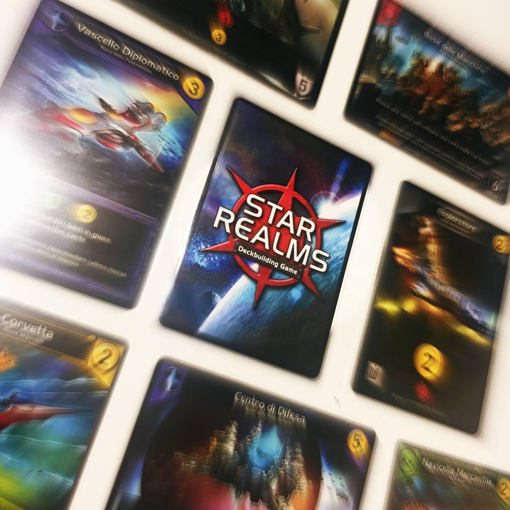
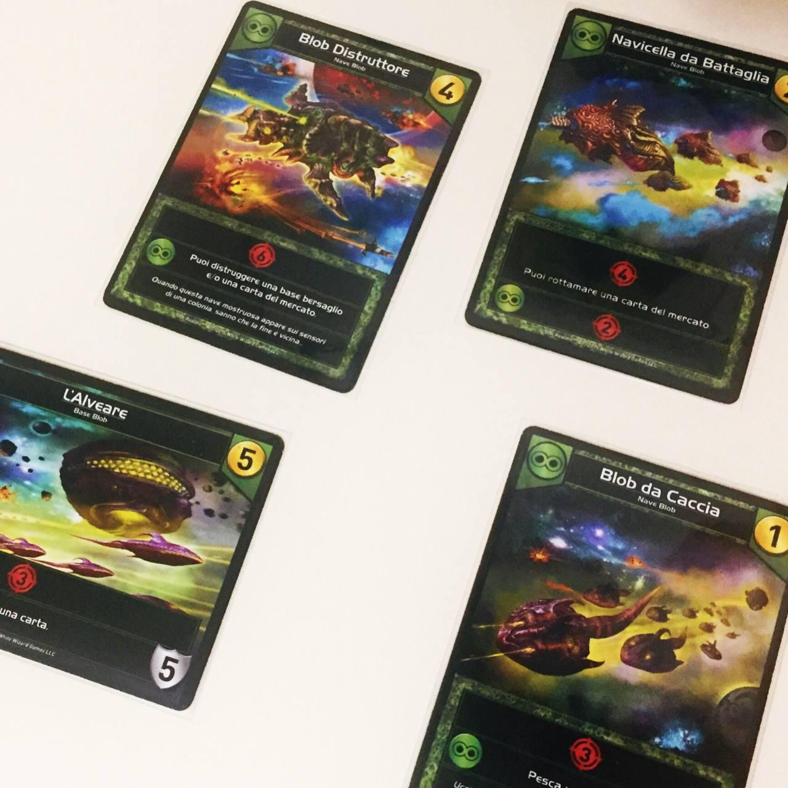

<Setting>

  In <em>Star Realms</em> avrai un solo obiettivo:{" "}
  <strong>annientare l’Autorità avversaria</strong> prima che la tua faccia la
  stessa fine. Per farlo, dovrai infoltire le tue fila di incrociatori, lance,
  caccia, basi e ogni sorta di nave spaziale: ti serviranno per commerciare,
  abbattere la flotta nemica e rinsaldare il tuo potere nella galassia. Sarà una
  sfida testa a testa senza esclusione di colpi.

</Setting>

<Rules>

  Ogni sfidante inizia la partita con 50 punti Autorità (cioè la salute) e un
  piccolo mazzetto di 10 carte, dal quale ogni turno ne pescherà 5. Potrà
  giocarle tutte o solo alcune, in qualsiasi momento, ma alla fine del turno
  ogni carta messa in gioco o rimasta in mano andrà scartata. Una volta giocate,
  le carte possono offrire degli effetti particolari, ma principalmente
  forniranno dei punti da spendere entro la fine del turno.
  <strong>Ci sono tre tipi di punti: denaro, attacco e autorità</strong>. Il denaro
  servirà ad acquistare le carte dalla fila del mercato, che andranno a finire negli
  scarti personali e saranno immediatamente rimpiazzate dalla carta in cima al mazzo
  centrale. I punti attacco saranno utilizzati per colpire l’Autorità avversaria
  o eventualmente le basi spaziali (delle carte speciali che rimarranno in gioco
  tra un turno e l’altro). I punti autorità ristabiliranno l’Autorità persa. Le carte
  potrebbero avere degli effetti secondari, la maggior parte dei quali sono detti
  Abilità. <strong>Esistono due tipi di Abilità: Alleato e Scrap</strong>. La prima
  potrà essere sbloccata in presenza di almeno un’altra carta della stessa fazione
  (Federazione dei Mercanti, Culto delle Macchine, Blob e Impero Stellare) della
  carta in questione tra quelle nella propria area di gioco; la seconda, invece,
  sarà riscattabile solo a patto di rottamare la carta, cioè eliminarla dal gioco
  in maniera definitiva. Chiude la partita chi riuscirà a portare l’Autorità avversaria
  a zero, aggiudicandosi così la vittoria.

</Rules>

<Feedback>

Uno dei grandi pregi di <em>Star Realms</em> è l’essere riuscito a prendere un sottogenere di gioco – il deckbuilding – che aveva già una sua solida tradizione, avviata da <em>Dominion</em> e portata avanti da <em>Thunderstone, Legendary</em> e molti altri, e rivoluzionarla completamente. A grandi set di carte e molte e varie righe di testo, <em>Star Realms</em> ha risposto con <strong>un piccolo mazzo che sta tranquillamente in una mano</strong> e un sistema a punti essenziale.
I turni si alternano con velocità, è tutto un arraffare e sparare. Ma a spuntarla non saranno per forza le navi più potenti, bensì quelle che saranno giocate con maggiore intelligenza. Grande importanza, infatti, viene data al <strong>ritmo</strong>, alla scelta dei momenti più adatti per impiegare le proprie risorse. Non avendo la possibilità di modificare le proprie mani, l’ottimizzazione del mazzo e la scelta degli acquisti saranno fondamentali.
Non per questo ci troviamo davanti ad un gioco complesso o poco accessibile. <em>Star Realms</em> è esattamente quello che promette di essere: <strong>un’esperienza intuitiva, dove l’immediatezza e la ponderazione si bilanciano sapientemente</strong>.
Una piccola nota di merito sento di volerla spendere anche per le illustrazioni, piccole esplosioni di colori in un 3D un po’ goffo e old school ma dotate di grande carattere. Tutto sommato, non sono invecchiate così male (cosa che non si può dire dell’impostazione grafica delle carte, che purtroppo non riesce a nascondere la natura semi-amatoriale, seppur pregevole, del gioco).

D’altra parte, <em>Star Realms</em> non è un gioco privo di difetti. Essendo un punto di svolta nell’ambito dei deckbuilding, alcune scelte di design e di sviluppo risentono dei piccoli salti nel vuoto che i suoi creatori hanno dovuto necessariamente compiere. Il sistema a punti, ad esempio, per quanto immediato, <strong>manca un po’ di eleganza</strong>: non è grandiosamente architettato, e l’impressione è che, più di ogni altra strategia, l’accumulo di punti attacco sia il modo migliore – e, fattualmente, anche l’unico – per vincere. Questo rende le partite più divertenti che strategiche, assottigliando sensibilmente la varietà di scelte da compiere ogni turno, che spesso si riducono ad un “compro o non compro”, a discapito della rigiocabilità – che si mantiene comunque alta grazie alla rapidità del set-up e alla leggerezza delle meccaniche.
Ma forse la debolezza principale di <em>Star Realms</em> è anche la sua più grande forza: alla fine dei conti, oltre ad essere un piccolo gioco, è anche un gioco piccolo, dal quale non ci si può aspettare un grandissimo impatto. Lo giochi e lo rigiochi perché ti sale l’adrenalina, perché non sai mai se la tua mano sarà quella vincente o se non ci sarà un altro turno, ma c’è poco progresso, in termini di profondità, tra una partita e la successiva.
Volendo tirare le somme, pur nel suo piccolo deck box di cartoncino, <em>Star Realms</em> è un titolo <strong>senza grandi pretese</strong> che è però riuscito a imporsi nel panorama dei giochi di carte e a creare una sua <strong>piccola ma interessante eredità</strong>, con successori più o meno diretti come <em>Hero Realms</em> e <em>Volfyirion</em>. È tutt’altro che un gioco superato: ha una sua solida fan base e nuove espansioni escono ogni anno da quasi dieci anni. Con tutti i limiti imposti dalla sua forma, materiali e di design, <em>Star Realms</em> è e resterà ancora a lungo un pezzo irrinunciabile nella collezione degli amanti dei giochi di carte.

N.B.: esistono delle app per tenere traccia dell’Autorità, visto che le carte presenti nella scatola che servirebbero a farlo sono davvero impraticabili.

</Feedback>

