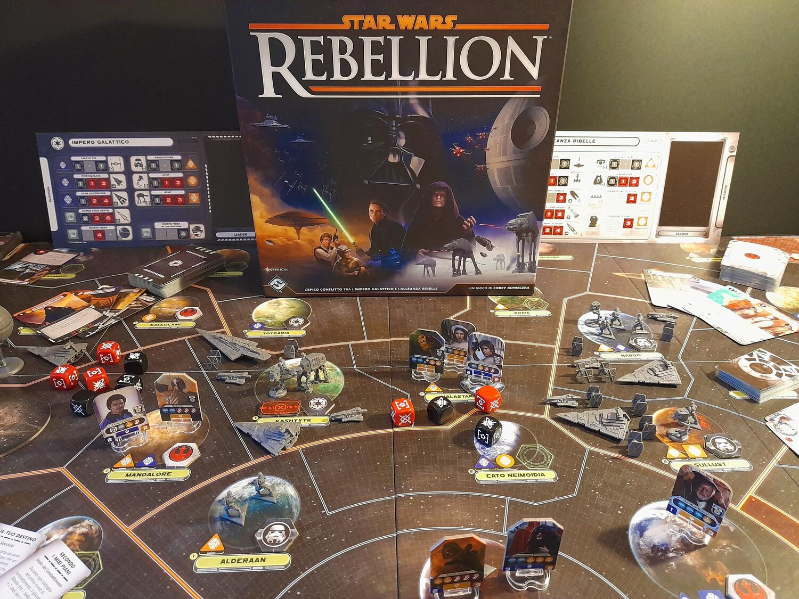
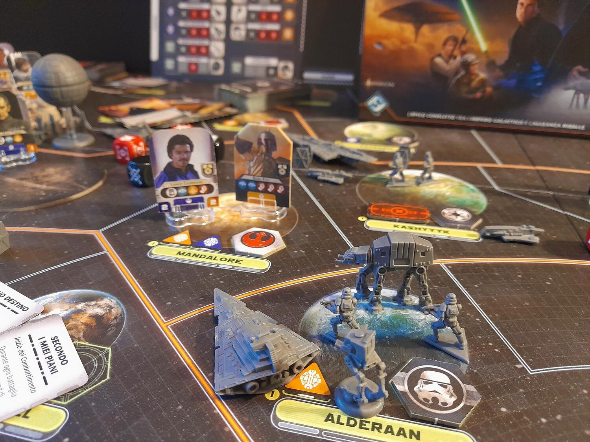

<Setting>

  Da quasi vent'anni l'ombra dell'Impero è calata sulla galassia: flotte di Star
  Destroyer ed eserciti di assaltatori mantengono saldamente il controllo dei
  pianeti abitati, mentre da Coruscant l'imperatore tesse oscure trame. Dal suo
  sforzo di mantenere il potere è nata la Morte Nera, una stazione spaziale
  corazzata capace di disintegrare interi pianeti. Tuttavia, non tutto è
  perduto: la Ribellione, una piccola cellula di combattenti con il sogno di
  restaurare la Repubblica e porre fine alla tirannia, è riuscita a rubare i
  piani di costruzione della Morte Nera, sperando di trovarne il punto debole e
  distruggere l'arma…
   
  Da qui prendono le mosse sia il primo film della trilogia originale di Star
  Wars sia il nostro gioco, che si basa sui tre film degli anni '80.

</Setting>

<Rules>

  Star Wars Rebellion è un gioco asimmetrico, in cui un giocatore impersona
  l'Impero e l'altro la Ribellione, con diverse condizioni di vittoria: il primo
  dovrà trovare e distruggere la base ribelle, mentre il secondo dovrà
  sopravvivere fino a quando il segnalino tempo non coinciderà con quello
  reputazione, cercando nel contempo di risolvere obiettivi che faranno
  avvicinare i due segnalini, accorciando la partita e incrementando le
  probabilità di vittoria ribelle.
   
  Il gioco si articola in un massimo di 16 round, divisi ognuno in 3 fasi:
  assegnazione, comando e ripristino.
   
  Nella prima si sceglie quali eroi inviare in missione, ovvero le carte in mano
  ai giocatori, che permettono di effettuare tantissime azioni: dallo schierare
  truppe, al catturare eroi nemici, dal sabotare un pianeta al mandare Luke da
  Yoda per farlo diventare un cavaliere Jedi. Le missioni sono uno dei motori
  principali del gioco, sia dal punto di vista delle meccaniche che
  dell'ambientazione.
   
  Nella seconda fase si porteranno a termine le missioni e si utilizzeranno gli
  eroi avanzati per muovere le truppe sulla plancia, con la possibilità che
  comincino dei combattimenti. Questi sono gestiti da lanci di dadi, mitigati in
  parte dal tipo di unità coinvolte e dalle carte tattica, che possono
  modificare alcuni parametri rendendo il combattimento sempre teso e
  imprevedibile.
   
  Con la terza fase termina un round di gioco: tutti i leader ritornano nella
  riserva, i giocatori pescano nuove missioni, il ribelle pesca una carta
  obiettivo mentre l'imperiale lancia le sonde per cercare la base ribelle.
   
  La partita procede in questo modo fino a quando uno dei due giocatori non
  vince.

</Rules>

<Feedback>

  Questo non è solo un ottimo gioco, ma è{" "}
  <strong>IL gioco per gli amanti di Star Wars</strong>: ogni carta, eroe,
  pianeta e miniatura richiama la saga, e durante la partita si creeranno spesso
  situazioni che ricalcheranno o rielaboreranno i momenti più amati dei film:
  l'attacco dei ribelli alla Morte Nera, la distruzione di Alderaan, la
  principessa catturata per ottenere informazioni, Han Solo messo nella
  carbonite, e tanti altri.
   
  Le meccaniche sono solide e intuitive, pur garantendo una buona profondità.
  Ovviamente stiamo parlando di un gioco “american”, quindi non aspettatevi che
  la vostra strategia si sviluppi esattamente come avete pianificato. Pesca di
  carte e tiri di dado sono molto presenti, e perfino il diabolico piano
  dell'imperatore Palpatine potrebbe crollare sotto una serie di risultati
  negativi (o del lato chiaro della forza?).
   
  L'asimmetria è molto marcata e le sensazioni che restituisce il gioco saranno
  estremamente differenti per i due giocatori. Infine, soprattutto nelle prime
  partite, scordatevi di stare sotto le 4 ore, ma non preoccupatevi, perché
  l'esperienza sarà entusiasmante. Una componentistica di ottima qualità è la
  ciliegina sulla torta di questo gioco che mi sento di consigliare a tutti gli
  appassionati della saga e non, pronti ad avventurarsi ancora una volta in
  quella galassia lontana lontana.

</Feedback>

