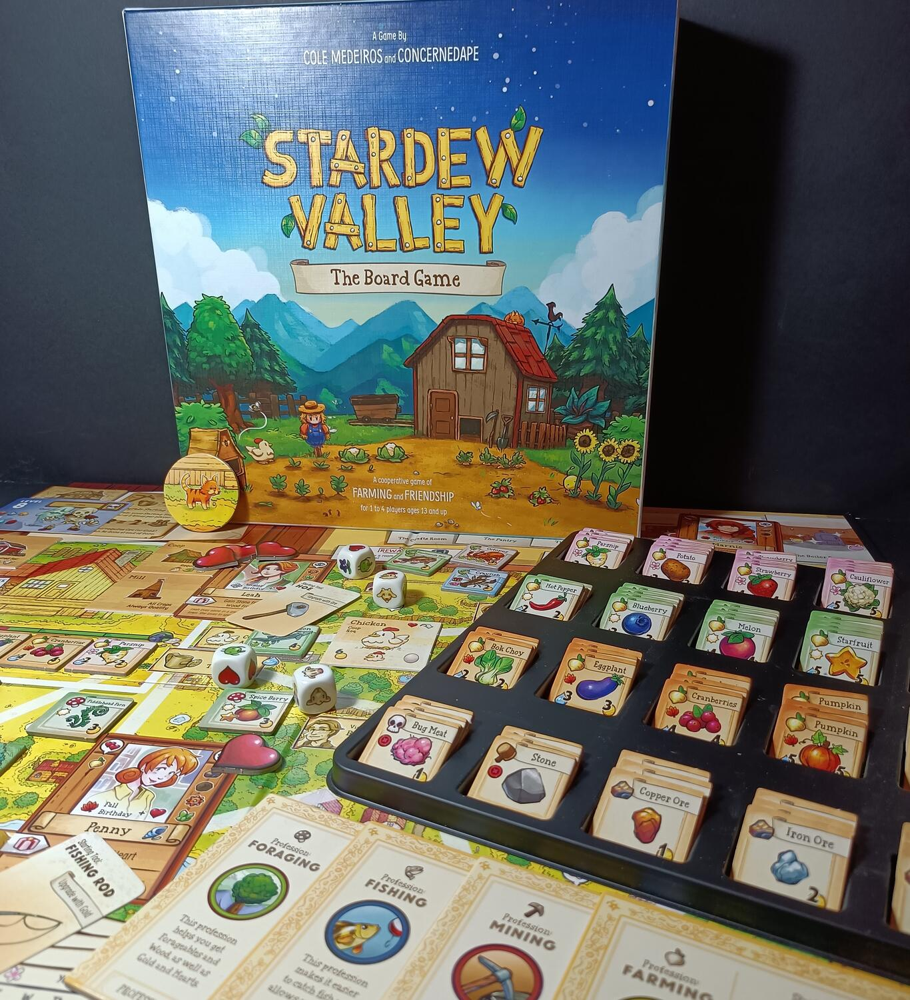
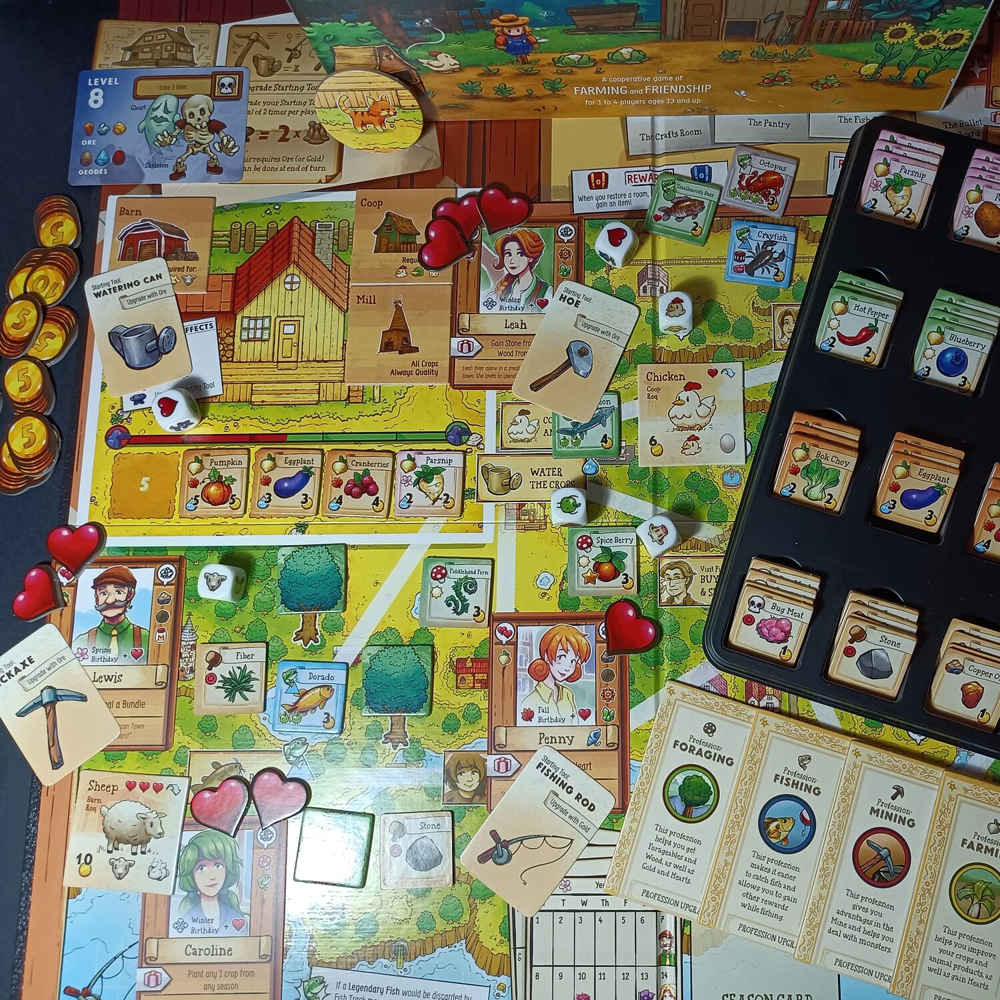

<Setting>

  “Se stai leggendo questo, devi avere un disperato bisogno di un cambiamento.
  La stessa cosa è successa anche a me, molto tempo fa. Avevo perso di vista ciò
  che contava di più nella vita... i veri legami con le altre persone e la
  natura. Così ho lasciato tutto e mi sono trasferito nel posto a cui appartengo
  veramente”
   
  <strong>Stardew Valley: The Board Game</strong> è un gioco cooperativo
  ispirato all'omonimo videogioco di Eric Barone. Dovrete collaborare per
  costruire la più bella fattoria e cercare di far ritornare agli albori il
  paesino di Stardew Valley, completando le missioni che il vostro vecchio nonno
  vi ha lasciato e ricostruendo il Centro comunitario. Dovrete impegnarvi con
  tutto ciò che la Valle ha da offrire: raccolti, animali, foraggi nascosti,
  pesci sfuggenti, una miniera inesplorata e, naturalmente, gli amichevoli
  abitanti del luogo. Se avrete successo, la Valle prospererà! Se fallirete, la
  Joja Corporation spegnerà la magia della Valle...

</Setting>

<Rules>

  Stardew Valley non è un gioco complesso o difficile da imparare, ma ricco di
  opzioni e particolari, quindi per alleggerire la spiegazione non mi soffermerò
  troppo sul setup del gioco, poiché estremamente lungo e dettagliato. Quindi
  passiamo subito alle regole in generale! In Stardew Valley dovrete raccogliere
  risorse nel corso delle quattro stagioni, cercando di completare le difficili
  missioni che il vostro nonnino vi ha lasciato, oltre a dover ricostruire le
  sei sezioni del Centro comunitario. Ad inizio di ogni turno i giocatori si
  organizzano per scegliere in quale luogo andare in quella giornata. Si potrà
  andare a pesca (fiume, lago o oceano), in miniera, in città e in vari luoghi
  che hanno reso celebre il videogioco. Ovviamente, ogni giocatore avrà una
  specializzazione, come ad esempio Pescatore o Minatore, che gli permetterà di
  ottenere utili abilità nel corso della partita per agevolare specifiche
  azioni. A turno, i giocatori dovranno o effettuare due azioni nello stesso
  luogo, oppure effettuare un'azione, spostarsi in un altro luogo e farne una
  diversa. Il vantaggio di quest'ultima opzione è che nel tragitto i giocatori
  potranno raccogliere oggetti, come legna o foraggi. Successivamente il
  giocatore tornerà finalmente a casa, potendo effettuare a fine giornata
  un'azione bonus tra le seguenti: costruire una scala per le miniere, accudire
  gli animali, eliminare un token Jojo market o migliorare un attrezzo. I
  giocatori dovranno giostrarsi per riuscire a raccogliere più velocemente
  possibile le risorse per completare gli obiettivi. Accumulare soldi sarà la
  priorità per poter costruire edifici e strutture che vi permetteranno di
  migliorare le vostre azioni. Il raccolto e la pesca sono un ottimo modo per
  farlo, senza dimenticare che le miniere sono un luogo fondamentale per
  ottenere materiali preziosi. A tutto questo si aggiungerà la compagnia degli
  abitanti di Stardew Valley, che dopo un gradito regalo diventeranno vostri
  amici, aiutandovi a concludere il gioco. La partita termina se riuscirete a
  completare tutti gli obiettivi o al termine dell'anno.

</Rules>

<Feedback>

  Stardew Valley è una gioia per gli occhi e per il cuore. Da amante del
  videogioco, la <strong>ConcernedApe</strong> ha fatto un lavoro spettacolare
  nella realizzazione dei materiali e nella grafica. Colorati e in grandissime
  quantità, questi ultimi addobberanno il tabellone di gioco con un
  caleidoscopio di colori. Stardew Valley è un gioco sotto sotto semplice, con
  regole immediate da spiegare, ma che risulta ostico per via di un setup
  abbastanza lungo e dell'enorme quantità di dettagli e di opzioni da dover
  prendere in considerazione nel corso della partita. Di buono c'è che dopo i
  primi giri di prova tutto risulterà liscio, quindi non preoccupatevi troppo.
  La rigiocabilità è davvero alta, grazie alla gran quantità di oggetti,
  materiali, carte Evento, carte Obiettivo e possibilità di personalizzazione
  del personaggio. La scalabilità è davvero ottima, ma ho apprezzato di più
  giocarlo in quattro, poiché c'era la possibilità di poter scegliere tra più
  opzioni oltre che quella di poter sfruttare più classi di personaggi.
   
  Ovviamente non mancano dei difetti. Ho trovato il gioco abbastanza ripetitivo
  nel corso di una stessa partita. Dovrete, infatti, fare e rifare sempre le
  stesse azioni per poter accumulare i vari materiali necessari al completamento
  degli obiettivi. Oltre a ciò, in alcuni casi, entra a gamba tesa la dea
  bendata, che renderà il tutto abbastanza ostico e frustrante.
   
  In conclusione però, Stardew Valley è un gioco che si fa amare grazie ai suoi
  stupendi componenti. Lo consiglio fortemente a tutti quelli che hanno avuto il
  piacere di giocare ed amare il videogioco, poiché gli sviluppatori sono
  davvero riusciti a riportare le emozioni e le meccaniche che lo hanno reso
  così celebre.

</Feedback>

