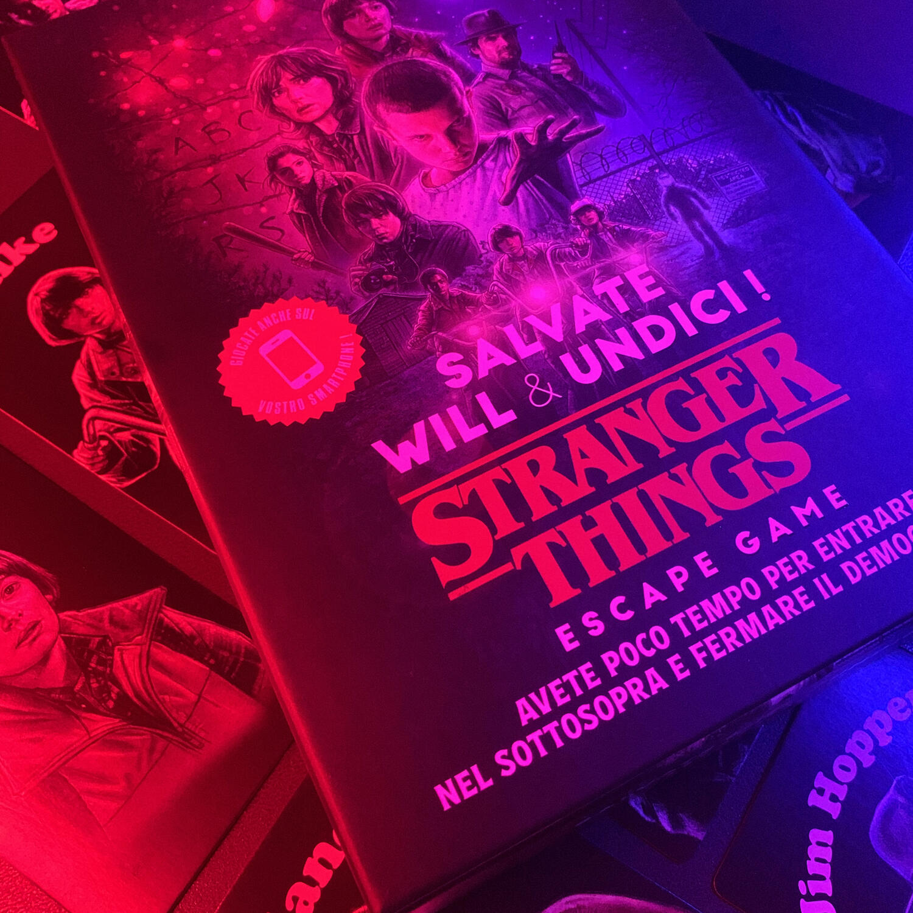

<Setting>

  Mentre strani fenomeni turbano la quiete della cittadina di Hawkins, il vostro
  amico Will Byers sparisce senza lasciare traccia. La tensione è altissima e il
  vostro gruppo di amici deve assolutamente ritrovarlo prima che sia troppo
  tardi! Ma fate attenzione: un mostro assetato di sangue è fuggito dal
  laboratorio e presto le vostre strade potrebbero incrociarsi.

</Setting>

<Rules>

  Questa escape room viene scandita da <strong>15 carte fase</strong>, ognuna
  delle quali vi darà un <strong>enigma</strong> da risolvere per procedere con
  la storia che, se avete visto la prima stagione di Stranger Things, potrete
  rivivere in prima persona.
   
  Gli enigmi (le carte fase) devono essere{" "}
  <strong>risolti progressivamente</strong>, uno alla volta. Per risolverne uno,
  dovrete capire come utilizzare al meglio le carte che si sbloccheranno man
  mano, capire quali utilizzare e soprattutto come. La particolarità di questa
  escape room è data proprio dai <strong>personaggi</strong>, ognuno dei quali
  ha una capacità unica che vi sarà essenziale per risolvere un dato enigma. Ad
  esempio Nancy, da brava studiosa, porterà con sé una tavola periodica degli
  elementi e cosa avrebbe mai potuto descrivere al meglio Undi se non una
  scatola di Eggo?
   
  Una volta controllata la soluzione dell'enigma, che è sempre un numero di 4
  cifre, nell'apposito manuale o sull'applicazione web, si potrà{" "}
  <strong>proseguire con la successiva carta fase</strong>. Se vi sentite
  smarriti e non avete idea di come affrontare l'enigma, nessuna paura: sono
  presenti degli aiuti davvero ben pensati.  
  Una volta girata la 15esima carta fase, la partita termina e valutate, in base
  al tempo speso, quanto siete stati bravi.

</Rules>

<Feedback>

  Stranger Things: salvate Will &amp; Undici è un modo ottimo per rivivere
  questa magnifica serie, capace di farvi ripercorrere gli eventi salienti del
  telefilm e impersonare i vostri personaggi preferiti.  
  La difficoltà degli enigmi <strong>non è banalissima</strong> ma è proprio questo
  che la rende interessante: alcuni sono davvero ostici, soprattutto se si interpretano
  male gli indizi a disposizione.
   
  Tenendo a mente che uno degli scopi di questo gioco è quello di far rivivere la
  serie, va da sé che bisogna seguire il <strong>filo narrativo</strong> e quindi
  procedere passo passo con l'avanzare della storia. Di conseguenza bisognerà procedere
  enigma dopo enigma, senza poter operare contemporaneamente su più fronti.
   A livello <strong>materico e graficamente è spettacolare</strong>, nulla
  è lasciato al caso.  
  Si può giocare senza parte digitale per una serata tutta in analogico, proprio
  per essere catapultati ancora di più nei famosi anni '80.  
  Non avete visto Stranger Things e vi state domandando se possa fare al caso
  vostro? Per prima cosa vergognatevi, poi prendetevi una sera, sedetevi al buio
  e premete play… poi non potrete voler altro che giocare questa escape.
   
  Se proprio non volete vederlo, nulla vi vieta di giocarla ma sappiate che vi
  spoilererete un capolavoro.

</Feedback>

