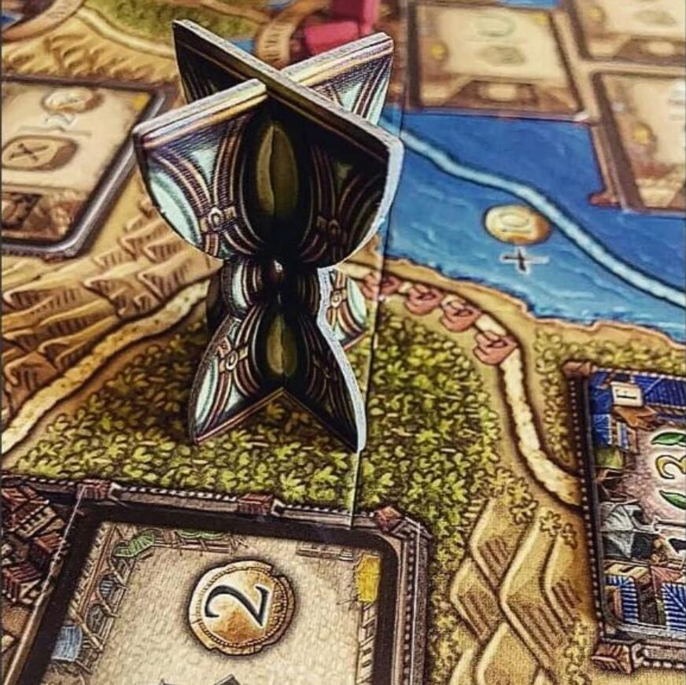
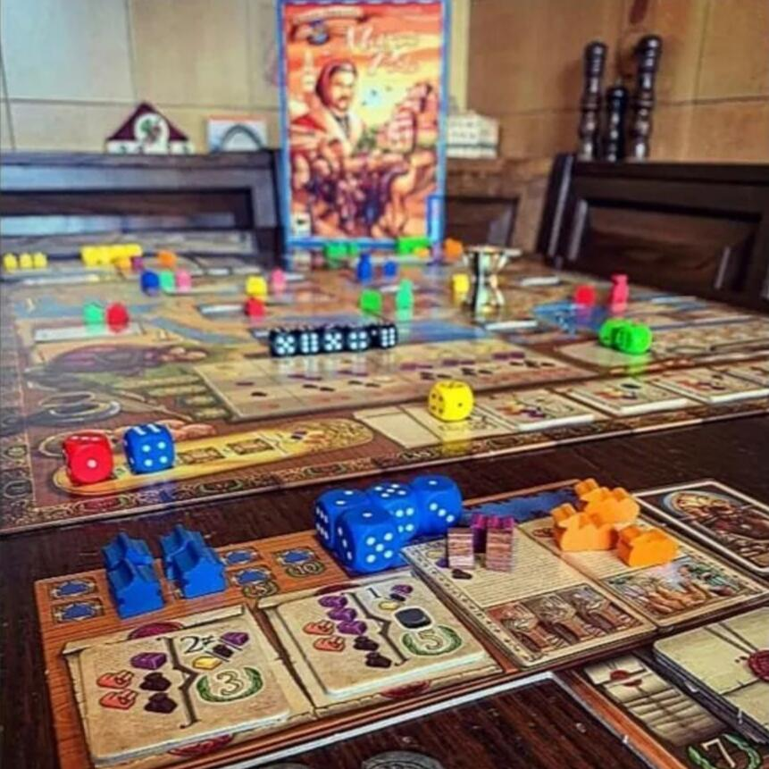

<Setting>

  Sulle Tracce Di Marco Polo è un gioco a sfondo storico e ripercorre i passi
  del giovanissimo Marco Polo, il quale alla tenera età di 17 anni si avventurò
  in un lungo ed estenuante viaggio partendo da Venezia fino a giungere nelle
  terre governate allora dal Kublai Khan, diventando perfino per un breve
  periodo governatore di alcune di esse.
   
  XI secolo: nella veste di abili mercanti di stoffe, spezie, ori e cammelli i
  giocatori dovranno contendersi il titolo di miglior viaggiatore, commerciante
  e stratega di tutti i tempi.
   
  Dopo aver attraversato Gerusalemme, la Mesopotamia e la “Via Della Seta” la
  famiglia Polo (composta da Marco, il padre Niccolò e lo zio Matteo) toccò le
  sponde della Cina (Catai) giungendo fino alla capitale.
   
  Senza includere il viaggio di ritorno verso la Serenissima, questo titolo
  porta gli avventori al tavolo a rivivere le imprese del trio Polo e non solo,
  a sviluppare abilità nel mercanteggiare tramite dadi personali e comuni, a
  riconoscere un buon affare e a saper concedersi una pausa dal viaggio per
  raccogliere e comprare risorse utili per affrontare il percorso successivo
  sino a raggiungere Pechino.
   
  Chi sarà di Voi il più abile viaggiatore e commerciante che saprà spaziare
  dalla bella Italia al più produttivo Catai?
   

</Setting>

<Rules>

  Una partita a Sulle Tracce Di Marco Polo dura esattamente 5 round, durante i
  quali i giocatori utilizzano i dadi a loro disposizione per selezionare azioni
  dal tabellone di gioco: chi ottiene il maggior numero di punti vittoria alla
  fine della partita è il vincitore.
   
  All’inizio del turno di gioco ogni giocatore al tavolo tira i propri dadi e li
  posiziona sull’apposita area della propria plancia, pronti per essere
  assegnati alle azioni disponibili:
   
  RACCOGLIERE RISORSE: i dadi saranno piazzati nelle colonne per raccogliere una
  risorsa tra SETA, SPEZIE, CAMMELLI e ORO. Il valore della risorsa raccolta
  varia al variare del risultato mostrato sulle facce del dado assegnato.
   
  VIAGGIARE: sarà necessario tirare i dadi e il numero minore indicherà le tappe
  percorribili. Ogni viaggio ha un costo fisso e una serie di extra che cambiano
  in base alla città di arrivo. Una volta giunti a destinazione potrete segnare
  il tutto con l'avamposto personale e godere dei benefit.
   
  RACCOGLIERE MONETE: indipendentemente dal numero del dado, si raccolgono
  sempre e solo 5 monete.
   
  PRENDERE NUOVI CONTRATTI COMMERCIALI: più alto è il valore del dado assegnato
  più è il numero di contratti che potremo considerare per la nostra scelta;
  ogni giocatore può comunque trasportare un massimo di 2 contratti
  contemporaneamente.
   
  Oltre a queste azioni principali c’è la possibilità, di turno in turno, di
  svolgere anche azioni aggiuntive e facoltative come:
   
  GUADAGNARE 3 MONETE  
  PAGARE 1 CAMMELLO PER RITIRARE UN DADO
   
  PAGARE 2 CAMMELLI PER MODIFICARE IL RISULTATO DI UN DADO
   
  PAGARE 3 CAMMELLI PER USARE UN DADO NERO AGGIUNTIVO
   
  Tramite le azioni i giocatori hanno l’obiettivo di toccare le diverse città che
  separano Venezia e Pechino, rispettivamente punto di partenza e arrivo, e intanto
  commerciare in cerca di fortuna.
   

</Rules>

<Feedback>

  Il gioco è un classico German: tutto è meeple, casette e dadi in legno.
   
  Il tabellone, bello colorato, è semplice a prima vista, nonostante il mix
  Mappa e Azioni in un unico tabellone.
   
  Il gioco è decisamente asimmetrico, con una rigiocabilità abbastanza alta,
  grazie alle abilità speciali dei vari personaggi, tra i quali Matteo Polo,
  Niccolò e Marco Polo e perfino il Kubilai Khan.
   
  La scalabilità è interessante, poiché non cambia assolutamente l’esperienza di
  gioco in 2, 3 o 4 giocatori. Forse la mappa, di suo un po’ piccola, potrebbe
  risultare striminzita in tanti giocatori.
   
  Occorre prestare particolare attenzione a rispettare pedissequamente il
  proprio turno, mentre una volta terminato resta solo da pensare a che mossa
  fare e frattanto guardare giocare gli altri… Ad alcuni questo potrebbe far
  storcere un po’ il naso, soprattutto se uno dei giocatori al tavolo soffre di
  paralisi d’analisi… Se poi è più d’uno, si salvi chi può!
   
  Tuttavia se si riesce a rispettare questa “piccola regola” il gioco ripagherà
  tanto.
   
  Un lato negativo è che non si sente per nulla interazione al tavolo: quale
  tipo di partita stia portando avanti l’avversario alla propria destra o alla
  propria sinistra non per forza deve interessare, anzi è pressoché inutile,
  mentre l’importante è commerciare, viaggiare e macinare punti vittoria come a
  sgranocchiare pistacchi… uno tira l’altro!
   
  Il tema del commercio è semplice e facilmente ritrovabile in altri giochi
  trattati come Jaipur e Century, sebbene le meccaniche di questo titolo siano
  più snelle e più eleganti.
   
  In conclusione, Sulle Tracce di Marco Polo non sarà certo il gioco della vita,
  questo è chiaro, soprattutto se prediligete titoli American, ma piuttosto un
  titolo da non evitare e a cui dedicare una partita ogni tanto: vi
  divertirete!!  

</Feedback>
