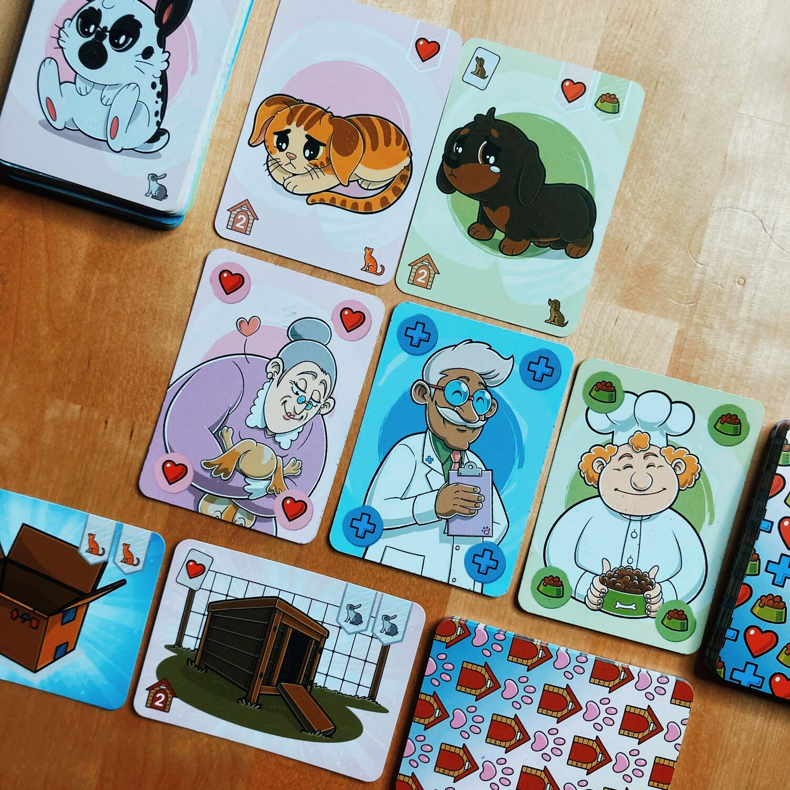
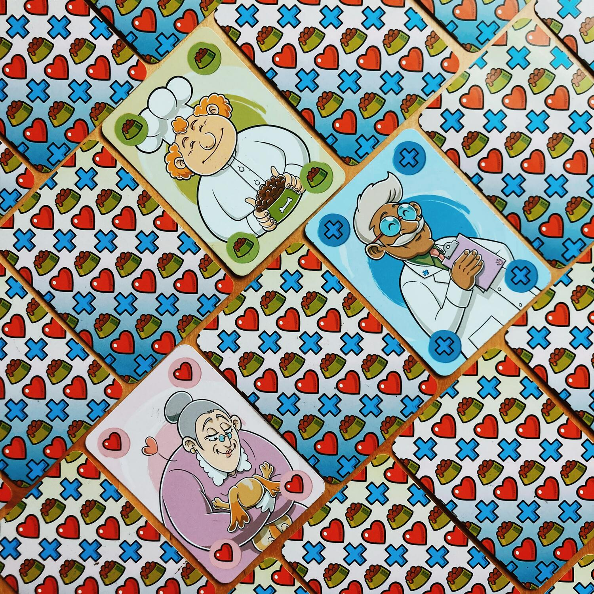
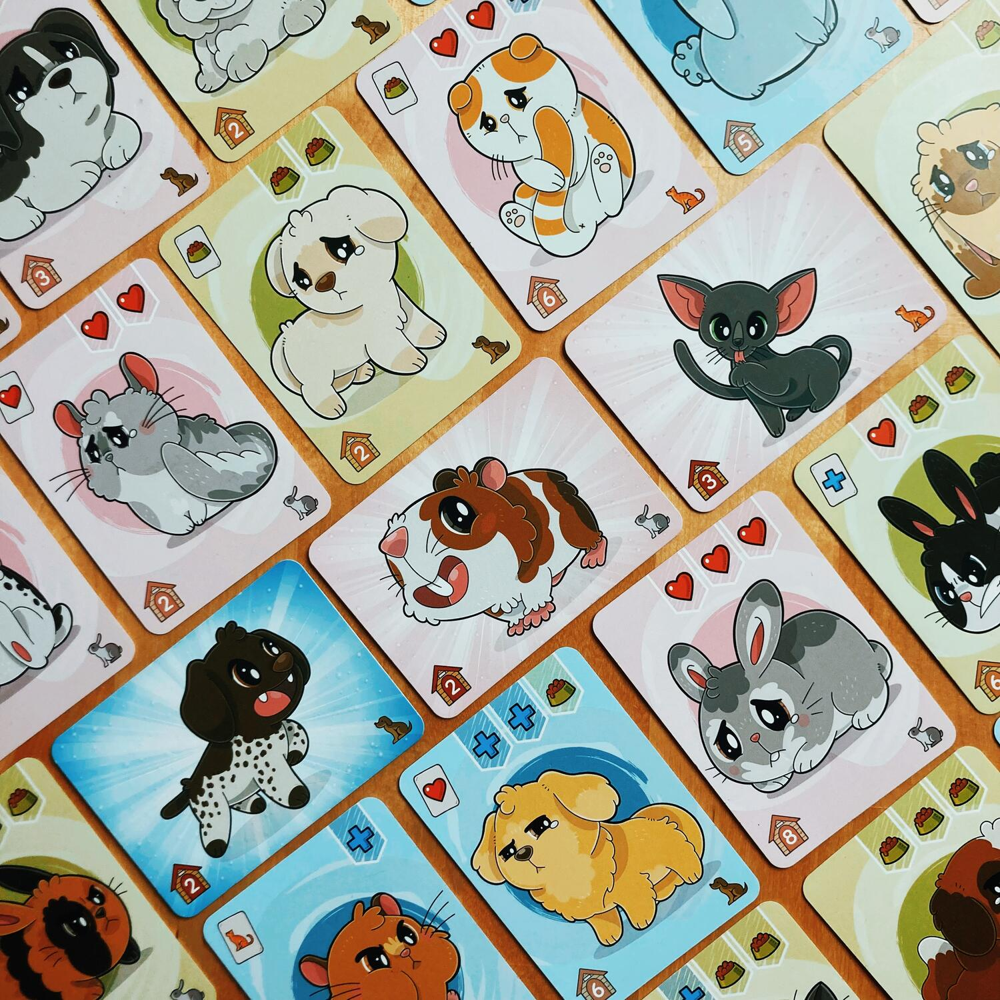

<Setting>

  Per tutti i nati negli anni 90’ questo giochino di carte farà ripensare ad una
  sola ed unica parola: TAMAGOTCHI!
   
  Ok, io so che tu sai di cosa sto parlando, ma se mai ci fosse qualche lettore
  o lettrice troppo giovane per conoscerli è mio dovere di vecchietta rimediare
  a questa lacuna!
   
  Questi piccoli videogiochi a forma di uovo che spopolavano tra i teenagers a
  cavallo tra i due secoli avevano come unico obiettivo quello di far
  sopravvivere l’animaletto scelto: bisognava prendersene cura in tutto e per
  tutto, dalla pappa, alle coccole, alle cure. Tutti aspetti che tornano in
  questo gioco, ma in forma più pucciosa e meno pixellata!

</Setting>

<Rules>

  Il setup è facile e veloce, e prevede che giocatori dispongano al centro del
  tavolo i tre mazzi: le Carte Animale dovranno essere girate sul lato triste e
  due si dovranno affiancare al mazzo così da aver visibili sempre tre cuccioli;
  le Carte Aiuto dovranno essere disposte coperte più tre scoperte al fianco del
  mazzo; infine le Carte Luogo potranno essere disposte come le precedenti,
  mazzo coperto più tre carte scoperte.
   
  All’inizio del turno il giocatore attivo sceglie due tra le carte Animali e/o
  Aiuto disponibili, dopodiché potrà:
   
  <ul>
    <li>      Giocare davanti a sé una Carta Animale sul lato triste ed eventualmente
      svolgere l’azione di pesca indicata dalla carta</li>
    <li>      Girare una Carta Animale davanti a sé sul lato felice pagando le Carte
      Aiuto richieste oppure due casuali per ogni simbolo mancante</li>
    <li>      Ottenere una Carta Luogo se si hanno gli Animali felici della specie
      richiesta ricordandosi che gli animali jolly (indicati con la stella)
      possono essere sempre utilizzati; anche in questo caso, se presente, è
      possibile svolgere l’azione di pesca indicata</li>
  </ul>
  Queste azioni possono essere fatte nell’ordine e per quante volte si desideri,
  dopodiché il turno finisce.
   
  Il gioco termina non appena un giocatore arriva ad avere dieci carte orizzontali
  davanti a sé tra Animali felici e Carte Luogo.
   
  Vince chi avrà raggiunto il maggior numero di punti tra Carte Animali felici e
  Carte Luogo!

</Rules>

<Feedback>

  L’aspetto estetico è sicuramente super cute e attira subito lo sguardo, ma non
  bisogna farsi ingannare da questa grafica tutta colori pastello e cucciolotti,
  perché il gioco, seppur semplice da imparare e adatto anche ai più piccoli,
  nasconde un’esperienza ben più profonda di quanto ci si possa aspettare.
   
  Partendo dalla scelta delle carte, non solo è necessario optare per quelle più
  consone alla nostra strategia, ma bisogna anche pensare a quelle che
  potrebbero essere più utili ai nostri avversari e quindi valutare se vale la
  pena modificare leggermente i nostri piani per potergliele sottrarre, facendo
  però attenzione a non rischiare di perdere troppi punti a fine partita, perché
  sì, gli animali tristi che avremo ancora in mano o in gioco davanti a noi
  varranno -1 punto.  
  Ovviamente poi sarà essenziale saper adattare le proprie scelte sulla base di ciò
  che gli avversari ci lasceranno e delle carte che turno dopo turno verranno scoperte.
   
  Oggettivamente non è un gioco che necessita di efferate abilità mentali e tattiche,
  ma è ampiamente godibile come filler e riempie piacevolmente il pomeriggio.
   
  Scala molto bene a qualsiasi player count e trovo che in solitario sia, per lo
  meno nelle prime partite, leggermente più complicato a causa del definito numero
  di turni.  
  Il problema secondo me più grande è che, come spesso può accadere con questi
  giochini, uno o più giocatori abbiano come unico scopo quello di chiudere la
  partita, senza badare troppo ai punti e quindi ad una vera strategia; questo
  comportamento può sfociare in due finali:
  <ol>
    <li>      il giocatore in questione vince perché non ha dato modo agli altri di
      portare avanti la loro strategia e quindi accumulare punti;</li>
    <li>      il giocatore in questione potrebbe anche non vincere, ma rischia di
      rovinare un pelo lo spirito di sfida.</li>
  </ol>

</Feedback>

