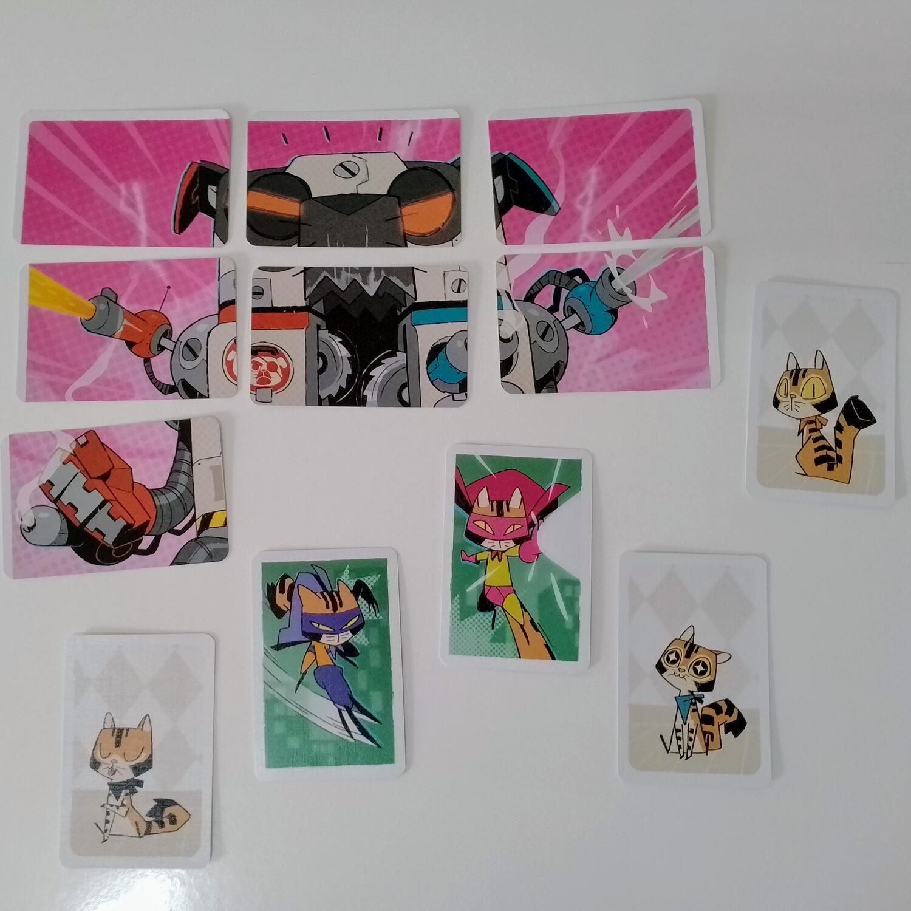
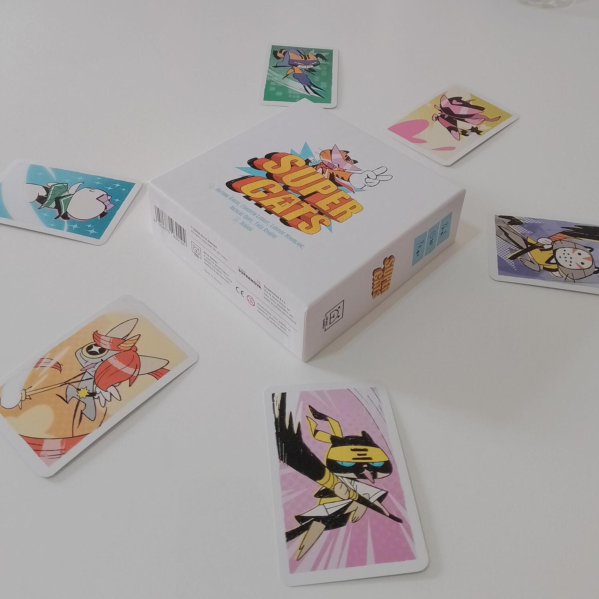

<Setting>

  Il cane robotico gigante minaccia di distruggere tutte le fabbriche di cibo
  per gatti dell'intero pianeta! Tocca ai Super Cats schierare le loro migliori
  (tras)formazioni per abbattere la minaccia.

</Setting>

<Rules>

  In <em>Super Cats</em> scegliete la vostra squadra di{" "}
  <strong>5 micini</strong> (le squadre cambiano solo esteticamente) e giocate
  in <strong>2 round</strong>. 
  Nel primo, al grido di "su-per-cat!", lanciate con le mani <strong>    numeri da 0 a 5</strong> per partecipare ad una sorta di <strong>asta al ribasso</strong>, in
  cui il numero più basso e senza ripetizioni vince. Più basso è il numero vincente,
  prima riuscirete a trasformare tutti i vostri gatti ordinari in SUPER CATS! Vince
  il round chi riesce a <strong>trasformare tutti i suoi gatti</strong> per primo.
   
  Al secondo round, il vincitore del primo diventa l'Eroe e <strong>    combatte contro il Robo-Dog</strong>, assemblato con 9 carte e "pilotato" dai perdenti del primo round, che
  dovranno cercare di lanciare al grido di "ro-bo-dog!" quanti più numeri possibili
  uguali a quelli dell'Eroe. Per ogni numero uguale, il team dei Super Cats vede
  uno dei suoi membri ritrasformarsi in gatto normale. Se invece il numero lanciato
  dall'Eroe non ha uguali, il Robo-Dog subisce un pari ammontare di danni e scarta
  quel numero di carte. Ma se l'Eroe vince con uno 0, tutti i suoi gatti si ritrasformano
  in Super Cats!
   
  <strong>    La fazione che riesce a disattivare tutte le carte di quella avversaria è la
    vincitrice della partita.</strong>

</Rules>

<Feedback>

  <em>Super Cats</em> è una piacevolissima sorpresa. Oltre a poter vantare delle{" "}
  <strong>illustrazioni goffe e spiritose</strong>, è un party game di tutto
  rispetto, divertente come e più di altri noti titoli del genere.
   
  La sua forza sta nell'audacia che il gioco dimostra nel voler puntare molto
  sulla sua <strong>meccanica principale, l'asta</strong>. Una scelta che
  avrebbe potuto rivelarsi disastrosa, visto il genere di riferimento, ma che in{" "}
  <em>Super Cats</em> è condita con una spolverata di <strong>caos</strong> così
  saggiamente dosata da rendere la meccanica quasi invisibile, perfettamente
  omogeneizzata all'atmosfera ilare che vuole (e riesce) ad evocare. Come
  riuscire a far mangiare cavoletti ad un bambino.
   
  Il risultato è un <strong>sottilissimo mind game</strong> che si consuma in
  una manciata di secondi e si ripete in maniera spietata ad ogni "su-per-cat!",
  durante il quale cercherete di interpretare gli sguardi delle persone sedute
  al tavolo alla ricerca del minimo sfarfallio che possa tradirle. E la cosa
  “migliore” è che tutto quanto scritto in questo capoverso non ha comunque un
  vero riscontro pratico, per cui a vincere potrebbe essere tranquillamente{" "}
  <strong>il più fortunato</strong>. 
  L'<strong>asimmetria</strong> che si viene poi a creare tra Eroe e Robo-Dog, unita
  alla brevità dei tempi di gioco e all'illusione di avere il controllo sulle aste
  e sul lancio dei numeri, innesca una <strong>    sana catena di frustrazioni</strong> che esigeranno sempre una nuova partita.
   
  Anche <strong>la scalabilità è buona</strong>, anche se in 3 giocatori forse è
  un po' scricchiolante, mentre i bilanciamenti per 4 e 5 sono perfettamente godibili.
   
  Consigliato a tutte quelle persone che non amano le atmosfere diluite (e a volte
  anche insipide) di molti party game che puntano sull'aspetto narrativo o iconografico.
  Al contrario, <strong>    <em>Super Cats</em></strong> **è una piccola gemma** che potrebbe stare tranquillamente in un pacchetto
  di sigarette e che è adatta a chi non vuole rinunciare al piacere di un buon gioco
  da tavolo anche ad una serata con profani dell'hobby.

</Feedback>
