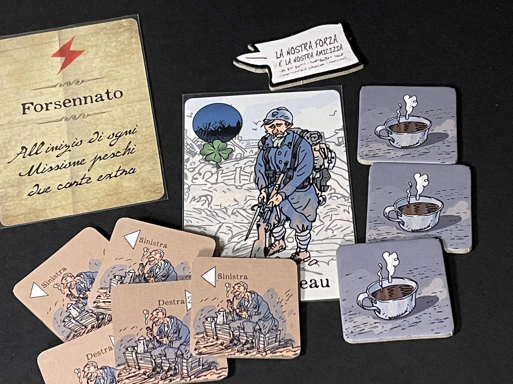
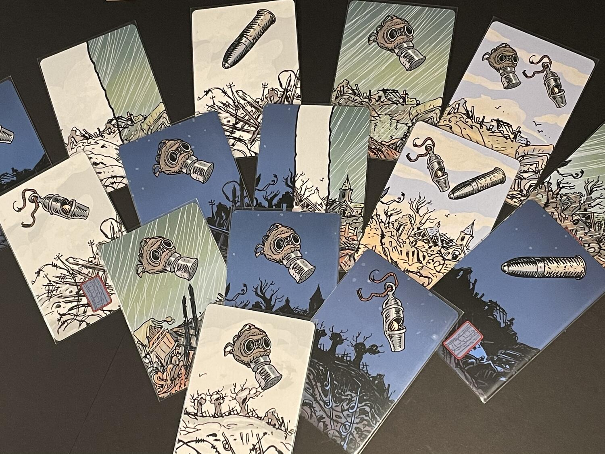

<Setting>

  2 Agosto 1914. Nella piazza del paese, un gruppo di amici inseparabili
  contempla incredulo l'ordine di mobilitazione generale attaccato alla bacheca
  del Municipio. Ormai da molte settimane i giornali hanno un tono che non
  promette nulla di buono, ma la brutalità dell'annuncio sorprende tutti. Senza
  alcuna idea dell'inferno in cui stanno per essere gettati, gli amici si
  promettono a vicenda di tornare tutti insieme a casa, accada quel che accada.
  Può l'amicizia essere più forte della Guerra?

</Setting>

<Rules>

  Dopo aver scelto una <strong>carta Soldato</strong> e averla collocata davanti
  a sé dal <strong>lato Portafortuna</strong>, ogni giocatore riceve 3{" "}
  <strong>tessere Supporto</strong>. Il mazzo di carte viene diviso in due
  sottomazzi: il primo, con la <strong>carta Pace</strong> in fondo, costituirà
  le <strong>Tribolazioni</strong>, mentre il secondo, con in fondo la{" "}
  <strong>carta Monumento ai Caduti</strong>, fungerà da{" "}
  <strong>riserva di Morale</strong> (di fatto, potenziali Tribolazioni).
  Piazzati un certo numero di <strong>gettoni Discorso</strong> in prossimità
  del mazzo, variabile a seconda del numero di giocatori, la partita può
  iniziare.
   
  Lo scopo del gioco è quello di esaurire il mazzo delle Tribolazioni, svelando
  la carta Pace senza che i giocatori abbiano più carte in mano, prima che si
  esaurisca quello del Morale, ovvero prima di rivelare la carta Monumento ai
  Caduti. Durante ogni round, i giocatori svolgono 4 fasi. Durante la{" "}
  <strong>Preparazione (1)</strong> pescano un numero di carte Tribolazione (non
  meno di 3 durante il primo giro) deciso di volta in volta dal{" "}
  <strong>Comandante</strong>, ovvero il primo giocatore. Durante la fase
  successiva, la <strong>Missione (2)</strong>, i giocatori tentano a turno di
  liberarsi delle carte Tribolazione che hanno in mano, o giocandole nella{" "}
  <strong>Terra di Nessuno</strong>, il centro del tavolo, o assegnandole al
  proprio personaggio. Ogni carta può rappresentare una o più{" "}
  <strong>Minacce</strong> (avversità meteorologiche e rischi bellici) - che
  possono riportare il famigerato simbolo <strong>Trappola</strong>, se si gioca
  con questa variante - oppure un <strong>Trauma/Fobia</strong> di natura
  psicologica. Ogni giocatore, finché non si ritira, può, ogni volta che è il
  suo turno, scegliere di compiere una sola tra le seguenti azioni: giocare una
  carta Tribolazione dalla propria mano, utilizzare il Portafortuna del suo
  personaggio per scartare una carta dalla Terra di Nessuno, fare un Discorso
  facendo scartare ai commilitoni una carta singola carta che contenga una
  Minaccia in particolare, oppure Ritirarsi (cosa che può tornare utile per
  evitare ai propri Traumi di influenzare la missione in corso) e giocare
  segretamente una tessera Supporto sul proprio Soldato. Nel momento in cui sono
  attive 3 Minacce identiche sul tavolo, la missione fallisce e le carte giocate
  nella Terra di Nessuno vengono rimescolate nel mazzo Tribolazioni. Se tutti i
  giocatori si sono ritirati, invece, la Missione è riuscita e le carte giocate
  nella Terra di Nessuno sono scartate. Quelle non giocate restano sempre in
  mano ai giocatori. Durante la successiva fase di <strong>Supporto (3)</strong>
  , si rivelano le tessere Supporto giocate e il personaggio che ne ha ottenute
  in maggioranza può ripristinare il suo Portafortuna o scartare 2 carte Trauma
  (1 se la missione è fallita). Le tessere Supporto restano a chi le ha
  ricevute. Se a questo punto qualcuno ha attivi 4 Traumi, tutti perdono.
  Altrimenti, si passa all'ultima fase, quella del{" "}
  <strong>Calo del Morale (4)</strong>: se la guerra non è ancora finita, si
  trasferiscono dal mazzo del Morale al mazzo Tribolazioni tante carte quante
  quelle rimaste in mano ai giocatori (minimo sempre 3). Se la partita non è
  ancora finita, a questo punto il segnalino Comandante passa al giocatore
  successivo e il Comandante precedente ottiene un gettone Discorso. E la guerra
  continua…

</Rules>

<Feedback>

  <em>Ta-Pum!</em> è un gioco minuscolo e dalla componentistica essenziale ma di
  notevole profondità. Per chi lo ha particolarmente amato, esiste anche in
  italiano l'espansione <em>Agli Ordini!</em>, che prevede un incremento del
  livello di difficoltà con l'introduzione delle <strong>carte Missione</strong>
  , una modalità di gioco in solitaria e un miglioramento della versione per 2 giocatori.
   
  Nonostante quello che si sente spesso declamare, il gioco non ci vuole fare respirare
  l'aria asfittica della trincea durante la prima guerra mondiale. Per saperlo, basterebbe
  leggere la <em>Nota di intenti</em> collocata nella seconda di copertina, ma si
  sa che non è opportuno chiedere allo spiegatore medio di andare al di là di una
  mera delucidazione dell'oscuro e tecnico linguaggio del regolamento, ragion per
  cui egli stesso non ha motivo di sobbarcarsi l'incarico.
   
  <em>Ta-Pum!</em> è, invece, uno strumento ludico raffinatissimo pensato per insegnare
  un aspetto cruciale della collaborazione, che altri collaborativi non veicolano
  in modo altrettanto chiaro: per la vittoria di tutti (in questo caso, la sopravvivenza),
  si deve osservare la condizione degli altri e prestare soccorso a chi sta peggio,
  anche se ciò non significa che chi aiuta stia per forza meglio, o che si debba
  in qualche modo gerarchizzare la sofferenza. Inutile dire che da un punto di vista
  pedagogico-didattico l'insegnamento è straordinario, senza parlare di quanto sia
  attuale. L'ambientazione è pertanto, si potrebbe quasi dire provocatoriamente,
  un pretesto: o meglio, sembra piuttosto che la sua scelta sia dettata dalla volontà
  dedicataria di omaggiare persone reali (tra i personaggi del gioco figurano antenati
  di alcuni tra coloro che hanno lavorato al gioco stesso). Questo, peraltro, non
  va a detrimento della qualità con cui il gioco approccia la prima guerra mondiale,
  un tema avvicinato con rispetto e serietà, senza indugiare in particolari inutilmente
  cruenti o estremamente drammatici. Che un evento collettivamente traumatico come
  questo sia diventato oggetto di un gioco non deve inibire il suo apprezzamento;
  la guerra non deve essere un tabù, specie in un titolo che anzi ne coltiva il ripudio,
  stimolando l'empatia, la cooperazione, la solidarietà e la fratellanza: tutti valori
  che, ipocritamente, nel vocabolario del lavoro contemporaneo - che definisce capitalisticamente
  job anche il work più faticoso - sono spesso “declassate” al rango di soft skills,
  quando non del tutto assenti.
   
  In chiusura, il nostro ricordo non può che andare a Bernard Verlhac, magnifico
  e memorabile illustratore di Ta-Pum!, meglio noto come il compianto Tignous del
  settimanale francese Charlie Hebdo, che, prima di essere ucciso negli attentati
  del 2015, ci ha lasciato in eredità in questo titolo un assaggio niente affatto
  secondario della sua arte.

</Feedback>
