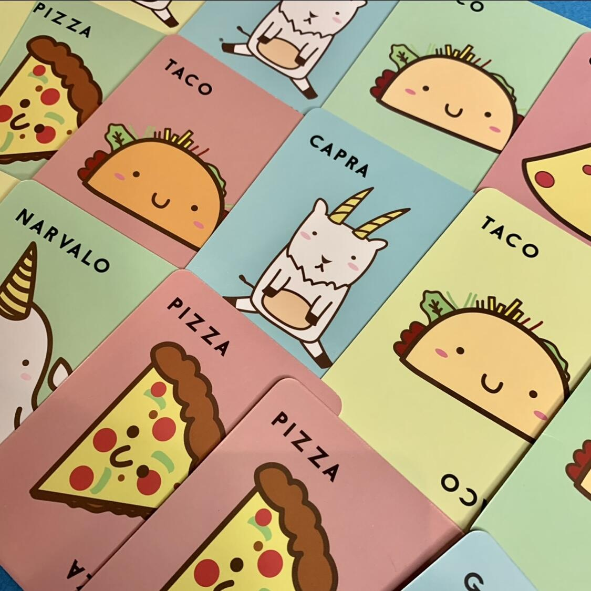
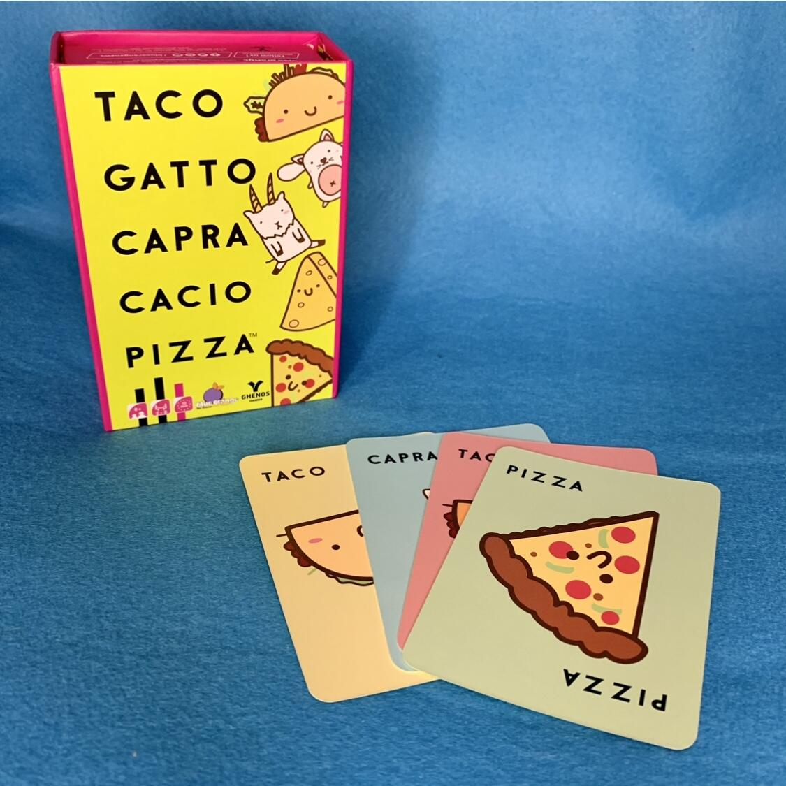
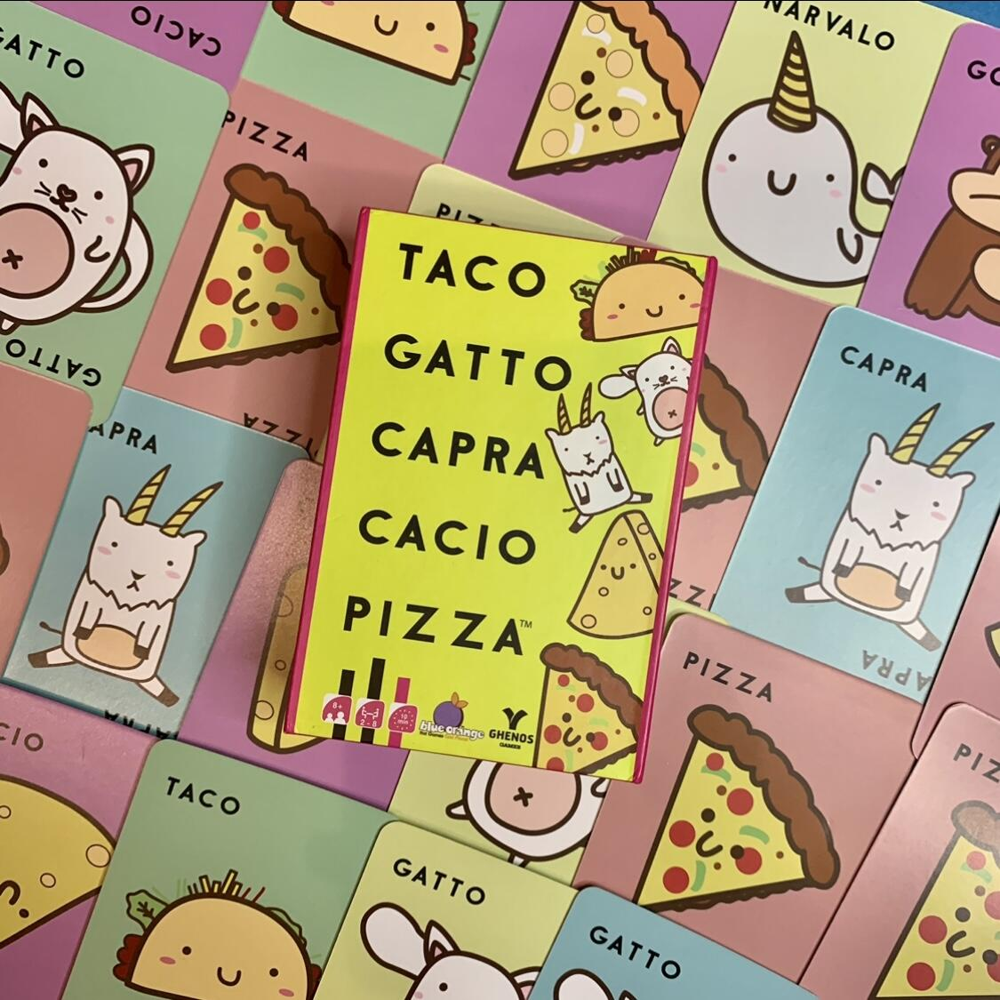

<Setting>

<strong>Taco Gatto Capra Cacio Pizza</strong>, 5 parole che possono sembrare molto strane fuori contesto. Fissa bene queste parole in testa, ti serviranno per giocare a questo <strong>party game per 2-8 giocatori</strong> estremamente semplice e intuitivo!
 
Appare una carta con l’immagine della parola dichiarata? Colpite con la mano velocemente la pila centrale. L’ultimo raccoglie tutto!

</Setting>

<Rules>

  Per giocare è necessario distribuire le carte. A turno si pronuncia una parola
  della sequenza “Taco Gatto Capra Cacio Pizza” girando una carta dal proprio
  mazzo e andando avanti fino a quando ci sarà una corrispondenza tra la parola
  detta e le immagini sulla carta giocata. In quel momento i giocatori dovranno
  colpire la pila di carte al centro del tavolo il più velocemente possibile.
  L’ultimo a farlo dovrà raccogliere tutte le carte e aggiungerle al proprio
  mazzo.
   
  A complicare la partita ci sono alcune carte speciali: la marmotta, il gorilla
  e il narvalo. Quando una di queste carte verrà giocata, i partecipanti
  dovranno compiere particolari gesti prima di poter mettere la mano sulla pila
  centrale. Con la marmotta bisogna battere le nocche sul tavolo, con il gorilla
  battere i pugni sul petto, mentre con il narvalo occorre unire le mani sopra
  la testa.
   
  Come si vince? Semplice ma non troppo… Per trionfare a Taco Gatto Capra Cacio
  Pizza occorre rimanere senza carte in mano (continuando comunque la sequenza
  vocale) ed essere il primo a colpire la pila.

</Rules>

<Feedback>

  Questo gioco è un <strong>ottimo party game</strong> dai ritmi frenetici e
  concitati che saprà sicuramente strapparti un sorriso. Ottimo quando non si sa
  cosa fare o c’è troppo poco tempo per i giochi lunghi e con tante regole.
  Consigliato anche per serate “alticce”.
   
  Poco importa se avrai la mano un po’ rossa a fine partita: ne sarà valsa la
  pena!

</Feedback>

