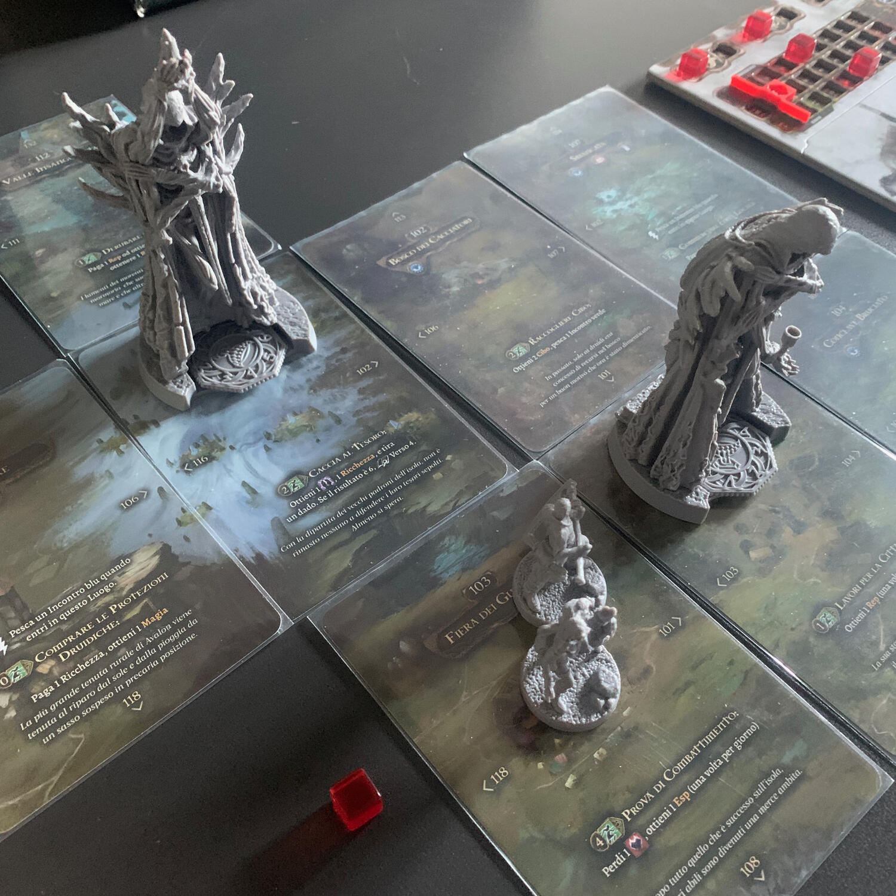
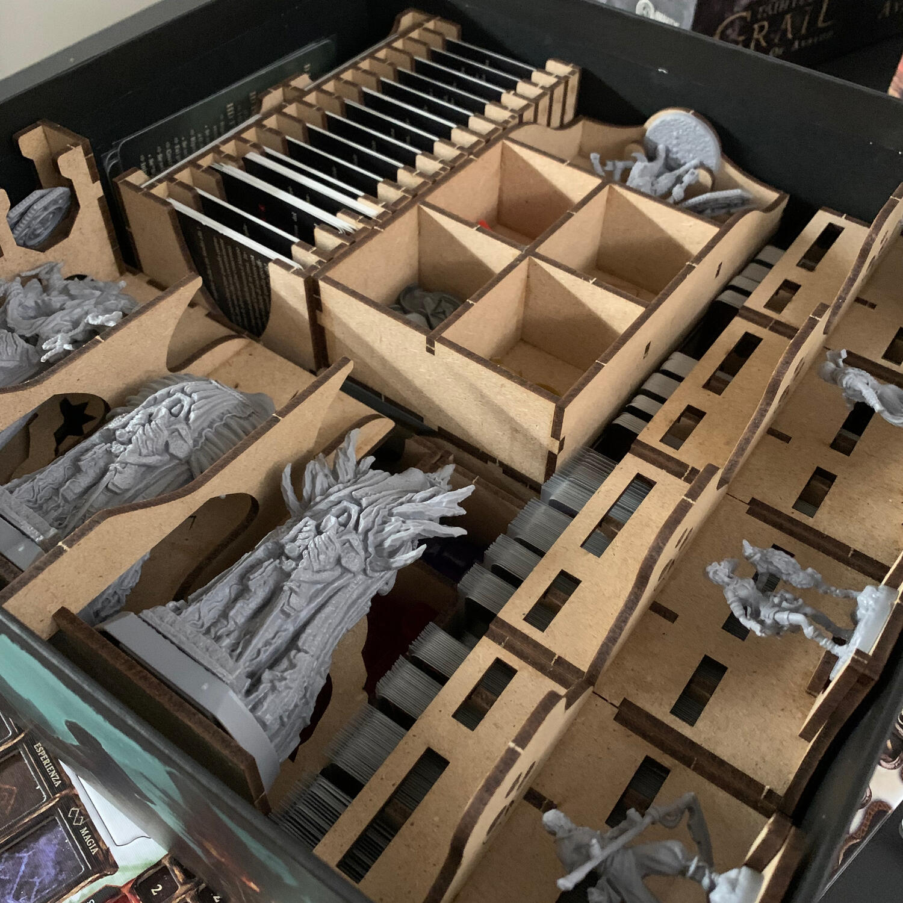

<Setting>

  Terre di Avalon, villaggio di Cuanacht (<em>nome impronunciabile n.d.r.</em>).
  Il Signore della città, assieme ai suoi più valorosi sudditi, ha deciso di
  compiere una spedizione per trovare un modo di salvare la città dall’avanzare
  della temibile e misteriosa Anomalia. Il Menhir, unica protezione, si sta
  spegnendo e nessuno è in grado di accenderlo. Gli eroi e il re se ne sono
  andati e di loro non si hanno più notizie.  
  Toccherà a voi giocatori, nei panni di ultimi degli ultimi, raccogliere l’eredità
  dei vostri maestri e cercare di salvare il vostro villaggio natale, se non l’intera
  Avalon. <strong>Riuscirete nel vostro obiettivo?</strong>

</Setting>

<Rules>

  Tainted Grail è un gioco che si potrebbe riassumere in una parola:{" "}
  <strong>Librogame</strong>. La maggior parte delle vostre scelte, infatti, vi
  farà aprire il libro dei segreti ad una determinata pagina, leggere un
  determinato passaggio e agire di conseguenza, influenzando così il mondo di
  gioco attraverso modifiche alla storia e a ciò che il vostro personaggio potrà
  fare o no in futuro, grazie ad un apposito foglio dove annotare queste
  modifiche. Ricordatevi sempre:
   
  <strong>    <em>Le terre di Avalon non dimenticano… mai!</em>{" "}</strong>
   
  Il resto del gioco è composto da una parte di mappa formata da carte con
  illustrazioni fantastiche che verranno disposte da un mazzo specifico a
  seconda della zona in cui sarete. Anche il combattimento e l’incontro
  diplomatico verranni svolti tramite un mazzo di carte, diverso per ogni
  giocatore, con cui bisognerà affrontare il nemico di turno tramite abili combo
  e potenti carte che diventeranno sempre più forti a mano a mano che i
  giocatori otterranno punti esperienza e potranno comprarne di migliori.  
  Ultimo motore fondamentale del gioco è la gestione di risorse e di tempo. Il gioco,
  infatti, è diviso in due fasi: giorno e notte, cosa che costringerà i giocatori
  a viaggiare per Avalon alla ricerca di cibo, ricchezza, reputazione e magia. Tutto
  sarà necessario per poter sopravvivere in queste pericolose terre, raccogliendo
  frattanto informazioni, per capire come riaccendere gli antichi Menhir, e cercando
  di sopravvivere alla nebbia senza impazzire!

</Rules>

<Feedback>

Tainted grail è un gioco strano. Sicuramente bello, ma c’è un enorme “ma”. Come tutti i giochi a campagna richiede dedizione e un gruppo predisposto a giochi lunghi e narrativi. Il vostro gruppo di gioco corrisponde a queste caratteristiche? Allora Tainted grail è l’<strong>esperienza che fa per voi</strong>. In caso contrario, statene alla larga. E occhio al numero di giocatori! Più si è più l’esperienza di gioco si dilata, risultando immersiva in modi che, a loro volta, possono piacere o no.  
 La parte di gestione risorse, cercando di fare meno spoiler possibili, ovviamente, ricorda un videogioco, ma nell’ottica di un gioco da tavolo può finire per appesantire le serate, dando ai giocatori un feeling davvero pericoloso, in quanto una sequenza di scelte “sbagliate” può portare ad una partita lunga e tediosa, quando in un videogioco tutto questo sarebbe stato risolto in una schermata di caricamento! La parte di combattimento/diplomazia invece saprà regalare soddisfazioni ai giocatori in qualsiasi caso. 
Per concludere, Tainted Grail è un gioco che non si può consigliare a scatola chiusa per una serie di “problemi”, che a seconda del gruppo di gioco possono essere più o meno fastidiosi, ma è un gioco che almeno una volta nella vita va provato, anche solo per l’eccellente livello della narrazione!  
Segnaliamo inoltre gli ottimi organizer della Dicetroyers, che permettono di ridurre all’osso i tempi di setup e de-setup del gioco e della sua gestione, permettendo di goderne a pieno l’esperienza.

</Feedback>

