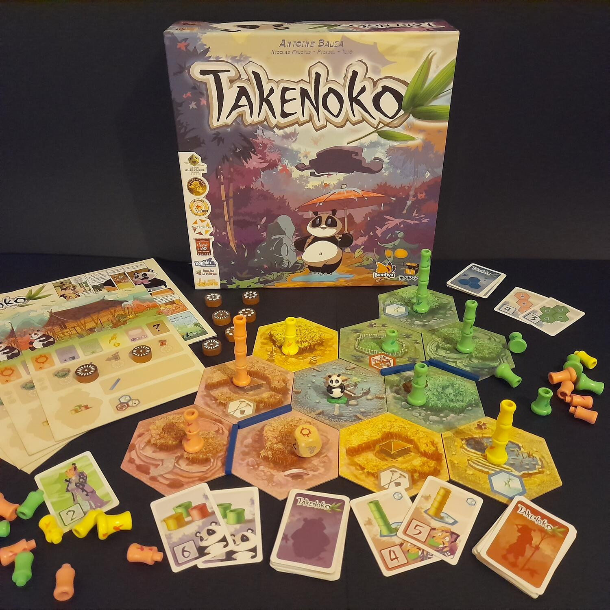

<Setting>

  Per sancire la pace tra le due grandi nazioni, l'imperatore della Cina ha
  donato un panda gigante al collega giapponese. Il pacifico orsacchiotto è
  stato affidato alle cure del giardiniere imperiale, ma i due non sembrano
  andare molto d'accordo! La fame di bambù del panda sembra infatti insaziabile:
  il giardiniere non fa in tempo a piantarne un po' che subito i succulenti
  germogli finiscono sotto le ghiotte ganasce di quel peluche bianco e nero!
  Toccherà ai giocatori mantenere l'ordine nei giardini, sfamando il panda e
  facendo crescere rigogliosamente il bambù.
   
  Curiosità: l'usanza cinese di donare panda giganti a nazioni straniere per
  consolidare alleanze diplomatiche è reale, provate a cercare su internet
  “diplomazia del panda”!

</Setting>

<Rules>

  L'obiettivo del gioco è possedere il maggior numero di punti a fine partita.
  Questi si ottengono risolvendo obiettivi di tre tipi: terreni, giardiniere e
  panda, che richiederanno, rispettivamente, una determinata conformazione delle
  tessere terreno, la presenza di bambù in quantità, altezza e colore corretti
  sulla plancia di gioco o nella pancia del panda sulla pancia… no, plancia del
  giocatore.
   
  Il gioco si svolge in round, in cui ogni giocatore, durante il suo turno, può
  compiere due azioni diverse tra: muovere il panda, muovere il giardiniere,
  pescare un obiettivo, ottenere un canale d'irrigazione e pescare tessere
  terreno. Con le ultime tre si ottiene semplicemente l'elemento scelto, mentre
  con quelle di movimento si procede così: panda e giardiniere possono muoversi
  solo in linea retta per quanti terreni si desidera. Quando il panda termina il
  movimento su un terreno dov'è presente bambù ne può mangiare un pezzo. Quando
  il giardiniere termina il movimento su un terreno irrigato, invece, fa
  crescere di uno il bambù su quella tessera e su quelle adiacenti e irrigate
  dello stesso colore.
   
  A partire dal secondo round di gioco ogni giocatore lancia il dado clima. Le
  condizioni climatiche, che possono essere cinque (più una jolly), modificano
  leggermente ogni turno, garantendo sempre un piccolo bonus.
   
  Il gioco procede così fino a quando qualcuno non completa l'ultimo obiettivo
  (ad esempio il nono in due giocatori), sancendo la fine della partita.

</Rules>

<Feedback>

  Il primo target del gioco sono ovviamente le famiglie, date le regole facili,
  il tema riguardante un animale simpatico come il panda e la durata contenuta.
  È tuttavia godibilissimo anche in altri contesti: le scelte strategiche non
  sono mai banali, e sarà sempre importante decidere dove posizionare un
  terreno, su quale obiettivo concentrarsi o se mettere i bastoni tra le ruote
  ad un giocatore che sta evidentemente puntando a qualche obiettivo specifico e
  remunerativo. Non manca certo la fortuna nella pesca di obiettivi, terreni e
  nei lanci del dado meteo, e soprattutto una pesca sfortunata dei primi può
  dare qualche difficoltà. Infastidisce anche una certa facilità degli obiettivi
  panda rispetto agli altri e la ripetitività delle mosse dopo un bel po' di
  partite (difetti risolti però dall'espansione). In ogni caso, dopo una prima
  partita avrete sicuramente voglia di farne un'altra per migliorare il
  punteggio e provare nuove strategie. Completano il quadro i materiali, di
  buona qualità: tessere e plance in solido cartone; canali, segna azioni e
  bambù in legno bello da vedere e piacevole al tatto; panda e giardiniere ben
  fatti e già dipinti. Un bel gioco introduttivo sia per grandi che piccini!

</Feedback>
