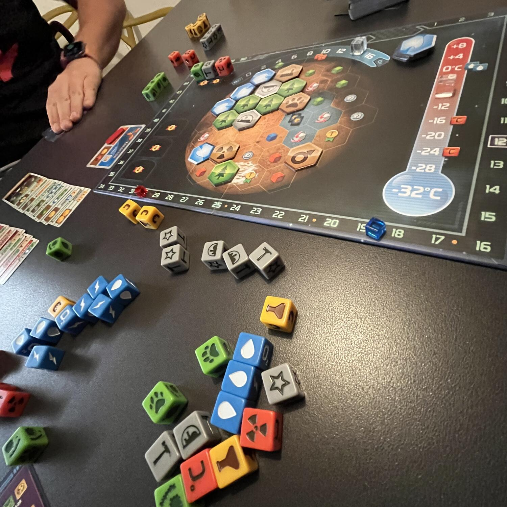
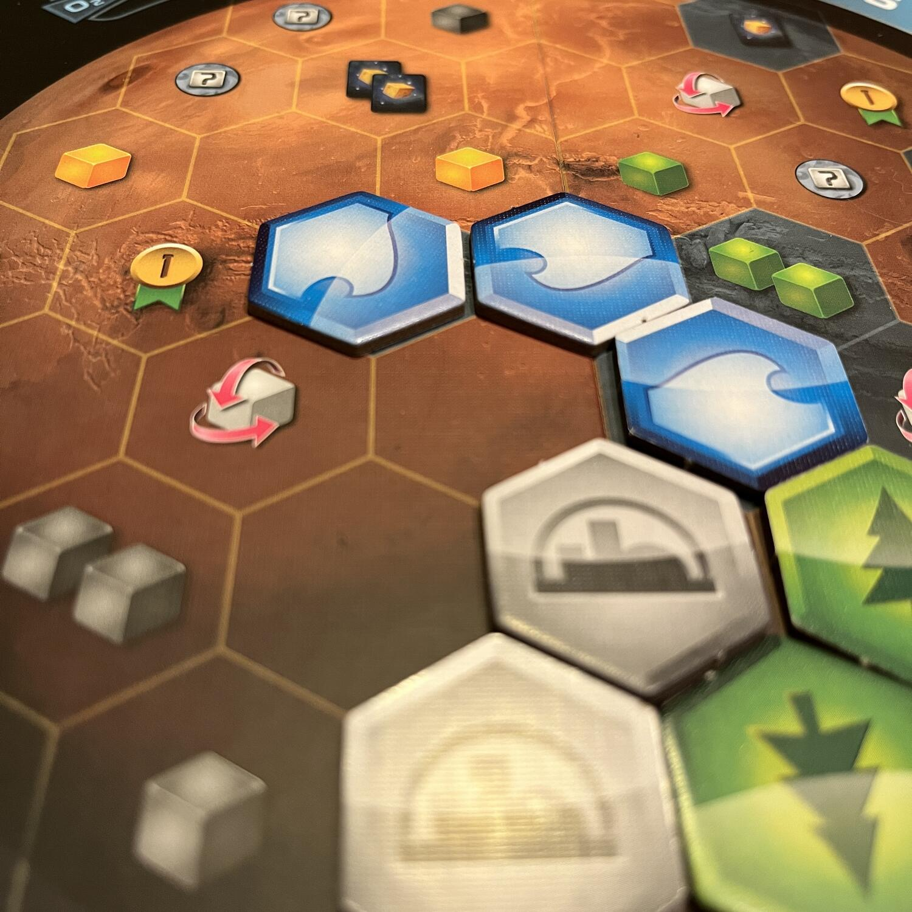
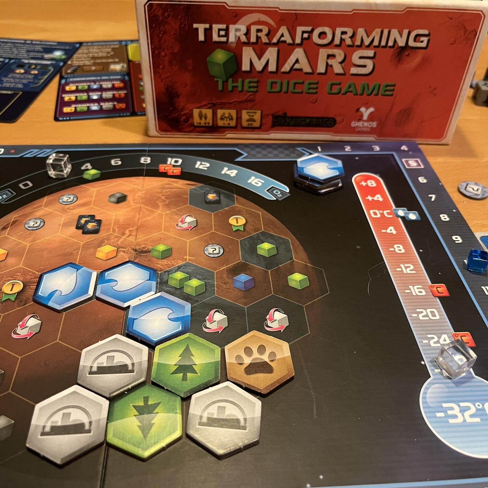

<Setting>

  Marte, la vostra Corporazione ci ha messo gli occhi sopra. Renderlo abitabile
  per permettere all’umanità di espandersi? Certo uno scopo decisamente nobile…{" "}
   E al <strong>Ritorno economico</strong> chi ci pensa?!  
  Voi ci state pensando ed è per questo che siete il CEO di questa corporazione:
  riuscirete a destreggiarvi e a farvi conoscere in questa nuova corso all’oro sul
  pianeta rosso?! <strong>Ci vediamo su Marte! </strong>

</Setting>

<Rules>

  <Link to="/reviews/terraforming-mars/">Terraforming Mars</Link>: The Dice Game
  è davvero una versione più <em>slim</em> del gioco originale. Si tratta sempre
  di aumentare l’ossigeno, innalzare la temperatura e fare in modo che ci sia
  abbastanza acqua: sono gli stessi obiettivi. Completarne due farà terminare la
  partita. Ogni turno un giocatore potrà scegliere se produrre risorse o
  compiere un'azione definita come principale, un’azione secondaria ed eventuali
  azioni gratuite. A conti fatti la questione sarà:
  <ul>
    <li>lanciare dadi</li>
    <li>giocare una carta pagando il costo in risorsa, che di fatto è la faccia del dado</li>
    <li>pescare carte</li>
  </ul>
  Le carte e alcune azioni daranno punti vittoria; raggiungere determinati
  obiettivi prima degli altri farà ottenere punti vittoria; alla fine, chi avrà
  più punti vittoria sarà dichiarato vincitore!

</Rules>

<Feedback>

Leviamoci un sassolino dalla scarpa: alla fine è tutta questione di <strong>Dea Bendata</strong>. Le risorse sono casuali. Sì, si possono manipolare i dadi, ma a livello di economia di gioco rallenta in maniera consistente la corsa ai punti. Non è lì però che la fortuna colpirà di più, bensì…nelle carte!  
Pescare male, per quanto si scarti e si peschi molto, è terribile. Non poter costruire, ovvero non costruire carte abbastanza potenti blocca, ingolfa il motore in maniera indescrivibile…  
Eppure, Terraforming Mars: The Dice Game è un gioco che, se sopravvivete all’ira dei dadi, divertirà tutti, amanti del gioco originale e non. I primi si ritroveranno davanti a una versione snellita, con tutte le caratteristiche che li hanno fatti innamorare del gioco base, presentate in maniera più semplice e decisamente più veloce. Attenzione, però: non partite con l’approccio di essere davanti all’originale. Seppure molti elementi siano in comune, e spesso possano sembrarlo anche le regole, sono due titoli differenti e questo qui non è certo per gli amanti dei cinghialoni! I non amanti del gioco originale, invece, avranno l’occasione di godersi un light game, in cui bisognerà continuamente adattarsi alla situazione che si presenta! Insomma, un gioco sfidante e, a suo modo, adatto a tutti i palati!  
È presente una modalità in solitario che, di fatto, è una corsa contro il tempo. 50 turni per raggiungere gli obiettivi e, visto che stiamo parlando di un solitario di gruppo, se non per qualche regoletta di setup non si sente molta differenza rispetto al gioco multiplayer. <strong>Non fatevi problemi a resettare la partita</strong>: alle volte la Dea bendata potrebbe non essere per niente a vostro favore e anche se i 50 turni sembrano tanti…

</Feedback>

