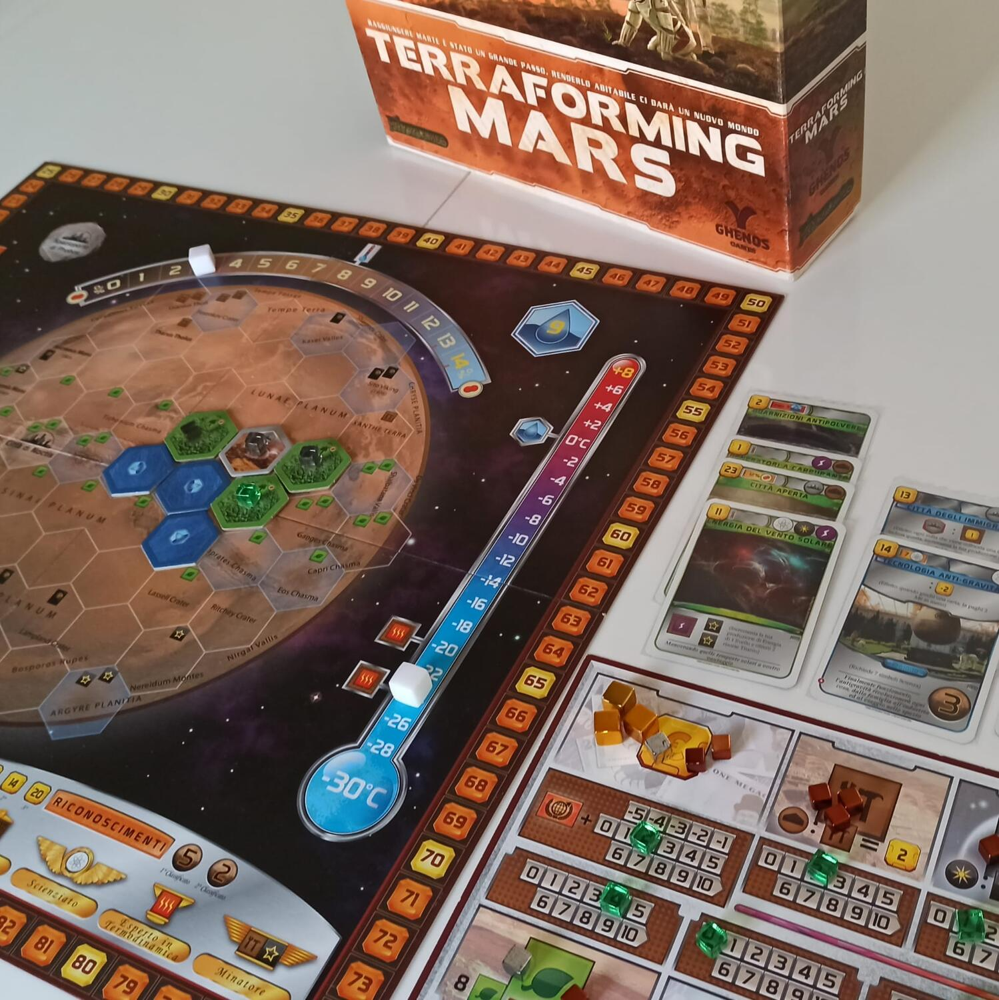
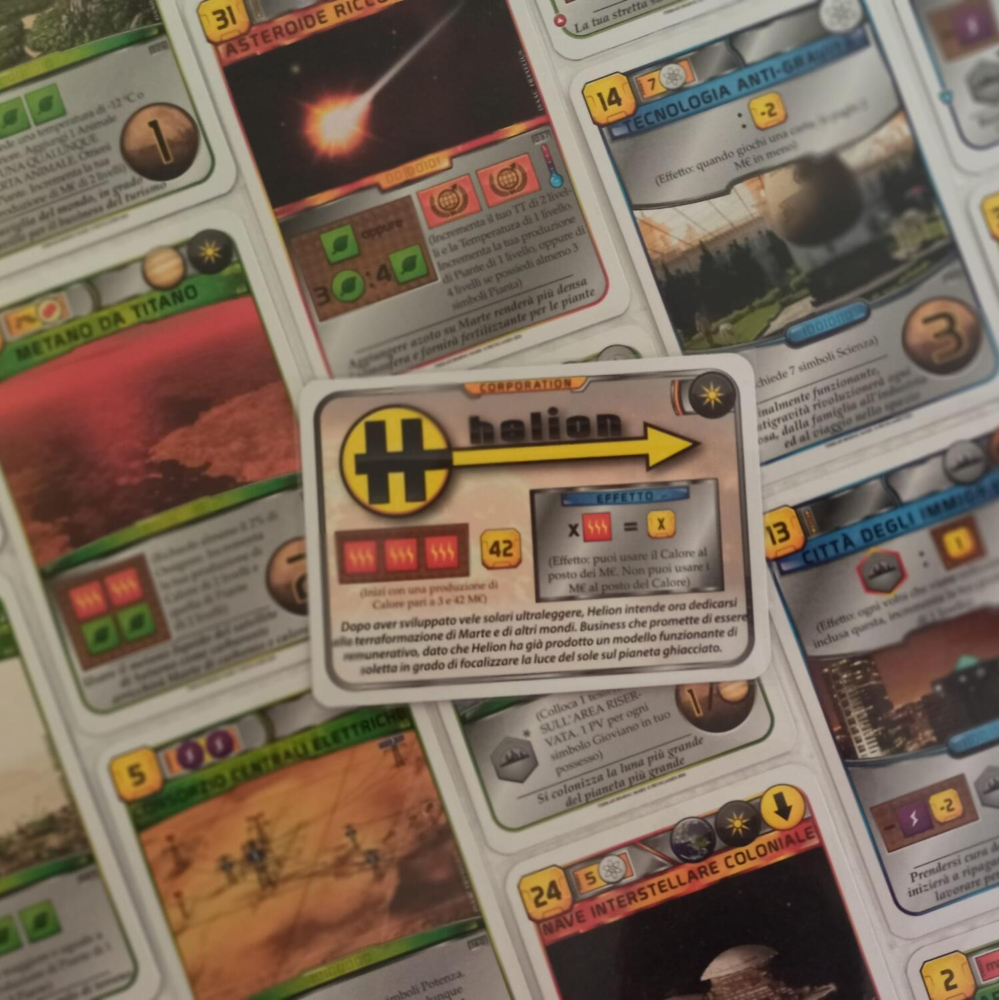
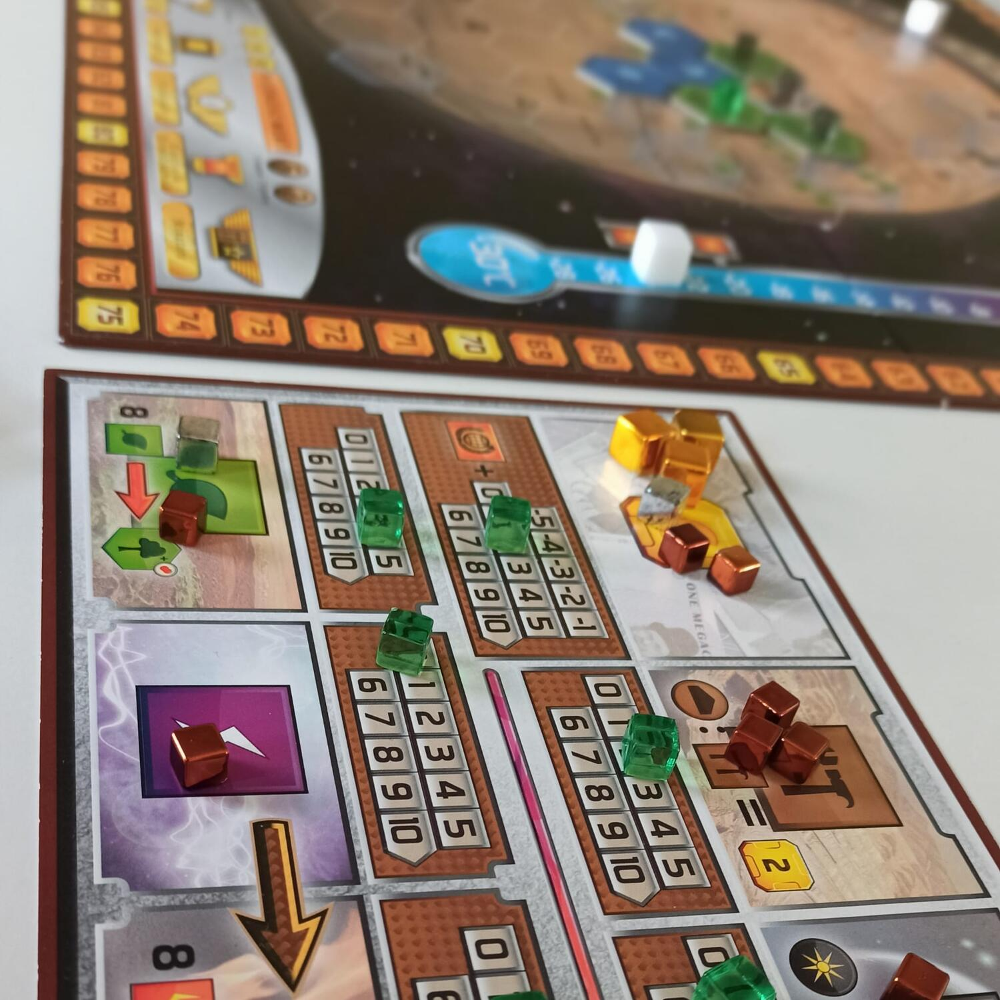

<Setting>

  “Il consiglio di amministrazione, valutato positivamente il portfolio iniziale
  di brevetti, comunica che il budget per il progetto terraformazione è
  totalmente confermato”. Le parole riecheggiano nella tua mente, cerchi di
  rimanere impassibile almeno fino a che la conference call olografica non sarà
  terminata. Poi il trionfo!
   
  Ma il tempo per festeggiare è poco perché le cose da fare sono innumerevoli e
  i tuoi competitor non staranno certo fermi con le mani in mano. Ovviamente
  coopereremo tutti per la terraformazione di Marte, ma i tuoi stakeholder non
  si accontenteranno di essere un nome su una targhetta commemorativa di una
  qualche centrale a fusione che alimenta una qualche periferia insignificante.
  Devi fare in modo che il nome della tua compagnia sia per sempre ricordato
  come “Coloro che resero Marte abitabile”.
   
  Proprio così: viaggiare su Marte dalla Terra è possibile, ma per il momento il
  pianeta è freddo, arido e inospitale, ma questo non è detto che sia uno
  svantaggio. Infatti, il governo terrestre ha stanziato cifre da capogiro in
  appalti: talmente tanti soldi che si parla di Megacrediti come fossero
  noccioline. E la tua è una delle poche corporation in grado di realizzare
  avveniristici progetti per rendere abitabile il pianeta rosso.
   E sarà nei panni del CEO di una di queste corporation che i giocatori dovranno
  cercare di rendere Marte abitabile, aumentandone la temperatura, creando oceani,
  foreste e città. Da bravi imprenditori, dovranno decidere su quali progetti investire
  le enormi risorse messe a disposizione per la terraformazione e quali lasciare
  ai propri competitor. Perché quando il pianeta sarà pronto per essere abitato,
  solo una di queste corporation sarà la più prestigiosa.

</Setting>

<Rules>

  In una partita di Terraforming Mars le scelte iniziano fin dal setup: ogni
  giocatore riceve 2 carte corporation e 10 carte progetto con cui dovrà
  decidere la propria mano iniziale. La corporation stabilisce il vostro
  capitale di risorse iniziale e solitamente garantisce un’abilità unica: a
  inizio partita se ne deve scegliere una fra le due che vengono distribuite.
   
  Le carte progetto sono il vero cuore del gioco e la loro gestione sarà un
  punto fondamentale della partita. Tenere una carta progetto costa 3
  Megacrediti (la valuta del gioco): si suppone che sia il costo del brevetto.
  Con questo in mente, si dovrà decidere quali delle 10 carte iniziali tenere e
  quali scartare. A meno di situazioni particolari, è molto rischioso tenere più
  di 6 carte, perché porterà il giocatore ad avere pochi capitali iniziali, così
  come può essere infruttuoso tenerne meno di 3 perché non saranno sufficienti a
  impostare una strategia iniziale.
   
  Una volta rivelata la propria corporation, scartate le carte che non si
  vogliono tenere e stabilito a caso il primo giocatore, inizia il gioco vero e
  proprio. A turno ogni giocatore può compiere fino a 2 azioni, poi tocca al
  giocatore successivo.
   
  Le azioni possibili sono:
  <ul>
    <li>      <strong>giocare una carta progetto</strong>: le carte hanno un costo (in Megacrediti o altre risorse) e degli eventuali prerequisiti. I progetti servono principalmente a terraformare Marte o a produrre risorse. Una volta giocata una carta se ne applicano gli effetti e poi, a seconda del tipo, la si impila nell’area del giocatore. Le carte sono di 3 tipologie:<ul><li>          rosse (eventi): una volta esaurito il loro effetto verranno messe in una pila coperta davanti al giocatore e verranno consultate solo a fine partita.</li><li>          verdi: una volta risolte rimarranno scoperte, ma solo per poterne vedere le icone</li><li>          blu: queste rimarranno scoperte e garantiranno abilità o effetti per il resto della partita</li></ul></li>
    <li>      <strong>realizzare un progetto standard</strong>: è come giocare una carta, ma i progetti sono disponibili per tutti i giocatori e sono solitamente meno performanti delle carte</li>
    <li>      <strong>attivare un’abilità di una carta</strong>: come detto, alcuni progetti o alcune corporation garantiscono abilità attivabili ogni turno</li>
    <li>      <strong>innalzare la temperatura</strong>: raccogliendo calore sarà possibile innalzare la temperatura di Marte</li>
    <li>      <strong>piantare una foresta</strong>: raccogliendo piante sarà possibile piantare una foresta e aumentare la quantità di ossigeno di Marte</li>
    <li>      <strong>reclamare una milestone</strong>: sono dei traguardi che daranno punti a fine partita</li>
    <li>      <strong>finanziare un riconoscimento</strong>: simile alle milestone, ma non è detto che chi li finanzi sarà poi chi riceve i punti a fine partita</li>
  </ul>
  Quando un giocatore non può o non vuole più fare azioni, può passare e per
  quel turno non potrà più fare niente. Quando tutti i giocatori hanno passato
  il turno finisce, i giocatori ricevono le risorse in base alle loro produzioni
  e inizia un nuovo turno.
   
  Nel gioco ci sono 6 tipi di risorse: Megacrediti, acciaio e titanio servono
  per pagare i progetti; piante, energia e calore servono invece per
  terraformare o per attivare le abilità. Infine, c’è un indicatore del Tasso di
  Terraformazione (TT) che indica quanto il giocatore ha contribuito alla
  terraformazione del pianeta: questo darà sia Megacrediti ogni turno che punti
  vittoria a fine gioco.
   
  A inizio turno ogni giocatore riceverà 4 nuove carte progetto e opzionalmente
  è possibile fare un draft fra giocatori. Dopo che ogni giocatore ha deciso
  quali progetti tenere, pagandoli 3 Megacrediti come a inizio partita, inizia
  la fase azioni.
   
  Quando Marte è completamente terraformato il gioco non termina immediatamente,
  ma si va avanti fino a che tutti i giocatori non avranno passato come al
  solito.
   
  Finita la partita, si sommano ai TT i punti derivanti dalle milestone
  reclamate, dai riconoscimenti vinti, dalle carte giocate, dalle foreste in
  gioco e dalle città: chi ha più punti vince.

</Rules>

<Feedback>

  Terrafoming Mars è diventato in breve tempo un caposaldo del genere: la sua
  solida posizione nella top ten della classifica di BoardGameGeek ne è una
  conferma tangibile.
   
  È un gioco perfetto? Forse no, ma ci si avvicina molto. L’unico difetto
  universalmente riconosciuto del gioco sono le plance giocatore, la cui qualità
  è nettamente al di sotto di tutti gli altri componenti molto belli e
  funzionali presenti nella scatola: in pratica si tratta di fogli cartonati e,
  considerando che devono tenere traccia di tutte le vostre risorse, basta uno
  scossone al tavolo o una manovra maldestra per rendere il recupero della
  partita spiacevole. Tutto il resto sono caratteristiche del gioco: possono
  piacere o no, ma non possono essere definite difetti.
   
  La prima caratteristica divisiva è sicuramente la durata: una partita con 4 o
  5 giocatori dura tranquillamente più di 3 ore e basta che un paio di giocatori
  pensino molto o si distraggano per superare le 4. D’altro canto, i turni dei
  giocatori sono piuttosto veloci e anche in 5 farete appena in tempo a pensare
  alle vostre mosse che toccherà di nuovo a voi.
   
  Un’altra caratteristica è il peso dell’esperienza durante il gioco. Per quanto
  Terraforming Mars sia un gioco di strategia a breve/medio termine, aver già
  giocato, e quindi conoscere già le carte, darà un significativo vantaggio,
  soprattutto se si tiene conto che prendere continue decisioni per 3 ore
  potrebbe essere sfiancante per un neofita.
   
  Insomma, Terraforming Mars rientra a pieno titolo nella categoria dei
  “cinghialoni”, nonostante il regolamento abbastanza snello e l’assenza di
  pianificazioni cervellotiche dal fumoso effetto sulla partita. Tutto ciò che
  fate ha un chiaro impatto e non dovrete affidarvi a divinazioni per capire
  cosa sta succedendo. Se state cercando un gioco di grande profondità per
  riempire un intero pomeriggio o una serata lunga con gli amici, allora la
  vostra ricerca è probabilmente giunta a termine.
   
  Terraforming Mars garantisce un’esperienza strategica e di gestione risorse
  incredibilmente soddisfacente: produrre risorse, gestire la mano e
  terraformare Marte vi faranno sentire di stare creando un vero impero
  finanziario. Mantenere una strategia richiede scelte continue, sia per quanto
  riguarda i progetti da tenere che nell’ordine in cui realizzarli, nonché sulla
  gestione degli imprevisti generati dagli avversari. Tutto il mazzo è composto
  da carte uniche (più di 200), quindi non sarà mai possibile aspettare la
  “combinazione perfetta”, ma si dovrà realizzare il proprio piano con quello
  che si trova, mediando fra progetti a lungo e a breve termine. Tutto questo
  rende le partite incredibilmente diversificate e richiede capacità di
  adattamento notevoli oltre che di pianificazione.
   
  Insieme all’enorme rigiocabilità e profondità strategica, il gioco presenta
  tanti aspetti di interazione solitamente rari, per questo genere. Pur
  rimanendo un gioco di stampo europeo, è possibile colpire gli avversari con
  progetti non proprio collaborativi, ma soprattutto darsi battaglia sugli spazi
  migliori dove edificare sulla mappa o sulle redditizie milestones.
   
  È possibile giocare a Terraforming Mars nella modalità “per principianti” o in
  quella completa. Le differenze, quanto a complessità, sono poche, mentre la
  componente strategica e di personalizzazione ne risente molto: per questo,
  consiglierei la prima versione solo a neofiti del genere o a persone che hanno
  “poco tempo” per giocare e vogliono subito fare una partita. Un’altra regola
  che viene considerata opzionale per questioni di tempo è il draft dei progetti
  a inizio turno, ma rimuoverlo toglie veramente tanto alle possibilità
  strategiche. Infatti, in una partita a 5 giocatori, ogni turno vedrete 10
  progetti (4, poi 3, poi 2 e poi 1) tra cui scegliere e questo riduce
  significativamente la variabilità, dando anche un momento in più di
  interazione: infatti, se anche non ci fosse nulla per voi, potrete sempre
  togliere progetti buoni agli avversari.
   
  Insomma, prendetevi il pomeriggio/sera liberi, chiamate i vostri amici e
  sedetevi intorno al tavolo belli comodi, perché il viaggio su Marte sarà
  lungo, ma sicuramente indimenticabile e pieno di emozioni!

</Feedback>

