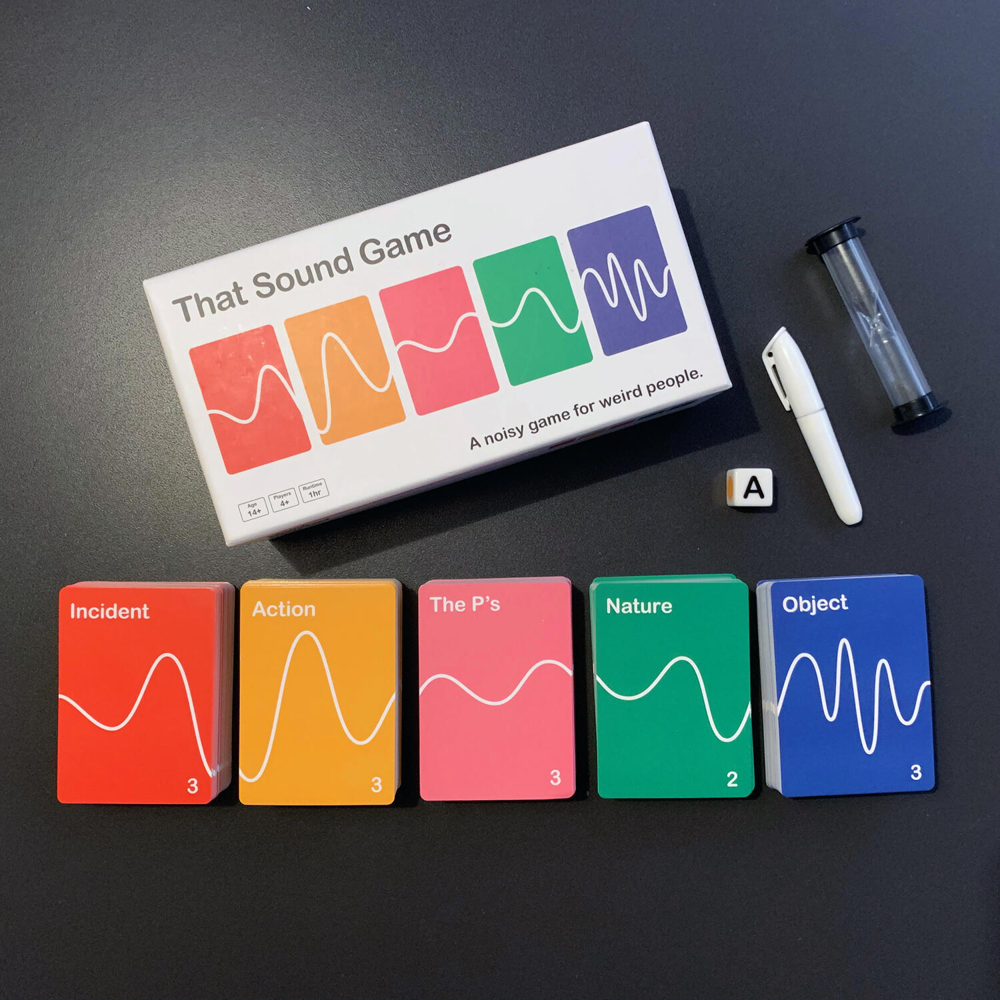
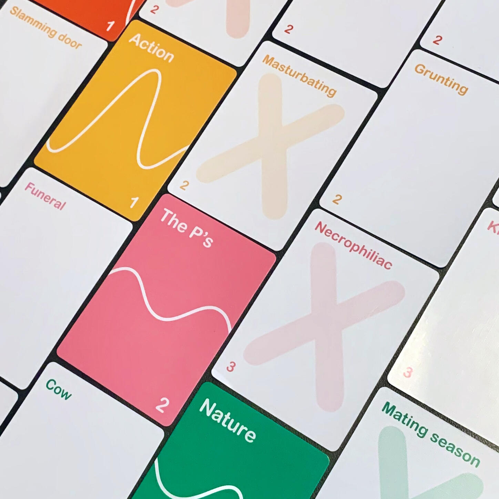
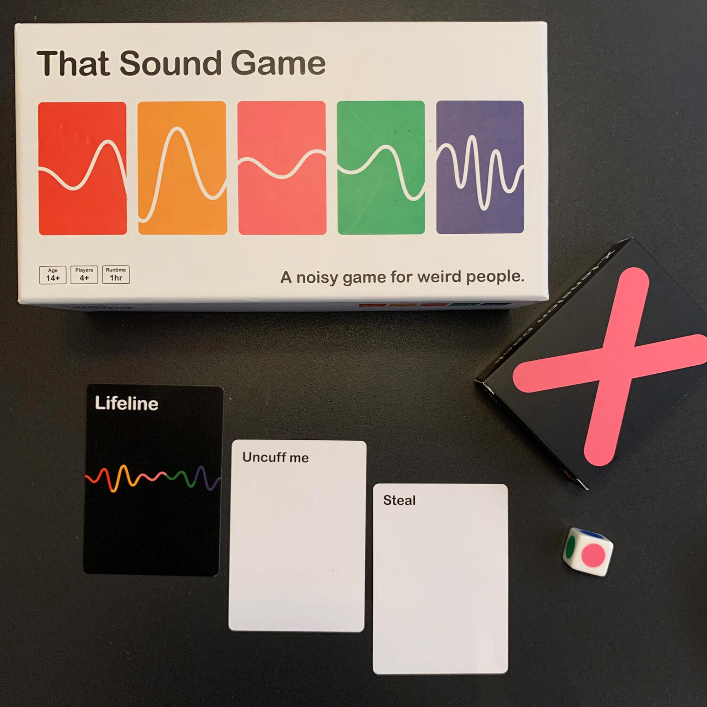

<Setting>

  Ti sei mai trovato ad emettere <strong>suoni strani con la bocca</strong> nel
  tentativo di imitare l'ambiente circostante? Pensa a quante volte hai
  cantilenato "ninoninoooo", quante volte hai fatto "du dum tss" muovendo le
  mani a ritmo, o quante volte hai provato a rispondere a un cane con un tuo
  rispettabilissimo "woff woff".
   
  Ti sei sentito stupido? A me succede… e più di quanto vorrei!  
  That sound game è proprio questo: <strong>    sentirsi stupidi facendo suoni</strong>.

</Setting>

<Rules>

  Dividetevi in gruppi di almeno 2 persone, per un massimo di 4 gruppi: più
  persone ci sono nel singolo gruppo, meglio è.
   
  Ogni turno, una squadra gioca e cerca di indovinare tanti più suoni possibili
  emessi da uno di loro. Ovviamente, non si possono scegliere i suoni da fare,
  ma bisogna (provare a) replicare quelli indicati dalle varie carte che
  verranno pescate dal mazzo scelto con un lancio di dado.
   
  Ci sono 5 mazzetti, 5 categorie:
  <ul>
    <li>      <strong>Action</strong>: camminare, tagliare l'insalata, …</li>
    <li>      <strong>Incident</strong>: pioggia di meteoriti, …</li>
    <li>      <strong>The P's</strong> (people, places and personas): cantante lirico,
      ristorante, …</li>
    <li>      <strong>Nature</strong>: moffetta, deserto, …</li>
    <li>      <strong>Object</strong>: asciuga capelli, forbice, …</li>
  </ul>
  Nel caso in cui non si riesca a indovinare, la vostra squadra può comunque
  decidere di passare.
   
  Ogni carta indovinata in 1 minuto (il tempo a disposizione per il turno di
  ciascuna squadra), vi farà guadagnare i punti indicati, ogni carta "passata",
  ne regalerà uno agli avversari.
   
  Inoltre, questi possono fare ulteriori punti gridando "<strong>STEAL</strong>"
  ed utilizzando una delle due relative carte che hanno a disposizione: quando
  ciò avviene il gioco si ferma e chi ha giocato la carta avrà una sola
  possibilità di rubare i punti in palio, indovinando il suono al posto della
  squadra che sta giocando: se ciò avviene, si fanno punti e si ri-ottiene la
  carta altrimenti la si perde per sempre.  
  Alla fine della partita, chi fa più punti (potete decidere voi quando fermarvi),
  vince!

</Rules>

<Feedback>

  That Sound Game è strano, ti fa emettere dei suoni che non pensavi che avresti
  emesso mezzo secondo prima. Per quanto tu abbia un'idea del{" "}
  <strong>suono</strong> che produce un <strong>tagliaerba</strong>, stai pur
  certo che, molto più spesso di quanto tu creda, gli altri non riusciranno a
  decifrarlo nonostante per te sia, in quel momento, la cosa più chiara
  dell'universo.  
  Anche perché, diciamolo, come si fa il suono di un macina caffè?
   
  Se questo non vi basta per sentirvi idioti, vi raccomando la <strong>    x-tension</strong>, l'espansione HOT o comunque malata. In questo caso, alcune carte marchiate
  con una X verranno mescolate assieme a quelle "normali". Succederà che imitando
  il verso del delfino, la tua squadra penserà che stai godendo di piacere. Succederà.
  Invece era un innocuo delfino. Poveri delfini.
   
  Vi siete domandati come mai si lancia un dado da 6 per scegliere una delle 5 categorie:
  bene, bravi! Una faccia rappresenta una <strong>A</strong>, che sta per "all-in",
  ovvero dove tutte le <strong>squadre giocano contemporaneamente</strong>, l'una
  contro l'altra.
   
  Se siete curiosi di provare That Sound Game, è premuroso sottolineare che <strong>    il gioco esiste solamente in inglese{" "}</strong>(da qui il "da provare" invece che "da avere") e che molti termini sono
  molto complessi da tradurre, quindi è <strong>    necessario che tutte le persone al tavolo abbiano un buonissimo vocabolario</strong>. E quindi come potrei concludere questa recensione se non con un….
  Ta-dah!

</Feedback>

