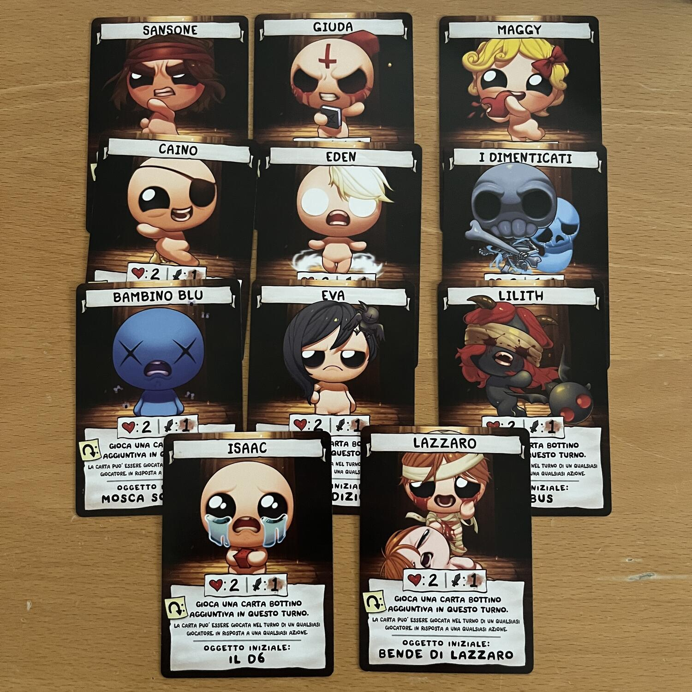
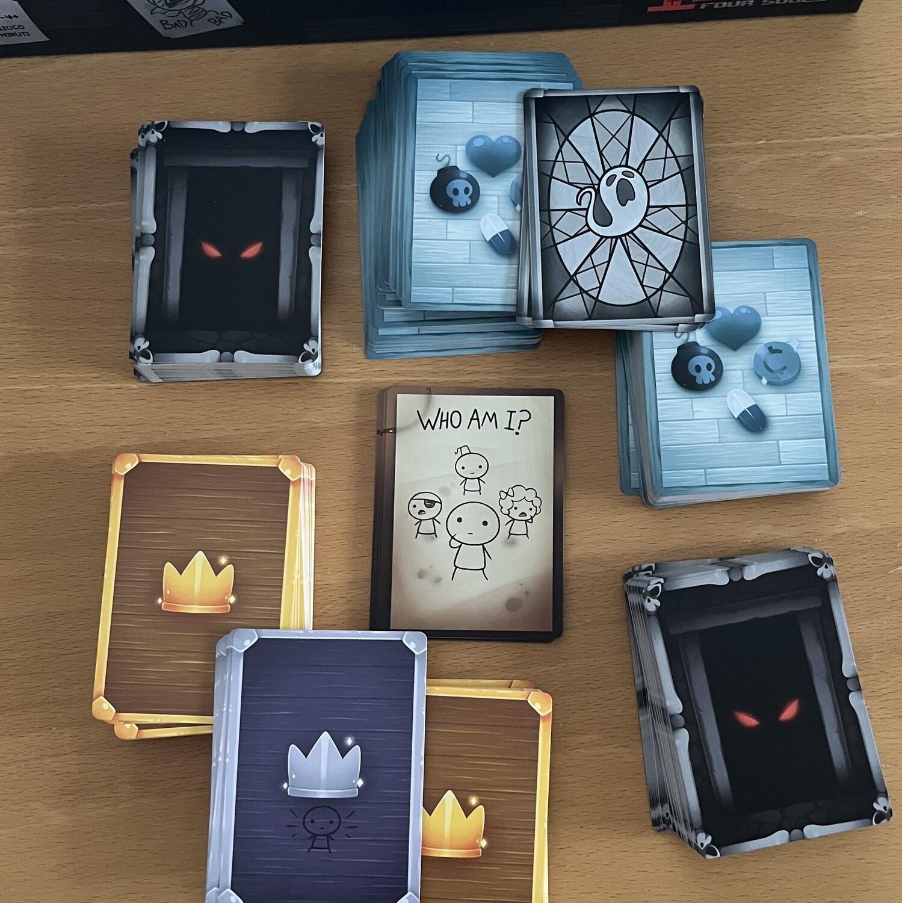
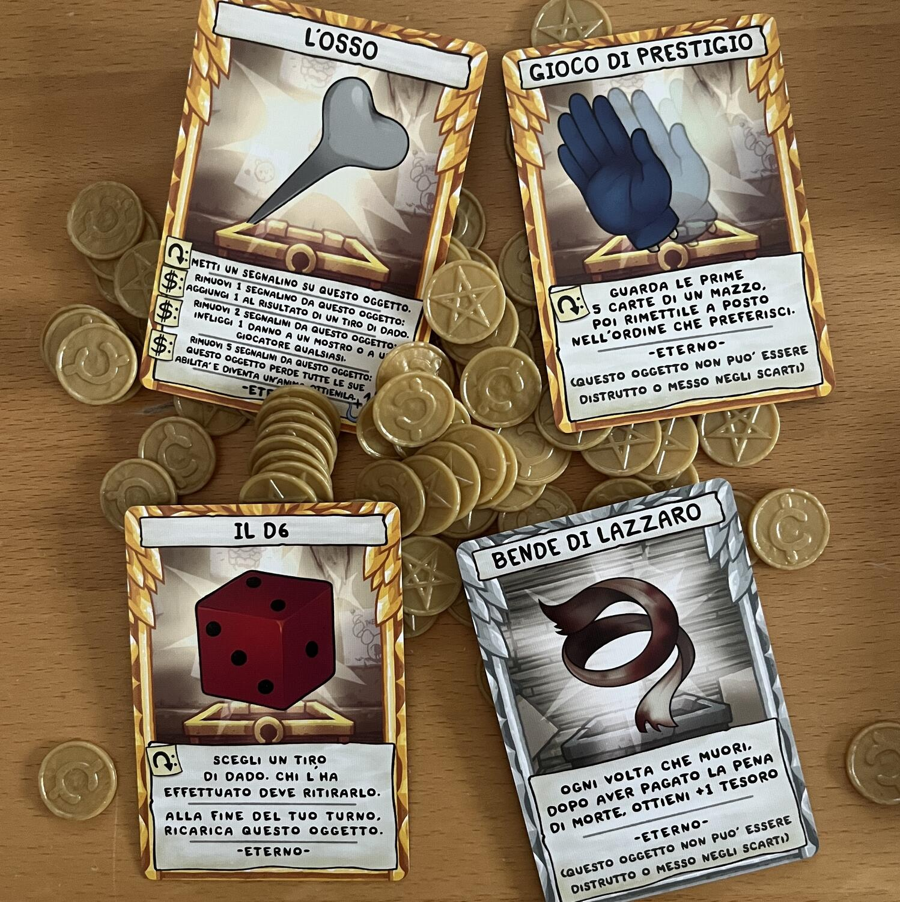

<Setting>

  Isaac e sua madre vivevano da soli in una piccola casa in collina. Isaac se ne
  stava per i fatti suoi, disegnando e giocando, mentre sua madre guardava
  programmi cristiani in televisione. La vita era semplice ed erano entrambi
  felici. Fino al giorno in cui la madre di Isaac udì una voce dall’alto.
   
  Queste sono le premesse del videogioco che ha sconvolto il panorama indie nel
  2011, e che vede il piccolo Isaac nudo e in lacrime fuggire da sua madre, a
  cui la voce “divina” ha imposto di uccidere il figlio, attraverso{" "}
  <strong>dungeon pieni di mostri</strong> in foggia di insetti, escrementi,
  interiora, carcasse, tumori e demoni, alla ricerca della salvezza (o di
  qualsiasi cosa ne assuma la forma).

</Setting>

<Rules>

  L’allestimento della partita è piuttosto facile. Ciascun giocatore riceve 1{" "}
  <strong>Carta Personaggio</strong> e la sua{" "}
  <strong>Carta Oggetto Eterno</strong> abbinata. Si mescolano poi i tre mazzi,
  quello dei Bottini (i consumabili), dei Mostri e degli Oggetti, e da questi
  ultimi due si rivelano anche le prime 2 carte. I giocatori ricevono poi 3
  carte Bottino e 3 Monete a testa.
   
  A partire dal primo giocatore, si svolgono dei turni individuali che prevedono
  la possibilità di:
   
  <ul>
    <li>      <strong>giocare </strong>1 Bottino dalla mano,</li>
    <li>      <strong>attaccare </strong>1 Mostro scoperto o in cima al mazzo,</li>
    <li>      <strong>comprare </strong>1 Oggetto scoperto o dalla cima del mazzo
      (pagandolo 10 Monete),</li>
    <li>      <strong>attivare</strong> finché possibile gli effetti delle Carte Oggetto
      o della Carta Personaggio, anche durante i turni degli avversari
      (pagandone il costo o “tappandole”).</li>
  </ul>
  I Mostri costituiscono l’obiettivo principale del gioco, in quanto la loro sconfitta
  garantisce delle <strong>ricompense </strong>al giocatore, in forma di risorse
  o, nel caso dei Boss (cioè i Mostri più forti), di Anime. Il sistema di combattimento
  è piuttosto semplice e si risolve con un lancio di dado che scala su alcune caratteristiche
  – il danno e la salute del Personaggio e del Mostro, più il valore di attacco di
  quest’ultimo.
   
  Quando un giocatore esaurisce i punti salute del suo Personaggio, questi “muore”
  (cioè scarta 1 Oggetto e 1 Bottino a sua scelta e perde 1 Moneta), il suo turno,
  se in corso, termina, e il Personaggio rinasce con tutte le carte “tappate”. Se
  invece è il Mostro ad avere la peggio, il giocatore ne riscuote i bonus ed eventualmente
  l’Anima rappresentata sulla carta.
   
  La partita termina quando un giocatore ha ottenuto la sua <strong>    quarta Anima</strong>, vincendo su tutti gli altri.

</Rules>

<Feedback>

  Dal regolamento potrebbe trasparire che TBOI: Four Souls sia un gioco
  piuttosto tranquillo, in cui ognuno svolge il suo turno giocando le proprie
  carte e cercando di ottenere le Anime prima degli altri. Ma, come si dice: il
  diavolo è nei dettagli. Infatti, il cuore del gioco sta proprio nelle carte e
  nella possibilità di giocarle, all’occorrenza, anche nei turni degli altri.{" "}
  <strong>L’interazione è quasi esclusivamente diretta</strong>, e la maggior
  parte delle carte sono progettate per <strong>sabotare</strong> non tanto le
  strategie degli avversari, quanto piuttosto il loro{" "}
  <strong>livello di sopportazione</strong>. È estremamente probabile che un
  piccolo dispetto assuma in un paio di mosse le proporzioni di un complotto, di
  una vendetta generazionale, di una punizione divina, finché non ci si
  dimentica che l’obiettivo del gioco sono i Mostri.
   
  In questo, TBOI: Four Souls si dimostra un{" "}
  <strong>party game coinvolgente</strong>, pieno di colpi scena, anche epico a
  tratti, capace di creare un’atmosfera concitata e una tensione sempre sul
  punto di infrangersi in un ribaltamento del tavolo. Ed è una sensazione che{" "}
  <strong>crea dipendenza</strong> e spinge a rigiocarlo in continuazione, con
  lo stesso gruppo o anche con gruppi diversi, complice l’asciuttezza del
  regolamento.
   
  Ma le incrinature iniziano proprio qui. Infatti, dopo un po’ di partite – un
  bel po’, va detto – ci si rende conto che il gioco è{" "}
  <strong>un po’ troppo regolato dalla fortuna</strong> e che non c’è davvero
  una grande soddisfazione personale nel gameplay che vada oltre l’appagamento
  del rancore nei confronti degli altri giocatori. Le partite più tranquille,
  infatti, si sono dimostrate sciape, quasi insulse.
   
  Difettato è anche il <strong>bilanciamento </strong>del mazzo dei Mostri, che
  dovrebbe scandire il ritmo degli attacchi e delle preparazioni, con un
  comparto di Boss tosto e definito che crei una sapiente climax di violenza.
  Invece, il mazzo straborda di Boss, che rappresentano circa 1/3 del totale, e
  che raramente si somigliano come livello di difficoltà. Non c’è quasi motivo
  di attaccare gli altri Mostri, considerato che quasi sempre c’è un Boss a
  disposizione (e anche quando non c’è, si preferisce non attaccare i Mostri,
  così da lasciare il compito agli avversari e cogliere poi il Boss che
  probabilmente attende di essere rivelato dalla cima del mazzo).
   
  The Binding of Isaac è una storia complessa che parla di colpa, di fanatismo,
  di abuso, ma che sa deliziare anche con riferimenti pop e geek, il tutto
  condito da un gameplay allucinante e punitivo, pieno di variabili e dalla
  rigiocabilità illimitata. Four Souls aveva il compito di ricreare l’esperienza
  videoludica attraverso delle carte. <strong>Ci è riuscito a metà</strong>: se
  infatti riesce ad orchestrare il caos che ci aspettavamo – regalando tante e
  divertenti partite – manca tuttavia di un’impalcatura abbastanza solida da
  riuscire ad impartire un ritmo al flusso di gioco, che può rivelarsi slegato e
  poco accattivante per un pubblico che mastica titoli più strutturati.
  L’espansione <strong>Requiem</strong>, che promette una quantità di nuove
  carte quasi pari al gioco base, avrà risolto il problema?

</Feedback>

