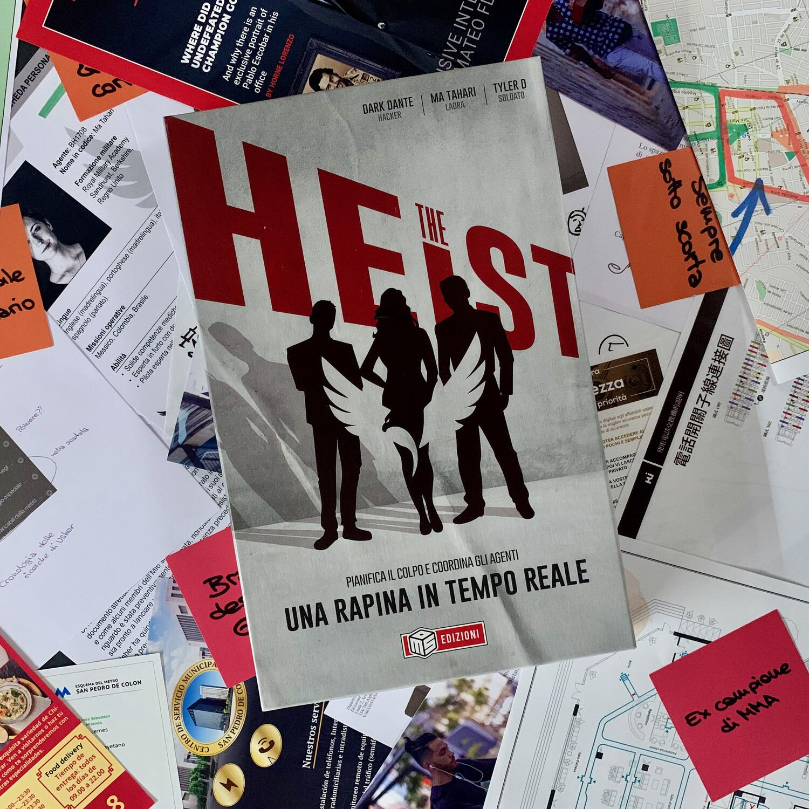
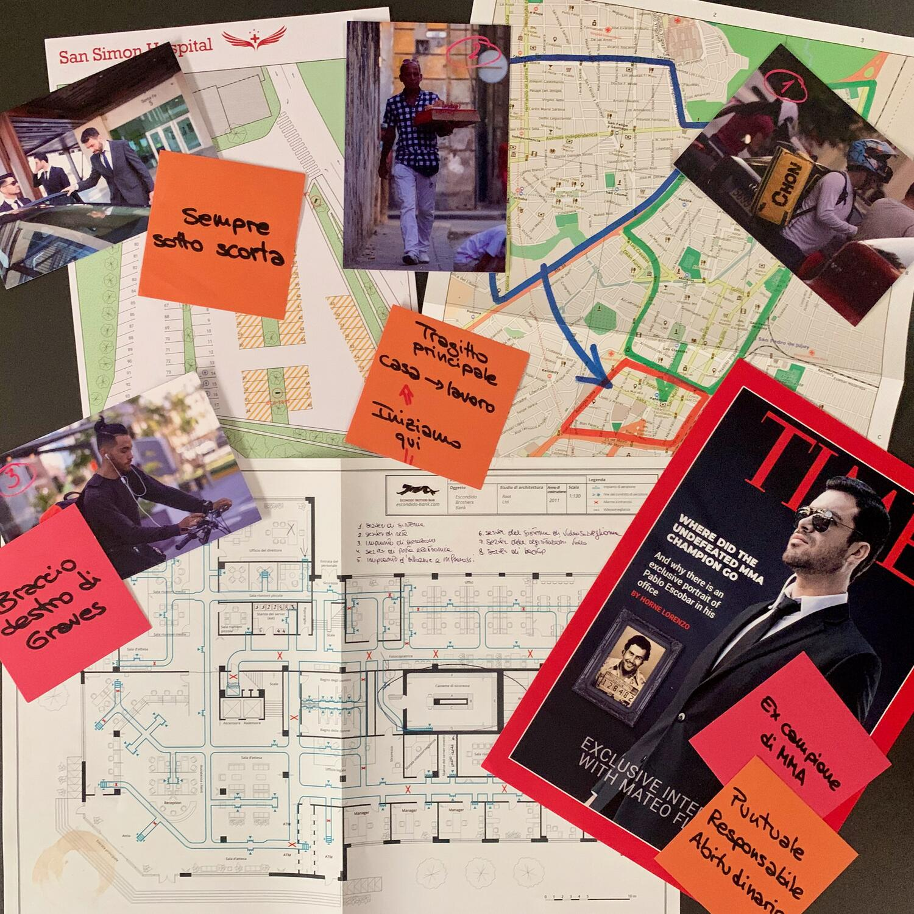
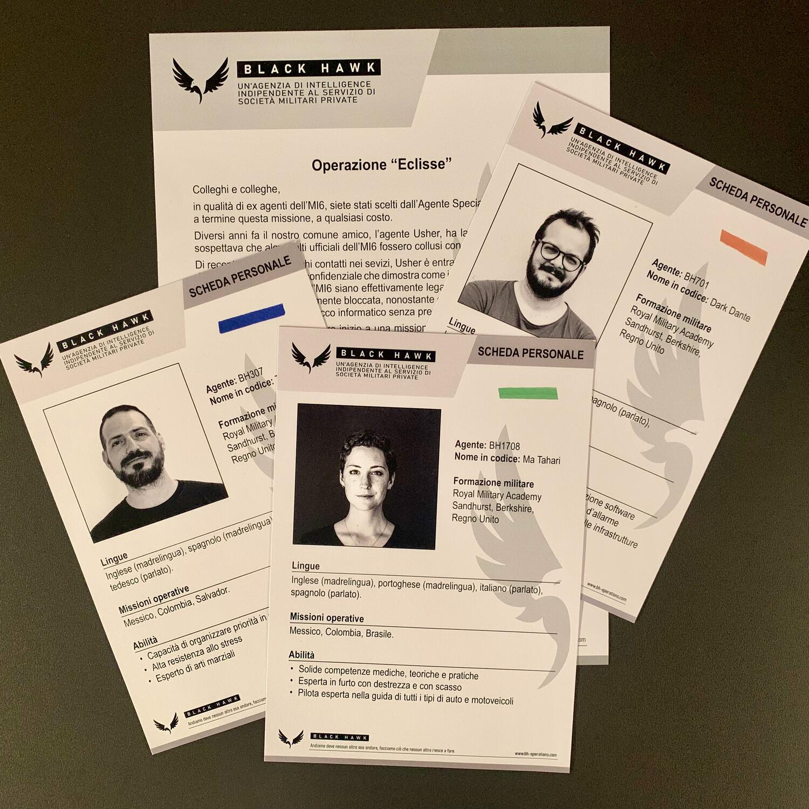

<Setting>

  Il cartello di Zipacna sta per sferrare un imponente cyberattacco in grado di
  mettere in crisi la sicurezza globale. La vostra missione è quella di{" "}
  <strong>entrare nella loro banca</strong> e rubare tutte le risorse
  finanziarie in modo da sventare il loro pericoloso piano.
   
  Studiate il materiale con attenzione e{" "}
  <strong>    prendetevi tutto il tempo necessario per pianificare la missione</strong>{" "}
  perché, una volta avviata,{" "}
  <strong>la sua esecuzione avverrà in tempo reale</strong>. 
  Il successo della missione dipende da voi!

</Setting>

<Rules>

  Spiegare le regole di The Heist è inutile,{" "}
  <strong>praticamente non ha regole</strong>. Pe' davero!  
  Immaginate di essere i coordinatori di tre agenti sul campo pronti a fare tutto
  ciò che direte loro, quando glielo direte. Il vostro scopo sarà quello di portare
  a casa la missione e, per farlo, prima di iniziare <strong>    dovrete "analizzare" un faldone pieno di documenti, piantine, screenshot,
    foto, post-it, depliant, veri siti-web e molto altro</strong>. Tutti questi elementi saranno necessari per organizzare al meglio la
  vostra missione, per capire come muovervi e gestire le tempistiche con cui agire.
  Potete tranquillamente organizzarvi le informazioni come siete più comodi direttamente
  sul vostro tavolo. Per molte informazioni, però, vi sarà difficile capire come
  poterle utilizzare e perché dovreste… ma niente paura, tutto sarà chiaro!  
  Una volta che avete familiarizzato con i documenti, siete pronti a mandare sul
  campo gli agenti che "piloterete" attraverso tre{" "}
  <strong>bot su telegram</strong>, scrivendo loro dei messaggi, ai quali
  risponderanno con altri messaggi, foto o addirittura video.  
  Vi sembrerà di essere lì.

</Rules>

<Feedback>

  Avete presente nei film d'azione quei 2-3 personaggioni che stanno sempre nel
  furgoncino delle pulizie vicino al classico albergo mentre coordinano con
  walkie talkie a onde corte una banda di criminali?  
  Ecco, più o meno questo è "the heist" e voi siete i 2-3 personaggioni che devono
  tirare i fili.  
  Inizialmente, vedendo la scatola,{" "}
  <strong>    ero un po' spaventato dalla grande quantità di tempo che avrei dovuto
    dedicare a fare congetture</strong>
  , dalla grande quantità di informazioni che avrei dovuto assimilare prima di mandare
  il primo messaggio e dalla grande quantità di pressione che mi avrebbe dato messaggiare
  con i miei tre compari. <strong>Niente di tutto questo era vero.</strong>
   
  Per affrontare la <strong>prima parte</strong> del gioco, ci sono bastati <strong>    30 minuti</strong>, in quanto siamo riusciti a dividerci il materiale da "studiare". Certo,
  le informazioni sono tante ma non è necessario impararle a memoria: basta ricordarsi
  di cosa parlano i vari documenti. In ogni caso, i bot non sono pensati per farvi
  fallire la missione se non date la risposta entro pochi secondi, anzi, vi aspetteranno,
  permettendovi così di giocare il gioco come più credete possa toccare le vostre
  corde: preferite imparare tutto perfettamente e poi mettervi alla prova? Fatelo!
  Preferite affrontarlo con più spensieratezza ricercando a mano a mano le informazioni?
  Fatelo!
   
  <strong>    The heist è una via di mezzo tra un investigativo e un'escape room</strong>, senza la pesantezza di un investigativo e senza le difficoltà di un
  escape room. In altre parole è una cosa nuova. È un'esperienza totalmente immersiva.{" "}
  <strong>È fighissimo</strong>. Vi sembrerà davvero di essere nel furgoncino.  
  Se volete un altro{" "}
  <Link to="/reviews/sherlock-holmes-consulente-investigativo/">Sherlock</Link>{" "}
  da unire alla vostra collezione, non è quello che cercate.  
  Se bramate un nuovo <Link to="/reviews/unlock-escape-adventures/">
    Unlock
  </Link>, non è quello che troverete.  
  Se apprezzate l’idea di portare il gioco nel mondo reale, come in{" "}
  <Link to="/reviews/chicken-crimes-il-mistero-del-dom-gallignon/">
    Chicken Crimes
  </Link>
  , hey, questo è ancora più hardcore, ma non voglio spoilerare nulla… <strong>    Diciamo che visitare un sito web sarà banale rispetto ad altre cose che
    sarete portati a fare.</strong>
   
  Da amante delle escape room sono rimasto un po' deluso dalla <strong>    difficoltà degli enigmi</strong>: li speravo più sfidanti, mentre qui si parla di un vero e proprio entry
  level. Certo, quello che per me è un punto negativo, per molti potrebbe essere
  un elemento positivo.
   
  Spero vivamente che questa scatola sia solo la prima di una lunga serie, magari
  con difficoltà crescenti o con necessità di correre ancora di più, per sentire
  l'adrenalina spingere.

</Feedback>

