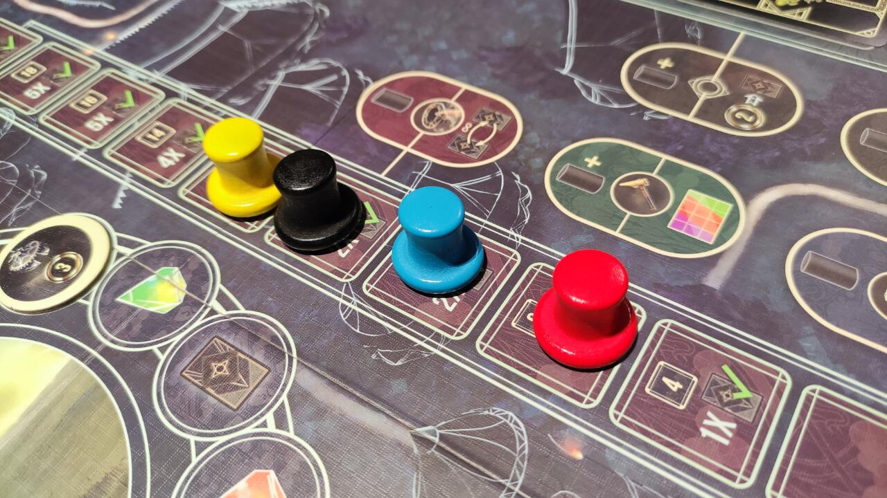

<Setting>

  Avete mai pensato di essere proprietari di un circo e sfidare i vostri amici a suon di spettacoli, effetti speciali e
  sfruttando le abilità dei vostri maestri? The Magnificent vi darà questa opportunità un po’ insolita per un gioco da
  tavolo! Viaggerete alla ricerca dei migliori artisti e dei più stupefacenti effetti speciali per organizzare gli
  spettacoli più acclamati. Siete pronti?

</Setting>

<Rules>

  Una partita a The Magnificent dura <strong>3 round </strong>. In ogni round i giocatori effettueranno 4 turni.  
  Le azioni si svolgono mediante la <strong>scelta dei dadi</strong>, la cui somma determinerà la forza delle azioni stesse:
  più sarà alta la somma dei dadi di uno stesso colore, più sarà forte l’azione (ma dovrete anche pagare di più alla fine
  del turno!).  
  Un turno si svolge in 3 passaggi:
       
         Si prende un dado e lo si colloca su una propria <strong>carta mastro</strong> che non ne abbia uno: le carte mastro rappresentano le scelte del direttore del proprio circo. Nella parte alta della carta c’è un bonus utilizzabile una sola volta nel turno di un giocatore; nella parte bassa il punteggio che darà se la si scarterà a fine round.
       
       Si determina la forza, data dal dado preso nel primo passaggio più tutti quelli dello stesso colore già presenti
      sulle vostre carte mastro. Si possono scartare gemme dello stesso colore del dado per incrementare la forza di
      due. Le gemme trasparenti sono jolly. Inoltre, si può utilizzare un dado trasparente come un dado di qualsiasi
      colore e si potrà sommare ai dadi del colore scelto, ma solo per il turno in corso!.
       
      Si svolge un’azione tra le seguenti:
      <ul>
        <li><strong>Costruzione</strong>: consente di espandere il proprio campo con le tessere, funzionali alla realizzazione degli spettacoli. Si sceglie un livello in base alla forza del colore dei dadi selezionato e si prende/ono quella/e corrispondente/i. Poi si piazza la tessera nel proprio campo. La prima potrà essere posizionata ovunque, le successive dovranno condividere almeno un lato con quelle presenti. Le tessere possono essere ruotate, ma una volta piazzate non potranno più essere spostate. Se si copre un bonus, lo si può prendere.</li>
        <li><strong>Viaggio</strong>: consente di prendere gemme, tende e locandine. Le tende servono per realizzare gli spettacoli, che sono rappresentati dalle locandine. Ci sono 3 tracciati, uno per colore. Si sposta in avanti la carrozza del colore del/i dado/i scelto/i in senso orario, in base alla forza dell’azione. Si prendono tutte le gemme e le locandine degli spazi dove si passa e ci si ferma. Per prendere una tenda occorrerà terminare il movimento su di essa e non ci si potrà più muovere nel turno in corso. Se si prende una tenda, la si pone su uno spazio tenda della propria plancia. Se si coprono tutti e 4 gli spazi tenda, non se ne possono ottenere di nuove. Se si prende una locandina, la si pesca dalla cima del mazzo locandine oppure tra le 4 visibili dalla zona locandine sul tabellone. Poi, la si pone in uno spazio della propria area locandine.</li>
        <li><strong>Esibizione</strong>: Si eseguono gli spettacoli sulle locandine. Il colore del dado scelto non ha importanza: conterà la forza. Si sposta il cappellino dalla propria area e lo si mette in uno spazio libero del tracciato spettacolo che corrisponda alla propria forza o in uno spazio sottostante. Poi, si organizzano gli spettacoli in un numero pari o inferiore a quelli indicati nello spazio. Per completare l’azione, una locandina deve avere una tessera tenda al di sotto e occorrerà rispettarne i requisiti, che possono essere tessere campo e gemme. Se si organizzano più spettacoli, i requisiti delle tessere si sommano: si dovranno avere più copie della stessa tessera o più gemme di un determinato tipo. Inoltre, qualche tenda mostra delle gemme che devono essere scartate per potervi svolgere uno spettacolo. Si ottengono quindi i punti e le monete mostrate sulle locandine e sulle tende.</li>
      </ul>
  Quando tutti i giocatori hanno svolto 4 turni, il round termina. Si esegue quindi il <strong>Pagamento</strong> : si
  calcola la somma dei dadi dello stesso colore utilizzati, si pagano monete pari al valore più alto tra questi e la
  somma dei dadi trasparenti utilizzati. Per ogni moneta che non si riesce a pagare si perderanno 1 punto nel primo
  round, 2 nel secondo e 3 nel terzo. Si conteggia una carta mastro tra le 5 a disposizione e se ne ottengono i punti.
  Poi la si scarta.  
  Al terzo round il gioco termina e chi ha più punti vince!

</Rules>

<Feedback>

  The Magnificent è un buon peso medio, adatto anche a giocatori occasionali. Le partite sono relativamente brevi: in
  due giocatori servono circa 40’. Arrivati al terzo round se ne vorrebbe uno più per poter fare ciò che era stato
  programmato, per cui occorrerà cercare di massimizzare le azioni. Eppure, anche se il gioco è “stretto”, difficilmente
  avrete la frustrazione di non riuscire a fare tutto, poiché non è punitivo. L’interazione è bassina: ci si limita a
  rubarsi i dadi e le locandine di maggior interesse.  
  La nota dolente è l’ambientazione, non molto immersiva: realizzare uno spettacolo si riduce al possesso di tessere campo
  da incastrare in stile tetris e di gemme, che rappresenterebbero gli effetti speciali. I materiali invece sono molto belli:
  peccato solo per le plance giocatore, che sono fini, e per il contenitore porta-risorse che, non chiudendosi perfettamente,
  lascerà andare in giro i pezzi che avrete ordinato.  
  La grafica divide: potrà far impazzire chi adora le atmosfere dark o far storcere il naso a chi si sarebbe aspettato
  colori più sgargianti, trattandosi di un gioco sul circo.  
  In definitiva, un gioco leggero ma non troppo, dalla durata contenuta e adatto anche a giocatori occasionali. Consigliato!

</Feedback>

