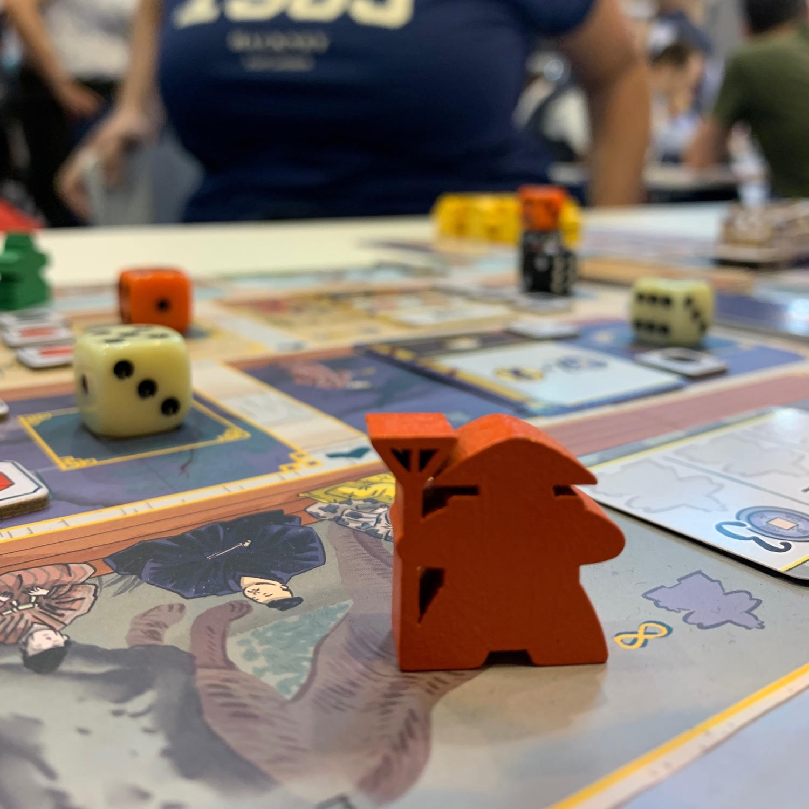
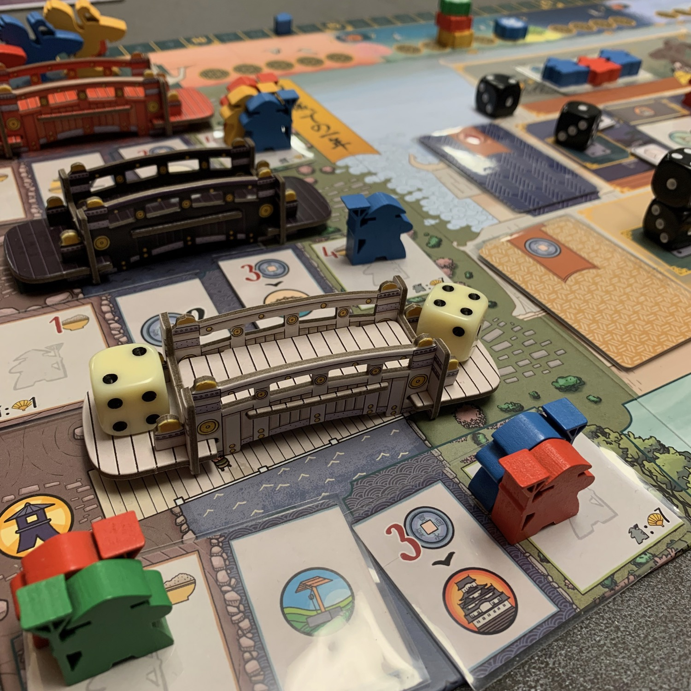
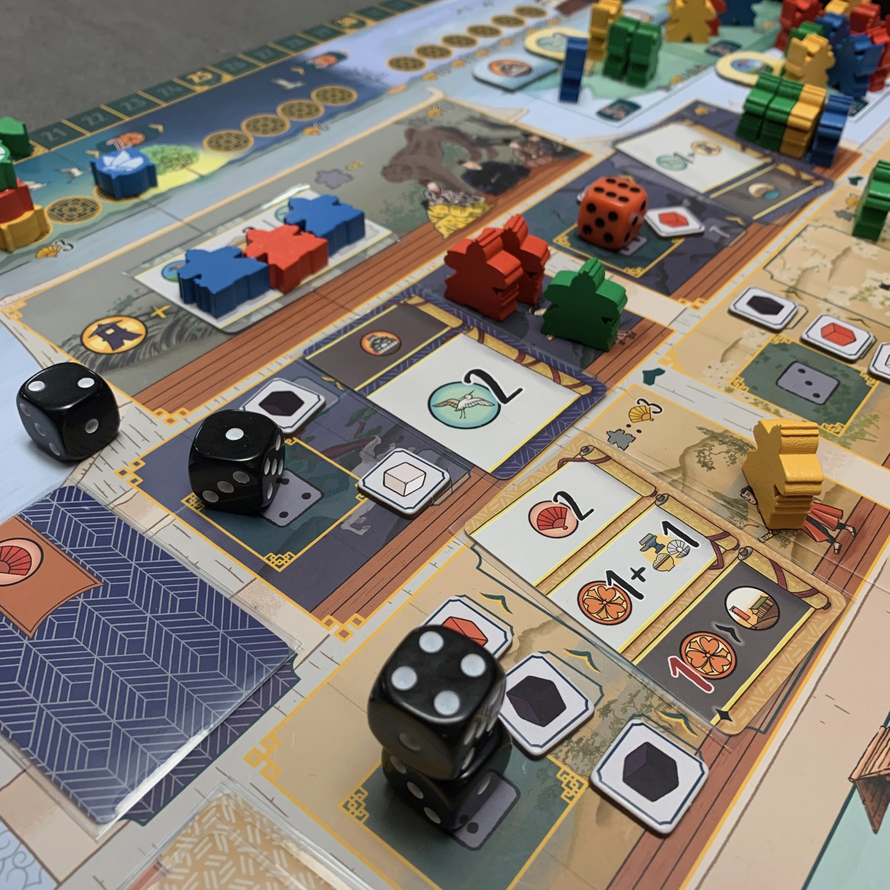

<Setting>

  Giappone, 1761: Provincia di Harima. Il Daimyo Sakai Tadazumi è uno dei più importanti consiglieri dello Shogunato
  Edo, e governa la regione del <strong>Castello di Himeji</strong>. È nei migliori interessi dei clan locali, quindi,
  entrare nelle grazie del clan Sakai. Per ottenere influenza devono inserire membri della propria famiglia a ogni
  livello della catena di comando del Castello Bianco, da ruoli politici a ranghi militari, fino ai più umili
  giardinieri che curano i minimi dettagli del parco del palazzo.

</Setting>

<Rules>

  Una partita di The White Castle è divisa in <strong>3 round di gioco</strong>, durante i quali ogni giocatore svolge 3
  turni, <strong>per un totale di 9 turni</strong>. 
  Ogni turno, ogni giocatore <strong>sceglie un dado</strong> da uno degli estremi dei tre ponti (i dadi sono disposti in
  ordine crescente) e lo utilizza <strong>per svolgere un'azione</strong>. Le azioni disponibili, presenti sul tabellone
  e sulla plancia personale, sono riconoscibili dall'icona di una faccia del dado, rappresentante un numero: posizionando
  il dado su un’azione si guadagna o si paga denaro in base alla differenza di valore tra dado disegnato e dado collocato.{" "}
   
  Le azioni sono molto varie e di diversa intensità: dalle semplici "ottieni risorse" a quelle più complesse, che
  permettono di spostare meeple dalla propria plancia al tabellone; queste azioni sono il vero gioco in quanto sono in
  grado di innescare combo su combo:
   
  <ul>
    <li>      <strong>ponti</strong>: pagando riso, si posiziona un meeple giardiniere sulla riva sinistra o destra del ponte
      che preferiamo e si ottiene subito la relativa ricompensa;</li>
    <li>      <strong>castello</strong>: pagando soldi si posiziona un cortigiano all'entrata del castello, mentre pagando perle
      lo si fa salire di uno o di due piani. Una volta scelta la stanza, si prende la carta dalla plancia comune e la si
      posiziona su quella personale. Quella "vecchia" la si gira e la si mette nell'azione della lanterna;</li>
    <li>      <strong>campi</strong> di marte: pagando ferro, si posiziona un guerriero in uno dei campi.</li>
  </ul>
  Vi starete domandando perché valga la pena prendere un dado <strong>dalla sinistra di un ponte</strong> (e quindi con il
  valore minimo)… e mo ve lo dico! Prendendo il dado basso, probabilmente sarete obbligati a colmare la differenza con le
  vostre monete ma, una volta fatto ciò, attiverete l'azione "<strong>lanterna</strong>": via via che si esploreranno stanze
  del castello, questa azione diventerà sempre più forte, permettendo a un dado basso+lanterna di farvi guadagnare (oltre
  che a ottenere delle risorse e dei punti vittoria) molti più soldi di quanti potreste ottenerne prendendo un dado alto.{" "}
   
  Oltre alle azioni presenti sul tabellone, ce ne sono tre (simili tra loro) sulle plance personali. Inizialmente queste
  azioni saranno deboli ma, a mano a mano che si gioca, si potenzieranno: infatti, svolgendone una si attiverà tutta la
  linea di icone (che prima erano nascoste dai meeple) e la parte corrispondente sulla carta a destra.  
  Dopo che tutti i giocatori avranno scelto 3 dadi, il round termina con ancora 3 dadi su alcuni ponti.  
  Nei primi 2 round, i ponti che hanno almeno un dado, <strong>abilitano i relativi giardinieri</strong> scatenando
  ancora combo!  
  Alla fine dell'ultimo, invece, si conteranno i punti, principalmente sulla base della posizione dei meeple.

</Rules>

<Feedback>

  The White Castle mi è <strong>entrato subito nel cuore</strong> (e nello zaino, dato che è stato il primo gioco che ho
  provato e comprato allo Spiel di Essen!). I motivi sono presto detti:{" "}
  <strong>    le regole sono semplici, il peso è perfetto, la scatola è piccolissima, i materiali sono curati e il costo è
    irrisorio</strong>
  .  
  Il modo in cui gioco questo gioco è diverso rispetto agli altri: solitamente, si gioca pensando a come si può arrivare
  a svolgere una determinata azione a 2-3 turni di distanza, raccogliendo tutte le risorse e via dicendo; in The White
  Castle, invece, <strong>molte azioni devi farle "di sponda" per risparmiare tempo</strong>. Non devi capire come
  massimizzare la singola azione, bensì come ottimizzare il singolo turno, facendo in modo che la somma delle azioni in
  combo sia la migliore possibile. Ed è proprio questo il motivo per cui amo questo gioco. Questa caratteristica,
  ovviamente, lo porta anche a essere noioso da giocare se i giocatori al tavolo hanno livelli di padronanza diversi o
  anche se, semplicemente, uno l'ha già giocato mentre gli altri no: la differenza sarà abissale.  
  Vi piace <Link to="/reviews/tiletum/">Tiletum</Link>? E <Link to="/reviews/wingspan/">Wingspan</Link> ? <em>    Darwin's Journey</em>? Sì? Compratelo subito.
   
  Io spero che questo titolo possa lanciare un messaggio al mondo ludico: si può vendere un gioco bellissimo a 30 euro che
  non occupa ¼ di cubo di kallax. E voi come la pensate sulle scatole piccole?

</Feedback>

