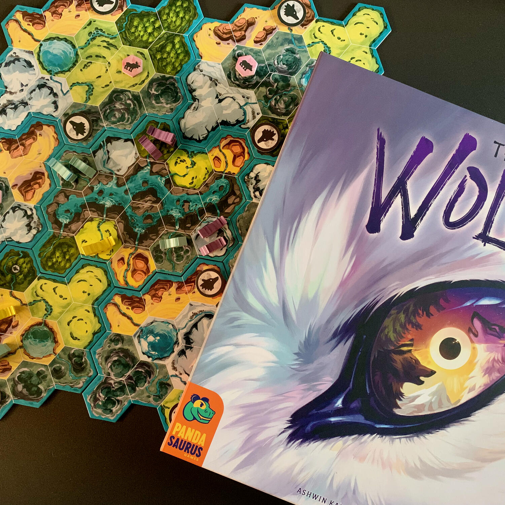
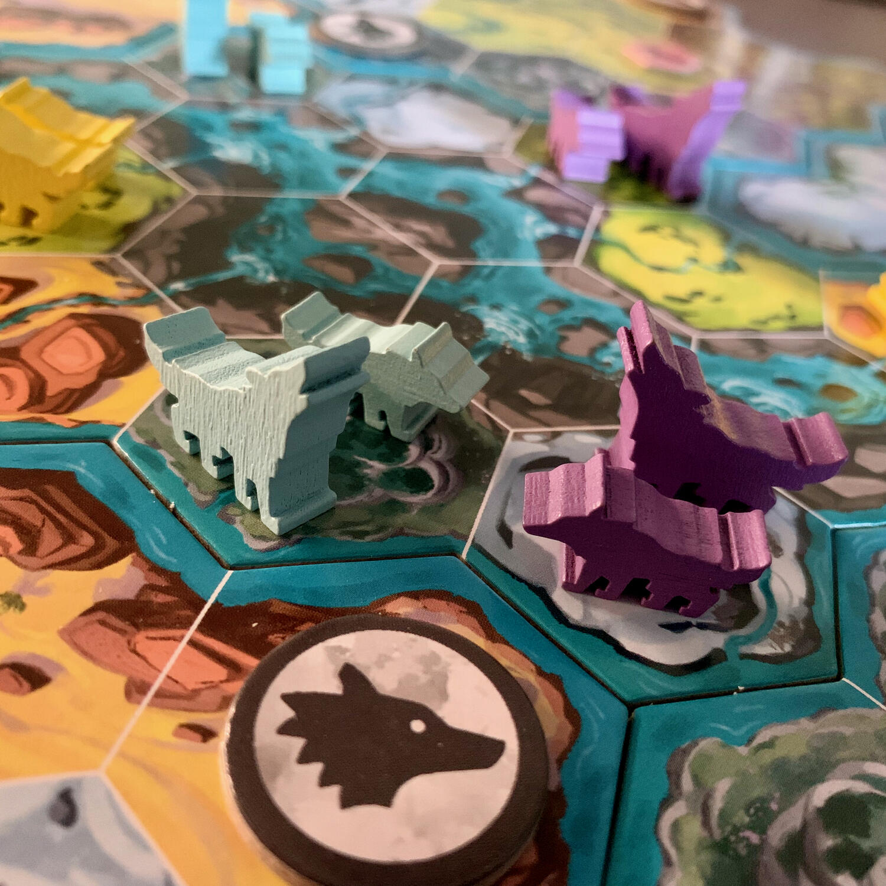
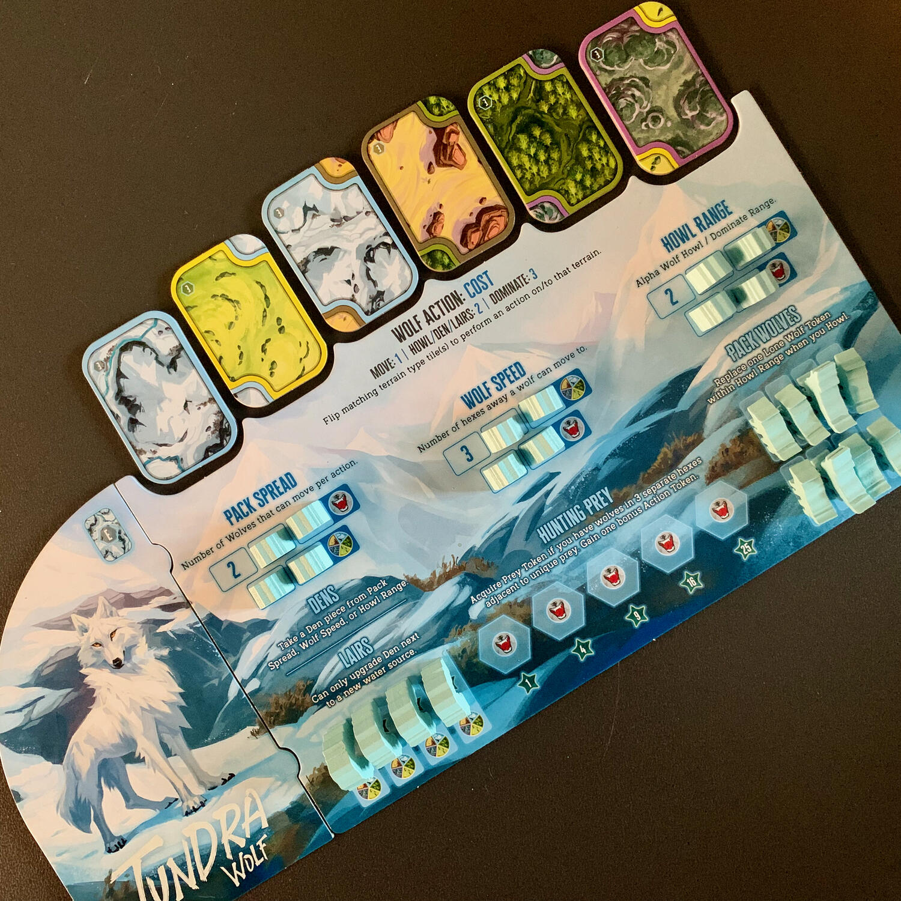

<Setting>

  Siete il capo di un branco di lupi. Nel corso di un ciclo lunare, dovrete inseguire le prede nella natura selvaggia,
  reclutare lupi solitari per far crescere il vostro branco e combattere con branchi rivali per il controllo del
  territorio. Con astuzia e istinto omicida, forse riuscirete a stabilire il dominio del vostro branco. Forse…

</Setting>

<Rules>

  L'obiettivo del gioco è quello di collezionare il maggior numero di punti vittoria. Per farlo dovrete combattere per
  il <strong>controllo delle regioni</strong> della plancia, <strong>cacciare prede</strong> e{" "}
  <strong>migliorare</strong> la forza del vostro <strong>branco</strong>.  
  Ogni turno, un giocatore deve compiere <strong>due azioni</strong>: muoversi, costruire tane, migliorarle, ululare ai lupi
  solitari per convincerli a entrare a fare parte del proprio branco e imporsi sugli avversari assimilando, così, i lupi
  e le tane bersaglio.
   
  Ogni giocatore possiede una plancia che, inizialmente, sarà colma di lupi e tane da poter posizionare sulla mappa centrale.
  Spostare meeple non solo aumenterà la forza del proprio branco a livello numerico, ma permetterà anche di avere azioni
  sempre più forti, con lupi capaci di muoversi per tragitti sempre più lunghi e di rafforzare la forza del loro ululato,
  facendolo sentire sempre più da lontano. <strong>Posizionando i meeple dalla plancia alla zona di gioco</strong>, verranno
  scoperti dei numeri o dei bonus che permetteranno di accedere ad azioni più forti e a possibili punti vittoria extra, oppure
  a token che, se spesi, daranno a loro volta azioni extra o ci permetteranno di attivarne una in modo più semplice.
   
  Per compiere le azioni sarà necessario <strong>capovolgere un determinato numero di tessere</strong> (1, 2 o 3) dello stesso
  territorio. Poiché ogni tessera rappresenta fronte-retro 2 delle 5 tipologie di territorio (bosco, montagna, …), terminata
  l'azione i territori disponibili sui quali compiere le successive saranno differenti.  
  La partita termina al compimento della <strong>terza fase lunare</strong> ma durante ogni sottofase della partita
  (luna crescente, primo quarto e luna piena) ci sarà un calcolo intermedio delle maggioranze, che avverrà di volta in
  volta in regioni diverse guardando il numero dei pezzi di ogni giocatore lì presenti (tutti valgono 1 tranne le tane
  grosse che valgono 3).  
  L'ultimo modo per collezionare punti vittoria è <strong>cacciare</strong>. Questa, più che una vera e propria azione, è
  una situazione: se riuscirete a circondare una preda da almeno 3 lati con almeno 3 lupi, il suo token verrà posto sulla
  vostra plancia, sbloccando così, via via, sempre più punti.

</Rules>

<Feedback>

  Wolves è stato un fulmine a ciel sereno. Un gioco a prima vista semplice, con una{" "}
  <strong>grafica davvero bella</strong> e capace di suscitare interesse in chiunque lo veda intavolato. Solo a prima
  vista semplice, appunto, questo gioiellino nasconde la sfida di <strong>pianificare a lungo termine</strong>,
  guardando avanti di almeno 2-3 turni. Muoversi è quasi sempre fattibile, dominare lo è molto meno: avere tre tessere
  rappresentanti lo stesso territorio implica che si è fatto in modo di arrivare a quella situazione nei turni
  precedenti. Vi troverete spesso a dover scegliere se seguire la vostra strategia oppure abbandonarvi a una più
  istintiva tattica a breve termine. Ovviamente la scelta dipende molto dalla situazione in corso e da quanto e da come
  la vostra strategia finale ne viene intaccata.  
  L'atto di muovere tane e lupi dalla vostra plancia verso la mappa smuove gli stessi sentimenti che potete trovare in un
  sempreverde <Link to="/reviews/scythe">Scythe</Link>, con l'azione di miglioria. Tutto gira attorno alle scelte: che lupo
  posizionare? meglio aumentare la distanza? la quantità di lupi che si possono muovere? o forse è meglio puntare sull'ululato?
  Il tutto è reso ancora più interessante dalla possibilità di ottenere anche bonus oppure punti vittoria.
   
  Vorrei spendere due righe anche sulla qualità dei <strong>regolamenti</strong> scritti da Pandasaurus: sempre chiari, davvero
  belli e rilassanti da leggere, di una limpidezza logica che non sempre si riesce a trovare.  
  Wolves mi è piaciuto davvero molto: mi sento di consigliarvelo, soprattutto se siete neofiti che vogliono andare verso
  qualcosa di sempre più complicato.

</Feedback>

