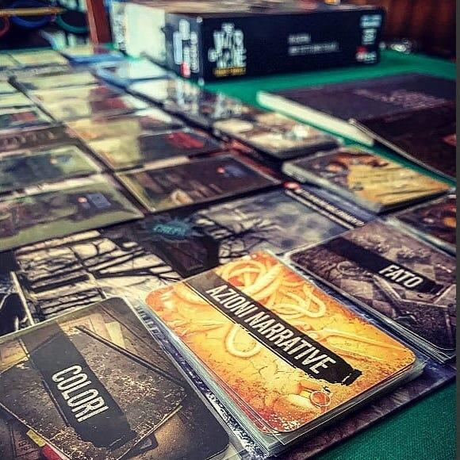
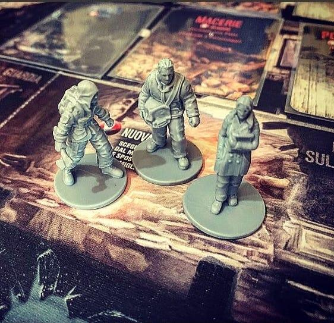

<Setting>

  A Pogoren si combatte una guerra cruda, fredda, estenuante…
   
  Sono gli anni compresi tra il '92 e il '96, siamo a Sarajevo e la città è
  assediata!
   
  Molti muoiono ogni giorno sotto colpi sparati da fucili e cannoni, alcuni
  tentano di lasciare la città, altri si nascondono in case abbandonate, altri
  ancora cercano riparo dai colpi dei cecchini appostati sui tetti e fanno di
  tutto per sopravvivere al meglio delle loro possibilità. Un manipolo di
  superstiti: uomini, donne e bambini… Insegnanti, pompieri, avvocati… Insomma
  una moltitudine di persone diverse, con diverse esperienze di vita, si
  ritrovano a dover convivere e condividere tutto ciò che possa esser loro di
  aiuto per “tirare avanti un giorno in più”. Si ritrovano rintanati all'interno
  di una casa qualunque in attesa di percepire il placarsi della guerra, il
  silenzio tanto agognato. Ogni giorno è diverso dagli altri… ogni giorno il
  rischio di rimanere uccisi durante la perlustrazione in cerca di cibarie,
  vestiti, armi e oggetti utili è stressante oltre ogni limite. La paura è
  palpabile.
   
  Scelte difficili, spesso poco ortodosse, sono all'ordine del giorno per la
  propria egoistica sopravvivenza, il coprifuoco è attivo 24 ore su 24 e la
  legge del più forte oramai decide la vita di uomini stanchi, costretti a
  sparare non per credo o per altro, ma spesso solo per sete e per fame… Si sa,
  durante la guerra i normali equilibri sociali e morali rischiano di ribaltarsi
  e lasciare il posto alla crudeltà, all'individualismo; emozioni discordanti si
  fanno strada negli animi delle persone sempre più scosse… I giocatori dovranno
  impersonare proprio quelle persone, quei civili, e dovranno collaborare: ma
  salvarsi da una morte indegna in questo contesto non sarà affatto semplice!

</Setting>

<Rules>

  Il gioco si articola in una serie di GIORNATE che sono suddivise a loro volta
  in fasi del giorno appunto: troviamo quindi il MATTINO, fase in cui i
  giocatori dovranno pescare una carta EVENTO e risolverla.
   
  La fase successiva è quella delle AZIONI DIURNE: ogni PERSONAGGIO può eseguire
  fino ad un massimo di 3 azioni; i segnalini status indicheranno l'esatto
  numero di azioni che potremo o non potremo fare e quali.
   
  Questi segnalini comprendono malus come malattie, ferite, fame ecc.
   
  Le azioni consentono di esplorare il tabellone di gioco che raffigura il
  RIFUGIO, costruire MIGLIORAMENTI per cercare di sopravvivere al meglio e
  scoprire alternative tecnologie per combattere la fame, il freddo e le
  malattie, ed infine aggiungere le carte MIGLIORAMENTO al rifugio per poterle
  utilizzare in futuro.
   
  Dopo le azioni diurne scende il CREPUSCOLO, fase passiva nella quale i
  personaggi dovranno sfamarsi e dissetarsi per recuperare le forze usate
  durante il giorno.
   
  È la volta della SERA: i personaggi dovranno decidere se dormire, andare in
  perlustrazione della città al di fuori del rifugio in cerca di qualcosa di
  utile o fare il turno di guardia per rimanere a difesa del rifugio stesso.
   
  Se uno o più personaggi andranno in PERLUSTRAZIONE, verrà eseguirà la fase
  corrispondente. Al termine della fase perlustrazione è la volta del RAID
  NOTTURNO, durante la quale i personaggi che sono rimasti a difesa del rifugio
  dovranno vendere cara la pelle per non essere sopraffatti da una minaccia
  estratta casualmente dal mazzo RAID NOTTURNI.
   
  Infine sorge l'ALBA: gli esploratori della città fanno ritorno, vengono
  assegnate medicine e bende ai superstiti, si pesca una carta FATO per definire
  le sorti del gruppo e successivamente una carta AZIONE NARRATIVA. Ricomincia
  così un nuovo giorno…
   
  Sarà l'ultima carta EVENTO a sancire la fine della partita e le condizioni di
  vittoria… o di sconfitta!!!

</Rules>

<Feedback>

  Partiamo subito col dire che This War Of Mine non è per tutti… È vero che si
  tratta di un gioco di sopravvivenza, è vero che è un collaborativo ed è vero
  che è pensato per essere giocato anche in solitario… Tuttavia, in soldoni, è
  eccessivamente articolato e complesso, poco appagante e soprattutto non
  produce reale collaborazione: se devo collaborare con gli altri giocatori mi
  aspetto che sia ridotta il più possibile la presenza del “Giocatore Alpha” e
  che le scelte si prendano di comune accordo. In This War Of Mine non è così.
  Il fatto che ogni volta che viene affrontata una nuova fase della giornata
  (anzi, più volte nella stessa fase) è richiesto ai giocatori di passarsi il
  Diario per leggere a turno i paragrafi non compensa il fatto che non c'è una
  vera e propria interazione tra i giocatori. Neanche nella scelta delle azioni:
  un mero passaggio del turno a chi segue a dover leggere il Diario, che quindi
  decide su tutto. Si aggiunga che non appena un personaggio dovesse morire il
  gruppo dei sopravvissuti potrebbe decidere di NON assoldare un nuovo
  personaggio, escludendo il giocatore dalla partita. Il gioco può essere
  definito quindi come un “Solitario Collaborativo”, ma questo rimane sempre e
  comunque un ossimoro.
   
  Sappiate poi che i personaggi possono morire per una infinità di motivi
  diversi: un aspetto che veramente rende l'idea della cruda realtà in momenti
  di guerra, ma che da un punto di vista ludico ho trovato un po' troppo
  sproporzionato e a scapito delle concrete vie di vittoria dei giocatori.
   
  In conclusione, TWOM mi ha lasciato un po' l'amaro in bocca perché dalla
  Awaken Realms ci si aspetta sempre dei “gioconi”, invece questa volta sembra
  abbiano toccato il loro tallone d'Achille, quanto meno nelle meccaniche.
  L'ambientazione sì, quella si sente tutta, mentre il tabellone e la
  componentistica sono decisamente S-P-A-Z-I-A-L-I.

</Feedback>

