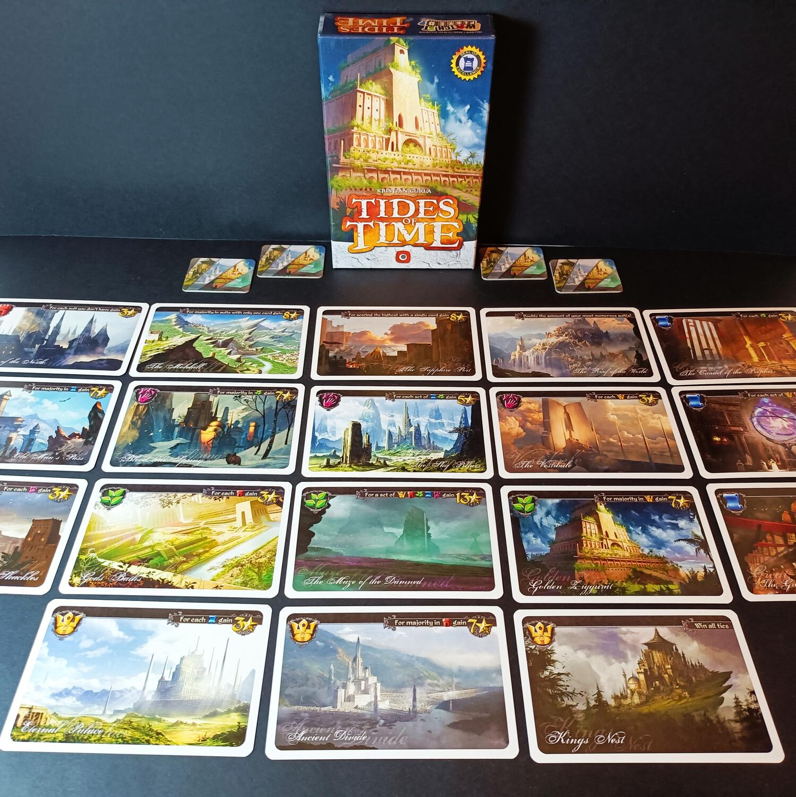
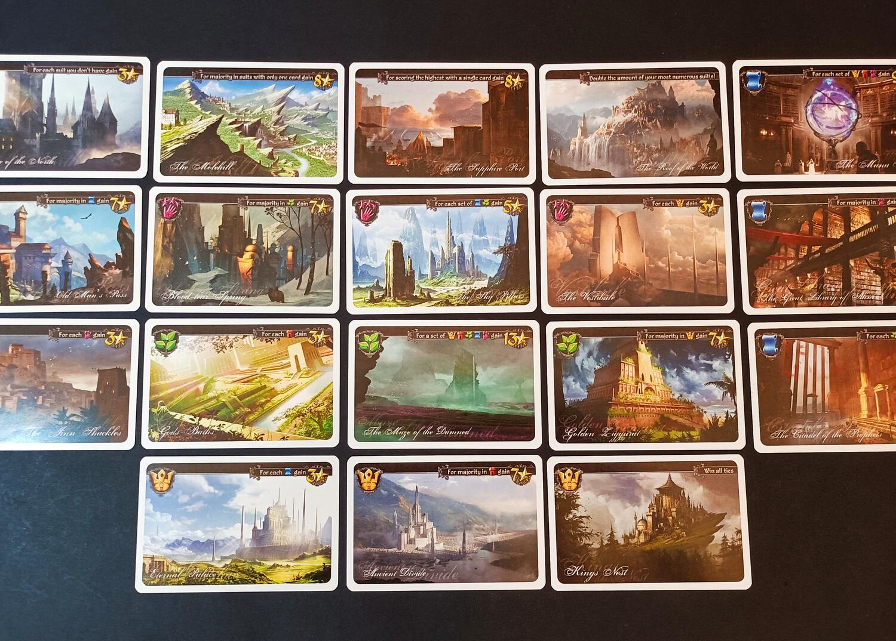

<Setting>

  Costruisci grandiosi monumenti, innalza impenetrabili fortificazioni e
  accumula vaste conoscenze con il passare dei secoli. Le più grandi civiltà
  lasceranno le loro tracce per molto tempo dopo il loro crollo, altre
  sorgeranno e cadranno a seconda delle correnti del tempo. Solo tu potrai
  decidere il destino del tuo regno.

</Setting>

<Rules>

  Tides of time è un gioco competitivo in cui dovrete costruire era dopo era
  maestosi monumenti che, combinati tra loro, vi permetteranno di ottenere più
  punti vittoria. Per iniziare distribuite 2 segnalini Reliquia ad ogni
  giocatore insieme alle prime 5 carte Regno; a questo punto, il primo Round può
  avere inizio. Ogni Round inizia con una fase di draft: ogni giocatore sceglie
  una carta Regno tra quelle in mano, la pone di fronte a sè, costruendola, e
  passa le restanti all'avversario. Quando i giocatori hanno terminato e
  costruito 5 carte Regno, il Round termina e si contano i punti Vittoria. La
  maggior parte delle carte Regno, in Tides of time, permette di guadagnare
  punti Vittoria in maniera differente e in base alle altre carte Regno che
  possedete; altre, invece, permettono di modificare le regole del gioco a
  vostro vantaggio. Una volta terminato il draft delle carte Regno, i giocatori
  contano e segnano i punti Vittoria ottenuti. A questo punto ogni giocatore
  sceglie una carta Regno da tenere, posizionando uno dei simboli Reliquia su di
  essa; questa carta farà parte del suo Regno fino alla fine della partita. Poi,
  ne sceglierà un'altra da scartare, che non verrà più usata nel corso della
  partita. Infine, ogni giocatore riprenderà in mano le restanti 3 carte Regno,
  ne pescherà 2, arrivando nuovamente a 5 carte. A questo punto, un nuovo Round
  potrà avere inizio, svolgendo nuovamente il draft, e poi il conteggio dei
  punti per altri due Round.

</Rules>

<Feedback>

  Tides of time è un gioco da tavolo simpatico, rapido, veloce da spiegare e da
  intavolare, oltre che profondo dal punto di vista strategico. Per portarvi a
  casa la vittoria dovrete tenere presenti molte variabili, cercando le carte
  migliori da tenere per voi e provando ad ostacolare allo stesso tempo
  l'avversario. Le strategie sono numerose e la rigiocabilità, pur con la
  presenza così ridotta di componenti, è abbastanza elevata. L'art di Tides of
  time è davvero ben fatta: vi fermerete più volte ad ammirare le splendide
  illustrazioni delle carte realizzate da Rafal Szyma. Tides of time è stata una
  piccola sorpresa, grazie al suo prezzo davvero contenuto: non ci ho pensato
  due volte ad aggiungerlo alla mia collezione, quindi non fatevelo sfuggire
  neanche voi!

</Feedback>

