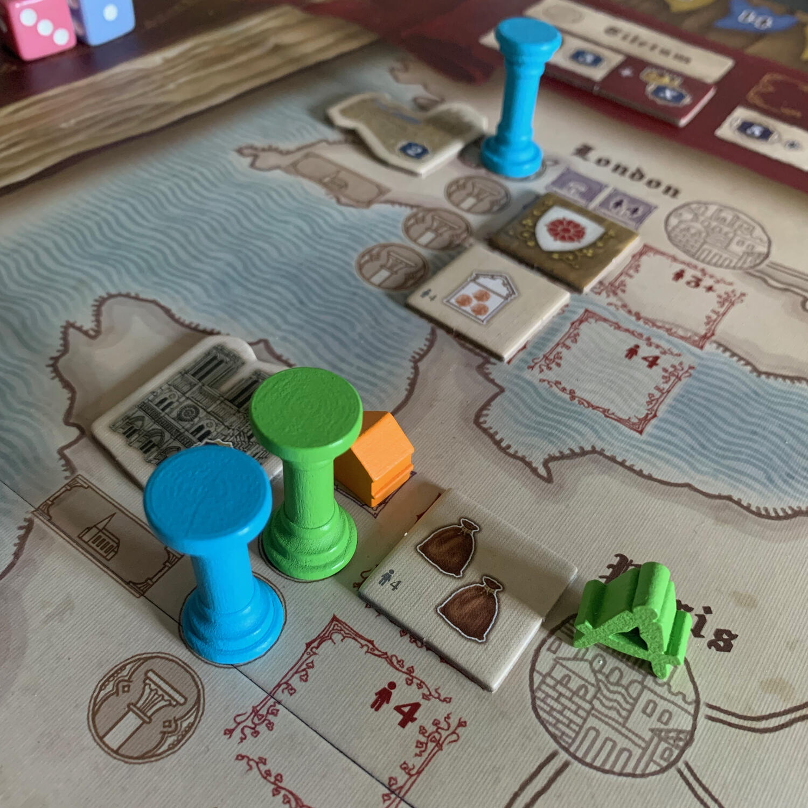
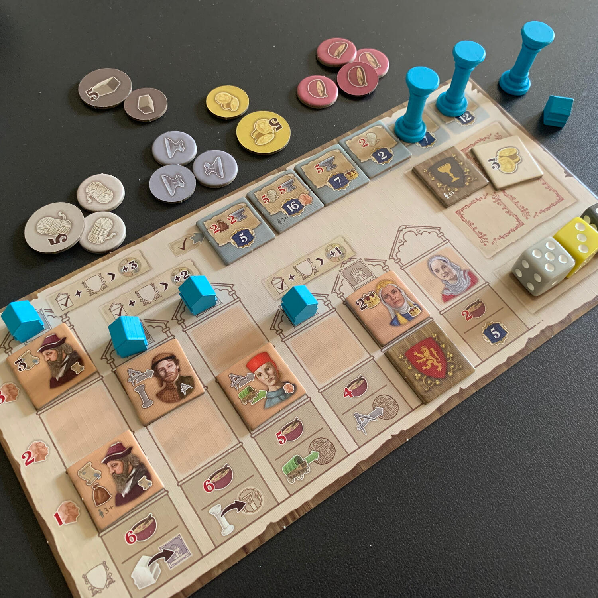

<Setting>

  Tiletum è ambientato nel Primo Rinascimento. Vestirai i panni di un{" "}
  <strong>ricco mercante</strong> che viaggia attraverso l'Europa dalla città di
  Tiletum (<strong>Tielt, Belgio</strong>) a Venezia.
   
  Visiterai numerose città per stipulare contratti commerciali per lana e ferro
  e per stabilire postazioni commerciali. Dovrai accumulare le risorse richieste
  per adempiere ai contratti, investire nella costruzione di cattedrali
  monumentali, ottenere il favore delle famiglie nobili e partecipare a fiere
  importanti, nelle quali i tuoi affari principali avranno luogo. Sarai inoltre
  aiutato da <strong>personaggi illustri</strong> che verranno accolti nelle tue
  case. Otterrai così il prestigio che ti renderà il mercante più famoso del
  Primo Rinascimento.

</Setting>

<Rules>

  Prima di spiegare le regole del gioco, soffermiamoci sulla novità introdotta
  da questo titolo: <strong>la ruota dei dadi</strong>. In Tiletum ogni dado
  indica contemporaneamente due fattori: il colore è la tipologia di risorsa
  (giallo: oro, rosa: cibo, …) ed il numero si traduce in quantità (in altre
  parole un 5 giallo rappresenta 5 unità di oro). Ad ogni inizio turno, una
  certa quantità di dadi verrà lanciata e posizionata sulla ruota,
  raggruppandoli per numero: gli uno con gli uno, i due con i due… La ruota,
  oltre a ordinare i dadi, è suddivisa in sei sezioni, ciascuna delle quali
  corrisponde un'azione e un numero di dado. Ad esempio possiamo avere l'azione
  "Architetto" collegata ai dadi con valore 2. Quando un giocatore andrà a
  selezionare un dado, sceglierà anche la rispettiva azione, ma con forza{" "}
  <strong>inversamente proporzionale</strong> alla quantità di risorse che
  otterrà: il 5 giallo sull'azione Architetto ci permetterà, sì, di ricevere 5
  oro, ma ci farà svolgere solamente 2 azioni come architetto (la quantità delle
  azioni possibili viene determinata sottraendo da 7 il valore del dado
  ottenuto).  
  Una partita a Tiletum si gioca in <strong>4 turni</strong>, ognuno composto di{" "}
  <strong>5 fasi</strong>:
     
    <strong>Preparazione</strong>: si estraggono a caso i dadi che verranno utilizzati nel turno corrente, si lanciano e si posizionano sulla ruota;
     
    <strong>Azioni</strong>: a turno, ogni giocatore prende un dado dalla
      ruota, ne raccoglie le rispettive risorse, ottiene eventuali tessere bonus
      e poi esegue l'azione collegata. Questo finché non vengono svolte 3 azioni
      per giocatore. In qualsiasi momento il giocatore può completare degli
      incarichi, come ad esempio scambiare oro per risorse oppure completare
      contratti. Le azioni sono sei:{" "}
      <ul>
        <li>          <strong>Architetto</strong>: spostare il meeple architetto, aggiungere
          colonne ad una cattedrale o prendere una tessera bonus dalla città in
          cui si trova questo meeple;{" "}</li>
        <li>          <strong>Mercante</strong>: spostare il meeple mercante, costruire una
          casa o prendere una tessera bonus dalla città in cui si trova questo
          meeple;{" "}</li>
        <li>          <strong>Personaggio</strong>: prendere una tessera personaggio,
          cambiare tutte le tessere personaggio disponibili e piazzare una
          tessera personaggio negli edifici sulla propria plancia;</li>
        <li>          <strong>Contratto</strong>: prendere una tessera contratto e scambiare
          risorse;</li>
        <li>          <strong>Re</strong>: avanzare nel tracciato del Re (vedi dopo);{" "}</li>
        <li>          <strong>Jolly</strong>: eseguire una delle 5 precedenti.</li>
      </ul>
     
    <strong>Re</strong>: Il tracciato del Re indica quanti punti si faranno (o
      si perderanno) nel turno in corso e chi sarà il primo giocatore nel turno
      successivo.
     
     <strong>Fiera</strong>: in ognuno dei 4 turni, si otterranno punti in modo
      diverso a seconda della fiera che si sta svolgendo. Per prendere parte a
      una fiera è necessario che il meeple mercante sia nella città dove questa
      fiera è in corso oppure che una casa sia stata precedentemente costruita.
      Si segnano i punti.
           <strong>Pulizia</strong>: ci si prepara per il prossimo turno.
  Al termine della partita, si sommano ai punti già collezionati quelli prodotti
  dalla quantità di colonne e case costruite, quelli provenienti dagli edifici
  popolati con i personaggi e si arrotonda con le risorse rimaste. Inutile dire
  che chi ha più punti è il vincitore.

</Rules>

<Feedback>

  Cosa?!? Tia recensisce anche giochi <strong>senza carte</strong>?!? Ogni tanto
  lo faccio.  
  Avete presente la sensazione che provate nell'incastrare <strong>    combo su combo</strong>, di trasformare un'azione a prima vista stupida in qualcosa di colossale
  e di sentirvi i <strong>re del mondo</strong>? Se la conoscete e vi piace, Tiletum
  fa per voi.  
  Il gioco gira senza troppi intoppi, tutto è chiaro, è un continuo{" "}
  <strong>tenere in equilibrio</strong> le risorse e le azioni, le une non hanno
  senso senza le altre… ma non si possono ottenere assieme (cioè non
  abbastanza)!
   
  Quello che vi chiede il gioco è di fare più punti degli altri giocatori, ma
  per farli bisogna andare alle fiere, completare contratti, guadagnare stima
  agli occhi de re, popolare i propri edifici con personaggi che vi faranno
  sentire il loro amore… e tutto questo toccando solamente{" "}
  <strong>12 dadi a partita</strong>. Facile no?  
  Ed è qui che entrano in gioco le combo. Ad esempio, posizionando un personaggio
  in un'abitazione, questo vi darà, un'azione architetto con la quale prendere la
  tessera nella città in cui è il vostro meeple per ricevere 3 risorse di lana, con
  la quale completare un contratto che oltre a darvi 7 punti vittoria, vi darà anche
  la possibilità di muovervi sulla mappa con il mercante. Questo è Tiletum… se siete
  bravi.  
  Parlando di difetti, il <strong>setup è molto lento</strong> e noioso
  soprattutto se giocate sempre con un numero di giocatori sempre diverso (nel
  mio caso ho provato il gioco con 2, 3 e 4 giocatori) e quindi bisogna passare
  in rassegna tutte le tessere personaggio, contratto ecc e dividerle a seconda
  del numero di giocatori (con un paio di ziplock passa la paura).  
  Ma una volta preparato è un gioco che si <strong>spiega in 15 minuti</strong>,
  che offre molta profondità e che garantisce una certa libertà nel perseguire le
  proprie strategie: ad esempio, spendendo due oro è possibile aumentare / diminuire
  di 1 un dado sulla ruota subito prima di scegliere l'azione, e quindi eseguirne
  una diversa da quella decisa dal caso.  
  Non consiglierei di giocarlo con gente "meno skillata" in questo genere di
  giochi, in quanto risulta frustrante che un giocatore riesca sempre a fare
  tutto con stile mentre l'altro arranca, come può succedere nel bellissimo{" "}
  <Link to="/reviews/sulle-tracce-di-marco-polo/">Marco Polo</Link> degli stessi
  autori.  
  Un altro punto (per quanto mi riguarda) negativo è la resa del <strong>    tema</strong>, <strong>arido e algido</strong>, non si sente minimamente… ma non si
  può avere tutto, no?  
  Per concludere, Tiletum è una figata se vi piacciono le combo e vivere i dadi
  senza l'ansia di doverli tirare.

</Feedback>

