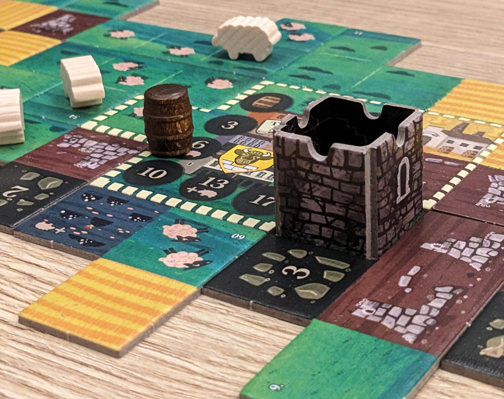
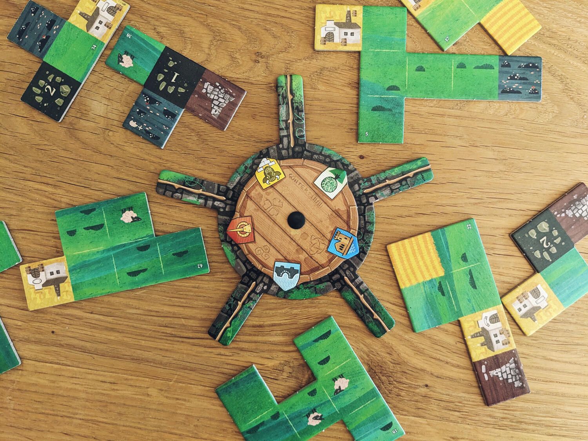
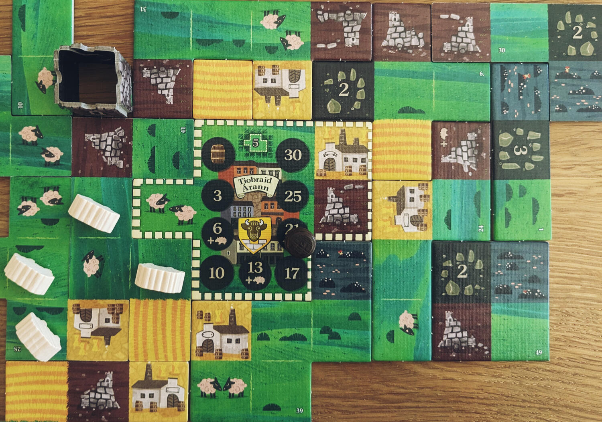

<Setting>

  Con Tipperary vi ritroverete in <strong>Irlanda</strong>, più precisamente
  nella deliziosa contea che porta lo stesso nome del gioco. Qui costruirete il
  vostro appezzamento di terra attorno alla vostra base ed{" "}
  <strong>espanderete il vostro bellissimo paesaggio</strong>. Svilupperete la
  vostra <strong>distilleria</strong> di buon whisky e lo farete invecchiare
  sempre di più; <strong>alleverete pecore</strong>, costruirete per loro nuovi
  e pascoli, e frattanto scoprirete{" "}
  <strong>antiche torri medievali e mistici cerchi di pietre</strong>. Chi
  realizzerà il miglior paesaggio irlandese?

</Setting>

<Rules>

  Il gioco consiste principalmente in una <strong>ruota</strong> che gira al
  centro del tavolo, attorno alla quale sono disposti 5 gruppi di coppie di
  tessere. Ogni giocatore ha uno stendardo associato alla propria tessera
  iniziale, anche questo posizionato sulla ruota. Ogni volta che la ruota gira,
  ogni stendardo finirà per indicare un gruppo di 2 pezzi di{" "}
  <strong>polimino</strong> tra cui ogni giocatore dovrà scegliere.
   
  Contemporaneamente, tutti i giocatori prenderanno uno di questi due pezzi e lo{" "}
  <strong>posizioneranno per espandere la propria campagna</strong>.
  Successivamente, la ruota si riempirà nuovamente di tessere, pronta per essere
  girata nuovamente nel turno successivo. Il gioco dura 12 round (10 se si gioca
  con 5 persone), quindi bisognerà scegliere con attenzione quali polimini
  collocare.
   
  Ci sono molte condizioni che devono essere tenute in considerazione ai fini
  del punteggio finale, e{" "}
  <strong>molti paesaggi diversi che forniranno vari bonus di gioco</strong>.
  Ogni pezzo è formato da diverse quantità di quadrati, e ognuno di questi ha un
  effetto specifico:
  <ul>
    <li>      I quadrati gialli rappresentano la distilleria di whisky e i campi
      coltivati. Quando si collegherà una coppia composta da 1 distilleria e 1
      campo coltivato, si avanzerà sul proprio tracciato del whisky. Più si
      avanza, più punti si ottengono alla fine del gioco.</li>
    <li>      I campi verdi rappresentano i pascoli per le pecore. Ai fini del
      punteggio, verrà preso in considerazione solo il gregge più grande di
      pecore adiacenti, che garantirà un punto per ciascuna di queste. Inoltre,
      alla fine del gioco, al giocatore con il gregge più grande verranno
      assegnati cinque punti extra.</li>
    <li>      I quadrati marroni rappresentano le rovine medievali che verranno trovate
      esplorando i dintorni di Tipperary. Collegando tre diverse rovine in linea
      retta (orizzontalmente o verticalmente) si avrà accesso a una torre che
      verrà posizionata alla fine della partita per occupare un buco nel proprio
      tableau. Un altro modo per riempire gli spazi può essere quello di
      associare quadrati blu scuro, che rappresentano paludi magiche che
      garantiscono un quadrato 1x1 extra.</li>
    <li>      Infine, ci sono i quadrati neri, ovvero cerchi di pietra che danno punti
      immediatamente.</li>
  </ul>
  Una grande quantità di punti a fine gioco deriverà dalla creazione di un'area
  rettangolare quanto più ampia possibile (senza buchi). Ciò garantirà un numero
  di punti pari alla sua area (altezza moltiplicata per lunghezza). È qui che le
  torri accumulate durante il gioco torneranno utili, poiché permetteranno ai
  giocatori di colmare gli spazi vuoti e di completare qualsiasi area prima di
  segnare il punteggio.
   
  Alla fine del gioco chi avrà il punteggio più alto vincerà la partita!

</Rules>

<Feedback>

  Tipperary si presenta come un <strong>gioco leggero</strong> di posizionamento
  tessere{" "}
  <strong>adatto a tutta la famiglia e a tutti i tipi di giocatori</strong>,
  esperti e neofiti. Lo <strong>svolgimento</strong> del gioco è{" "}
  <strong>fluido</strong> e le <strong>regole</strong> sono{" "}
  <strong>chiare</strong>, il che lo rende un piacere da spiegare e da
  intavolare. Tipperary può essere predisposto in 2 minuti ed essere riposto
  nella scatola in altrettanto tempo. Inoltre, la natura simultanea del gameplay{" "}
  <strong>elimina tutti i tempi di inattività</strong>. 
  Ma perché è fantastico sia per i giocatori esperti che per i nuovi giocatori? Ciò
  che lo rende perfetto per entrambi i gruppi è paradossalmente lo stesso motivo:
  la ruota centrale. In particolare, mi riferisco all'<strong>    imprevedibilità legata al giro della ruota</strong>, che decide tra quali due tessere scegliere. Ciò <strong>    restringe le possibilità di questa scelta</strong>, rendendola da una parte meno opprimente per i nuovi giocatori, ma dall’altra
  più impegnativa per i giocatori esperti, che dovranno trarre il meglio dalla poca
  scelta che viene loro fornita (che di solito non è mai quella che si sperava…).
   
  Altro elemento che rende questo gioco leggero, ma non banale, è l’importanza in
  termini di punti della <strong>creazione dell'area rettangolare</strong>, in quanto
  a volte bisognerà trovare il giusto equilibrio tra l’abbinamento di due tessere
  per il bonus da esse fornito e la creazione di un rettangolo abbastanza grande
  senza vuoti dalla forma strana. <strong>    La gestione ponderata di questi due elementi è ciò che fa brillare questo
    gioco</strong>. 
  Insomma, un gran bel disegno da parte di Lookout Games!

</Feedback>

