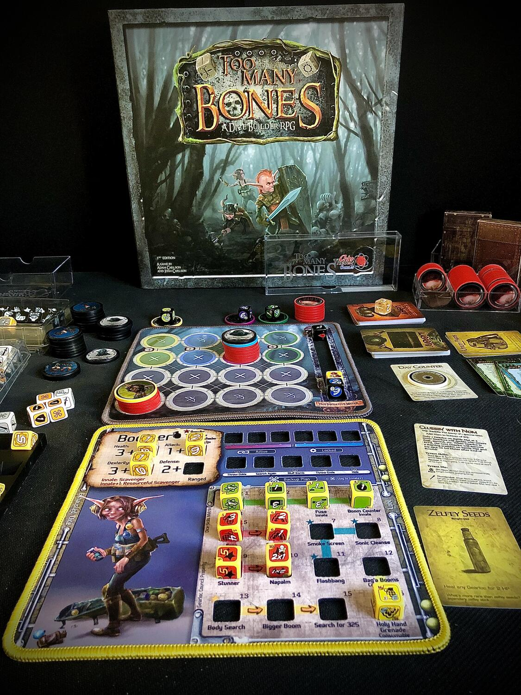

<Setting>

  Tra le mura di Obendar, nelle regioni di Daelore esiste una razza alquanto strana: i Gearlock. I giocatori
  impersoneranno un gruppo di avventurieri appartenenti a questa razza con una missione speciale: affrontare e
  sconfiggere i Tiranni che minacciano la loro sopravvivenza… Uno alla volta...

</Setting>

<Rules>

  All'inizio di ogni avventura i giocatori (da 1 a 4) dovranno scegliere quale nemico affrontare e da questa scelta
  dipenderanno non solo la durata della partita ma anche il tipo di nemici che si andrà ad affrontare e alcuni eventi
  particolari che si interporranno tra i Gearlock e l'eliminazione del loro nemico.  
  Sono proprio gli incontri il motore del gioco di Too many bones: essi potranno essere narrativi o di combattimenti contro
  gli scagnozzi del Tiranno, fino ad arrivare al confronto finale con lo stesso.  
  Gli scontri avverranno su una mappa divisa per zone, in cui sia i nemici che i Gearlocks si muoveranno, lanceranno
  dadi d'attacco e di difesa e utilizzeranno delle pericolose abilità per incasinare ancora di più la situazione.  
  Al termine del combattimento ci sarà poi la possibilità di guadagnare loot o accrescere le proprie abilità in modo da essere
  sempre più preparati ad affrontare le difficoltà e, prima o poi, il terribile Tiranno...

</Rules>

<Feedback>

  Too many bones è un bellissimo gioco non per tutti. Per quanto mi piacerebbe passare ore ad elencarne solo i pregi, mi
  tocca far finta di essere un po' oggettivo. Innanzitutto è molto tattico, quindi già questo può far storcere il naso a
  molti giocatori. L'art poi è orribile, non nel senso che è disegnata male, ma per la scelta voluta dei soggetti brutti
  essendo i Gearlock di fatto una razza che risulta essere visivamente un po' goblin, un po' halfling. I materiali, in
  compenso, sono fantastici: la Chip Theory Games colpisce ancora una volta grazie alla cura e alla qualità superba.
  Torniamo però al gioco in sé che, inutile dirlo, è bello. Eppure più passeranno le partite più vi sembrerà che duri
  troppo, che ci siano poche scelte davvero ottimali da fare durante il potenziamento dei personaggi e che alle volte
  una sconfitta prematura in uno scontro può portare quasi automaticamente al fallimento della missione. Questi sono
  sicuramente i lati negativi, ma TMB è anche altro. È emozione, è un'avventura che si evolve giorno per giorno. Un tiro
  di dado andato bene, una build strana, una serie di scontri spesso decisi all'ultimo turno. Un tiro di dado che si
  risolve in un fallimento per il nemico o per i giocatori. É un'esperienza particolare che se affrontata nel modo
  giusto può dare moltissime soddisfazioni! Quindi, se tutto questo può essere di vostro gradimento, TMB è il gioco per
  voi!

</Feedback>

