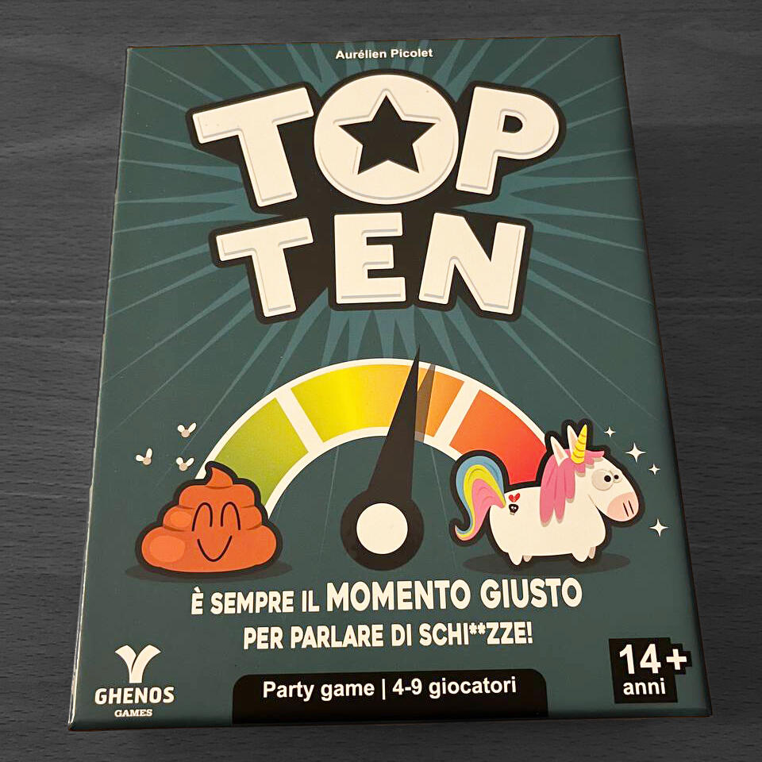
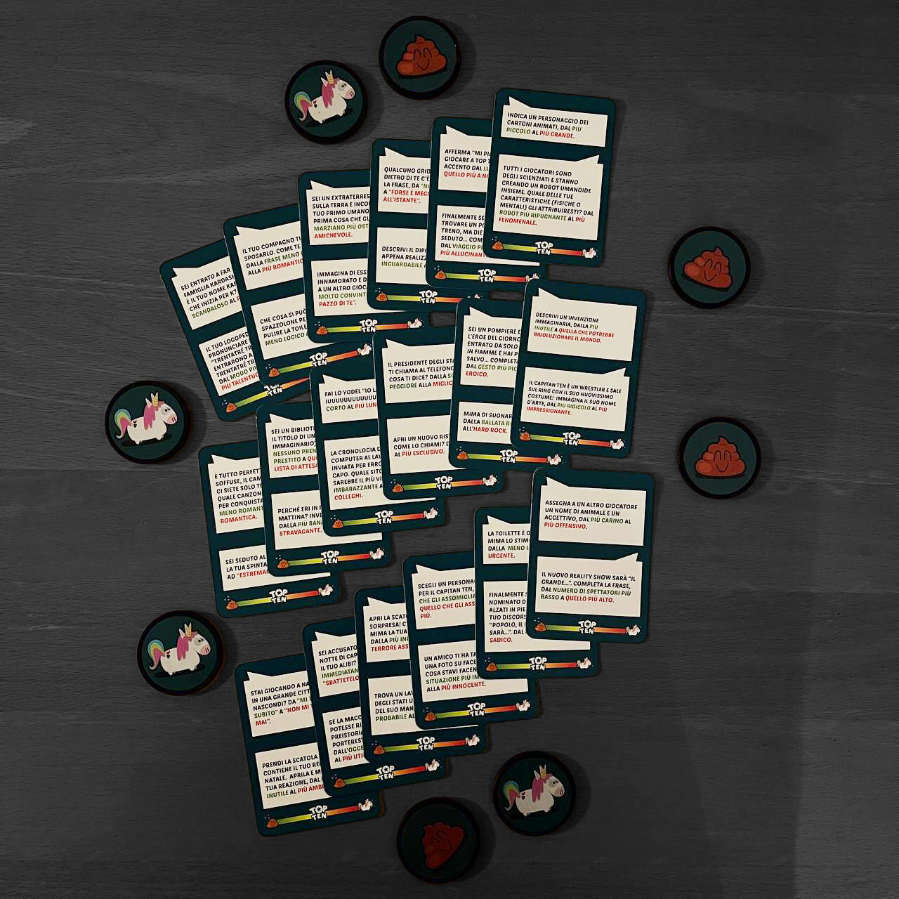

<Setting>

  Se ve lo state chiedendo la risposta è no, top ten non è un gioco di
  classifiche. L'unica cosa che potrete classificare è il livello di scemaggine
  dei vostri amici, da 1 a 10!
   
  L'altro aspetto da non sottovalutare assolutamente è il fatto che i vostri
  amici “scemi” non vogliano riempire il vostro tavolo da gioco di cacca di
  unicorno, vero? Sono ben meglio gli unicorni, ve lo assicuro!

</Setting>

<Rules>

  Una partita di top ten è pensata per essere caciarona e il più “efficace”
  possibile. Il gioco è diviso in 5 round, in ognuno dei quali un giocatore sarà
  anche il <strong>Cap'ten</strong> (non dite nulla, vi prego) che dovrà
  indovinare la scala giusta per il round in corso. Infatti prima del round di
  gioco vero e proprio verrà pescata una carta tema, composta da due argomenti.
  Questi, a loro volta, sono formati da due opzioni che stabiliscono la forbice
  minima e massima delle caratteristiche su cui si giocherà il round, secondo
  l'argomento scelto dal Cap'ten . Ad esempio nomi di blog di giochi da tavolo
  dal <em>meno bello</em> al <strong>più bello</strong>, una scala che i
  giocatori dovranno interpretare a seconda del numero segreto da 1 a 10, che
  verrà loro assegnato ad inizio round.
   I giocatori, a turno, dovranno dare la loro interpretazione di intensità
  a voce alta a seconda del loro numero. Una volta che si avrà la panoramica completa,
  il Cap'ten dovrà poi, a seconda delle risposte dei suoi giocatori, ordinare le
  persone dal meno “intenso” al più “intenso” e ad ogni errore … <strong>    POOP</strong> ! Il gruppo si ritroverà una cacca di unicorno. Dopo che ogni unicorno
  disponibile sarà andato di corpo, i giocatori avranno perso la partita. Se i giocatori
  sopravvivono 5 round avranno vinto la partita. <strong>    Vi ho già detto che Top ten è un coop vero</strong>?

</Rules>

<Feedback>

  Top ten è un gioco strano. Si capisce perché sia candidato allo Spiel des
  Jahres 2022. É un gioco semplice, veloce e che saprà divertire i palati di
  tutti i giocatori. Infatti, pur essendo un party game cooperativo, è un gioco
  che ha persino una strategia… se così si può chiamare e se proprio va cercata!
  A seconda delle decisioni del gruppo e soprattutto del Cap'ten i giocatori
  potranno dosare il rischio o meno, qualcuno ha detto{" "}
  <Link to="/mechanisms/push-your-luck/">Push your luck</Link>?
   
  Che dire, Top ten saprà sicuramente stupire se glielo lascerete fare, l'unico
  prezzo, a parte la casa piena di cacca di unicorno, è che il vostro gruppo di
  gioco sia ben predisposto ai party game! Infatti, come tutti i giochi sui
  generis, se il gruppo non è abbastanza “portato” all'esperienza di gioco, lo
  stesso potrebbe risultare noioso.
   
  <strong>Non è il vostro caso però, giusto?</strong>

</Feedback>

