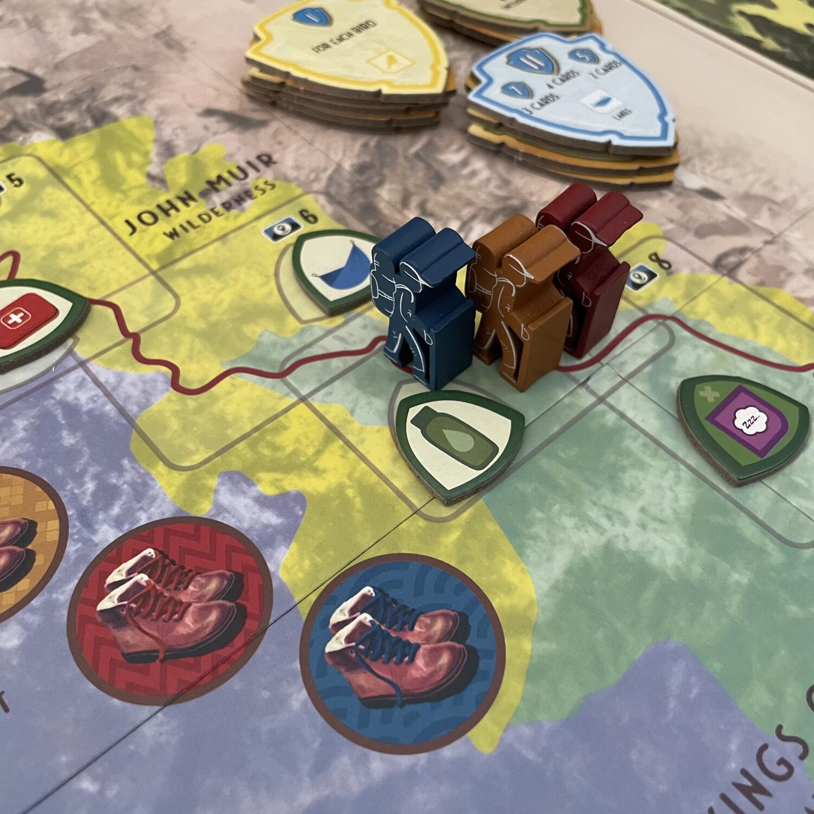

<Setting>

  Partite per un viaggio di <strong>esplorazione</strong> alla scoperta del
  leggendario <strong>sentiero di John Muir</strong>, tra i magici paesaggi
  montani della Sierra Nevada e della California. Esplorate la{" "}
  <strong>maestà lussureggiante</strong> di <strong>luoghi incantevoli</strong>,
  in un <strong>pittoresco miscuglio di paesaggi</strong>. Scalate le vette del
  parco di Yosemite e di quello di Sequoia. Visitate siti di interesse
  straordinario, rinfrescandovi nel King’s River. Ma attenzione a non restare
  troppo indietro sul sentiero: <strong>il tempo stringe</strong> e siete in
  corsa con altri escursionisti per arrivare al Whitney Portal!

</Setting>

<Rules>

  I giocatori hanno <strong>12 turni</strong> per percorrere il Sentiero e solo
  chi avrà raggiunto la sezione 10 a fine partita potrà concorrere per la
  vittoria.
   
  Un turno si divide in <strong>tre fasi</strong>: <strong>Alba</strong>,{" "}
  <strong>Giorno</strong> e <strong>Tramonto</strong>. 
  Durante l’<strong>Alba</strong>, si pesca un Token Meteo, che, oltre a marcare
  il turno in corso, influenzerà i costi di spostamento dei giocatori lungo il Sentiero.
  Quindi, viene pescata una Carta Sentiero e se ne gioca una dalla propria mano iniziale
  di 3. Le Carte Sentiero, verdi e rosse (queste ultime richiedono prerequisiti per
  poter essere giocate), consentono di ricevere dei benefici. Si può giocare una
  Carta Sentiero di qualunque tipo in cambio di 1 Acqua, ma rinunciando a ricevere
  altri benefici.
   
  Durante il <strong>Giorno</strong>, i giocatori piazzano in senso orario uno dei
  loro Token Traccia (leggi: i lavoratori) per svolgere un’azione sulla plancia comune,
  finché tutti i Token non sono stati piazzati e le relative azioni non sono state
  risolte. È possibile ottenere nel corso della partita fino ad altri 2 Token Traccia,
  oltre ai 3 iniziali, attraverso il Registro di Altitudine.
   
  Le <strong>azioni</strong> che si possono svolgere sono le seguenti:
  <ul>
    <li>      <strong>Fare un’Escursione</strong>: attraversare una delle 10 sezioni del
      sentiero, al costo delle Risorse Personali o Naturali indicate dal Mazzo
      Mappa individuale, da eventuali Marcatori JMT sul percorso comune e dal
      Meteo giornaliero. Eventuali Attrezzi raffigurati nei Marcatori devono già
      essere attivi nello Zaino del giocatore. I giocatori possono in ogni caso
      avanzare lungo il Sentiero, ma per ogni requisito non soddisfatto
      otterranno un Token Avversità.</li>
    <li>      <strong>Ottenere Risorse Naturali</strong>: Acqua, Terra, Vento e Fuoco,
      nel numero indicato, vengono conservati sulla plancia personale, fino a un
      massimo di 12 complessivamente.</li>
    <li>      <strong>Scoprire Carte Guida</strong>: collezionare vari set dei 5 tipi
      (Animali selvatici, Uccelli, Alberi, Fiori e Fiumi) che daranno punti
      vittoria e vari bonus.</li>
    <li>      <strong>Esplorare Carte Destinazione</strong>: siti di interesse di 4 tipi
      (Picchi e Passi, Pascoli e Valli, Laghi, Cascate e altre Peculiarità), che
      sbloccano Bonus di Esplorazione sulla plancia personale e danno punti
      vittoria.</li>
    <li>      <strong>Rifornirsi </strong>presso lo chalet dell’High Sierra: collocare
      sulla propria plancia le Risorse Personali indicate fino al massimo
      consentito o rimuovere Token Avversità.</li>
    <li>      <strong>Elevare</strong>: avanzare sul Registro di Altitudine
      (fondamentale per sbloccare Token Traccia e ottenere i Bonus Viaggio a
      Punta di Freccia), ogni volta che si ottiene un Attrezzo già presente nel
      proprio Zaino.</li>
    <li>      <strong>Passo Montano</strong>: pescare due Carte Sentiero e giocarne
      altrettante dalla mano, senza ottenere benefici dagli Attrezzi dello Zaino
      da Escursione, ma in compenso guadagnando i benefici da una carta rossa,
      come se fosse verde.</li>
    <li>      <strong>Prime Luci dell’Alba</strong>: ottenere il relativo Medaglione e
      l’Acqua accumulata su di esso, che darà diritto a ricevere il gettone
      primo giocatore (il Medaglione Trailblazer) durante il Tramonto.</li>
  </ul>
  Nell’ultima fase (appunto, il <strong>Tramonto</strong>), i giocatori consumano
  un Cibo e una Bottiglia d’Acqua / 2 Risorse Naturali Acqua, ricevendo un Token
  Avversità per ogni requisito non soddisfatto; recuperano i Token Traccia; rimpinguano
  il tracciato delle Carte Guida, eliminando la carta sullo spazio più a sinistra
  e facendo scorrere le altre; restituiscono il Medaglione Prime Luci, se preso,
  e aggiungono su di esso 1 Risorsa Naturale Acqua, ottenendo in cambio il Medaglione
  Trailblazer (Primo Giocatore); se nessuno possiede il Medaglione Prime Luci, si
  passa in senso orario il Medaglione Trailblazer.
   
  <strong>Alla fine del Turno 12</strong>, dopo la consumazione di cibo e acqua,
  si saltano le fasi restanti del Tramonto per procedere direttamente al conteggio
  finale dei punti vittoria (da cui, si diceva, sono esclusi i giocatori che non
  hanno raggiunto la sezione 10 del sentiero), sottraendo punti in base a quanti
  Token Avversità si possiedono, assegnandone per ogni Medaglione non utilizzato,
  per ogni set di Carte Guida, per i Bonus a Punta di Freccia ottenuti e per la Punta
  di Freccia Dorata.

</Rules>

<Feedback>

  La prima impressione con <em>Trailblazer: The John Muir Trail</em> (da non
  confondere con il gioco quasi omonimo <a href="https://boardgamegeek.com/boardgame/352454/trailblazers" target="_blank">Trailblazers</a>{" "}è <strong>estremamente positiva</strong>: mentre si fa l’unboxing si sentono
  l’<strong>enfasi naturalistica </strong>e l’attenzione al tema poste nel
  titolo, con richiami a tutto un genere in espansione, che con titoli come{" "}
  <Link to="/reviews/wingspan/">Wingspan</Link>,{" "}
  <Link to="/reviews/parks/">Parks</Link> e{" "}
  <Link to="/reviews/cascadia/">Cascadia</Link> fa dell’
  <strong>amore per la natura</strong> il suo punto di forza. Si percepisce bene
  che chi ha messo in piedi questo progetto conosceva a fondo l’ambiente e la pratica
  che voleva descrivere e ha fatto di tutto per riportare quell’atmosfera sul tabellone
  di gioco.
   
  <strong>Ma</strong>: nonostante l’evocatività dell’artwork, e nonostante il tema
  coinvolgente e peculiare, <strong>    il sistema di gioco è più forte e tende ad imporsi sull’ambientazione</strong>. Beninteso, la rapida successione di azioni e l’ansia di raggiungere
  alcuni obiettivi per primi rimandano sicuramente all'idea di un hiking intensivo,
  in cui <strong>    diversi team di escursionisti si sfidano a chi fa il percorso più lungo nel
    tempo più breve</strong>. Tuttavia, malgrado la bellezza davvero iconica delle immagini,
  difficilmente guarderete più di pochi secondi ogni carta, soprattutto se i
  giocatori al tavolo sono esperti. E questa è (forse) una differenza rispetto a
  giochi come Wingspan, di cui si è detto che ha un’ambientazione poco
  coinvolgente, ma il cui sistema di fatto impone di indugiare nella lettura
  delle carte più a lungo, facendo così godere ai giocatori ogni immagine, di
  cui viene voglia di approfondire le peculiarità naturalistiche.{" "}
  <em>Trailblazer: The John Muir Trail</em>, invece,{" "}
  <strong>ci fa correre verso la meta</strong>, imponendoci inevitabilmente di
  trascurare un po’ il contesto (il che è bizzarro, vista la cura che è stata
  riposta nella trasposizione ludica di questo specifico itinerario di hiking).
  Vi ritroverete a trascurare completamente il meraviglioso artwork perché
  mirate come falchi a prendere il vostro quinto Token Traccia, o perché siete
  in lotta per un primato, o perché siete semplicemente poco accattivati dallo
  splendido artwork di questo titolo.
   
  <strong>Un’altra forzatura</strong>, in cui il sistema di gioco si impone
  sulla linearità dell’ambientazione, è{" "}
  <strong>il modo in cui si ottengono gli attrezzi nello zaino</strong>: più
  proseguiamo lungo il sentiero… e più ne otteniamo? Forse un po’
  controintuitivo, per quanto il meccanismo funzioni ugualmente e bene.
   
  Fatti salvi questi elementi, che possono lasciare perplessi alcuni, a conti
  fatti <em>Trailblazer: The John Muir Trail</em> è{" "}
  <strong>un bell’eurogame</strong>, <strong>intenso</strong> e{" "}
  <strong>soddisfacente</strong>: di certo,{" "}
  <strong>non uno tra i più leggeri</strong>! Se vi aspettate un gioco
  rilassante, dove non dovrete impegnarvi a fare calcoli, a porre attenzione
  alle mosse avversarie o a precedere gli altri nella selezione di azioni
  cruciali, siete fuori strada. Se in 2 giocatori pestarsi i piedi è
  virtualmente possibile, ma poco cogente, in 3 o 4 può diventare addirittura
  frustrante. Preparatevi perciò a programmare attentamente le vostre mosse
  puntando a quelle in grado di innescare bonus a cascata, sbirciate le plance
  degli altri giocatori e correte a capofitto verso la meta!
   
  Le <strong>varianti</strong> e la <strong>modalità solitaria</strong>, in
  questo titolo come in altri, **più che un bonus dal valore intrinseco, sono
  ormai quasi una condizione imprescindibile, un “servizio” atteso **e{" "}
  <strong>non arricchiscono particolarmente l’esperienza di gioco</strong>.
  Bisogna invece valorizzare le due <strong>mini espansioni</strong> l’
  <strong>Orso Nero Americano</strong> e la <strong>Sialia </strong>(o Bluebird),
  insieme ai loro splendidi token, che offrono sfumature interessanti alle scelte
  degli escursionisti lungo il Sentiero e incrementano la longevità di un titolo
  che già si presenta molto ricco. Meno accattivanti, ma ugualmente meritevoli, le{" "}
  <strong>Carte Abilità</strong>, le <strong>Carte Missione</strong> e il <strong>    Pacco Mappe Difficile</strong>.
   
  Se, come me, amate gli eurogame medio peso, gradite il tema naturalistico e siete
  grandi estimatori dell’escursionismo (da tavolo!), non potete perdervi <em>    Trailblazer: The John Muir Trail</em> e, anzi, dovrete restare sintonizzati con noi, dato che in quest’ultima fase
  del 2023 <strong>sono attese espansioni</strong>. Perciò, non mancate: <strong>    l’Arizona Trail vi attende</strong>!

</Feedback>

