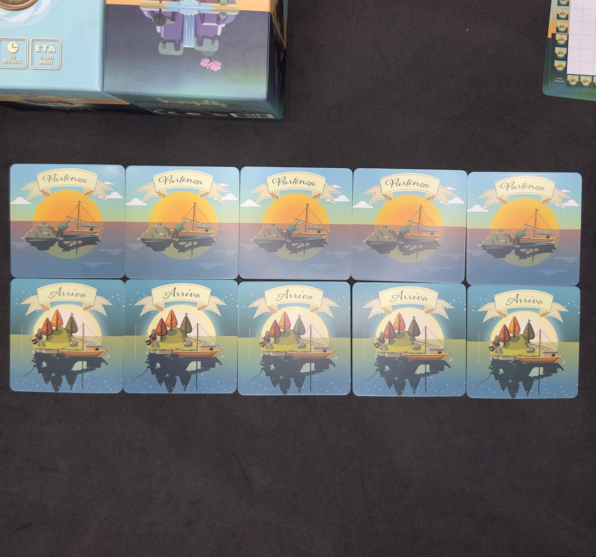
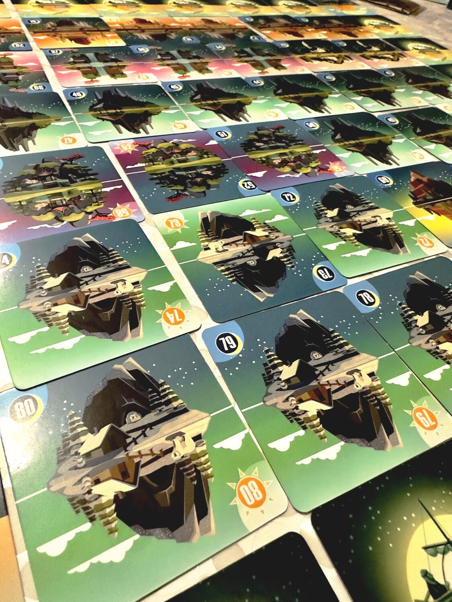
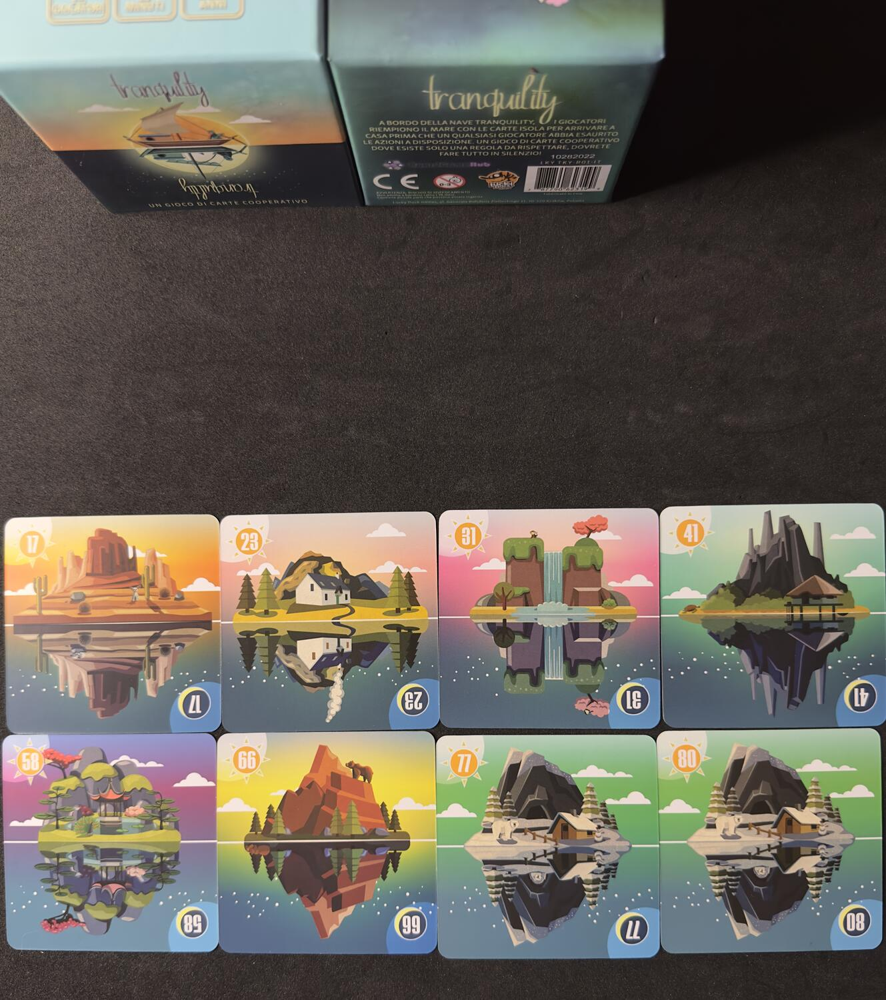

<Setting>

  Tranquility vi catapulterà in un viaggio alla scoperta della - appunto -
  tranquillità. Vi sembrerà di essere a bordo di una barca che salpa per una
  rotta ancora ignota.&nbsp;
   

</Setting>

<Rules>

  Il setup è rapido e semplice. Dopo aver disposto le 24 tessere iniziali per
  creare una griglia 6x6 vuota, dovrete mescolare le 80 carte isola numerate con
  le 5 carte arrivo e dividerle in un numero di mazzi pari al numero di
  giocatori. Dopodiché ogni giocatore pescherà 5 carte ed inserirà mescolando,
  nel suo mazzo, una carta “<strong>partenza</strong>”. Il gioco ha inizio, ma
  mi raccomando: in Tranquility <strong>non</strong> si parla!
   
  Nel vostro turno potrete svolgere una delle 2 seguenti azioni:
  <ul>
    <li>      Giocare una carta: potete giocare una carta all’interno della griglia 6x6 seguendo l’ordine crescente (spoiler: completare la griglia sarà parte del vostro obiettivo!); la carta potrà essere giocata in uno spazio completamente vuoto o adiacente ad un’altra carta, ma in quest’ultimo caso dovrete scartare un numero di carte dalla vostra mano pari alla differenza fra le due carte.</li>
    <li>      Scartare due carte.</li>
  </ul>
  Completata una di queste azioni, dovrete pescare dal vostro mazzo di pesca personale
  fino a tornare con 5 carte in mano.
   
  Carta <strong>Partenza</strong>: se all’inizio del proprio turno un giocatore
  dovesse avere in mano questa carta, sarà obbligato a giocarla. Una volta
  fatto, dovrete scartare un totale di <strong>8</strong> carte scegliendo tra
  voi e gli altri giocatori al tavolo: questo sarà l’unico momento in cui{" "}
  <strong>potrete</strong>parlare, senza dare indizi sulle carte che avete in
  mano, ma indicando quante carte siete disposti a scartare per partire;
  dopodiché chi ha scartato torna a 5 carte pescando dal proprio mazzo.
   
  Come vincere?
   
  Una volta completata la griglia di 36 carte isola - ricordate, in ordine crescente
  - e giocata la carta partenza, uno di voi, nel proprio turno, potrà giocare la
  carta “<strong>arrivo</strong>” che determinerà la fine della partita e la vittoria
  del gruppo.
   
  Tutto molto bello, ma si può perdere?
   
  Sì se nel proprio turno un giocatore non potesse giocare una carta, nel caso
  in cui abbia tutte carte impossibili da inserire nella griglia e/o non potesse
  scartare 2 carte dalla propria mano, allora si andrà incontro alla sconfitta
  di tutto l’equipaggio.

</Rules>

<Feedback>

  Tranquility appare come un gioco fresco e semplice, ma racchiude in sé un
  grande potenziale. Innanzitutto consiglio di provarlo in almeno 4, o
  addirittura 5; questo perché in 2 si hanno a disposizione 42/43 carte nel
  proprio mazzo e ci si sente più “sicuri” nello scartare carte, ma quando vi
  ritroverete a dover “sacrificare” carte dalla vostra mano, sapendo che
  andranno perse per tutta la durata della partita, vi posso garantire che il
  peso di queste scelte potrebbe farsi sentire, se non subito, sicuramente verso
  la fine della partita, quando il vostro mazzo di pesca inizierà a
  scarseggiare.&nbsp;
   
  L’impossibilità di parlare rende il tutto molto più complicato.
   
   
  Ho apprezzato moltissimo le varianti già inserite all’interno della scatola, la
  modalità competitiva 1 vs 1 e le varie mini espansioni che alzeranno l’asticella
  della difficoltà.&nbsp;
   
  Ed è proprio questo il bello di Tranquility: la varietà di difficoltà. Potrete
  scegliere di passare 15/20 minuti in relax con i vostri amici o sentirvi come veri
  marinai in mare aperto.&nbsp;
   
   
  Concludendo mi sento di dire che Tranquility rispetta la durata di un filler,
  ma con le sue espansioni è in grado di diventare un gran bel titolo con un
  buon mix di fortuna e strategia, anche un pizzico di cattiveria da parte del
  gioco, soprattutto quando vi ritroverete a pentirvi di aver scartato una carta
  che, verso fine partita, avrebbe potuto portarvi verso una destinazione{" "}
  <strong>tranquilla</strong>. 
  Un’ultima caratteristica che mi ha fatto innamorare di questo piccolo titolo è
  l’aspetto estetico. Le carte sono ben curate e dettagliate, i colori ed i disegni
  a tema sono un piacere per gli occhi; mi è capitato spesso di soffermarmi ad osservare
  le varie isole, raffigurate sia durante il giorno che di notte.

</Feedback>

