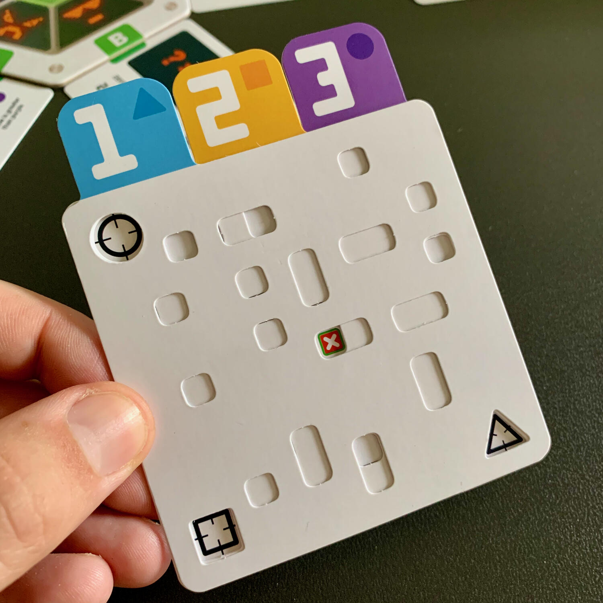
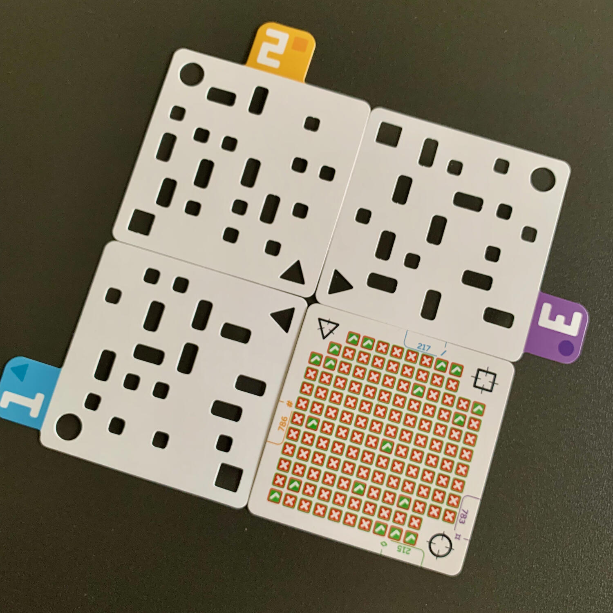

<Setting>

  In informatica, una <strong>macchina di Turing</strong> (o più brevemente MdT)
  è una macchina ideale che manipola i dati contenuti su un nastro di lunghezza
  potenzialmente infinita, secondo un insieme prefissato di regole ben definite.
  In altre parole, si tratta di un <strong>modello astratto</strong> che
  definisce una macchina in grado di eseguire algoritmi e dotata di un nastro
  potenzialmente infinito su cui può leggere e/o scrivere dei simboli.
   
  cit. <a href="https://it.wikipedia.org/wiki/Macchina_di_Turing" target="_blank">Macchina di Turing</a>.

</Setting>

<Rules>

  Il vostro obiettivo sarà quello di <strong>trovare l'unico codice</strong> in
  grado di superare con successo tutti i test di verifica. Il codice è composto
  di 3 cifre (unità, decine e centinaia), ognuna delle quali da 1 a 5. Ogni test
  di verifica controlla una sola regola (es: le decine sono dispari).
   
  Il primo giocatore a capire come incastrare tutte le regole assieme, vince!{" "}
   
  Ok, ma in parole semplici cosa vuol dire?
   A inizio turno,{" "}
  <strong>    dovrete creare un codice utilizzando le 3 schede perforate</strong>{" "}
  corrispondenti alle 3 cifre scelte. Quando queste schede vengono sovrapposte,
  tutti i fori tranne uno verranno chiusi. Utilizzate questo foro per verificare
  i vostri codici, sovrapponendolo con al massimo 3 test di verifica.
   I test di verifica mostrano una griglia di caselle con segni di successo
  o fallimento. Se un segno di successo appare attraverso il foro, <strong>    allora il codice soddisfa quella regola</strong>. Ciò non significa che tutto il codice sia corretto, ma indica che per
  quella regola, questo codice va bene. Ad esempio, un test potrebbe dire che le
  decine devono essere minori di 4 oppure che le unità sono pari o, ancora, che non
  sono presenti "5" nel codice.
   
  Più informazioni otterrete, più sarete in grado di affinare le vostre congetture
  e di avvicinarvi alla soluzione. Alla fine di ogni turno, dichiarerete se volete
  dare la soluzione e risolvere il problema (pollice su/giù). Se qualcuno risolve
  correttamente il problema, vince. Altrimenti, tutti i giocatori che hanno sbagliato
  vengono eliminati e il gioco continua.

</Rules>

<Feedback>

  Premetto che sono un programmatore e che da piccolo amavo mastermind: questo
  gioco è stupendo e irrinunciabile come un 25 aprile.  
  Se avete letto le regole e ci avete capito qualcosa, complimenti!  
  Turing machine è uno di quei giochi che è impossibile spiegare senza fare
  degli esempi, senza poter mostrare come le componenti interagiscono tra di
  loro oppure senza spiegare come prendere nota dei risultati. Avete mai giocato
  a <strong>Decrypto</strong>? Il feeling nel spiegarlo è esattamente lo stesso
  (forse perché stiamo parlando di un altro gioco di Le Scorpion Masqué?).
   
  La prima partita si fa fatica a capire come leggere le varie componenti ma,
  superata quella, tutto fila liscio come l'olio e si farà una partita dopo
  l'altra per vedere che livello si riesce a raggiungere. Sul regolamento sono
  presenti solamente <strong>20 problemi di difficoltà crescente</strong>, ma
  online, su <a href="https://www.turingmachine.info" target="_blank">https://www.turingmachine.info</a>, potete trovarne milioni e milioni.
   
  <strong>    Perché mi piace questo gioco? Per quello che ti dice senza dirti; per quello
    che ti permette di assumere; perché l'esercizio ti porta al miglioramento.</strong> Nel concreto, ci sono alcune configurazioni di regole che, ad un certo
  punto della partita, vi permettono di arrivare alla soluzione in un turno andando
  a tagliare un sacco di possibili soluzioni solo perché, seguendo la tana del bianconiglio,
  queste sono impossibili, per i più svariati motivi. Questo concetto è davvero difficile
  da spiegare a meno che non abbiate provato il gioco o a meno che non abbiate idea
  di cosa sia <strong>l'early return pattern</strong>. Questa inspiegabile piccolezza
  è la cosa che mi ha tenuto incollato per intere sere al gioco… Sì, avete intuito
  bene, in solo. Ho giocato principalmente questo gioco in solo perché, secondo me,
  è il modo migliore per goderselo, come una sessione di debugging divertente e rilassante.{" "}
   
  Certo, questo gioco non è privo di difetti, anzi.{" "}
  <strong>Il setup e il teardown sono lenti</strong>, bisogna cercare in tutte
  le tessere quelle corrispondenti ai numeri indicati dal problema e, quando si
  mette via, bisogna assolutamente riposizionarle in ordine, altrimenti la volta
  dopo…
   A parte questi difetti, Turing machine è una chicca. Guardate la scatola:
  vedete il verde? Quello è il manuale… <strong>Sì, la scatola è forata</strong>…
  devo dire altro?!?
   
  Se avete domande, scrivetemi pure ;)

</Feedback>

