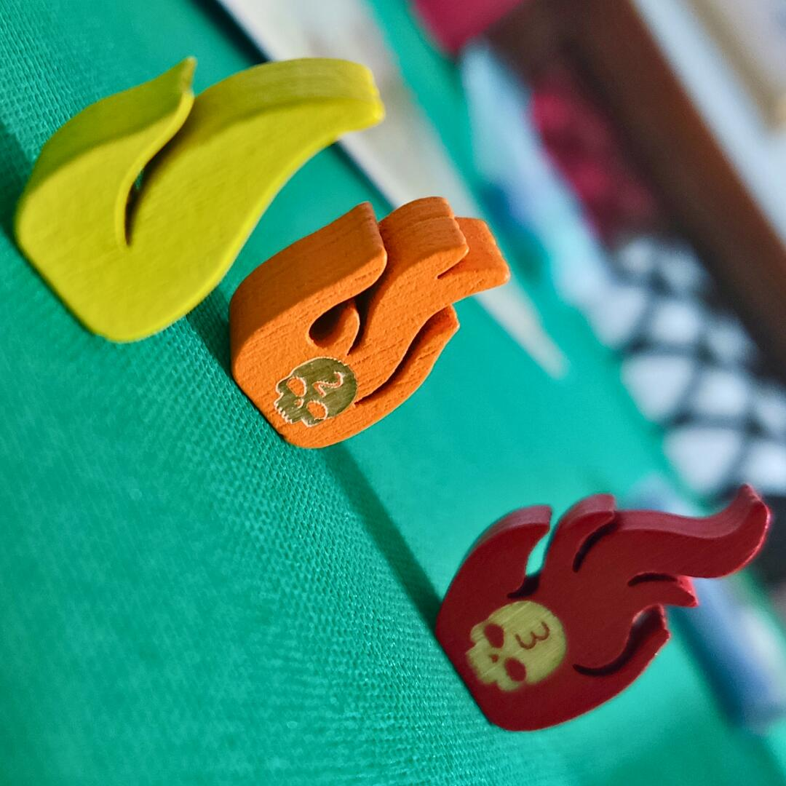
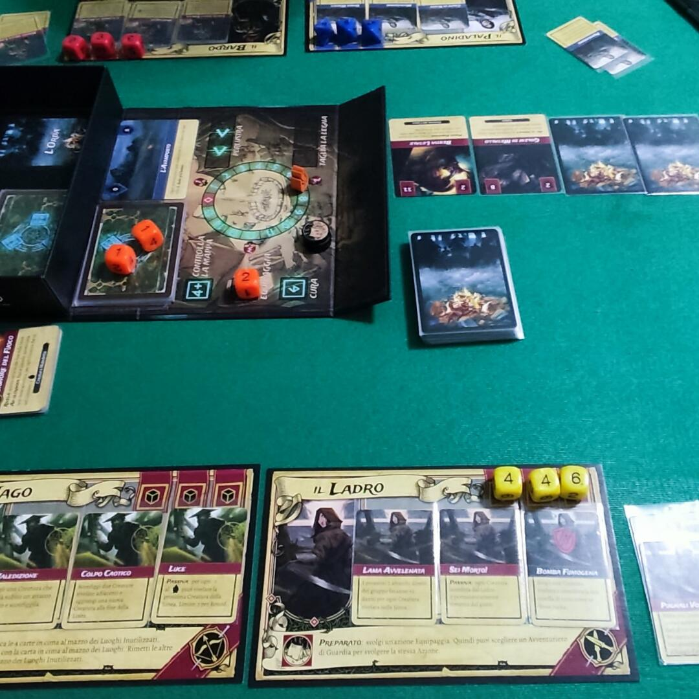
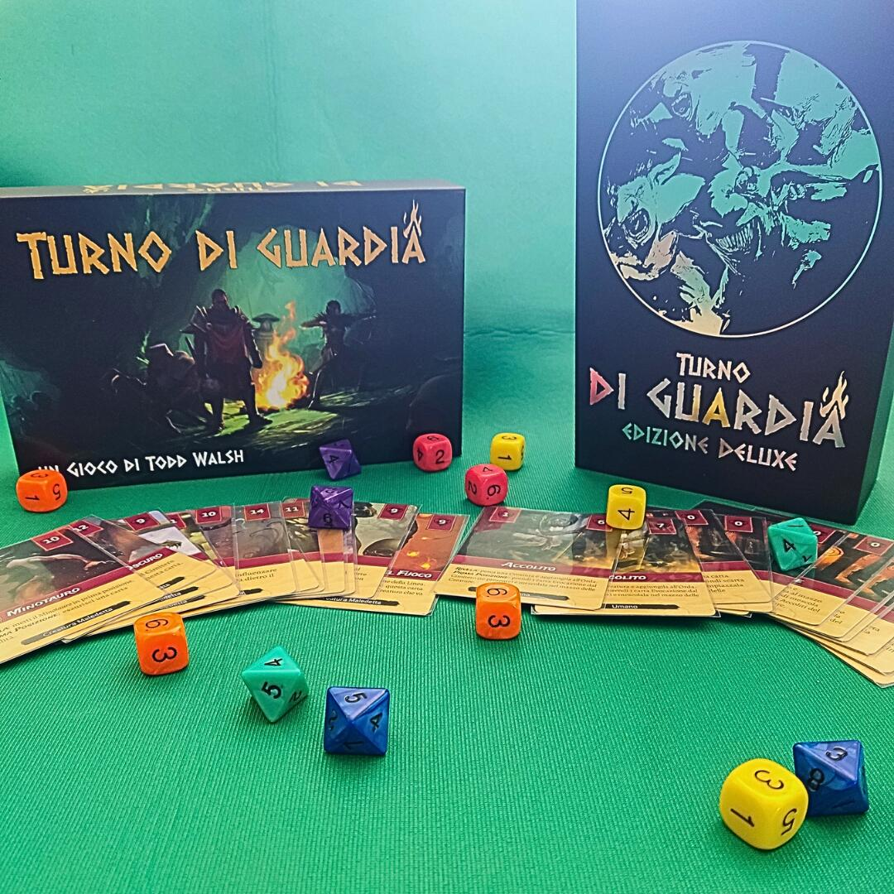

<Setting>

  Il regno è in grave pericolo. Potenti nemici stanno cospirando per far
  risorgere il Maledetto, il demone che il tuo gruppo ha già sconfitto in
  passato. Visitate luoghi oscuri e respingete orde di nemici intente ad
  orchestrare questo malvagio piano. Riuscirete a sconfiggere di nuovo questo
  potente nemico, prima che faccia calare le tenebre sull'intero regno?
   

</Setting>

<Rules>

  Una partita si articola in 9 turni, 8 dei quali suddivisi in 2 fasi (fase di
  Accampamento e fase di Guardia) e la fase finale con il solo turno di guardia
  che coinvolge tutti gli avventurieri.
   
  <strong>    <strong>FASE DI ACCAMPAMENTO</strong></strong>
   
  Ogni avventuriero deve svolgere 2 turni di riposo presso l'accampamento
  durante l'intera partita.
   
  Chi riposa in accampamento recupera subito un'abilità esaurita, poi lancia i
  dadi e scegli tre delle seguenti azioni possibili (dove concesso si può
  scegliere più volte la stessa azione):
   
  <ul>
    <li>      <em>Taglia la legna</em>    </li>
    <li>      <em>Perlustra</em>    </li>
    <li>      <em>Controlla la mappa (con un risultato di 4+)</em>    </li>
    <li>      <em>Cura (solo con un 6)</em>    </li>
    <li>      <em>Equipaggia</em>    </li>
    <li>      <em>Attiva le rune (solo con dadi doppi o tripli)</em>    </li>
    <li>      <em>Azione di accampamento propria dell'avventuriero</em>        </li>
  </ul>
      <strong>        <strong>FASE DI GUARDIA</strong></strong>
       
      Durante la fase di guardia gli avventurieri devono sconfiggere le creature
      che attaccheranno il loro accampamento, il cui numero è indicato sulla
      carta luogo attiva.
       
      Una volta pescate le carte creatura e posizionate in linea, esse vanno
      rivelate a partire da quella più vicina al mazzo delle creature, in numero
      pari al valore del fuoco da campo indicato sul tabellone di gioco.
       
      Non esiste un vero e proprio ordine di turno per sconfiggere le creature:
      gli avventurieri, infatti, potranno agire come preferiscono, sia
      attaccando con i loro dadi (anche in modo congiunto), sia usando le
      abilità di cui dispongono.
       
      La fase di guardia termina quando gli avventurieri sconfiggono tutte le
      creature della linea, oppure quando hanno esaurito tutti i dadi a loro
      disposizione e non possono più combattere. In questo caso, si rivelano
      eventuali creature non ancora rivelate e si assegnano agli avventurieri i
      danni. In caso di esaurimento totale di tutte le ferite degli
      avventurieri, la partita termina.
       
      Per vincere una partita bisogna sconfiggere tutte le creature nei luoghi
      base e quelle nel luogo finale, unite al mazzo dell'orda.

</Rules>

<Feedback>

  Turno di guardia si presenta in una scatola piccola e portatile, ma il suo
  aspetto non deve trarvi in inganno, in quanto all’interno troverete un sacco
  di materiale e un gioco decisamente strutturato. La prima geniale intuizione è
  proprio il fatto che la scatola stessa funge da tabellone di gioco, rendendo
  il setup rapidissimo.
   
  <strong>    <em>      <strong>Cosa troveremo all'interno?</strong></em></strong>{" "}
  Il gioco base include 6 schede avventuriero, una pioggia di dadi di ogni tipo
  e decine di carte mostro e luogo. Il flusso di gioco necessita di un po’ di
  rodaggio nelle prime partite e, anche se non è propriamente adatto a giocatori
  inesperti oppure alle prime armi con i tower defense, si può affermare che
  scorre senza intoppi (dopo un po’ di pratica) e che permette alta interazione
  tra i giocatori, i quali dovranno coordinare le loro abilità e i successi dei
  loro dadi per sconfiggere le creature maligne.  
  La cura della grafica del tabellone e delle illustrazioni delle carte è di ottimo
  livello, garantendo una buona immersività nell'ambiente di gioco. Il titolo si
  presta ad un’elevata rigiocabilità, grazie all’alta randomizzazione dei mostri
  da affrontare e dalle squadre che i giocatori possono comporre di volta in volta
  con i vari avventurieri, ognuno dei quali, infatti, ha un proprio set di dadi e
  delle abilità peculiari, utili a respingere gli attacchi delle forze del male.
   
  <strong>    <em>      <strong>Ma è tutto così semplice e immediato?</strong></em></strong> Purtroppo no. Come già accennato, il regolamento risulta un po’ ostico
  per i giocatori neofiti e, a volte, anche caotico su alcune applicazioni delle
  abilità dei mostri e degli eroi. La partita potrebbe risultare ripetitiva per chi
  cerca esperienze alla dungeon crawler, visto che il titolo in questione è un tower
  defense con dadi e carte e, soprattutto, soffre la piaga degli Alpha Player. I
  giocatori più esperti al tavolo, infatti, potrebbero condurre la partita suggerendo
  tutte le mosse agli altri giocatori, per cercare di ottenere la vittoria, ma così
  facendo toglieranno la voglia di giocare a chi vorrebbe scegliere per se stesso
  cosa fare e come farlo.  
  Va infine sottolineata la difficoltà del titolo, tipica di tutti i tower
  defense, la quale potrebbe allontanare i giocatori meno competitivi, visto che
  spesso le partite si riducono a pochi round dove verremo sopraffatti dalle
  creature del male senza riuscire a respingerle.  

   

</Feedback>

