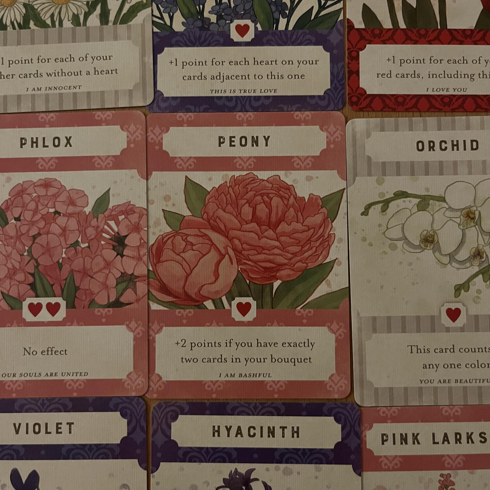
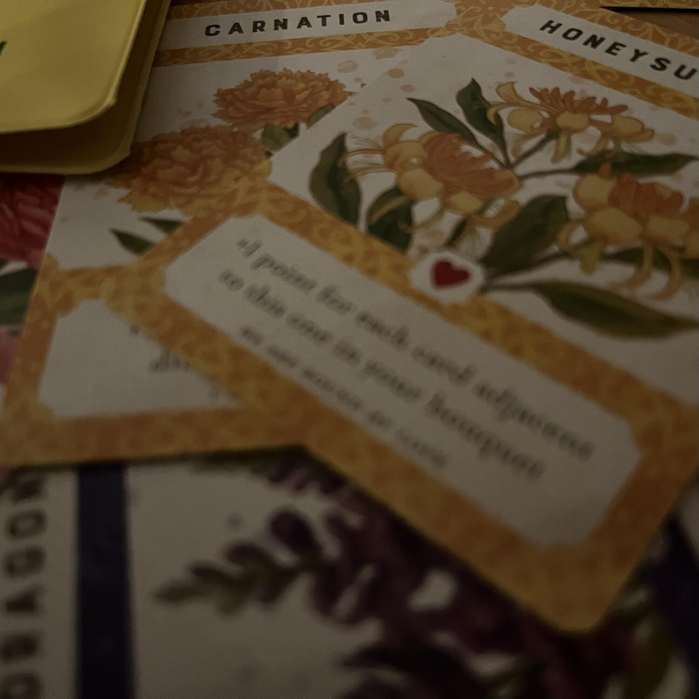
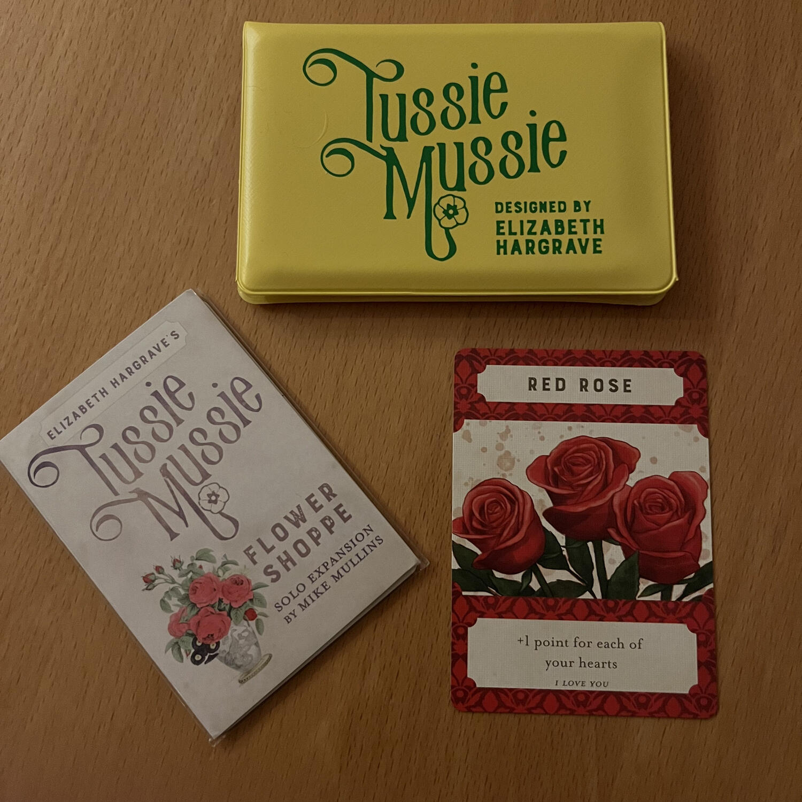

<Setting>

  Tussie-Mussie rappresenta l’arte squisitamente vittoriana dell’attribuire un
  significato ai fiori e il gioco fa esattamente questo: creare delle
  composizioni floreali da mostrare agli amici di turno.  
  Sì, avete letto bene, la designer è Elizabeth Hargrave, l’autrice del gioco sul{" "}
  <em>birdwatching</em> chiamato <Link to="/reviews/wingspan">Wingspan</Link>

</Setting>

<Rules>

  In Tussie Mussie i giocatori dovranno comporre il loro bouquet con eventuali{" "}
  <em>keepsake</em> a corredo. Alla fine di ciascuno dei 3 round previsti
  verranno calcolati dei punti a seconda della tipologia di mazzetti composti.{" "}
   
  Come avviene la scelta delle carte? Il giocatore attivo pesca 2 carte e le offre
  al giocatore alla sua sinistra, una scoperta e l’altra coperta; quel giocatore
  ne sceglie una, lasciando così l’altra al giocatore attivo. Si continua così fino
  a che ogni giocatore non avrà quattro carte davanti a sé, divise tra il boquet
  (quelle scoperte) e i keepsake (quelle coperte).

</Rules>

<Feedback>

  Tussie Mussie è un gioco inusuale, quasi <strong>zen</strong>, considerato
  quanto sia rilassante e riflessivo. Ci si ritrova spesso e volentieri a
  chiaccherare del più e del meno prestando poca attenzione al gioco in sé,
  eppure questo continua senza interruzioni per tutta la sua durata.  
  Tussie Mussie quindi è un titolo che fa dell’essenzialità il suo punto di forza.
  In fondo ci sono solo tre regole e il flusso di gioco è <strong>    incredibilmente liscio e pulito.</strong>

</Feedback>

