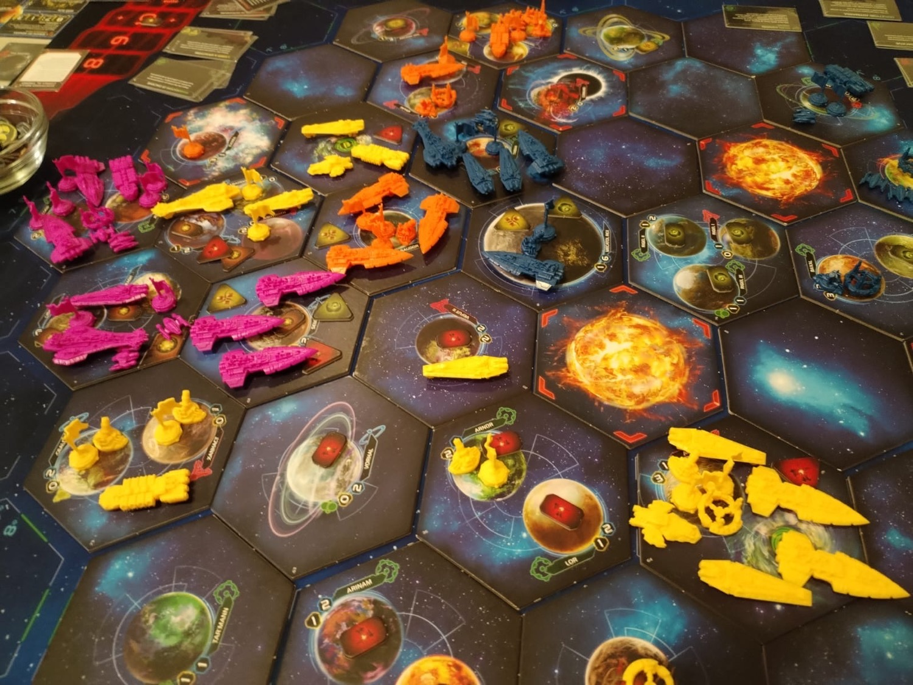
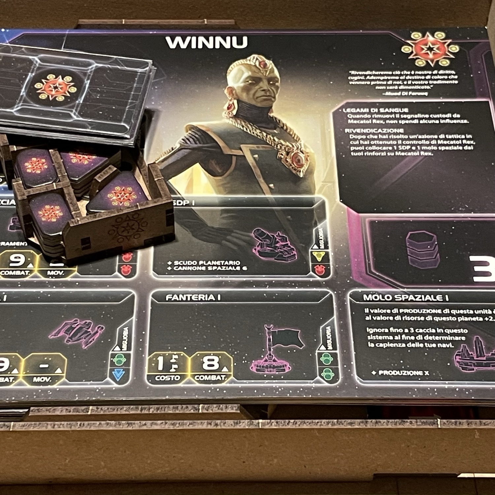
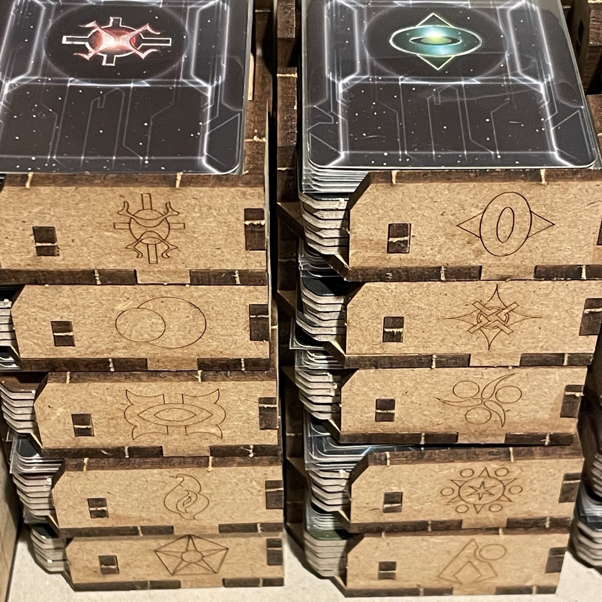

<Setting>

  Un tempo l’impero Lazax governava la galassia dal pianeta-capitale <strong>Mecatol Rex</strong>. Ma la decadenza si è infiltrata anche nel cuore della civiltà galattica suprema e nel corso dei secoli i Lazax sono caduti, soffocati da razze rivali che, tuttavia, non hanno saputo rimpiazzarli, lasciando un incolmabile <strong>vuoto di potere</strong>. Ma si sa: il caos è solo anticipatore di un nuovo kosmos. Il momento per <strong>una nuova egemonia</strong> è finalmente giunto e molte razze sparse per la galassia hanno fiutato la nuova opportunità. Ponetevi alla guida della vostra per guadagnare la <strong>supremazia politica</strong>, <strong>scientifica</strong> ed <strong>economica</strong>: se serve, anche con la forza delle armi…

</Setting>

<Rules>

 Premettiamo che <strong>il regolamento di TI4 è sostanzialmente snello</strong>, ma presenta una gran quantità di situazioni particolari e dettagli procedurali che difficilmente potranno essere automatizzati in modo lineare ed efficace durante le prime partite: in questa sede non si potranno certamente ripercorrere tutti nel dettaglio. Funge da fonte definitiva e fondamentale a tal proposito il <strong>Compendio</strong>, che grazie al Glossario finale offre uno strumento molto efficace per una rapida consultazione. 
Per cominciare, si sceglie una <strong>fazione</strong> tra le 17 disponibili (l’espansione <em>Prophecy of Kings</em> le aumenta a 24) e si radunano tutti i <strong>materiali correlati</strong>, incluse truppe (terrestri, spaziali e strutture) e tecnologie di partenza (vd. retro della scheda di fazione; sull’appendice della scheda andranno poi collocati 3 segnalini comando nello spazio tattica, 3 in flotta e 2 in strategia). Si crea una <strong>galassia</strong> (si può usare un setup predefinito), ponendo il <strong>Segnalino Custodi</strong> su Mecatol Rex, il pianeta al centro della galassia, e i <strong>Pianeti d’Origine</strong>, con le relative truppe di partenza ivi allocate, negli appositi spazi ai margini della galassia stessa. Ogni giocatore guarda due <strong>Obiettivi Segreti</strong> e ne tiene uno. Si predispongono poi 10 <strong>Obiettivi Pubblici</strong> (5 di livello 1 - di cui i primi 2 rivelati - e 5 di livello 2) e si sceglie se concludere la partita a 10 o a 14 punti. 
Nonostante la gran quantità di regole, giocare a TI4 non è difficile e la <strong>Struttura del Round</strong> è semplice e lineare, con le sue tre <strong>Fasi</strong> (quattro da un certo momento in poi), ovvero Strategia, Azione, (Delibera), Status. 
<ul>
<li>Nella <strong>Fase di Strategia</strong> si scelgono le carte Strategia, ciascuna delle quali conferisce un’abilità primaria a chi le sceglie e una secondaria a chi spenderà un segnalino strategia durante la sua esecuzione; inoltre, queste 8 carte sono numerate per determinare l’ordine di iniziativa di un round (dal più basso al più alto).</li>
<li>Nella <strong>Fase di Azione</strong> (la più lunga) si compiono azioni a turno (di strategia, di movimento, di combattimento, tattiche, o di componenti - ovvero con carte azione, tecnologie o scheda di fazione), finché non si decide di passare; per passare è necessario aver svolto l’azione delle carte strategia selezionata. Durante la</li>
<li><strong>Fase di Status</strong> si prepara il round successivo e, soprattutto, si reclamano punti vittoria pubblici.</li>
<li>Infine, a partire dal round in cui Mecatol Rex viene reclamato si attiva anche la quarta <strong>Fase di Delibera</strong> (che precederà quella di Status), durante la quale i giocatori votano delle delibere che possono cambiare alcune regole del gioco sul lungo termine.</li>
</ul>
È sicuramente la <strong>Fase di Azione il momento più dinamico del gioco</strong>: le unità si spostano nella galassia con azioni tattiche, attivando sistemi dove possono avvenire - nell’ordine - <strong><em>movimenti</em></strong> (nel rispetto dei limiti imposti da tessere speciali come supernova e asteroidi, e tenuto conto che ogni nave ha un valore di capienza per il trasporto di truppe o caccia, oltre alle statistiche di costo, attacco e movimento), <strong><em>combattimenti</em></strong> (che seguono una serie di step precisi, indicati anche sulla sezione riepilogativa dell’appendice alla plancia personale, ovvero fuoco con SPD, sbarramento anti-caccia, annuncio di ritirata, lancio dei dadi, assegnazione dei danni, ritirata, eventuale sbarco e combattimento planetario), <strong><em>conquiste di pianeti</em></strong> culturali, industriali o pericolosi (le cui carte vengono reclamate esaurite) e infine <strong><em>produzione</em></strong> di nuove truppe (se nel sistema attivato è presente un molo spaziale), rispettando il limite di flotta che ogni giocatore avrà stabilito sulla propria scheda di fazione. Di norma, ogni fazione può <strong><em>attivare un sistema</em></strong> una sola volta per round (ogni fazione può dunque collocare solo un proprio segnalino in uno stesso sistema) e muovervi le proprie truppe anche da più sistemi; inoltre, le truppe localizzate in un sistema attivo non possono più muoversi fino a fine round. I pianeti hanno un valore giallo (<strong>risorse</strong>) e uno azzurro (<strong>influenza</strong>). 
Durante la <strong>Fase di Status</strong>, un giocatore può reclamare fino a un obiettivo pubblico (se non lo ha già reclamato in precedenza) e uno privato; si verifica quindi che nessuno abbia vinto e si rivela un nuovo obiettivo; ogni giocatore pesca poi una carta azione e ritira dalla mappa di gioco tutti i propri gettoni comando rimettendoli nella propria riserva; ottiene poi due nuovi gettoni comando e li colloca sulla propria scheda, approfittando, se vuole, per ridistribuirli tutti secondo le proprie esigenze; infine, le carte esaurite tornano pronte, le unità che hanno sopportato danni vengono riparate e le carte strategia vengono restituite. A questo punto, se Mecatol Rex è stato conquistato (spendendo i 6 punti influenza richiesti) si procede per il resto della partita con la quarta fase (altrimenti si torna alla Fase di Strategia per iniziare un nuovo turno). 
Durante la <strong>Fase di Delibera</strong>, il giocatore che possiede il segnalino Portavoce pesca dal mazzo una delibera. Le delibere si dividono in <strong>leggi</strong> o <strong>direttive</strong>: le prime, una volta approvate, resteranno in vigore per tutta la partita, mentre le seconde hanno un effetto immediato una tantum. I giocatori votano la prima delibera partendo da chi è seduto alla sinistra del Portavoce stesso, il quale vota per ultimo e, in caso di parità, ha facoltà di dirimere i pareggi. Questa procedura si ripete poi con una seconda carta delibera, rivelata solo dopo che la prima votazione si è conclusa. I voti sono conteggiati in base all’influenza che i giocatori decidono di spendere esaurendo i loro pianeti e (nota bene) tra una votazione e l’altra i pianeti esauriti non si ripristinano. 
<strong>Vince</strong> chi realizza per primo <strong>10 obiettivi</strong> (14 nella partita ampliata).

</Rules>

<Feedback>

  Contrariamente a quanto si legge in giro in recensioni forse un po’ superficiali, <strong>Twilight Imperium NON è un “4X”</strong>. Non si presenta cioè come uno di quei giochi in cui vincere dipende dall’azione congiunta delle quattro operazioni <em>EXterminate</em>, <em>EXplore</em>, <em>EXpand</em> ed <em>EXploit</em>. O meglio, se è vero che molti di questi elementi sono presenti (non tutti: non c’è vera e propria esplorazione, almeno nel gioco base, dato che non esistono spazi coperti, sullo stile della nebbia di guerra nei videogiochi) è anche vero che non è strettamente necessario sterminare gli avversari per vincere. In ogni caso, non sembra esserci dietro la genesi del gioco stesso alcuna volontà di farlo ricadere entro l’etichetta del 4X, ma sembra piuttosto una <strong>semplificazione</strong> proiettata dai giocatori su un titolo in cui, di fatto, la conquista militare è un mezzo, non uno scopo, a differenza di altri 4X dove essa costituisce un punto cardine di specifiche strategie di vittoria (vd. Civilization). Certo, è facile scambiare la supremazia militare con il gioco al massacro, ma TI4 non è un gioco dove si vince sterminando gli altri (per quanto indubbiamente questo agevoli l’impresa): <strong>è un gioco nel quale bisogna raggiungere obiettivi</strong>. E questi obiettivi contemplano molte opzioni diverse dalla mera conquista. Suona forse meno affascinante, epico e titanico, ma è così. 
Parte forse da qui un <strong>fraintendimento</strong> <strong>storico</strong> nei confronti di TI4, che lo vede come un titolo dalla durata inesorabilmente interminabile? Non è da escludere: la <strong>difficoltà intrinseca di intavolare una partita</strong> a un gioco non dipende solamente dalla sua effettiva lunghezza e dalla sua accessibilità (non immediata, bisogna ammetterlo, anche perché ogni fazione va studiata e compresa prima di essere giocata efficacemente - altro che <Link to='/reviews/root'>Root</Link>…), ma anche da <strong>fattori estrinseci</strong> come la competenza e il numero dei giocatori attorno al tavolo: ho giocato partite in 4 della durata di 3 ore e mezzo, quando ormai avevo una certa dimestichezza (che bella estate…) e ho giocato anche partite da 10 ore e più con lo stesso numero di giocatori. La differenza? Nel secondo caso nessuno dei giocatori al tavolo (me compreso) era un esperto, mentre nel primo lo eravamo tutti. C’è da farsi qualche domanda. 
A ben vedere, questi elementi costituiscono dei forti pregiudizi alla fortuna del titolo, che ugualmente ha una storia straordinaria e di successo alle spalle: <strong>4 edizioni e una posizione ottima e costantemente alta nel rank di BGG</strong>. 
Alcuni amici, storici conoscitori del gioco, lo accusano di essere vittima del classico problema di <em>kingmaking </em>(e a volte di <em>bash the leader</em>), ma piuttosto che essere un problema originario di TI4 io direi che può scaturire in situazioni di ripetitività delle giocate, magari fatte più o meno sempre con la stessa compagnia, dove a volte può anche avvenire che il giocatore risaputamente più forte al tavolo venga neutralizzato per tempo (<em>bash the stronger</em>?), mentre gli altri si contendono un testa a testa facilmente rotto sul finire della partita da fattori casuali o, più spesso, antipatie personali… Dinamiche come queste sono frequenti al tavolo da gioco, ma <strong>proiettare disfunzioni interne ai gruppi ludici su questo titolo rischia di inquinarne l'intrinseca pulizia e linearità.</strong> 
TI4, in realtà, può dare l’impressione di essere un gioco estremamente complicato a causa di due ragioni fondamentali: <strong>l’inesperienza al tavolo</strong> e la <strong>difficoltà di intavolarlo per le sue dimensioni</strong>. Se il primo problema si può tranquillamente evitare con un po’ di studio e di partite, sul secondo occorre un intervento più deciso, che non “semplicemente” un super tavolo: personalmente ho fatto ricorso <a href='https://thedicetroyers.com/it/shop/twilight-imperium-it/' target="_blank">all’organizer dei The Dicetroyers</a>. La <strong>spesa</strong> è <strong>certamente significativa</strong> rispetto alle tante soluzioni organizzative disponibili ed è chiaramente rivolta a un pubblico che ama rendere <strong>deluxe</strong> non solo la conservazione del gioco ma anche l’esperienza ludica in sé; <strong>tuttavia</strong>, per quanto mi riguarda, è <strong>ampiamente compensata</strong> (i) dal fatto che si tratta di un <strong>setupper</strong>, più che di un organizer, pensato non solo per azzerare totalmente i tempi di preparazione e conservazione, ma anche per agevolare la dislocazione razionale dei componenti sul tavolo durante la partita; (ii) dal <strong>miglioramento radicale dell’esperienza di gioco</strong>, dato che ogni componente trova posto in modo sistematico e ad hoc per fazione (ognuna ha la sua scatola, con sopra il logo chiaramente visibile e con tanto di slot per token e carte); (iii) dall’<strong>assenza di materiale plastico</strong>, che ha placato la mia coscienza ecologista, già in accesa ribellione per via delle innumerevoli miniature presenti nel gioco; (iv) dalla possibilità di <strong>ordinare in modo funzionale</strong>, separando ciascun mazzo nel proprio slot, le innumerevoli <strong>carte</strong> (con spazio a sufficienza - dettaglio per me fondamentale - per conservarle <strong>anche imbustate</strong>!); (v) dal fatto che consente di <strong>ospitare anche l’espansione <em>La profezia dei Re</em></strong> nella scatola base. La piccola ma funzionale <em>dice tower</em>, poi, è un tocco di classe. 
Una volta superato il titanico problema organizzativo e quello esperienziale, <strong>il gioco fila che è una meraviglia</strong>. Dopo molte partite, trovo che un elemento eccessivamente sottovalutato sia rappresentato dai <strong>negoziati</strong>: TI4 è un gioco dove saper negoziare dà una marcia in più e i negoziati vanno realizzati con arte, soprattutto durante la Fase di Delibera, quando ciascuno può fare transazioni con ogni altro giocatore. <strong>Cambiali, frammenti, merci di scambio e materie prime</strong>: tutto questo può essere scambiato (le cambiali di un giocatore possono addirittura essere cedute a terzi senza il consenso del proprietario originario). In aggiunta, ogni fazione porta al tavolo delle <strong>capacità speciali</strong> che possono occasionalmente rendersi utili per indurre altri giocatori a degli accordi volti al reciproco beneficio. Ho giocato partite in cui i negoziati venivano snobbati perché considerati un elemento “sporco”: qualcuno sostiene che se un gioco non è in grado di offrirti una situazione al tavolo in cui tutti possono ottenere quello che vogliono con le loro semplici forze, senza dover contrattare con altri, il gioco è imperfetto. Ma TI4 non è quel genere di gioco e a me, devo ammettere, sta bene che simuli un dato di realtà: la realtà che neanche nella vita si riesce a ottenere ciò che si vuole senza il dialogo con gli altri. Trovo quindi che la connotazione dell’esperienza ludica tramite un fattore imprevedibile come il negoziato costituisca strutturalmente un <strong>valore aggiunto</strong>. 
Spenderei infine qualche commento sul combattimento: <strong>TI4</strong>, ripetiamolo, <strong>NON è un gioco di guerra</strong>. Tutto il plasticame (che bella quella morte ne… ehm cioè quel war sun!) sembra gridare a gran voce il contrario: eppure, mai al tavolo da gioco come con questo titolo ho sperimentato situazioni di mutua deterrenza e di grande tensione non concretizzarsi mai in un conflitto a fuoco. TI4 resta un gioco in cui il potenziale di negoziazione può quasi (ma sottolineo il <em>quasi</em>) sempre evitare un conflitto diretto. <strong>Combattere ha senso principalmente in due circostanze specifiche</strong>: impedire a un altro giocatore di reclamare obiettivi per fare punti occupandone il sistema di origine, oppure conquistare uno snodo strategico di fondamentale importanza per la sua posizione e le sue risorse, per il quale c’è chiaramente una competizione insanabile (non di rado Mecatol Rex corrisponde alla descrizione, per quanto il pianeta in sé non costituisca a priori chissà quale ghiotto bottino - non per tutte le fazioni, in ogni caso). Avere una o più grandi flotte sparse per la galassia sarà quindi sì importante, ma vi accorgerete presto che un combattimento (sempre dispendioso) vi procurerà più danni e svantaggi che altro, soprattutto sul lungo termine, ponendovi in una posizione di forte vulnerabilità al tavolo: piuttosto, evitatelo e ritiratevi quando vi accorgete di trovarvi in una posizione di inferiorità. 
TI4 è <strong>un'esperienza unica nel suo genere</strong>: <strong>consiglio di provarlo almeno una volta nella vita</strong>, senza pregiudizi, con flessibilità e sapendo che la partita potrebbe protrarsi anche per un’intera giornata (assicuratevi di avere una compagnia resiliente, disponibile e notturna). Se c'è un gioco che non mi annoierei mai di intavolare è questo.

</Feedback>

