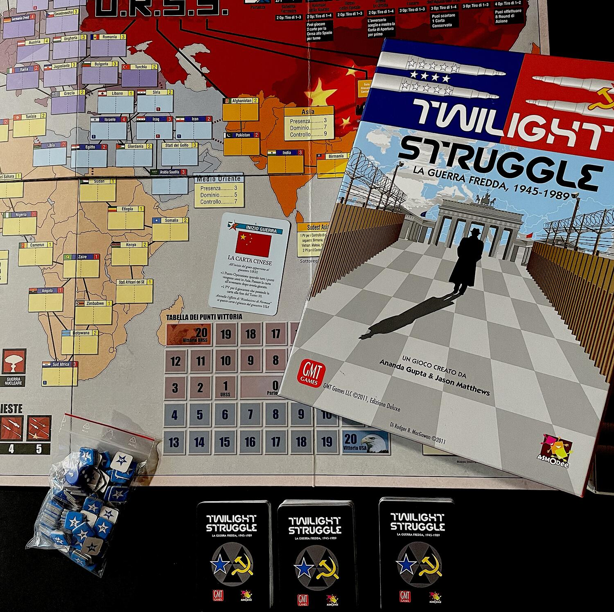
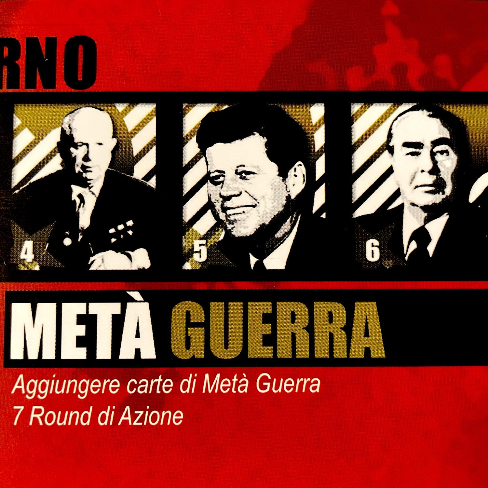

<Setting>

  Mentre la guerra in Ucraina proietta all'orizzonte un periodo cupo e
  turbolento, le origini di un conflitto mai realmente concluso si stagliano
  alle nostre spalle e chiedono di essere rilette alla luce dei fatti recenti.
  Anche allora, come oggi, il mondo osservava due colossi titanici intervenire a
  destra e a manca, spartendosi le aree di influenza del globo. Ripercorrete la
  storia della <strong>Guerra Fredda</strong>, dai conflitti Arabo-Israeliani al
  Vietnam, dalla Crisi dei Missili di Cuba alla Guerra di Corea, dalla Corsa
  allo Spazio alla tensione Nucleare. Rivivete quella “Twilight Struggle” che ha
  portato ai giorni nostri.

</Setting>

<Rules>

  Twilight Struggle è sostanzialmente un <em>card driven</em> della durata
  massima di 10 round, con 3 mazzi di pesca (a cui corrispondono 3 ere), che via
  via si integrano. Ogni round, dopo la distribuzione di un certo numero di
  carte, i due giocatori scelgono segretamente una carta dalla loro mano e la
  giocano, svolgendo un'azione tra le seguenti: possono{" "}
  <strong>risolvere la carta giocata come evento</strong> o sfruttarne i punti
  operazione per <strong>aumentare la loro influenza</strong> negli Stati sulla
  mappa, ridurre quella avversaria (<em>Tiri di Riallineamento</em>) o{" "}
  <strong>tentare un colpo di stato</strong> (si noti che l'evento si verifica
  ugualmente se la carta giocata è associata all'avversario del giocatore di
  turno); oppure, i giocatori possono <strong>scartare una carta</strong> e
  tentare con un lancio di dado di avanzare nella corsa allo spazio;{" "}
  <strong>devono</strong>, invece, <strong>giocare le carte punteggio</strong>{" "}
  delle varie aree continentali e subcontinentali nel corso del round in cui
  sono state pescate.
   
  Al termine di ogni round si verifica il numero delle operazioni militari
  effettuate e lo stato di DEFCON. Uno dei due giocatori vince immediatamente:
  se l'avversario fa scendere il livello di DEFCON a 1, scatenando una guerra
  nucleare; se controlla l'Europa quando si gioca la relativa carta punteggio;
  se raggiunge 20 punti vittoria. Nel corso della Tarda Guerra può anche
  verificarsi una vittoria anticipata se, quando viene giocata la carta{" "}
  <strong>Wargames</strong>, uno dei due giocatori ha un vantaggio di punti
  sufficiente sull'avversario.
   
  Qualora, concluso il decimo round di gioco, nessuna delle suddette condizioni
  di vittoria fosse stata raggiunta, si calcolano i punteggi di tutte le aree e
  la vittoria arriderà al giocatore nel cui tracciato ricadrà il segnalino dei
  punti vittoria.

</Rules>

<Feedback>

  Twilight Struggle è una <strong>bomboniera ludica</strong> di{" "}
  <strong>riuscitissima ambientazione storica</strong>: perfettamente in stile
  GMT, per chi sa farsi deliziare dalla componentistica cartonata ma efficace, è
  squisitamente contestualizzato, ma si lascia apprezzare anche da chi non ama
  la storia e cerca solo un'audace sfida con un singolo avversario. Respirerete
  l'aria fuliginosa della cortina di ferro, l'odore del Napalm al mattino e vi
  sembrerà davvero di essere perennemente sull'orlo del disastro atomico. Il
  gioco dà il meglio di sé quando lo si conosce a fondo: la consapevolezza delle
  carte presenti nel mazzo conferirà profondità strategica e flessibilità
  tattica alle scelte dei due giocatori, cosa che contribuisce non poco a
  mitigare la presenza dei pochi elementi aleatori.

</Feedback>

