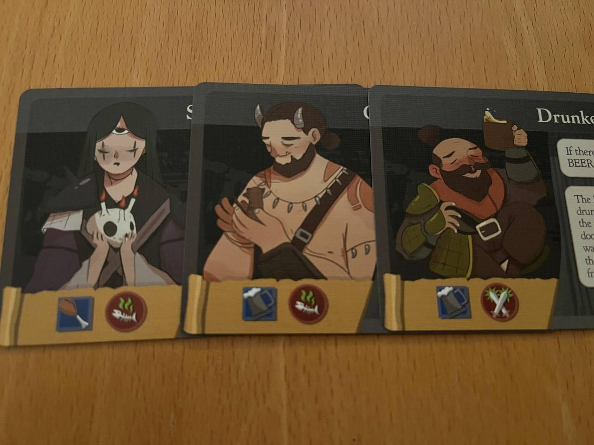
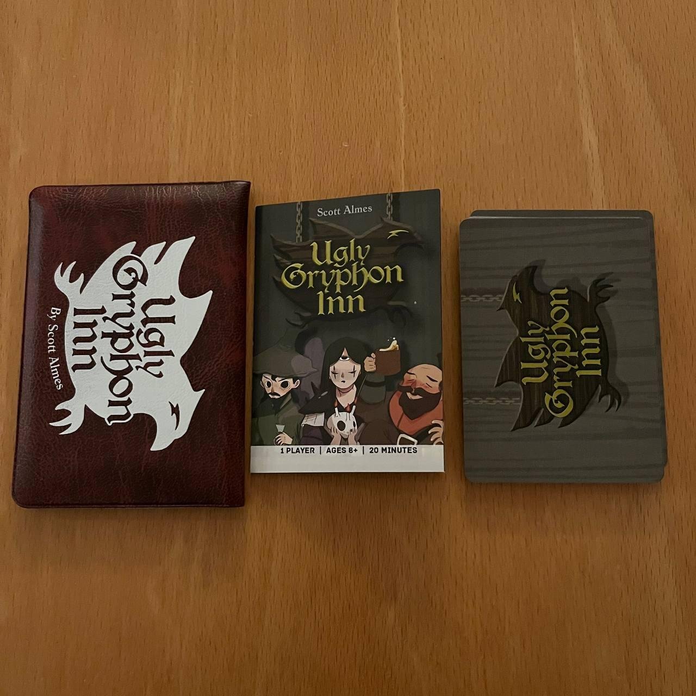

<Setting>

  La Locanda del Brutto Grifone è la più popolare della città, meta di avventori
  di ogni sorta che tutte le sere ne riempiono le casse. Eppure
  <strong> il proprietario non è contento </strong> come dovrebbe. Perché, dite?
  Forse non avete mai provato a cacciare via un mago del tempo ubriaco!

</Setting>

<Rules>

  Ogni carta di Ugly Gryphon Inn rappresenta un cliente, possibilmente ubriaco e
  probabilmente molesto.  
  Per vincere la partita, il proprietario (sto parlando di te!) dovrà riempire con{" "}
  <strong>7 clienti </strong>la locanda quando il mazzo di carte sarà esaurito. L’unica
  mossa possibile è prendere un potenziale cliente dalla fila del bar (composta di
  4 carte che vengono estratte progressivamente dalla cima del mazzo) e aggiungerlo
  alla locanda.
   
  Ogni cliente della locanda, tuttavia, vi rimarrà soltanto finché le 2 condizioni
  riportate sulla sua carta saranno rispettate.

</Rules>

<Feedback>

  Ugly Gryphon Inn è un gioco troppo facile: per aggiungere un buon livello di
  sfida bisogna ricorrere ad espansioni e giocare nelle modalità più difficili,
  che aumentano il numero di clienti richiesti per vincere.  
  Detto questo, che probabilmente è IL difetto del gioco, Ugly Gryphon Inn, come{" "}
  <Link to="/reviews/food-chain-island">Food Chain Island</Link>, riesce nel suo
  obiettivo di <strong>condensare componenti e meccaniche molto snelli in un titolo di buona rigiocabilità.</strong>

</Feedback>

