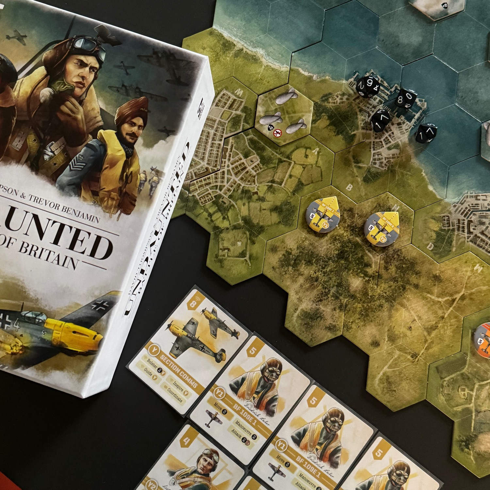
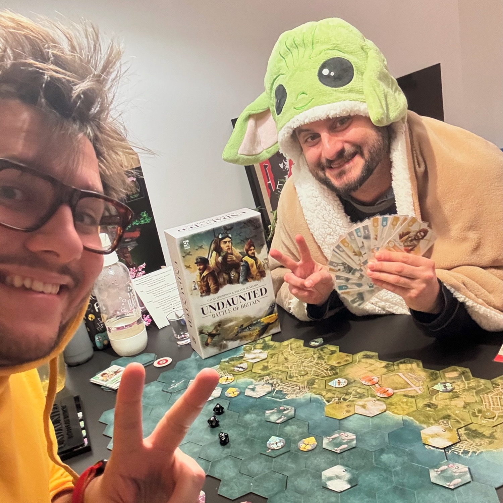
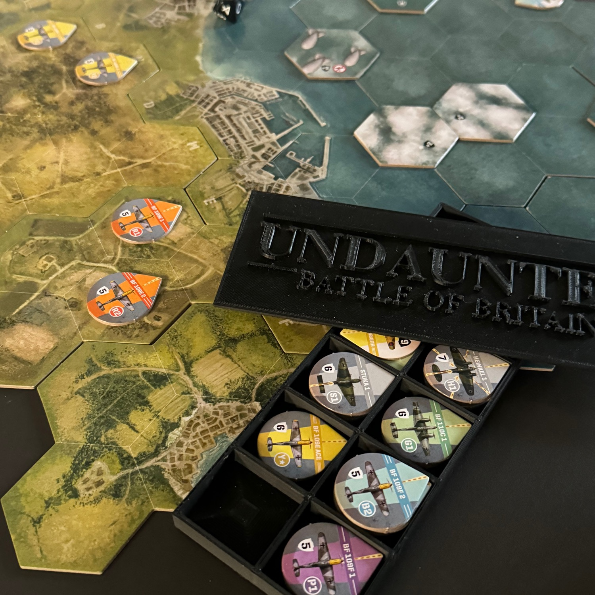

<Setting>

  Estate 1940. La macchina da guerra tedesca ha attraversato il continente in meno di un anno, schiacciando tutto ciò
  che aveva davanti. La Gran Bretagna è l'unico ostacolo alla vittoria tedesca in Europa. Comandate i piloti
  della <strong>Luftwaffe</strong>, collaudata in battaglia, che cercano di spegnere ogni resistenza e spianare la
  strada all'invasione, o la <strong>RAF</strong>, intraprendente e determinata, che si oppone a ogni passo.

</Setting>

<Rules>

  Il gioco si svolge in una <strong>serie di round</strong>, durante i quali si giocano carte per muovere gli aerei,
  attaccare il nemico e raggiungere i propri obiettivi.  
  Ogni round è composto da <strong>tre fasi</strong>: 
  <ol>
    <li><strong>Pescare carte</strong>: si pescano 4 carte;</li>
    <li><strong>Determinare l'iniziativa</strong>: si gioca una carta coperta, si rivela contemporaneamente
      all'avversario e chi ha l'iniziativa maggiore inizia il turno.</li>
    <li><strong>Turni dei giocatori</strong>.</li>
  </ol>
  Ogni carta è composta principalmente da due parti: <strong>l'iniziativa</strong> e <strong>le azioni</strong> permesse
  dalla stessa.  
  Una volta giocata l'iniziativa, il giocatore con il valore più alto, gioca tutte le carte che ha in mano e poi passa
  il turno all'altro giocatore che giocherà, a sua volta, le proprie carte. 
  Quando si gioca una carta combattimento (un aereo), <strong>si deve sempre intraprendere un'azione di movimento
  e</strong> si può anche effettuare (in un ordine di proprio piacimento) <strong>una delle azioni indicate dalla
  carta</strong>, come ad esempio manovrare, attaccare, bombardare e molto altro. Ogni aereo ha una <strong>linea di
  tiro e una potenza di fuoco</strong> (numero di dadi da tirare), quindi la posizione e la distanza tra predatore e
  preda è molto importante: molti aerei, se riescono a mettersi in coda, tirano un dado in più! <strong>Per ogni danno
  che un aereo subisce</strong>, una relativa carta viene tolta dal mazzo del giocatore, rendendolo sempre più debole,
  fino a farlo precipitare. 
  L'altra tipologia di <strong>carta</strong> principale è quella relativa alle <strong>comunicazioni</strong>. Queste
  carte permettono di rafforzare l’aviazione di un giocatore, <strong>aggiungendo carte dalla scorta al proprio
  mazzo</strong>, oppure di ispirare (ovvero rigiocare) una carta giocata nello stesso turno, a patto che abbia lo
  stesso colore! Quando si gioca, è necessario eseguire un'azione della carta o oscurarsi: non si possono fare entrambe
  le cose. Le azioni di questo tipo di carta sono utilizzabili <strong>solamente se la coppia degli aerei</strong> del
  medesimo colore (rosso con rosso, giallo con giallo, …) <strong>si trova al massimo separata da due esagoni</strong>.
  Oscurarsi permette di scartare per sempre una carta comunicazione dalla propria mano, con lo scopo di snellire il
  proprio mazzo, ma anche per evitare di prendere carte discord, nel caso in cui i due aerei ormai fossero troppo
  distanti per farli volare fianco a fianco. 
  Undaunted BoB è un gioco che vi farà scoprire, in <strong>11 scenari</strong>, la guerra sulla <strong>Manica</strong>.
  Scenario dopo scenario entreremo in contatto con nuovi elementi di gioco, come i bombardieri tedeschi oppure le navi e
  le contraeree inglesi.

</Rules>

<Feedback>

  Vi piace la storia militare della <strong>Seconda guerra mondiale</strong>? Vi sono piaciuti gli altri titoli
  di <strong>Undaunted</strong>? Vi piacciono i <strong>rompicapo</strong>? Undaunted: Battle of Britain è sicuramente
  un gioco che dovete provare. BoB, infatti, si distingue dai titoli precedenti della serie per la sua enfasi sui
  rompicapo che dovrete affrontare dal primo all'ultimo turno. 
  Mentre i titoli precedenti richiedevano solamente una pianificazione strategica delle truppe - come ad esempio dove e,
  soprattutto, quando posizionarle - <strong>in Battle of Britain bisognerà, ogni turno, bilanciare la potenza di fuoco
  con la possibilità di cadere a terra con l'aereo in fiamme e le ali spezzate</strong>. In questo gioco la posizione è
  tutto e passare <strong>da predatore a preda</strong> è davvero questione di due carte e di tanta tattica. State
  attenti a cosa mirate perché non tutti i bersagli sono uguali: ci sono aerei che si muovono molto veloci, aerei che
  sono capaci di bombardare, aerei che sparano dalla coda e molto, molto altro.  
  <strong>Il sistema di volo è una figata, semplice ma efficace</strong> (come tutto quello che troverete in questo
  gioco), ed è in grado di trasmettere il senso della velocità e della potenza dei diversi aerei.  
  <strong>La scelta tra sparare e manovrare</strong> (ovvero cambiare di direzione), insieme alla necessità di mantenere
  la comunicazione attiva, aggiunge profondità al gioco. Perdere le comunicazioni tra i due aerei potrebbe essere
  rischioso, ma potrebbe essere anche l'unico modo per aggiudicarsi il predominio su quel tratto di cielo.  
  A differenza degli altri <Link to="/reviews/undaunted-north-africa/">Undaunted</Link>, questo titolo <strong>si
  focalizza più sul tabellone che sul mazzo</strong>, con un'importanza cruciale sulla posizione dei vari caccia. 
  Invece, come per tutta la collana, <strong>l'inserto fa pena</strong>: le carte imbustate non ci stanno ed è scomodo.
  Personalmente, ho comprato quello di <a href="https://www.etsy.com/shop/panamaniac3d/"
                                          target="_blank">Panamaniac3D</a> che, tra le varie cose, mette a disposizione
  direttamente i file <strong>STL</strong> se volete stamparlo per conto vostro, come ho fatto io! 
  Se, come me e Dadi-Daddy, siete degli amanti di Undaunted, mi aspetto che questo titolo sia già presente nelle vostre
  kallax; altrimenti fate in modo che questo non sia il primo che acquisterete. Per quanto
  sia <strong>stratosferico</strong>, vi consiglio di iniziare con qualcosa di più semplice, come ad esempio <Link
  to="/reviews/undaunted-north-africa/">North Africa</Link>, in quanto vi consentirà di apprenderete meglio le varie
  tattiche di deck building.

</Feedback>

