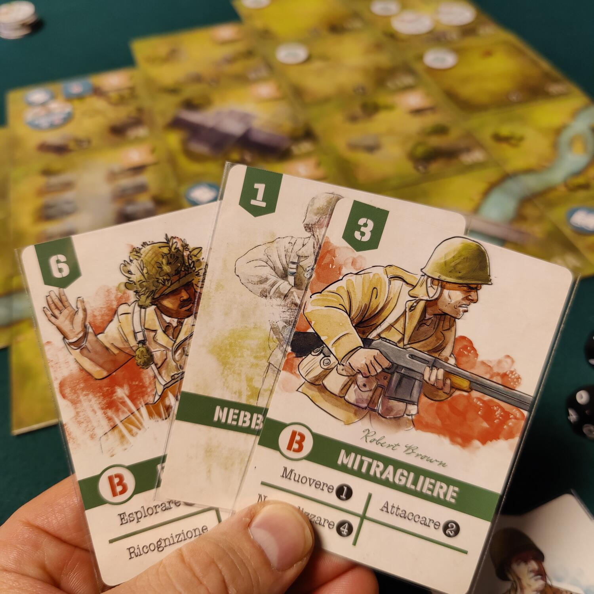
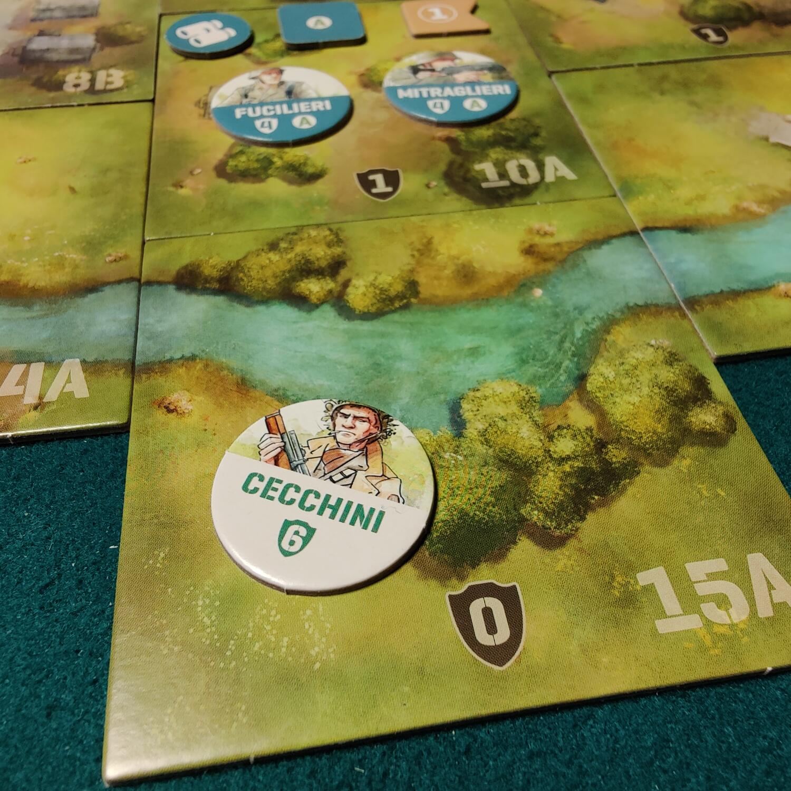

<Setting>

  Giugno '44. La Normandia è teatro della più grande e vasta operazione di
  invasione anfibia che l'uomo ricordi. Tra gli alleati trovano posto uomini
  arrivati da ogni parte del mondo disposti a sacrificare la propria vita in
  nome di un ideale chiamato libertà, dall'altra parte della trincea invece i
  tedeschi cercano di respingerli accogliendoli a colpi di mitragliatrice,
  granate e mortai.  
  Prendi parte alla più famosa operazione militare della storia, scegli il tuo lato
  della barricata e comanda con coraggio i tuoi soldati. Ci saranno da prendere decisioni
  difficili, a volte dolorose, ma un grande comandante sa come fare la storia!

</Setting>

<Rules>

  Condensare il regolamento, seppur non complicato, in poche righe potrebbe
  risultare controproducente: ne analizzeremo gli aspetti principali. Undaunted
  Normandy è un gioco per due giocatori basato sulla meccanica di deck building:
  toccherà a voi decidere come rinforzare le vostre armate aggiungendo le carte
  al vostro mazzo di gioco, e quindi unità, al vostro attacco. Ogni round di
  gioco si svolge seguendo le stesse tre azioni: <strong>pescare</strong> 4
  carte dal proprio mazzo, <strong>sceglierne</strong> una, in segreto, che
  determinerà l'iniziativa del round e che verrà scartata, ed infine{" "}
  <strong>giocare</strong> le carte pescate rimanenti in mano secondo l'ordine
  di iniziativa.
   
  Ogni unità è identificata da un segnalino sulla mappa e da una o più carte. Le
  azioni che potrete svolgere con un'unità sono indicate direttamente sulla
  carta e possono essere azioni di movimento (<strong>muoversi</strong>,{" "}
  <strong>guidare</strong>, <strong>esplorare</strong>,
  <strong>inseguire</strong>), azioni di supporto (<strong>rinforzare</strong>,{" "}
  <strong>comandare</strong>, <strong>nascondersi</strong>,
  <strong>controllare</strong>, <strong>ispirare</strong>,{" "}
  <strong>ricognizione</strong>, <strong>puntare</strong>) o azioni di
  combattimento (<strong>attaccare</strong>, <strong>neutralizzare</strong>,{" "}
  <strong>bombardare</strong>).
   
  La vostra forza di attacco sarà divisa in 3 plotoni A, B, C, ciascuno composto
  da 1 Caposquadra, 5 Fucilieri, 3 Esploratori e 3 Mitraglieri. In base alla
  mappa giocata (ci sono 12 scenari nel manuale), avrete a disposizione anche
  Cecchini e Mortaio, oltre a carte strategiche come il Sergente di Plotone e la
  Guida di Plotone.
   
  Il numero sulla carta indica:
  <ul>
    <li>      per azioni di movimento il numero di tessere fino a cui l'azione può
      essere eseguita;</li>
    <li>per azioni di supporto quante carte sono interessate dall'azione;</li>
    <li>      per azioni di attacco quanti dadi verranno tirati da chi effettua l'azione
      di combattimento.</li>
  </ul>
  Chi subisce l'attacco deve calcolare il valore di difesa totale dato dalla
  somma di tre valori: <strong>difesa base</strong>, stampato sul segnalino
  dentro uno scudo;
  <strong>bonus di copertura</strong>, valore stampato sulla tessera della mappa
  in cui si trova il segnalino attaccato; <strong>bonus di distanza</strong>, il
  numero di tessere che separano chi attacca da chi difende. Se il valore di anche
  uno solo dei dadi tirati è maggiore o uguale al Valore di Difesa Totale l'attacco
  ha successo, l'unità attaccata subisce delle perdite e il giocatore che la controlla
  deve trovare ed eliminare la prima carta corrispondente a quella unità cercandola:
  <ul>
    <li>1 Dalla propria Mano</li>
    <li>2 Dalla Pila degli scarti</li>
    <li>3 Dal proprio mazzo, rimescolandolo</li>
    <li>      4 Se non ha più carte di quella unità, deve eliminare il segnalino dalla
      mappa</li>
  </ul>
  Ricordiamo che il valore 0 del dado è sempre un successo, non importa quanto sia
  alto il valore di difesa.
   
  La partita termina immediatamente quando una delle due fazioni raggiunge le condizioni
  di successo indicate dalla missione, come la conquista di determinati obiettivi
  o l’eliminazione di tutti i fucilieri del nemico.

</Rules>

<Feedback>

  Undaunted Normandy è un bellissimo gioco di guerra, un introduttivo agli
  strategici per due persone di cui si apprezza l'asimmetria e la profondità di
  gioco. È vero che gli americani da una parte e i tedeschi dall'altra hanno gli
  stessi mazzi di base, ma è altrettanto vero che ogni mappa vi indicherà come
  comporre il mazzo a disposizione di ogni giocatore, come posizionare le vari
  truppe iniziali sulla mappa e come cercare di ottenere la vittoria, generando
  un gioco asimmetrico come è giusto che sia un war game di questo tipo. Gli
  obiettivi non sono identici, il che vi permetterà di studiare una strategia
  tutt'altro che speculare a quella del vostro avversario, anzi spesso vi
  troverete a cedere qualche unità o a concedere una porzione di territorio, per
  tentare di aprire una breccia nelle difese nemiche.  
  L'alea insita nella pesca delle carte dal vostro mazzo e nel tiro dei dadi potrebbe
  far storcere il naso agli amanti della pianificazione e del controllo, ma adesso,
  sinceramente, quando mai una battaglia va secondo i piani stabiliti a tavolino
  dai generali stellati?
   
  Vale la pena segnalare due piccoli particolari, che dimostrano l'attenzione dei
  produttori verso questo gioco e risultano appaganti per i giocatori, anche se di
  fatto non aggiungono nulla alle meccaniche: ogni carta ha un'illustrazione differente,
  in linea con tutta la grafica del gioco, e ogni illustrazione riporta il nome di
  un soldato, il che dà la sensazione di comandare persone reali, non numeri astratti.
   
  Promosso senz’altro, in attesa dei rinforzi promessi da Undaunted: Reinforcements
  e dalla nuova campagna Undaunted: North Africa.

</Feedback>

