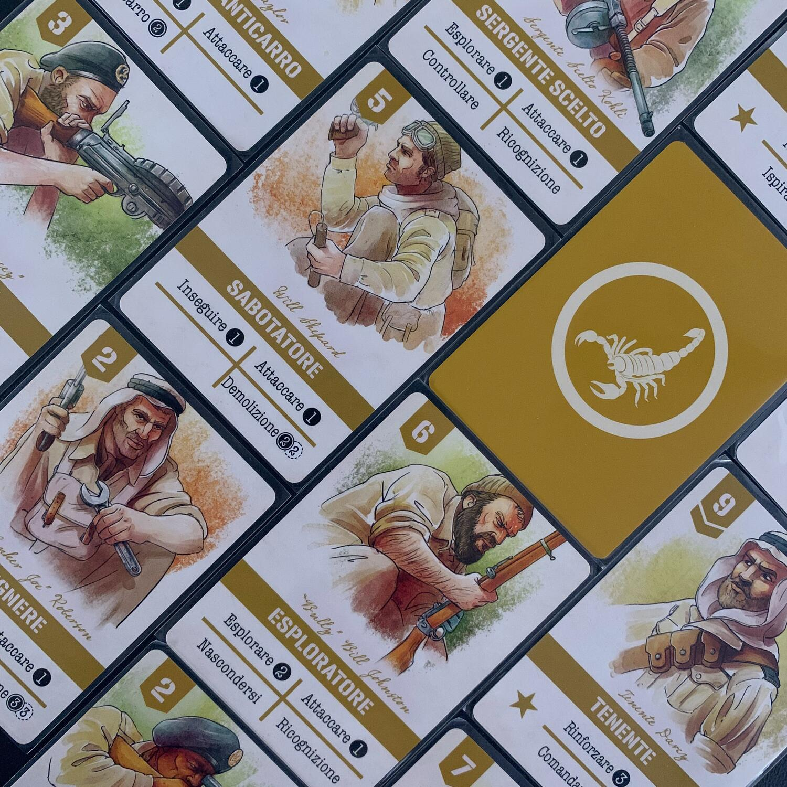

<Setting>

  Giugno, 1940. Per contrastare la crescente minaccia dell’Asse in{" "}
  <strong>Nord Africa</strong>, l’esercito britannico ha formato il Long Range
  Desert Group (<strong>LRDG</strong>), un’unità d’élite di ricognizione e di
  operazioni segrete, incaricata di raccogliere informazioni vitali e di portare
  scompiglio oltre le linee nemiche. Guida questi coraggiosi soldati in una
  serie di audaci missioni oppure comanda le <strong>forze italiane</strong> che
  gli si oppongono. Assumi il comando nel caos della{" "}
  <strong>guerra nel deserto</strong>, supera il nemico tra le dune e raggiungi
  impavido i tuoi obiettivi.

</Setting>

<Rules>

  Come nel precedente <Link to="/reviews/undaunted-normandy/">Undaunted</Link>,
  anche in questo caso ogni round è diviso in <strong>2 parti</strong>:{" "}
  <strong>pescare</strong> 4 carte per scegliere contemporaneamente l'iniziativa
  e, in ordine di iniziativa, <strong>giocare</strong> le carte rimaste in mano.{" "}
   
  Nella scatola sono presenti <strong>12 scenari</strong>, caratterizzati dalla narrazione
  di quanto accaduto all'LRDG alle prese con le difese fasciste, dagli obiettivi
  che ogni esercito deve raggiungere, dalla struttura dei mazzi per quella sessione
  e dalla creazione della mappa di gioco.
   
  Ogni scenario è diverso dagli altri: ci saranno da far esplodere edifici, ci saranno
  fortini da conquistare, ci saranno carri armati da far brillare e molto, molto
  altro.  E tutto questo, appunto, con <strong>4 carte a turno</strong>.  
  Ogni carta che verrà giocata attiverà un'azione da eseguire con la truppa
  designata, che sia muoversi, esplorare o, ovviamente, attaccare. Queste sono
  le tre azioni che, declinate nelle varie situazioni, saranno la base del
  gioco:  
  <ul>
    <li>      <strong>muovere</strong>: ci si muoverà di N tessere, già precedentemente
      esplorate;</li>
    <li>      <strong>esplorare</strong>: ci si muoverà di N tessere… esplorandole. Ogni
      volta che si esplorerà una nuova tile, una carta "nebbia di guerra"
      entrerà a fare parte del nostro mazzo. Questa carta è la classica carta
      "brutta" dei deck building che ci impedirà di pescare carte utili.</li>
    <li>      <strong>attaccare</strong>: si lanceranno tanti dadi d10 quanti dichiarati
      dall'azione, e si considererà solamente il numero più alto che esce (0 =
      successo certo). Se quel numero è maggiore o uguale rispetto alla difesa
      del bersaglio + la difesa del luogo + 1 per ogni tessera tra noi e lui…
      l'attacco avrà successo. Altrimenti no. Se l'attacco ha successo,
      l'avversario cercherà e scarterà una copia di quella carta (in
      quest'ordine) dalla mano o dalla pila degli scarti o dal mazzo. Se non
      dovessero esserci copie, la pedina verrà rimossa dalla mappa e quell'unità
      sarà morta. Per sempre.</li>
  </ul>
  Oltre a queste azioni, ce ne sono altre utilissime che permetteranno di
  pescare altre carte, di arruolare nuove truppe, di fare altro con i carri
  armati o con gli aerei.  
  <strong>    Una novità di questo titolo rispetto al precedente sono proprio i mezzi</strong>
  : ogni esercito ne ha a disposizione 3 che, a rotazione, entreranno nei vari
  scenari. I mezzi si possono vedere come delle posizioni extra che le nostre
  truppe possono utilizzare per svolgere ulteriori azioni.  
  Il primo giocatore che riesce a <strong>raggiungere l'obiettivo</strong>, vince.
  L'altro perde.  
  La guerra è questo, non si vince mai in due.

</Rules>

<Feedback>

  Chi dice che Undaunted è un gateway verso i <strong>giochi storici</strong>,
  non credo abbia mai giocato a un gioco storico.  
  Undaunted è semplice, chiaro, leggero, nonostante il tema. Ma soprattutto <strong>    è rapido</strong>. È un <strong>astratto</strong> che si basa sulla meccanica del{" "}
  <strong>deck building</strong>, ambientato in uno spazio-tempo, per quanto mi riguarda,
  fantastico… che, al contempo, è il fattore che ti porta ad amarlo o a spaventarsi
  a tal punto da non farti avvicinare.
   
  Ogni partita sarà diversa dalle altre e sarà sicuramente seguita da un "eh, ma
  se io avessi fatto l'LRDG non avrei fatto questa cosa"; oppure: "certo che i fasci
  sono nettamente più forti con quel carro armato"; o ancora: "follia!".
   
  Come sapete, la parte grafica è un dettaglio molto importante nei giochi che scelgo,
  e questo gioco mi ha spiazzato: le carte e i mezzi hanno delle <strong>    illustrazioni spettacolari</strong>… la plancia è al limite del guardabile. Boh, non capisco.  
  Questo gioco, per quanto mi riguarda, ha un difetto enorme:{" "}
  <strong>i nomi delle azioni</strong>. Ora ditemi, cosa farà mai l'azione
  Rinforzare? E Comandare? La prima vi farà pescare carte, la seconda ve le farà
  aggiungere al mazzo. Chiaro no? Questo dettaglio rende difficile immergersi a
  pieno sin dalla prima partita, dove staremo con un occhio sulle carte e uno
  sul regolamento; ma dalla seconda gira che è una meraviglia (anche perché le
  azioni disponibili le potete contare su due mani).  
  La cosa che mi è piaciuta di più del gioco è <strong>    il legame che vai a creare con i "tuoi" soldati</strong>, come l'amicizia che hai con Adriano Leone da quella volta che ha fatto
  brillare l'autocarro da armato che stava per distruggere tutto o del rispetto che
  provi per Will Shepard che non ci ha pensato due volte a farsi impallottolare mentre
  faceva saltare in aria i depositi nemici. Creerete un vero legame con questi soldati,
  partita dopo partita.  
  Undaunted è un gioco che ti tiene legato, che ti mette la scimmia addosso, al
  punto che non vedi l'ora di vedere come andrà il prossimo scenario. Questo è
  il primo titolo della serie che entra nella mia collezione, ma sicuramente non
  sarà l'ultimo! Lanciamo un appello a{" "}
  <Link to="/publishers/ghenos-games">Ghenos</Link> per portare anche{" "}
  <strong>Undaunted - Stalingrad</strong> in italiano? Daje!

</Feedback>

