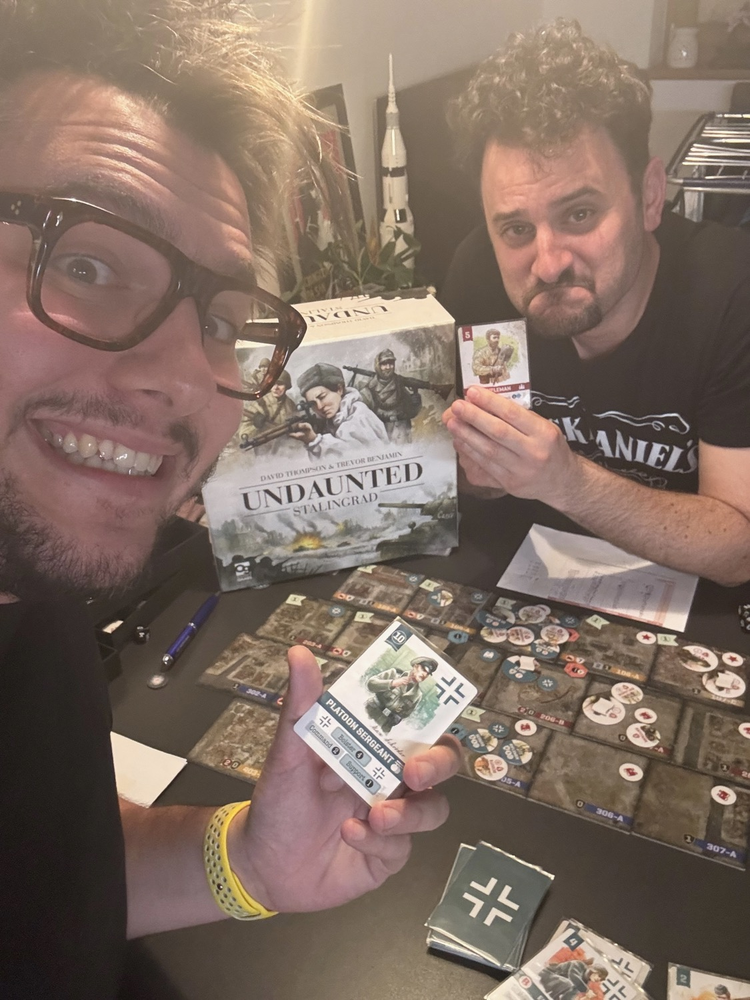
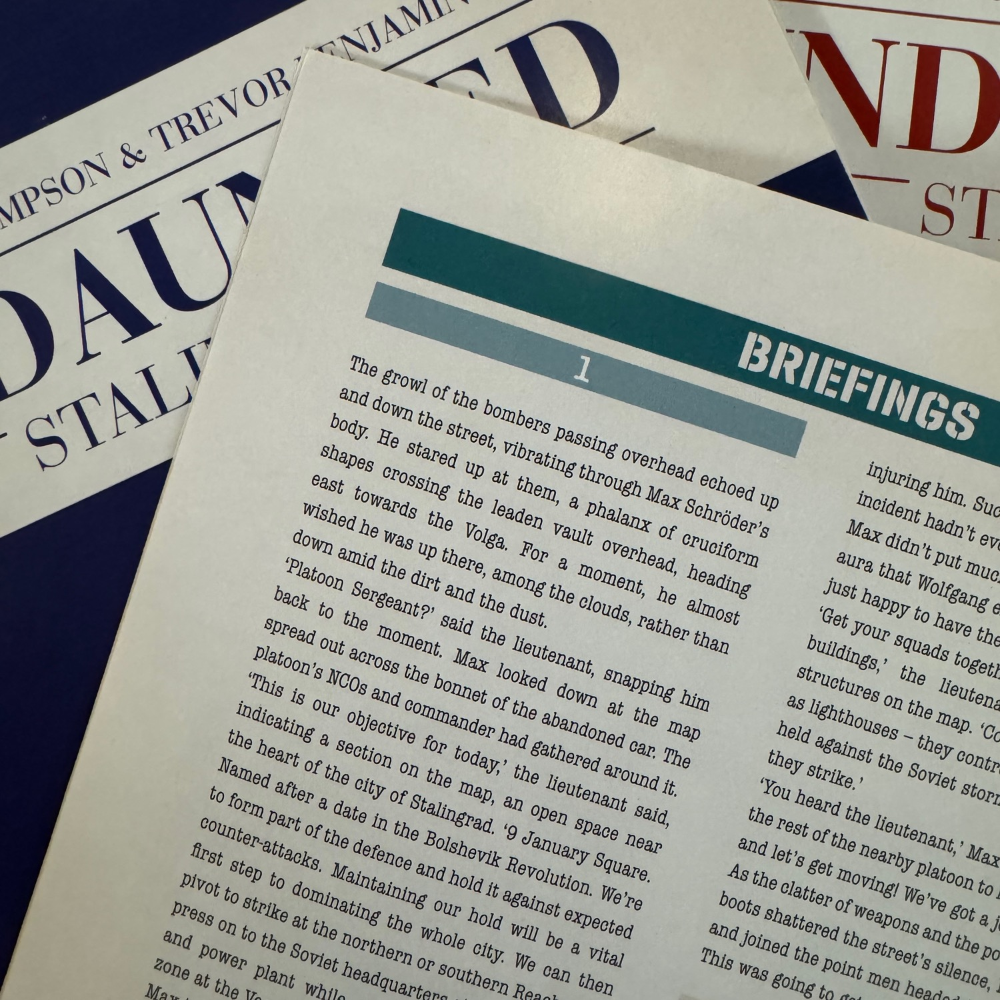
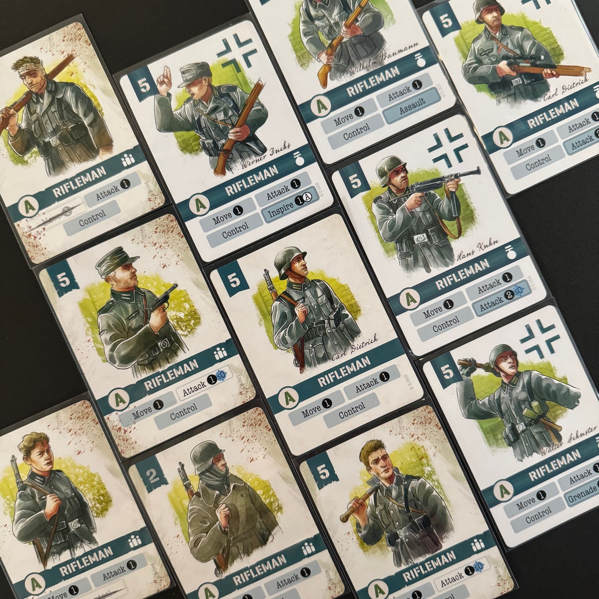

<Setting>

  La Battaglia di Stalingrado è <strong>un'epica lotta tra il bene e il male</strong> durante la Seconda Guerra Mondiale, ambientata nelle gelide terre russe. Le strade diventano teatro di un inferno, dove soldati coraggiosi si scontrano in una danza della morte. Sovietici e tedeschi combattono con determinazione ferrea, <strong>ogni edificio diventa un rifugio disperato</strong>. È una battaglia per l'anima dell'umanità, tra la brutalità nazista e la resilienza sovietica. Dopo mesi di scontri titanici, la vittoria arride all'Armata Rossa, ma il prezzo è altissimo. Stalingrado rimane un simbolo di coraggio e sacrificio, ma anche di orrore e tragedia. La memoria di questa battaglia rimarrà impressa nell'umanità come monito contro gli orrori della guerra e tributo alla resilienza umana.

</Setting>

<Rules>

 Se avete già giocato a Undaunted, saltate pure la prima parte di questa sezione: leggereste cose già note. Altrimenti… 
In Undaunted due giocatori si affrontano su un campo di battaglia con ogni sorta di truppa. Ogni scenario è definito da una specifica configurazione della mappa, dalle truppe schierate e dagli obiettivi, diversi per le due fazioni, che possono essere i più svariati: dall'eliminazione di un certo numero di soldati, fino a dover far brillare edifici per conquistare una zona. <strong>Ogni round</strong> di ogni titolo di questa collana è diviso in 3 parti: si pescano <strong>4 carte</strong>, se ne gioca una contemporaneamente all'avversario per decretare chi avrà l'iniziativa; a seguire, il giocatore con l’iniziativa giocherà le sue rimanenti 3 carte svolgendo le varie azioni; quindi toccherà all’avversario.  
Le azioni consentono di muovere le truppe, di esplorare zone rendendole accessibili alla propria armata, di acquisire nuove unità nel proprio mazzo, di pescare ulteriori carte e, ovviamente, di attaccare. Un attacco che colpisca con successo una determinata truppa comporterà la rimozione di una carta corrispondente dal mazzo dell'avversario, rendendo l'unità sempre più debole fino alla  rimozione dalla mappa del suo segnalini. 
<em>Se siete curiosi di sapere più nel dettaglio come funziona la meccanica dell'attacco, vi rimando alla recensione di <Link to="/reviews/undaunted-north-africa/">Undaunted: North Africa</Link>.</em> 
 
Nel caso di Undaunted: Stalingrad vivrete l’esperienza indimenticabile di uno degli scontri decisivi del secondo conflitto mondiale: la battaglia di Stalingrado. A differenza delle altre campagne, questa è <strong><em>legacy</em></strong>: quello che succederà sin dalla prima battaglia influenzerà la seconda, fino a determinare l’esito dell’intero scontro. I soldati che moriranno verranno sostituiti da <strong>nuove reclute</strong>, rimpiazzi più deboli e inesperti; <strong>altre unità riceveranno promozioni</strong> che ne miglioreranno le prestazioni; intere porzioni di città verranno abbattute al passaggio dei Panzer o dei bombardieri. Ma soprattutto, <strong>la battaglia potrà prenderà una piega diversa</strong> anche semplicemente a seconda di chi conquisterà un certo quartiere. Freddate a distanza il nemico con i cecchini, minate il campo con gli ingegneri artificieri, aggiratevi rapidi per il campo e rallentate i piani dell’avversario con gli scout, falciate con i mitraglieri gli incauti fucilieri, mentre i vostri leader chiamano truppe fresche e organizzano azioni di supporto. A scenario terminato, a seconda di quante vittime ci saranno tra le nostre fila, <strong>alcune saranno scartate e rimpiazzate con le carte reclute</strong>, che saranno identiche alla carta scartata ma con una piccola differenza: magari non si potranno muovere, magari non potranno sparare, magari saranno terrorizzate e saranno inutili per ottenere l'iniziativa. Ma, dopo gli addii, <strong>si miglioreranno 2 carte random</strong> per fazione, ottenendo così i primi veterani. Ogni truppa sul campo avrà le sue specifiche regole di movimento e combattimento, ogni scenario le sue norme d’ingaggio. 
Infine, <strong>due libriccini</strong>, uno per i nazisti e uno per i sovietici, vi guideranno in questo viaggio, che parte dalla storia ma può finire nella fantastoria. Tra uno scenario e l'altro, ogni esercito leggerà una cronaca vista con gli occhi dei propri soldati, che si scambiano battute, sorrisi, pensieri e paure.

</Rules>

<Feedback>

  Undaunted Stalingrad è l'Undaunted per <strong>eccellenza</strong>. C'è sicuramente un prima e un dopo questo titolo. Se vi piace la collana, smettete di leggere e <strong>fate in modo che questo titolo entri nella vostra kallax prima possibile</strong>.  
Ho vissuto l'intera campagna, lunedì dopo lunedì, canzone dopo canzone, grappino dopo grappino, con il dude <Link to="/writers/dadi-daddy">Dadi-Daddy</Link> ed entrambi contavamo i giorni tra una sessione e l'altra. Se il primo capitolo non si distinguerà per la sua innovazione, scenario dopo scenario tutto prenderà forma. <strong>Vi sentirete sempre più dei generali</strong> capaci di mandare i vostri uomini al macello per portare a casa la vittoria, per l'orgoglio di aver conquistato la Piazza Nord; <strong>ma anche uomini</strong> capaci di rattristarvi quando il vostro plotone viene spazzato via da un attacco aria-terra o quando deve rimanere trincerato in una casa ormai distrutta, solamente per permettere al fuciliere di prendere il controllo dell'ennesimo osservatorio. <strong>Undaunted: Stalingrad vi emozionerà</strong>. 
<strong>Le missioni</strong> che affronterete (o meglio, che lo sviluppo della mia campagna mi ha portato ad affrontare…) <strong>sono abbastanza diverse le une dalle altre</strong>, quel tanto da non darvi l'idea di rivivere un deja vu; ma le peculiarità che amerete di più di questo titolo saranno le truppe con le relative azioni e il meta che vi accompagnerà nelle vostre serate.  
<strong>Le truppe</strong>, inizialmente, sono le solite (il fuciliere, lo scout, …) ma, partita dopo partita, <strong>cambieranno</strong>, sia in bene che in male. <strong>I veterani introdurranno le nuove azioni che arricchiranno la profondità strategica e tattica</strong>: avrete soldati appostati alle fisse a controllare punti focali, fumogeni pronti a darvi supporto, mine antiuomo nei passaggi importanti e molto, molto altro.  
<strong>Mano a mano che giocherete, sarete portati a prendere decisioni sempre più importanti</strong>, soprattutto sulle azioni che vi porteranno a distruggere la città: dove ora ci sono i nemici ad attaccare, poi ci sarete voi a dovervi difendere. Ha ancora senso distruggere l'intero palazzo? Se lo fate la vittoria della battaglia è certa… ma quella della guerra? 
Capite quindi che ogni dado che lancerete, ogni movimento che farete, ogni obiettivo che conquisterete sarà importante, molto più importante di prima: <strong>finire ogni battaglia con il minor numero di vittime è la chiave per vincere… ma non è semplice!</strong> Man mano che si vince il gioco tenderà a bilanciare, dando al vinto qualche aiuto in più, qualche truppa capace di spostare l'ago della bilancia.  
<strong>Sembra tutto bello, no? Lo è!</strong> 
Lo è tranne per una cosetta di poco conto: l'inserto di Undaunted: Stalingrad è imbarazzante come quello di tutti i fratellini, facilmente rimpiazzabile, se ne sentirete la necessità. Io l'ho fatto. 
Ora che siete già andati a vedere quanto costa vi starete sicuramente domandando <strong>"ma esiste in italiano?"</strong> e la risposta, sfortunatamente, è <strong>"non ancora"</strong> (preghiamo per il futuro!): l'inglese nei dialoghi è abbastanza tosto e comprensivo di un lessico belligerante, mentre il regolamento sarete in grado di capirlo senza problemi. I dialoghi, se siete disposti a perdervi la parte narrativa, si possono saltare senza inficiare minimamente il gioco… ma è davvero un peccato. 
Tiriamo le somme?  
Conviene giocarlo come primo Undaunted? no.  
<strong>Conviene giocarlo? ASSOLUTAMENTE SÌ!</strong> Avete già il vostro Mosin–Nagant in mano? 
E ricordatevi sempre di mirare bene e sbagliare poco.

</Feedback>

