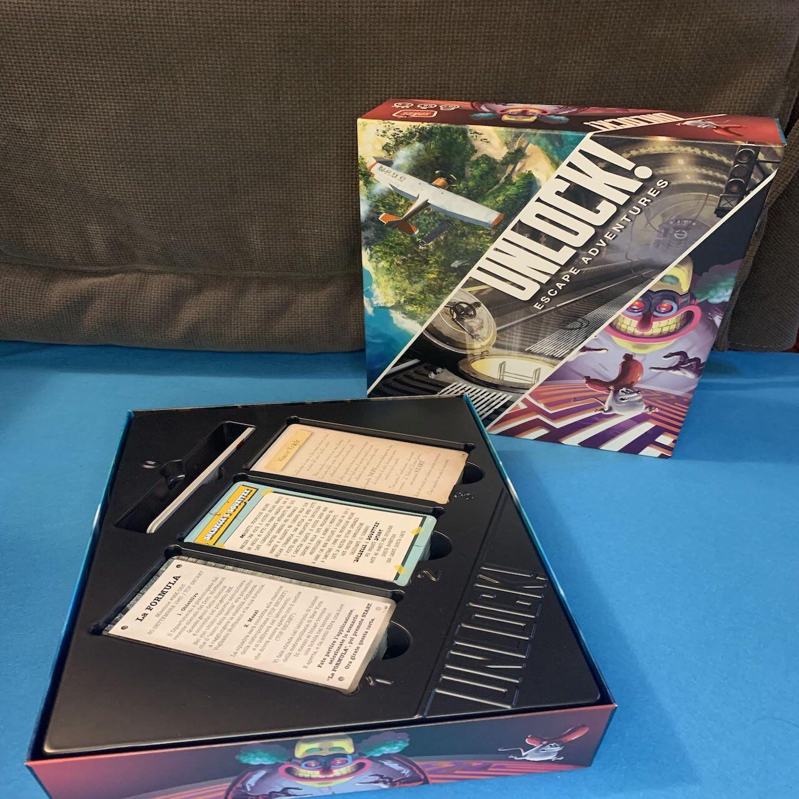
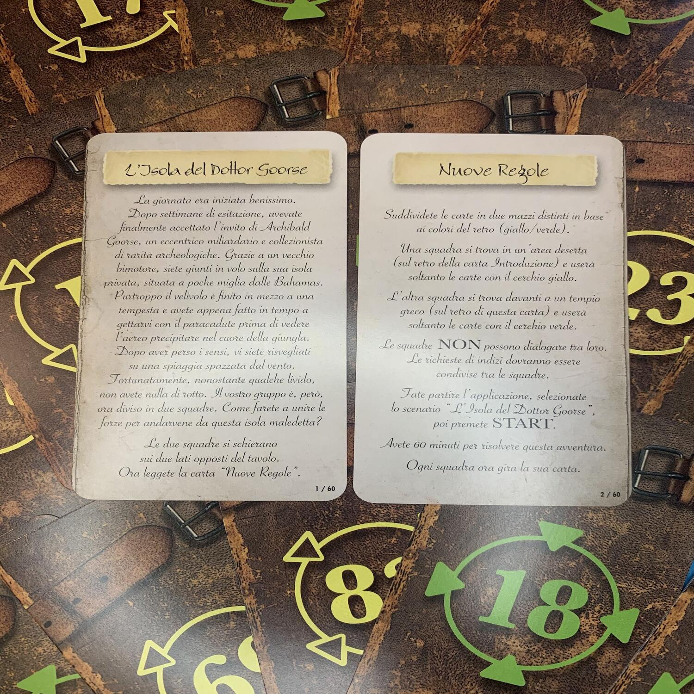

<Setting>

  Entrerete in un <strong>laboratorio segreto</strong> per recuperare un
  misterioso <strong>siero</strong> sviluppato da uno scienziato;{" "}
  <strong>sventerete il piano</strong> dello spregevole{" "}
  <strong>Professor Noside</strong>, in un'avventura dallo{" "}
  <strong>stile</strong> di un <strong>cartone animato</strong>; infine,
  visiterete <strong>l’isola</strong> di un eccentrico miliardario che
  colleziona antichità e vi troverete a <strong>sconfiggere</strong> le sue{" "}
  <strong>trappole</strong> !  
  Siete pronti a risolvere tutti questi casi?

</Setting>

<Rules>

  Innanzitutto, scaricate l’app di Unlock dal vostro store di fiducia! Vi servirà da <strong>cronometro</strong>  per tenere traccia del tempo che scorre, nonché per sbloccare porte, indizi e ottenere suggerimenti. L’applicazione terrà anche conto delle <strong>penalità</strong>  ricevute in caso di errori. Da ultimo, ma non per importanza, l’applicazione è in grado di <strong>creare l’atmosfera</strong>  perfetta per ogni avventura grazie a <strong>musica</strong>  e <strong>suoni</strong>  di sottofondo. 
Per <strong>iniziare</strong>  la partita basterà <strong>girare la prima carta</strong> , leggerla e far partire dall’applicazione l’avventura corrispondente. Appena l’avrete voltata, vi troverete in un luogo con alcuni numeri relativi ad oggetti a cui corrisponde una carta del mazzo, che va presa e girata per vedere cosa vi è illustrato. 
A mano a mano che l’avventura prosegue, verranno rivelate altre carte, che andranno poste al centro del tavolo.  
Ci sono diverse tipologie di carte:  
<ul>
<li><strong>Le carte oggetto</strong> , blu o rosse, devono essere combinate tra loro per creare nuovi oggetti, per aprire armadi e tanto altro. Da questo punto di vista, questa <em>Unlock!</em> vi sorprenderà!</li>
<li><strong>Le carte congegno</strong> , verdi, vi offriranno occasioni di interazione nei modi più bizzarri, attraverso la solita applicazione.</li>
<li><strong>Le carte codice, gialle</strong> , vi permetteranno di aprire, ad esempio, un lucchetto a combinazione.</li>
<li><strong>Le altre carte</strong> , le grigie, semplicemente coprono tutte le restanti potenziali situazioni del gioco.</li>
</ul>
In queste carte, inoltre, è possibile trovare dei <strong>numeri nascosti</strong> , indizi non ovvi, ma necessari per proseguire il gioco. 
La partita termina quando i giocatori sono riusciti a risolvere l’ultimo enigma e hanno fermato il timer. Quindi, possono accedere al proprio punteggio e alla valutazione della propria prestazione (da 0 a 5 stelle).

</Rules>

<Feedback>

  <strong>Ogni scatola</strong> di <em>Unlock!</em> è coinvolgente,
  entusiasmante e sempre caratterizzata da qualche meccanismo particolare che la{" "}
  <strong>rende unica</strong> ed <strong>originale</strong> . 
  Durante le prime partite l’app offrirà diversi aiuti, qualora si rimanesse bloccati
  in alcuni punti. Giocare le varie scatole consentirà di entrare di più nell’ottica
  di <em>Unlock!</em> e a mano a mano il bisogno di richiedere indizi verrà meno.
   
  <strong>La vera chicca</strong> di queste escape room portatili è <strong>    l’app</strong> , che, oltre a dare indicazioni, permette di ricevere indizi e risolvere
  congegni.
   
  <strong>In conclusione</strong> il bello di questi escape game è di avere a disposizione
  una serie di <strong>avventure ben pensate e giocabili da tutti</strong> . Questo
  ne compensa il difetto strutturale, ovvero la rigiocabilità, perché bisogna aspettare
  del tempo in modo da dimenticare dettagli rilevanti di ogni avventura. Altrimenti
  si può sempre far giocare un gruppo di amici supervisionando la partita in modo
  da vederli scervellarsi cercando di trovare la soluzione!
   
  Se siete incuriositi dal gioco e volete <strong>provare</strong> qualche <strong>    demo</strong> , potete andare sul sito di <strong>Asmodee</strong> nella sezione <strong>    “print and play</strong> ” e troverete diverse avventure stampabili e giocabili con app.

</Feedback>

