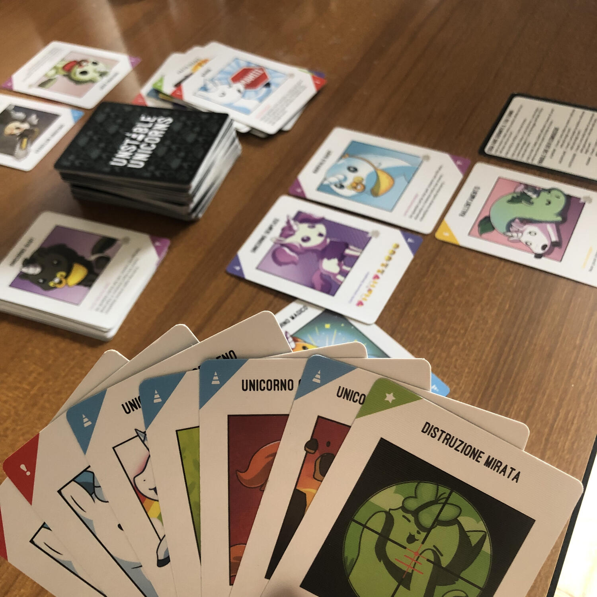
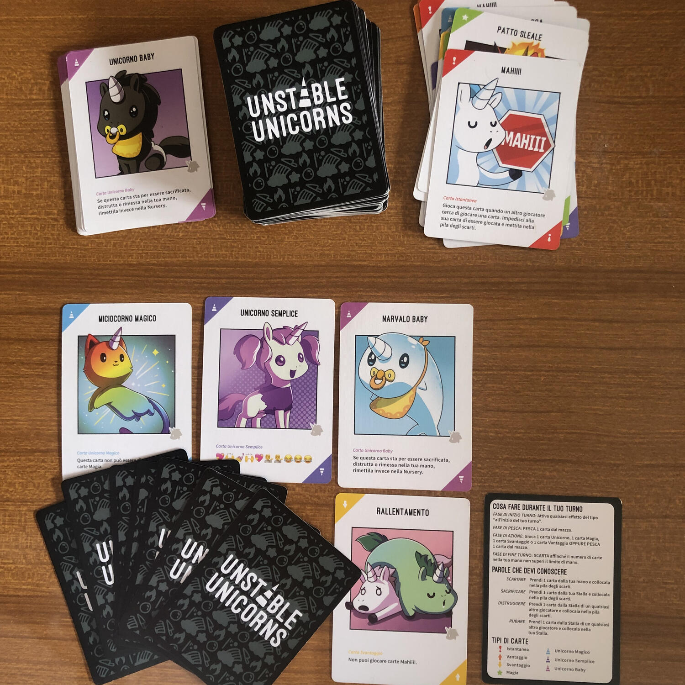

<Setting>

  Pensate agli unicorni come creature magiche, aggraziate e regali?
   
  Siate pronti a rivedere le vostre convinzioni perché in Unstable Unicorns
  avrete a che fare con esseri sociopatici, sadici e assassini (i tuoi amici).{" "}
   
  Prodotto grazie a una fortunata campagna Kickstarter e di successo per il suo modo
  di presentarsi simile a <Link to="/reviews/exploding-kittens/">
    Exploding Kittens
  </Link>, <em>Unstable Unicorns</em> è un gioco a turni strategico, veloce e infame
  con il quale passare una quarantina di minuti divertenti con i vostri amici, che
  forse dopo la partita non lo saranno più.

</Setting>

<Rules>

  Le regole di Unstable Unicorns sono molto semplici: il primo giocatore che
  riesce a possedere 7 unicorni nella propria stalla vince.
   
  Nel mazzo esistono diverse tipologie di carte che possono aiutarti a
  raggiungere il tuo obiettivo, sia esso quello di accumulare unicorni che
  quello di impedire ai tuoi amici di vincere. Nello specifico abbiamo:  
  <ul>
    <li>      <strong>Carte unicorno,</strong> Baby, Semplici e Magiche (queste ultime
      hanno effetti che possono dare benefici al giocatore durante la
      partita){" "}</li>
    <li>      <strong>Carte Magia</strong>, che hanno un effetto immediato{" "}</li>
    <li>      <strong>Carte Svantaggio</strong>, che possono essere aggiunte alla stalla
      degli altri giocatori per imporre effetti negativi a quel giocatore</li>
    <li>      <strong>Carte Vantaggio</strong>, che garantiscono effetti positivi al
      giocatore che le possiede nella propria stalla</li>
    <li>      <strong>Carte istantanee</strong>, nel mazzo base sono le carte{" "}
      <em>Mahiii!</em>, che possono essere giocate anche al di fuori del proprio
      turno e bloccano l’azione in corso.</li>
  </ul>
  Il set up del gioco è veloce e semplice: ogni giocatore inizia la partita con
  una carta unicorno baby già nella propria stalla e 5 carte in mano.
   
  Sul banco avremo invece la pila degli unicorni baby rimanenti, la pila degli
  scarti e il mazzo da cui pescare.  
  Durante il turno ogni giocatore dovrà per prima cosa pescare una carta e poi compiere
  una (e una soltanto!!) azione:  
  <ul>
    <li>mettere nella stalla una carta unicorno</li>
    <li>giocare una carta Magia, una carta Vantaggio o una carta Svantaggio</li>
    <li>pescare un’altra carta.</li>
  </ul>
  Il turno finisce poi scartando affinché il numero di carte nella mano non sia superiore
  a 7. In ogni turno il giocatore dovrà quindi decidere se accrescere il numero di
  unicorni nella sua stalla, potenziarsi aggiungendo vantaggi o infastidire gli altri
  giocatori.

</Rules>

<Feedback>

  Unstable unicorn è un gioco semplice da intavolare, anche per chi è alle prime
  armi. Il regolamento è chiaro e breve, e tutti gli effetti sono riportati
  anche sulle carte.
   
  Grazie alla sua grafica tenera e pucciosa e alla fluidità del playgame è un
  ottimo riscaldamento prima di dedicarsi a giochi più impegnativi.  
  Il gioco si presta bene alle partite a molti giocatori, ma il ritmo del gioco rischia
  di essere rallentato da chi soffre di paralisi decisionale. A nostro avviso una
  partita a 4 o 5 giocatori è l’ideale per mantenere un ritmo sostenuto. Unstable
  Unicorns è giocabilissimo anche in 2, anche se un po’ più prevedibile e meno fastidioso.{" "}
   
  La parte strategica è minima, ma più si conoscono le carte, con i possibili
  power up e poteri, più è facile integrarla nel gioco per infastidire e
  rallentare i tuoi avversari o trovare nuovi modi loschi per vincere.
  L’interazione tra i giocatori è una parte chiave del gioco, spesso distruttiva
  e fastidiosa, ma è anche questo che rende questo gioco così godibile.
   
  <strong>    Siate quindi pronti a creare tensione tra i giocatori e vi avvertiamo, non
    va bene per persone permalose!</strong>

</Feedback>

